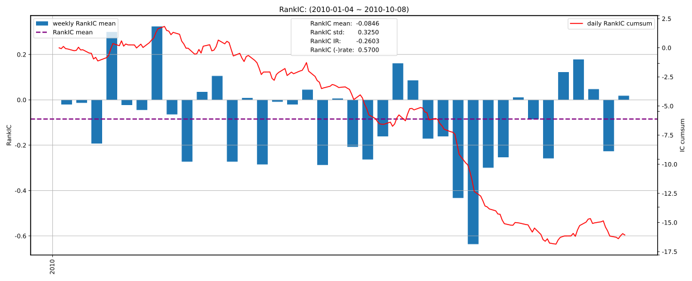
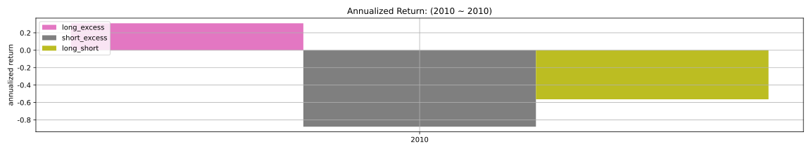

# factor1(RandomGenerated1) 因子报告
## 因子值分布（已去极值）

|   n_valid |   n_nan |   n_outlier |    mean |    std |     min |     25% |    50% |    75% |    max |
|----------:|--------:|------------:|--------:|-------:|--------:|--------:|-------:|-------:|-------:|
|      2000 |       0 |           0 | -0.0000 | 0.9489 | -2.2775 | -0.7256 | 0.0000 | 0.7101 | 2.4745 |

## 因子值非空比例

## IC分析
### 1D

| IC   |   total |    2010 |
|:-----|--------:|--------:|
| mean | -0.0319 | -0.0319 |
| std  |  0.3282 |  0.3282 |
| IR   | -0.0971 | -0.0971 |

| RankIC   |   total |    2010 |
|:---------|--------:|--------:|
| mean     | -0.0463 | -0.0463 |
| std      |  0.3153 |  0.3153 |
| IR       | -0.1467 | -0.1467 |

### 5D

| IC   |   total |    2010 |
|:-----|--------:|--------:|
| mean | -0.0384 | -0.0384 |
| std  |  0.2973 |  0.2973 |
| IR   | -0.1292 | -0.1292 |

| RankIC   |   total |    2010 |
|:---------|--------:|--------:|
| mean     | -0.0375 | -0.0375 |
| std      |  0.3106 |  0.3106 |
| IR       | -0.1206 | -0.1206 |

### 10D

| IC   |   total |    2010 |
|:-----|--------:|--------:|
| mean | -0.0957 | -0.0957 |
| std  |  0.3202 |  0.3202 |
| IR   | -0.2988 | -0.2988 |

| RankIC   |   total |    2010 |
|:---------|--------:|--------:|
| mean     | -0.0846 | -0.0846 |
| std      |  0.3250 |  0.3250 |
| IR       | -0.2603 | -0.2603 |

### 20D

| IC   |   total |    2010 |
|:-----|--------:|--------:|
| mean | -0.1109 | -0.1109 |
| std  |  0.3263 |  0.3263 |
| IR   | -0.3400 | -0.3400 |

| RankIC   |   total |    2010 |
|:---------|--------:|--------:|
| mean     | -0.1184 | -0.1184 |
| std      |  0.3169 |  0.3169 |
| IR       | -0.3736 | -0.3736 |

## 收益分析
### 1D

|                |   ann_ret |   max_dd |   sharpe |   calmar |   win_rate |   ann_vol |   avg_win_ret |   avg_loss_ret |   win_loss_ratio |
|:---------------|----------:|---------:|---------:|---------:|-----------:|----------:|--------------:|---------------:|-----------------:|
| group_5(long)  |    0.4655 |   0.2476 |   0.9100 |   1.8796 |     0.4949 |    0.6528 |        0.0364 |        -0.0313 |           1.1625 |
| group_1(short) |    0.6477 |   0.3035 |   1.0892 |   2.1342 |     0.5253 |    0.6551 |        0.0339 |        -0.0319 |           1.0633 |
| benchmark      |   -0.7536 |   0.7893 |  -1.0273 |  -0.9548 |     0.4873 |    0.9354 |        0.0492 |        -0.0542 |           0.9077 |
| long_excess    |    1.4164 |   0.4173 |   1.3353 |   3.3939 |     0.5330 |    1.1668 |        0.0640 |        -0.0598 |           1.0701 |
| short_excess   |   -0.9003 |   0.9139 |  -1.5064 |  -0.9852 |     0.4518 |    1.1140 |        0.0583 |        -0.0602 |           0.9687 |
| long_short     |   -0.3895 |   0.6245 |  -0.1384 |  -0.6238 |     0.5101 |    0.8639 |        0.0432 |        -0.0464 |           0.9305 |

### 5D

|                |   ann_ret |   max_dd |   sharpe |   calmar |   win_rate |   ann_vol |   avg_win_ret |   avg_loss_ret |   win_loss_ratio |
|:---------------|----------:|---------:|---------:|---------:|-----------:|----------:|--------------:|---------------:|-----------------:|
| group_5(long)  |   -0.4580 |   0.4814 |  -0.5651 |  -0.9514 |     0.4742 |    0.6773 |        0.0358 |        -0.0355 |           1.0077 |
| group_1(short) |    1.3332 |   0.3536 |   1.6400 |   3.7700 |     0.5619 |    0.6429 |        0.0328 |        -0.0330 |           0.9966 |
| benchmark      |   -0.6829 |   0.7785 |  -0.7621 |  -0.8772 |     0.4922 |    0.9336 |        0.0495 |        -0.0535 |           0.9244 |
| long_excess    |   -0.2658 |   0.4677 |   0.2898 |  -0.5683 |     0.5181 |    1.1276 |        0.0572 |        -0.0588 |           0.9726 |
| short_excess   |   -0.9072 |   0.9199 |  -1.6279 |  -0.9862 |     0.4715 |    1.0881 |        0.0547 |        -0.0621 |           0.8807 |
| long_short     |   -0.8361 |   0.7974 |  -1.6848 |  -1.0485 |     0.4691 |    0.8530 |        0.0394 |        -0.0460 |           0.8565 |

### 10D

|                |   ann_ret |   max_dd |   sharpe |   calmar |   win_rate |   ann_vol |   avg_win_ret |   avg_loss_ret |   win_loss_ratio |
|:---------------|----------:|---------:|---------:|---------:|-----------:|----------:|--------------:|---------------:|-----------------:|
| group_5(long)  |   -0.1538 |   0.4460 |   0.0833 |  -0.3449 |     0.4974 |    0.6691 |        0.0349 |        -0.0344 |           1.0129 |
| group_1(short) |    0.4360 |   0.4127 |   0.8869 |   1.0566 |     0.5661 |    0.6394 |        0.0306 |        -0.0352 |           0.8699 |
| benchmark      |   -0.7383 |   0.7785 |  -0.9805 |  -0.9484 |     0.4840 |    0.9270 |        0.0491 |        -0.0531 |           0.9256 |
| long_excess    |    0.3140 |   0.5810 |   0.8205 |   0.5405 |     0.5426 |    1.1762 |        0.0598 |        -0.0626 |           0.9559 |
| short_excess   |   -0.8812 |   0.8825 |  -1.3083 |  -0.9984 |     0.4628 |    1.1305 |        0.0581 |        -0.0610 |           0.9530 |
| long_short     |   -0.5662 |   0.5822 |  -0.6364 |  -0.9726 |     0.5132 |    0.8035 |        0.0378 |        -0.0445 |           0.8493 |

### 20D

|                |   ann_ret |   max_dd |   sharpe |   calmar |   win_rate |   ann_vol |   avg_win_ret |   avg_loss_ret |   win_loss_ratio |
|:---------------|----------:|---------:|---------:|---------:|-----------:|----------:|--------------:|---------------:|-----------------:|
| group_5(long)  |    0.0950 |   0.3289 |   0.4749 |   0.2887 |     0.5028 |    0.6927 |        0.0376 |        -0.0358 |           1.0504 |
| group_1(short) |    0.9108 |   0.2805 |   1.3064 |   3.2465 |     0.5307 |    0.6650 |        0.0352 |        -0.0329 |           1.0711 |
| benchmark      |   -0.6443 |   0.7015 |  -0.6371 |  -0.9184 |     0.4944 |    0.9351 |        0.0498 |        -0.0533 |           0.9330 |
| long_excess    |    0.2747 |   0.4861 |   0.7916 |   0.5651 |     0.5393 |    1.1706 |        0.0600 |        -0.0623 |           0.9636 |
| short_excess   |   -0.8794 |   0.8905 |  -1.3048 |  -0.9875 |     0.4663 |    1.1261 |        0.0560 |        -0.0599 |           0.9358 |
| long_short     |   -0.5908 |   0.6092 |  -0.6449 |  -0.9698 |     0.5028 |    0.8370 |        0.0408 |        -0.0461 |           0.8853 |

### 因子加权日频收益

|                 |   ann_ret |   max_dd |   sharpe |   calmar |   win_rate |   ann_vol |   avg_win_ret |   avg_loss_ret |   win_loss_ratio |
|:----------------|----------:|---------:|---------:|---------:|-----------:|----------:|--------------:|---------------:|-----------------:|
| factor_weighted |   -0.4364 |   0.4849 |  -1.1599 |  -0.9000 |     0.4444 |    0.4185 |        0.0215 |        -0.0209 |           1.0302 |
| benchmark       |   -0.6780 |   0.7128 |  -0.7413 |  -0.9511 |     0.4916 |    0.9361 |        0.0498 |        -0.0535 |           0.9294 |
| excess          |   -0.2805 |   0.5321 |   0.1991 |  -0.5271 |     0.5419 |    1.0341 |        0.0511 |        -0.0587 |           0.8711 |

### 单因子策略(0.8, 1.0)收益

|           |   ann_ret |   max_dd |   sharpe |   calmar |   win_rate |   ann_vol |   avg_win_ret |   avg_loss_ret |   win_loss_ratio |
|:----------|----------:|---------:|---------:|---------:|-----------:|----------:|--------------:|---------------:|-----------------:|
| strategy  |   -0.3924 |   0.3807 |  -0.4210 |  -1.0308 |     0.4500 |    0.6644 |        0.0356 |        -0.0315 |           1.1316 |
| benchmark |   -0.6780 |   0.7128 |  -0.7413 |  -0.9511 |     0.4916 |    0.9361 |        0.0498 |        -0.0535 |           0.9294 |
| excess    |   -0.2186 |   0.5811 |   0.3581 |  -0.3763 |     0.4804 |    1.1526 |        0.0647 |        -0.0567 |           1.1415 |

## 换手率分析
### 1D

|         |   turnover_count |   turnover_mean |   turnover_std |
|:--------|-----------------:|----------------:|---------------:|
| group_1 |         180.0000 |          0.7222 |         0.2491 |
| group_2 |         192.0000 |          0.7891 |         0.2476 |
| group_3 |         176.0000 |          0.6136 |         0.2101 |
| group_4 |         189.0000 |          0.8016 |         0.2453 |
| group_5 |         182.0000 |          0.7060 |         0.2468 |

### 5D

|         |   turnover_count |   turnover_mean |   turnover_std |
|:--------|-----------------:|----------------:|---------------:|
| group_1 |          36.0000 |          0.7917 |         0.2500 |
| group_2 |          37.0000 |          0.7703 |         0.2526 |
| group_3 |          35.0000 |          0.6000 |         0.2029 |
| group_4 |          38.0000 |          0.6974 |         0.2477 |
| group_5 |          35.0000 |          0.6857 |         0.2451 |

### 10D

|         |   turnover_count |   turnover_mean |   turnover_std |
|:--------|-----------------:|----------------:|---------------:|
| group_1 |          16.0000 |          0.7812 |         0.2562 |
| group_2 |          18.0000 |          0.7222 |         0.2557 |
| group_3 |          17.0000 |          0.5000 |         0.0000 |
| group_4 |          19.0000 |          0.7368 |         0.2565 |
| group_5 |          19.0000 |          0.6053 |         0.2094 |

### 20D

|         |   turnover_count |   turnover_mean |   turnover_std |
|:--------|-----------------:|----------------:|---------------:|
| group_1 |           8.0000 |          0.6875 |         0.2588 |
| group_2 |           9.0000 |          0.7778 |         0.2635 |
| group_3 |           9.0000 |          0.5000 |         0.0000 |
| group_4 |           9.0000 |          0.7778 |         0.2635 |
| group_5 |           9.0000 |          0.5556 |         0.1667 |

### 因子加权持仓换手率

|                 |   turnover_count |   turnover_mean |   turnover_std |
|:----------------|-----------------:|----------------:|---------------:|
| factor_weighted |           9.0000 |          0.6059 |         0.2417 |

### 单因子策略(0.8, 1.0)换手率

|          |   turnover_count |   turnover_mean |   turnover_std |
|:---------|-----------------:|----------------:|---------------:|
| strategy |           9.0000 |          0.5820 |         0.3513 |

