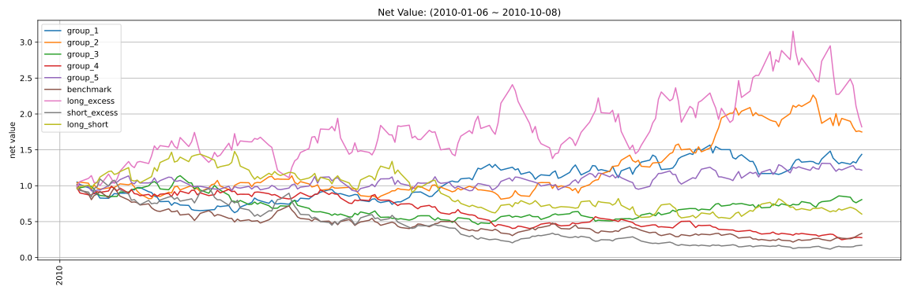

# factor2(RandomGenerated1) 因子报告

## 因子值分布（已去极值）

|   n_valid |   n_nan |   n_outlier |   mean |    std |     min |     25% |     50% |    75% |    max |
|----------:|--------:|------------:|-------:|-------:|--------:|--------:|--------:|-------:|-------:|
|      2000 |       0 |           0 | 0.0000 | 0.9489 | -2.4492 | -0.6865 | -0.0000 | 0.6026 | 2.5583 |

## 因子值非空比例

## IC分析

### 1D

| IC   |   total |    2010 |
|:-----|--------:|--------:|
| mean | -0.0327 | -0.0327 |
| std  |  0.3318 |  0.3318 |
| IR   | -0.0986 | -0.0986 |

| RankIC   |   total |    2010 |
|:---------|--------:|--------:|
| mean     | -0.0463 | -0.0463 |
| std      |  0.3385 |  0.3385 |
| IR       | -0.1367 | -0.1367 |

### 5D

| IC   |   total |    2010 |
|:-----|--------:|--------:|
| mean | -0.0362 | -0.0362 |
| std  |  0.3033 |  0.3033 |
| IR   | -0.1195 | -0.1195 |

| RankIC   |   total |    2010 |
|:---------|--------:|--------:|
| mean     | -0.0413 | -0.0413 |
| std      |  0.3081 |  0.3081 |
| IR       | -0.1341 | -0.1341 |

### 10D

| IC   |   total |    2010 |
|:-----|--------:|--------:|
| mean | -0.0871 | -0.0871 |
| std  |  0.3189 |  0.3189 |
| IR   | -0.2732 | -0.2732 |

| RankIC   |   total |    2010 |
|:---------|--------:|--------:|
| mean     | -0.0882 | -0.0882 |
| std      |  0.3230 |  0.3230 |
| IR       | -0.2732 | -0.2732 |

### 20D

| IC   |   total |    2010 |
|:-----|--------:|--------:|
| mean | -0.1060 | -0.1060 |
| std  |  0.3333 |  0.3333 |
| IR   | -0.3180 | -0.3180 |

| RankIC   |   total |    2010 |
|:---------|--------:|--------:|
| mean     | -0.1222 | -0.1222 |
| std      |  0.3088 |  0.3088 |
| IR       | -0.3957 | -0.3957 |

## 收益分析

### 1D

|                |   ann_ret |   max_dd |   sharpe |   calmar |   win_rate |   ann_vol |   avg_win_ret |   avg_loss_ret |   win_loss_ratio |
|:---------------|----------:|---------:|---------:|---------:|-----------:|----------:|--------------:|---------------:|-----------------:|
| group_5(long)  |    0.2854 |   0.1950 |   0.7120 |   1.4633 |     0.5000 |    0.6370 |        0.0347 |        -0.0315 |           1.1043 |
| group_1(short) |    0.5864 |   0.4059 |   1.0270 |   1.4446 |     0.5354 |    0.6642 |        0.0338 |        -0.0335 |           1.0093 |
| benchmark      |   -0.7536 |   0.7893 |  -1.0273 |  -0.9548 |     0.4873 |    0.9354 |        0.0492 |        -0.0542 |           0.9077 |
| long_excess    |    1.1523 |   0.4275 |   1.2381 |   2.6957 |     0.5178 |    1.1443 |        0.0638 |        -0.0568 |           1.1225 |
| short_excess   |   -0.8957 |   0.8937 |  -1.4983 |  -1.0022 |     0.4772 |    1.0989 |        0.0550 |        -0.0627 |           0.8773 |
| long_short     |   -0.4721 |   0.6325 |  -0.2529 |  -0.7464 |     0.5000 |    0.9036 |        0.0453 |        -0.0476 |           0.9518 |

### 5D

|                |   ann_ret |   max_dd |   sharpe |   calmar |   win_rate |   ann_vol |   avg_win_ret |   avg_loss_ret |   win_loss_ratio |
|:---------------|----------:|---------:|---------:|---------:|-----------:|----------:|--------------:|---------------:|-----------------:|
| group_5(long)  |   -0.3958 |   0.4905 |  -0.4166 |  -0.8071 |     0.4794 |    0.6701 |        0.0347 |        -0.0344 |           1.0081 |
| group_1(short) |    2.8350 |   0.3592 |   2.3144 |   7.8937 |     0.5876 |    0.6829 |        0.0358 |        -0.0363 |           0.9870 |
| benchmark      |   -0.6829 |   0.7785 |  -0.7621 |  -0.8772 |     0.4922 |    0.9336 |        0.0495 |        -0.0535 |           0.9244 |
| long_excess    |   -0.1784 |   0.4677 |   0.3853 |  -0.3815 |     0.5130 |    1.1186 |        0.0577 |        -0.0573 |           1.0077 |
| short_excess   |   -0.9485 |   0.9462 |  -2.0254 |  -1.0024 |     0.4767 |    1.1357 |        0.0537 |        -0.0663 |           0.8091 |
| long_short     |   -0.8951 |   0.8543 |  -2.1253 |  -1.0478 |     0.4588 |    0.8750 |        0.0394 |        -0.0475 |           0.8297 |

### 10D

|                |   ann_ret |   max_dd |   sharpe |   calmar |   win_rate |   ann_vol |   avg_win_ret |   avg_loss_ret |   win_loss_ratio |
|:---------------|----------:|---------:|---------:|---------:|-----------:|----------:|--------------:|---------------:|-----------------:|
| group_5(long)  |    0.6768 |   0.3272 |   1.1167 |   2.0685 |     0.5185 |    0.6528 |        0.0346 |        -0.0316 |           1.0949 |
| group_1(short) |    1.4256 |   0.3357 |   1.6501 |   4.2466 |     0.5714 |    0.6766 |        0.0340 |        -0.0354 |           0.9596 |
| benchmark      |   -0.7383 |   0.7785 |  -0.9805 |  -0.9484 |     0.4840 |    0.9270 |        0.0491 |        -0.0531 |           0.9256 |
| long_excess    |    1.7140 |   0.4837 |   1.4456 |   3.5434 |     0.5585 |    1.1357 |        0.0585 |        -0.0592 |           0.9875 |
| short_excess   |   -0.9308 |   0.9140 |  -1.8229 |  -1.0183 |     0.4840 |    1.1143 |        0.0510 |        -0.0635 |           0.8037 |
| long_short     |   -0.5140 |   0.6179 |  -0.4748 |  -0.8318 |     0.4921 |    0.8161 |        0.0400 |        -0.0422 |           0.9475 |

### 20D

|                |   ann_ret |   max_dd |   sharpe |   calmar |   win_rate |   ann_vol |   avg_win_ret |   avg_loss_ret |   win_loss_ratio |
|:---------------|----------:|---------:|---------:|---------:|-----------:|----------:|--------------:|---------------:|-----------------:|
| group_5(long)  |    0.1617 |   0.3560 |   0.5583 |   0.4541 |     0.5251 |    0.6742 |        0.0345 |        -0.0354 |           0.9739 |
| group_1(short) |   -0.1415 |   0.3959 |   0.0941 |  -0.3573 |     0.5251 |    0.6538 |        0.0316 |        -0.0348 |           0.9070 |
| benchmark      |   -0.6443 |   0.7015 |  -0.6371 |  -0.9184 |     0.4944 |    0.9351 |        0.0498 |        -0.0533 |           0.9330 |
| long_excess    |    0.3655 |   0.5103 |   0.8451 |   0.7162 |     0.5337 |    1.1528 |        0.0599 |        -0.0602 |           0.9939 |
| short_excess   |   -0.7274 |   0.8111 |  -0.5824 |  -0.8968 |     0.4888 |    1.1292 |        0.0578 |        -0.0604 |           0.9576 |
| long_short     |   -0.0227 |   0.5550 |   0.3839 |  -0.0410 |     0.5028 |    0.8202 |        0.0415 |        -0.0399 |           1.0401 |

### 因子加权日频收益

|                 |   ann_ret |   max_dd |   sharpe |   calmar |   win_rate |   ann_vol |   avg_win_ret |   avg_loss_ret |   win_loss_ratio |
|:----------------|----------:|---------:|---------:|---------:|-----------:|----------:|--------------:|---------------:|-----------------:|
| factor_weighted |   -0.4888 |   0.4660 |  -1.5467 |  -1.0490 |     0.4556 |    0.3853 |        0.0189 |        -0.0203 |           0.9278 |
| benchmark       |   -0.6780 |   0.7128 |  -0.7413 |  -0.9511 |     0.4916 |    0.9361 |        0.0498 |        -0.0535 |           0.9294 |
| excess          |   -0.3466 |   0.5213 |   0.0928 |  -0.6648 |     0.5307 |    1.0196 |        0.0512 |        -0.0571 |           0.8966 |

### 单因子策略(0.8, 1.0)收益

|           |   ann_ret |   max_dd |   sharpe |   calmar |   win_rate |   ann_vol |   avg_win_ret |   avg_loss_ret |   win_loss_ratio |
|:----------|----------:|---------:|---------:|---------:|-----------:|----------:|--------------:|---------------:|-----------------:|
| strategy  |   -0.3957 |   0.5928 |  -0.4202 |  -0.6675 |     0.4667 |    0.6695 |        0.0359 |        -0.0339 |           1.0603 |
| benchmark |   -0.6780 |   0.7128 |  -0.7413 |  -0.9511 |     0.4916 |    0.9361 |        0.0498 |        -0.0535 |           0.9294 |
| excess    |   -0.1941 |   0.6026 |   0.3654 |  -0.3220 |     0.5028 |    1.1249 |        0.0596 |        -0.0570 |           1.0458 |

## 换手率分析

### 1D

|         |   turnover_count |   turnover_mean |   turnover_std |
|:--------|-----------------:|----------------:|---------------:|
| group_1 |         175.0000 |          0.7229 |         0.2492 |
| group_2 |         193.0000 |          0.7772 |         0.2492 |
| group_3 |         185.0000 |          0.6919 |         0.2438 |
| group_4 |         194.0000 |          0.8093 |         0.2435 |
| group_5 |         182.0000 |          0.7198 |         0.2489 |

### 5D

|         |   turnover_count |   turnover_mean |   turnover_std |
|:--------|-----------------:|----------------:|---------------:|
| group_1 |          34.0000 |          0.7500 |         0.2538 |
| group_2 |          38.0000 |          0.8158 |         0.2444 |
| group_3 |          38.0000 |          0.6579 |         0.2355 |
| group_4 |          37.0000 |          0.7703 |         0.2526 |
| group_5 |          34.0000 |          0.7059 |         0.2498 |

### 10D

|         |   turnover_count |   turnover_mean |   turnover_std |
|:--------|-----------------:|----------------:|---------------:|
| group_1 |          17.0000 |          0.7647 |         0.2572 |
| group_2 |          19.0000 |          0.8947 |         0.2094 |
| group_3 |          19.0000 |          0.6842 |         0.2478 |
| group_4 |          18.0000 |          0.8333 |         0.2425 |
| group_5 |          18.0000 |          0.6944 |         0.2508 |

### 20D

|         |   turnover_count |   turnover_mean |   turnover_std |
|:--------|-----------------:|----------------:|---------------:|
| group_1 |           9.0000 |          0.6667 |         0.2500 |
| group_2 |           9.0000 |          0.7222 |         0.2635 |
| group_3 |           9.0000 |          0.8333 |         0.2500 |
| group_4 |           8.0000 |          0.8125 |         0.2588 |
| group_5 |           9.0000 |          0.6111 |         0.2205 |

### 因子加权持仓换手率

|                 |   turnover_count |   turnover_mean |   turnover_std |
|:----------------|-----------------:|----------------:|---------------:|
| factor_weighted |           9.0000 |          0.5666 |         0.2036 |

### 单因子策略(0.8, 1.0)换手率

|          |   turnover_count |   turnover_mean |   turnover_std |
|:---------|-----------------:|----------------:|---------------:|
| strategy |           9.0000 |          0.6574 |         0.3869 |

