# open(RandomGenerated1) 因子报告

## 因子值分布（已去极值）

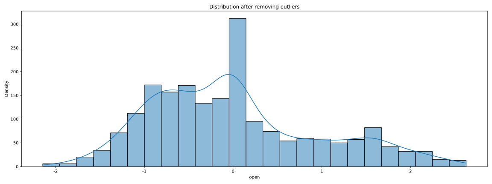

|   n_valid |   n_nan |   n_outlier |    mean |    std |     min |     25% |     50% |    75% |    max |
|----------:|--------:|------------:|--------:|-------:|--------:|--------:|--------:|-------:|-------:|
|      2000 |       0 |           0 | -0.0000 | 0.9489 | -2.1456 | -0.7190 | -0.0772 | 0.5058 | 2.6279 |

## 因子值非空比例

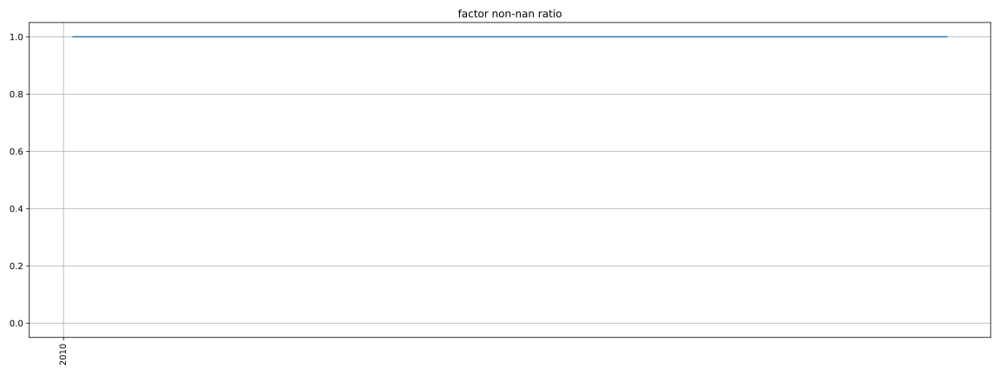

## IC分析

### 1D

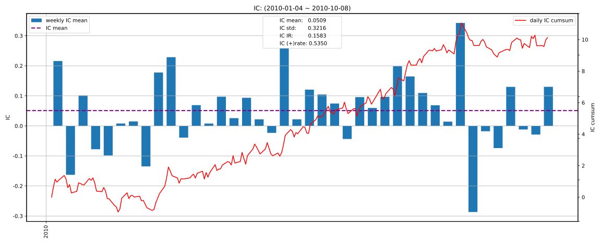

| IC   |   total |   2010 |
|:-----|--------:|-------:|
| mean |  0.0509 | 0.0509 |
| std  |  0.3216 | 0.3216 |
| IR   |  0.1583 | 0.1583 |

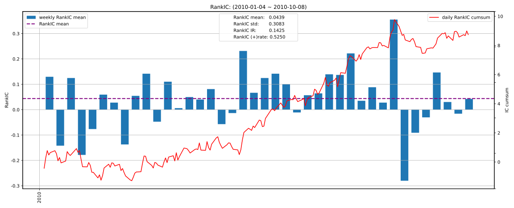

| RankIC   |   total |   2010 |
|:---------|--------:|-------:|
| mean     |  0.0439 | 0.0439 |
| std      |  0.3083 | 0.3083 |
| IR       |  0.1425 | 0.1425 |

### 5D

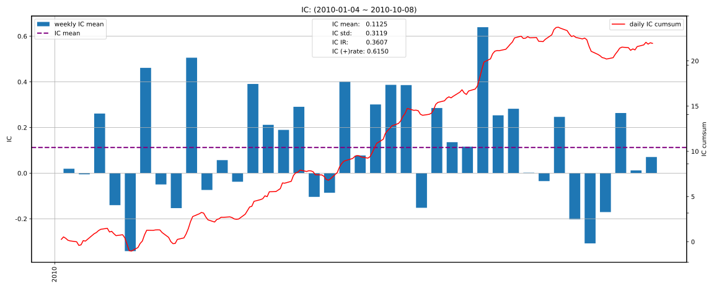

| IC   |   total |   2010 |
|:-----|--------:|-------:|
| mean |  0.1125 | 0.1125 |
| std  |  0.3119 | 0.3119 |
| IR   |  0.3607 | 0.3607 |

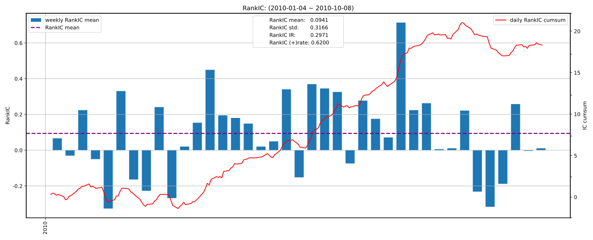

| RankIC   |   total |   2010 |
|:---------|--------:|-------:|
| mean     |  0.0941 | 0.0941 |
| std      |  0.3166 | 0.3166 |
| IR       |  0.2971 | 0.2971 |

### 10D

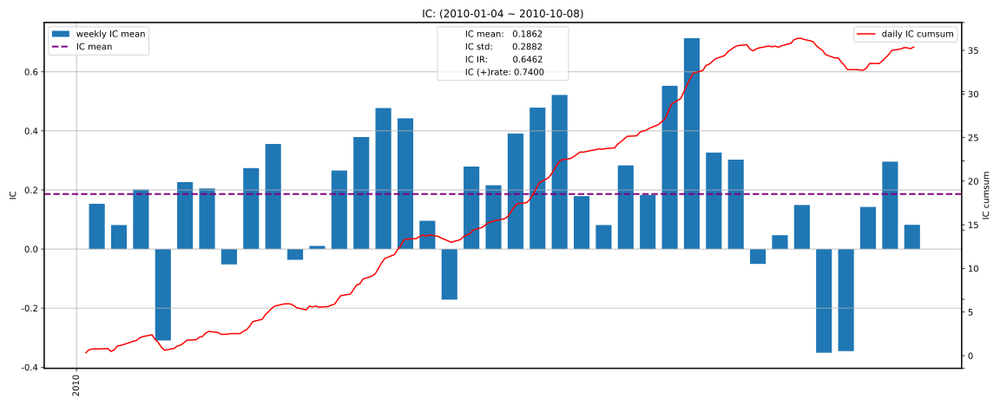

| IC   |   total |   2010 |
|:-----|--------:|-------:|
| mean |  0.1862 | 0.1862 |
| std  |  0.2882 | 0.2882 |
| IR   |  0.6462 | 0.6462 |

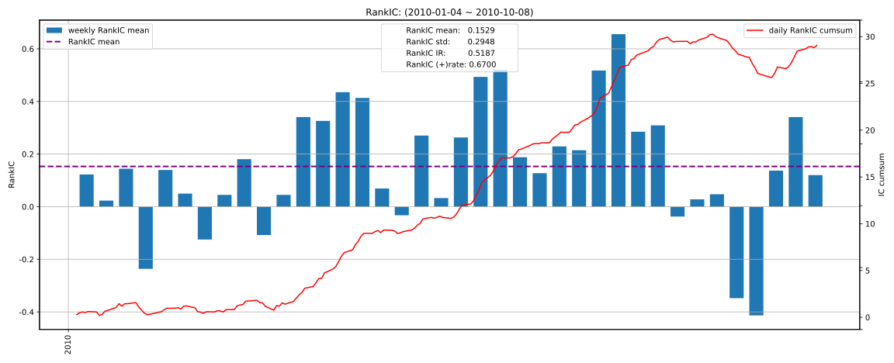

| RankIC   |   total |   2010 |
|:---------|--------:|-------:|
| mean     |  0.1529 | 0.1529 |
| std      |  0.2948 | 0.2948 |
| IR       |  0.5187 | 0.5187 |

### 20D

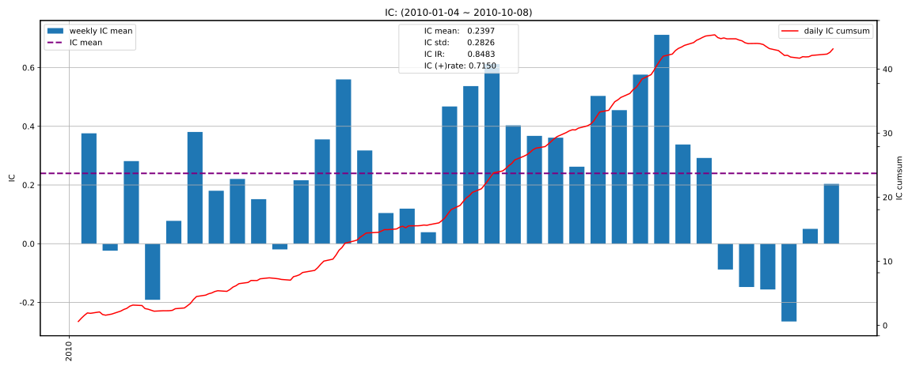

| IC   |   total |   2010 |
|:-----|--------:|-------:|
| mean |  0.2397 | 0.2397 |
| std  |  0.2826 | 0.2826 |
| IR   |  0.8483 | 0.8483 |

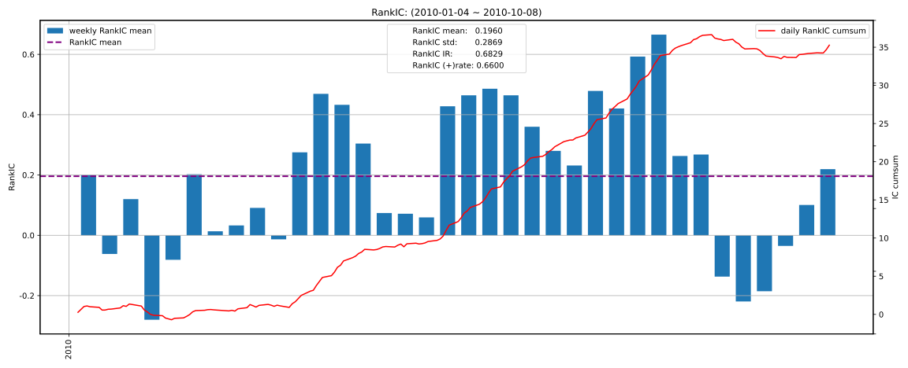

| RankIC   |   total |   2010 |
|:---------|--------:|-------:|
| mean     |  0.1960 | 0.1960 |
| std      |  0.2869 | 0.2869 |
| IR       |  0.6829 | 0.6829 |

## 收益分析

### 1D

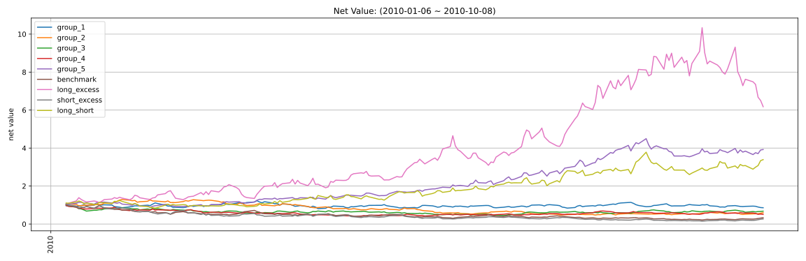

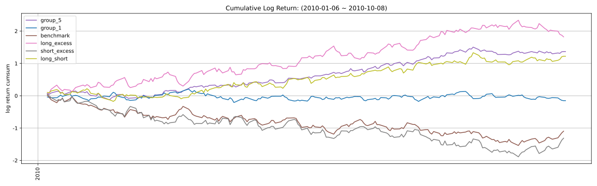

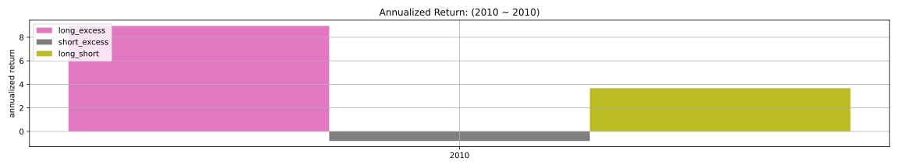

|                |   ann_ret |   max_dd |   sharpe |   calmar |   win_rate |   ann_vol |   avg_win_ret |   avg_loss_ret |   win_loss_ratio |
|:---------------|----------:|---------:|---------:|---------:|-----------:|----------:|--------------:|---------------:|-----------------:|
| group_5(long)  |    4.6962 |   0.2389 |   3.0069 |  19.6537 |     0.5909 |    0.6504 |        0.0350 |        -0.0320 |           1.0946 |
| group_1(short) |   -0.1756 |   0.3402 |   0.0333 |  -0.5162 |     0.5101 |    0.6574 |        0.0336 |        -0.0352 |           0.9553 |
| benchmark      |   -0.7536 |   0.7893 |  -1.0273 |  -0.9548 |     0.4873 |    0.9354 |        0.0492 |        -0.0542 |           0.9077 |
| long_excess    |    9.2732 |   0.4022 |   2.6875 |  23.0551 |     0.5533 |    1.0890 |        0.0629 |        -0.0519 |           1.2121 |
| short_excess   |   -0.8133 |   0.8569 |  -0.8392 |  -0.9491 |     0.4721 |    1.1713 |        0.0615 |        -0.0624 |           0.9858 |
| long_short     |    3.7326 |   0.3247 |   2.2212 |  11.4938 |     0.5303 |    0.8706 |        0.0494 |        -0.0399 |           1.2388 |

### 5D

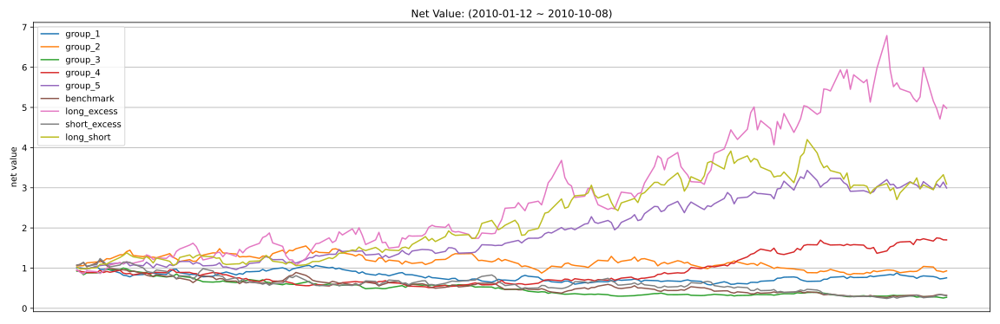

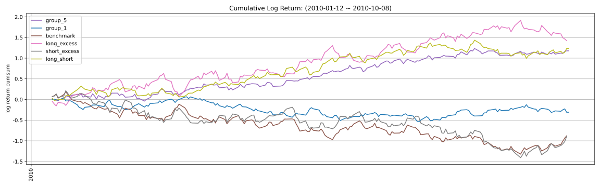

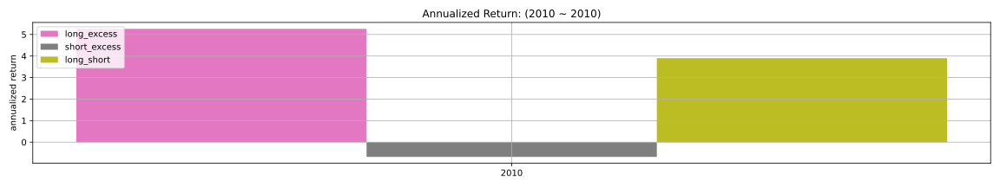

|                |   ann_ret |   max_dd |   sharpe |   calmar |   win_rate |   ann_vol |   avg_win_ret |   avg_loss_ret |   win_loss_ratio |
|:---------------|----------:|---------:|---------:|---------:|-----------:|----------:|--------------:|---------------:|-----------------:|
| group_5(long)  |    3.6135 |   0.1753 |   2.6270 |  20.6103 |     0.5928 |    0.6683 |        0.0349 |        -0.0341 |           1.0233 |
| group_1(short) |   -0.3310 |   0.4537 |  -0.3148 |  -0.7295 |     0.4897 |    0.6362 |        0.0325 |        -0.0331 |           0.9825 |
| benchmark      |   -0.6829 |   0.7785 |  -0.7621 |  -0.8772 |     0.4922 |    0.9336 |        0.0495 |        -0.0535 |           0.9244 |
| long_excess    |    5.4156 |   0.4299 |   2.2315 |  12.5983 |     0.5233 |    1.1097 |        0.0652 |        -0.0509 |           1.2795 |
| short_excess   |   -0.6882 |   0.8023 |  -0.4481 |  -0.8577 |     0.4870 |    1.1386 |        0.0602 |        -0.0611 |           0.9851 |
| long_short     |    3.9634 |   0.3556 |   2.3319 |  11.1450 |     0.5876 |    0.8388 |        0.0441 |        -0.0446 |           0.9889 |

### 10D

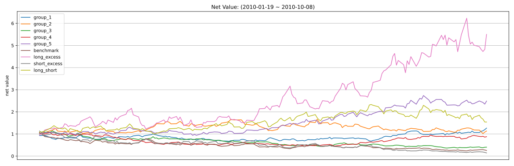

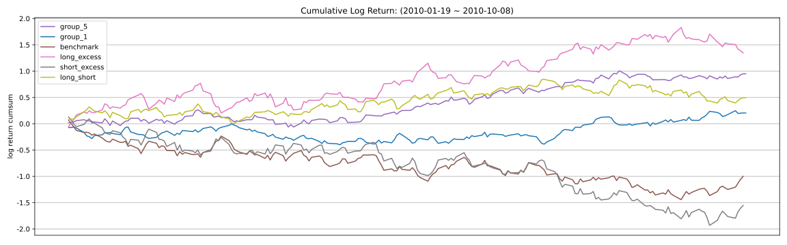

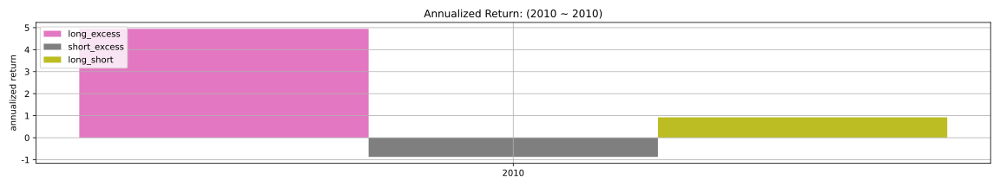

|                |   ann_ret |   max_dd |   sharpe |   calmar |   win_rate |   ann_vol |   avg_win_ret |   avg_loss_ret |   win_loss_ratio |
|:---------------|----------:|---------:|---------:|---------:|-----------:|----------:|--------------:|---------------:|-----------------:|
| group_5(long)  |    2.5487 |   0.2784 |   2.2361 |   9.1552 |     0.5714 |    0.6664 |        0.0349 |        -0.0331 |           1.0535 |
| group_1(short) |    0.3140 |   0.3301 |   0.7459 |   0.9511 |     0.5238 |    0.6390 |        0.0337 |        -0.0335 |           1.0068 |
| benchmark      |   -0.7383 |   0.7785 |  -0.9805 |  -0.9484 |     0.4840 |    0.9270 |        0.0491 |        -0.0531 |           0.9256 |
| long_excess    |    5.0882 |   0.4328 |   2.2021 |  11.7560 |     0.5426 |    1.0931 |        0.0612 |        -0.0517 |           1.1835 |
| short_excess   |   -0.8752 |   0.8725 |  -1.1895 |  -1.0031 |     0.4574 |    1.1669 |        0.0622 |        -0.0626 |           0.9938 |
| long_short     |    0.9339 |   0.3644 |   1.2010 |   2.5625 |     0.5397 |    0.8439 |        0.0454 |        -0.0450 |           1.0088 |

### 20D

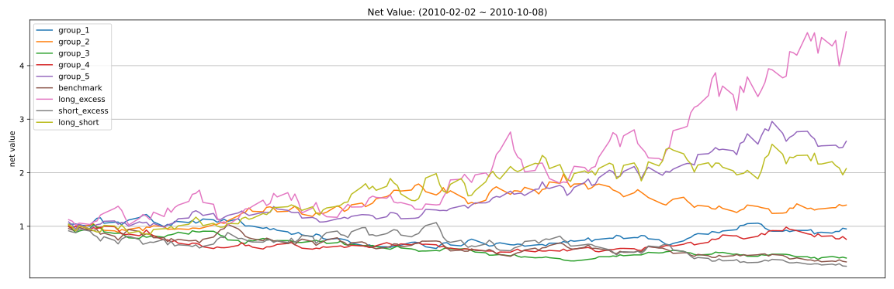

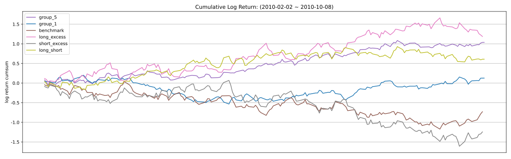

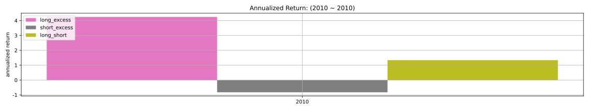

|                |   ann_ret |   max_dd |   sharpe |   calmar |   win_rate |   ann_vol |   avg_win_ret |   avg_loss_ret |   win_loss_ratio |
|:---------------|----------:|---------:|---------:|---------:|-----------:|----------:|--------------:|---------------:|-----------------:|
| group_5(long)  |    3.3071 |   0.2109 |   2.5410 |  15.6779 |     0.5922 |    0.6620 |        0.0342 |        -0.0338 |           1.0130 |
| group_1(short) |    0.1962 |   0.5199 |   0.6026 |   0.3773 |     0.5140 |    0.6821 |        0.0358 |        -0.0349 |           1.0257 |
| benchmark      |   -0.6443 |   0.7015 |  -0.6371 |  -0.9184 |     0.4944 |    0.9351 |        0.0498 |        -0.0533 |           0.9330 |
| long_excess    |    4.3663 |   0.3874 |   2.0807 |  11.2703 |     0.5393 |    1.0993 |        0.0616 |        -0.0524 |           1.1756 |
| short_excess   |   -0.8280 |   0.8132 |  -0.8295 |  -1.0181 |     0.4888 |    1.2166 |        0.0626 |        -0.0677 |           0.9249 |
| long_short     |    1.3550 |   0.3223 |   1.3910 |   4.2044 |     0.5363 |    0.9138 |        0.0490 |        -0.0463 |           1.0572 |

### 因子加权日频收益

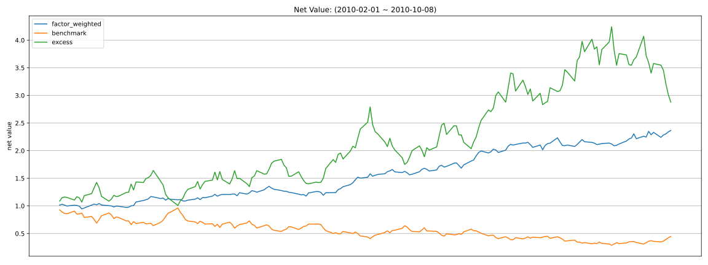

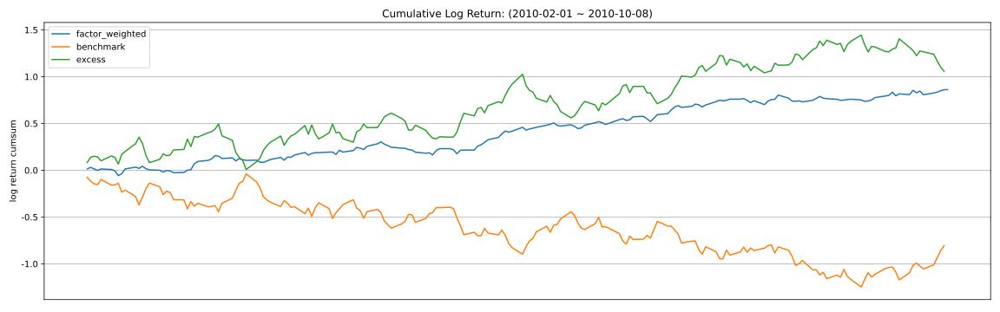

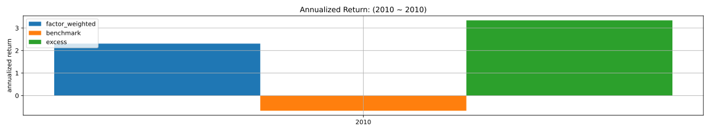

|                 |   ann_ret |   max_dd |   sharpe |   calmar |   win_rate |   ann_vol |   avg_win_ret |   avg_loss_ret |   win_loss_ratio |
|:----------------|----------:|---------:|---------:|---------:|-----------:|----------:|--------------:|---------------:|-----------------:|
| factor_weighted |    2.3399 |   0.1302 |   3.6218 |  17.9678 |     0.5889 |    0.3506 |        0.0202 |        -0.0170 |           1.1927 |
| benchmark       |   -0.6780 |   0.7128 |  -0.7413 |  -0.9511 |     0.4916 |    0.9361 |        0.0498 |        -0.0535 |           0.9294 |
| excess          |    3.4294 |   0.3857 |   2.0091 |   8.8905 |     0.5587 |    0.9809 |        0.0548 |        -0.0517 |           1.0608 |

### 单因子策略(0.8, 1.0)收益

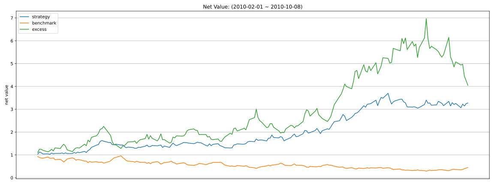

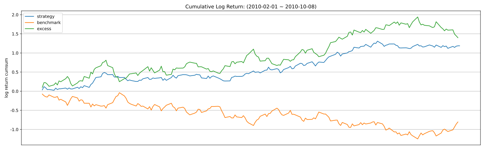

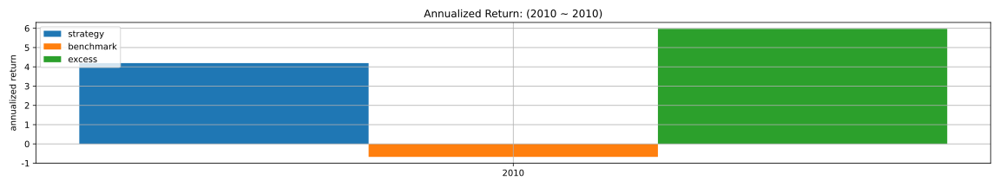

|           |   ann_ret |   max_dd |   sharpe |   calmar |   win_rate |   ann_vol |   avg_win_ret |   avg_loss_ret |   win_loss_ratio |
|:----------|----------:|---------:|---------:|---------:|-----------:|----------:|--------------:|---------------:|-----------------:|
| strategy  |    4.2622 |   0.2093 |   2.8835 |  20.3654 |     0.5778 |    0.6503 |        0.0358 |        -0.0318 |           1.1265 |
| benchmark |   -0.6780 |   0.7128 |  -0.7413 |  -0.9511 |     0.4916 |    0.9361 |        0.0498 |        -0.0535 |           0.9294 |
| excess    |    6.1591 |   0.4303 |   2.3360 |  14.3145 |     0.5475 |    1.1043 |        0.0620 |        -0.0524 |           1.1836 |

## 换手率分析

### 1D

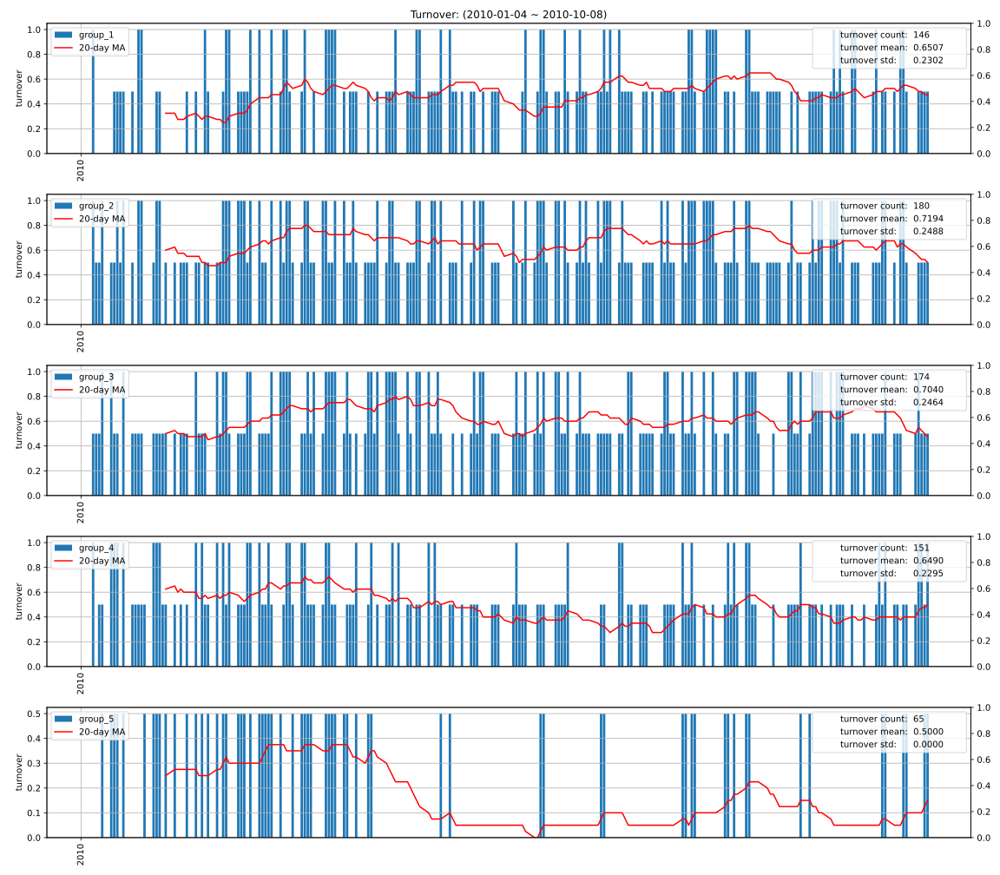

|         |   turnover_count |   turnover_mean |   turnover_std |
|:--------|-----------------:|----------------:|---------------:|
| group_1 |         146.0000 |          0.6507 |         0.2302 |
| group_2 |         180.0000 |          0.7194 |         0.2488 |
| group_3 |         174.0000 |          0.7040 |         0.2464 |
| group_4 |         151.0000 |          0.6490 |         0.2295 |
| group_5 |          65.0000 |          0.5000 |         0.0000 |

### 5D

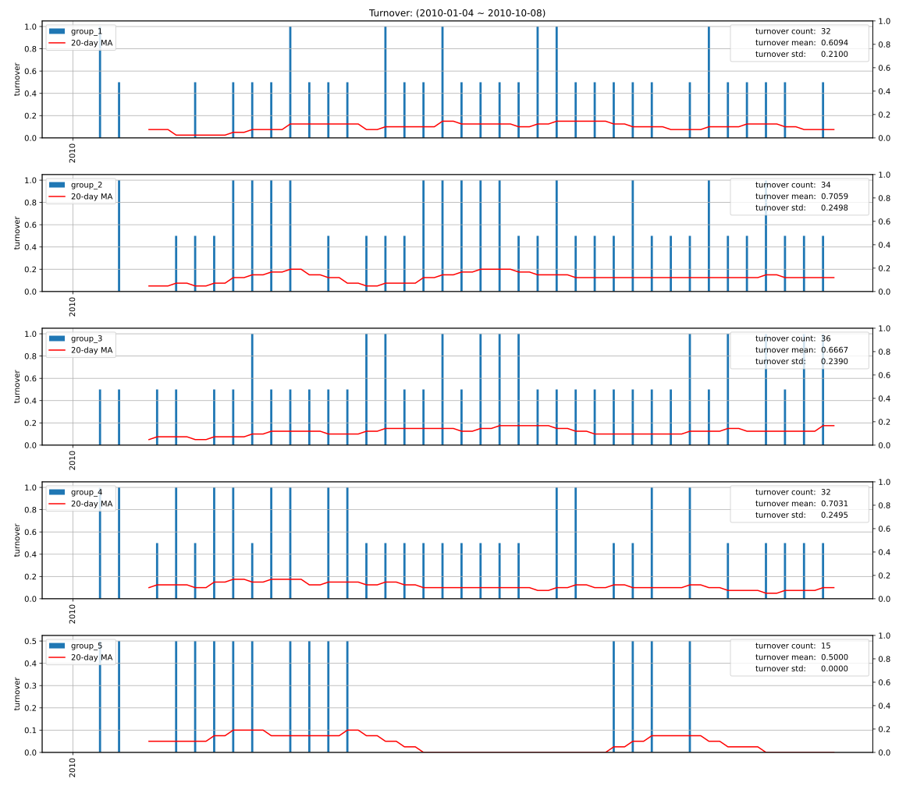

|         |   turnover_count |   turnover_mean |   turnover_std |
|:--------|-----------------:|----------------:|---------------:|
| group_1 |          32.0000 |          0.6094 |         0.2100 |
| group_2 |          34.0000 |          0.7059 |         0.2498 |
| group_3 |          36.0000 |          0.6667 |         0.2390 |
| group_4 |          32.0000 |          0.7031 |         0.2495 |
| group_5 |          15.0000 |          0.5000 |         0.0000 |

### 10D

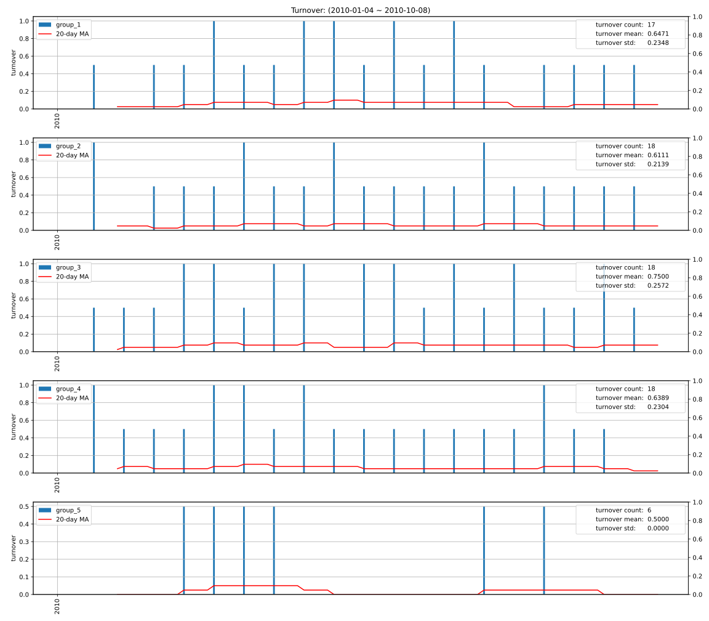

|         |   turnover_count |   turnover_mean |   turnover_std |
|:--------|-----------------:|----------------:|---------------:|
| group_1 |          17.0000 |          0.6471 |         0.2348 |
| group_2 |          18.0000 |          0.6111 |         0.2139 |
| group_3 |          18.0000 |          0.7500 |         0.2572 |
| group_4 |          18.0000 |          0.6389 |         0.2304 |
| group_5 |           6.0000 |          0.5000 |         0.0000 |

### 20D

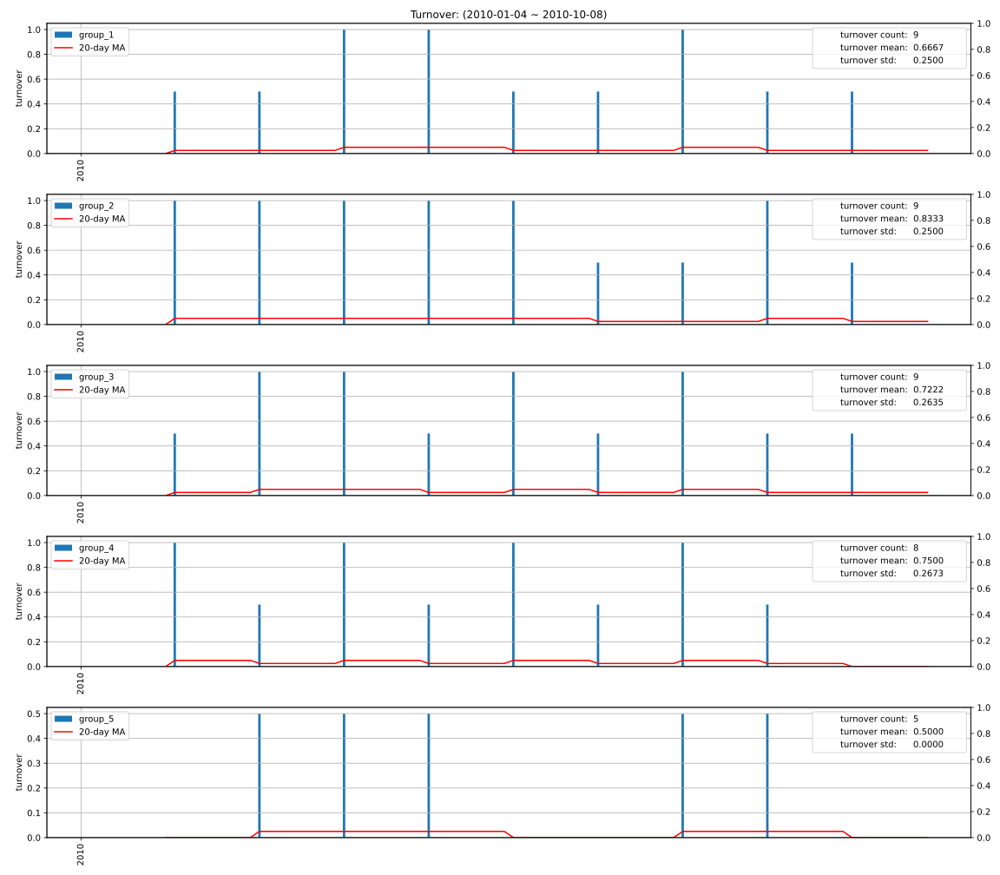

|         |   turnover_count |   turnover_mean |   turnover_std |
|:--------|-----------------:|----------------:|---------------:|
| group_1 |           9.0000 |          0.6667 |         0.2500 |
| group_2 |           9.0000 |          0.8333 |         0.2500 |
| group_3 |           9.0000 |          0.7222 |         0.2635 |
| group_4 |           8.0000 |          0.7500 |         0.2673 |
| group_5 |           5.0000 |          0.5000 |         0.0000 |

### 因子加权持仓换手率

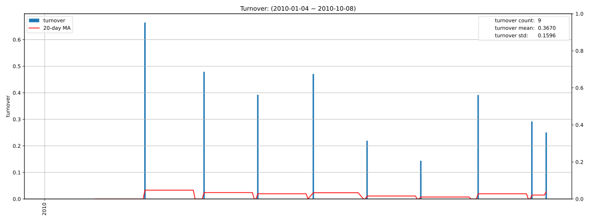

|                 |   turnover_count |   turnover_mean |   turnover_std |
|:----------------|-----------------:|----------------:|---------------:|
| factor_weighted |           9.0000 |          0.3670 |         0.1596 |

### 单因子策略(0.8, 1.0)换手率

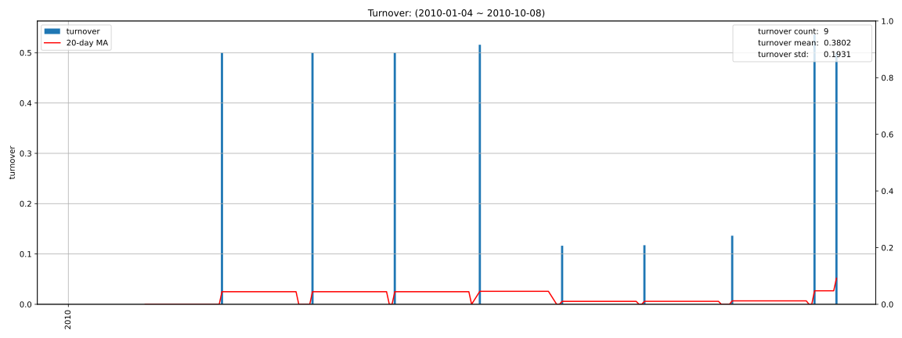

|          |   turnover_count |   turnover_mean |   turnover_std |
|:---------|-----------------:|----------------:|---------------:|
| strategy |           9.0000 |          0.3802 |         0.1931 |

