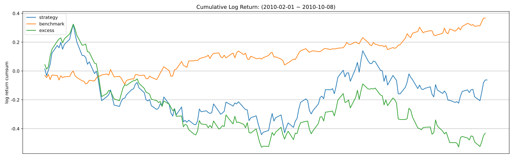

# factor1(RandomGenerated2) 因子报告

## 因子值分布（已去极值）

|   n_valid |   n_nan |   n_outlier |   mean |    std |     min |     25% |     50% |    75% |    max |
|----------:|--------:|------------:|-------:|-------:|--------:|--------:|--------:|-------:|-------:|
|      1910 |      90 |           0 | 0.0000 | 0.9489 | -2.2355 | -0.7507 | -0.0032 | 0.7249 | 2.2486 |

## 因子值非空比例

## IC分析

### 1D

| IC   |   total |   2010 |
|:-----|--------:|-------:|
| mean |  0.0315 | 0.0315 |
| std  |  0.3621 | 0.3621 |
| IR   |  0.0871 | 0.0871 |

| RankIC   |   total |   2010 |
|:---------|--------:|-------:|
| mean     |  0.0297 | 0.0297 |
| std      |  0.3586 | 0.3586 |
| IR       |  0.0827 | 0.0827 |

### 5D

| IC   |   total |   2010 |
|:-----|--------:|-------:|
| mean |  0.0444 | 0.0444 |
| std  |  0.3310 | 0.3310 |
| IR   |  0.1340 | 0.1340 |

| RankIC   |   total |   2010 |
|:---------|--------:|-------:|
| mean     |  0.0340 | 0.0340 |
| std      |  0.3225 | 0.3225 |
| IR       |  0.1055 | 0.1055 |

### 10D

| IC   |   total |   2010 |
|:-----|--------:|-------:|
| mean |  0.0175 | 0.0175 |
| std  |  0.3404 | 0.3404 |
| IR   |  0.0515 | 0.0515 |

| RankIC   |   total |   2010 |
|:---------|--------:|-------:|
| mean     |  0.0242 | 0.0242 |
| std      |  0.3414 | 0.3414 |
| IR       |  0.0709 | 0.0709 |

### 20D

| IC   |   total |   2010 |
|:-----|--------:|-------:|
| mean |  0.0008 | 0.0008 |
| std  |  0.3687 | 0.3687 |
| IR   |  0.0023 | 0.0023 |

| RankIC   |   total |   2010 |
|:---------|--------:|-------:|
| mean     |  0.0060 | 0.0060 |
| std      |  0.3462 | 0.3462 |
| IR       |  0.0173 | 0.0173 |

## 收益分析

### 1D

|                |   ann_ret |   max_dd |   sharpe |   calmar |   win_rate |   ann_vol |   avg_win_ret |   avg_loss_ret |   win_loss_ratio |
|:---------------|----------:|---------:|---------:|---------:|-----------:|----------:|--------------:|---------------:|-----------------:|
| group_5(long)  |    2.2359 |   0.2921 |   2.2351 |   7.6539 |     0.5579 |    0.6088 |        0.0323 |        -0.0289 |           1.1185 |
| group_1(short) |    0.2373 |   0.3258 |   0.6510 |   0.7284 |     0.4895 |    0.6763 |        0.0379 |        -0.0332 |           1.1397 |
| benchmark      |    0.7590 |   0.0979 |   2.0211 |   7.7533 |     0.5714 |    0.3022 |        0.0156 |        -0.0151 |           1.0306 |
| long_excess    |    0.8211 |   0.3147 |   1.3464 |   2.6090 |     0.5238 |    0.5623 |        0.0300 |        -0.0267 |           1.1243 |
| short_excess   |    0.0029 |   0.4881 |   0.2918 |   0.0059 |     0.5291 |    0.5760 |        0.0296 |        -0.0319 |           0.9296 |
| long_short     |    0.6371 |   0.6015 |   0.9910 |   1.0591 |     0.5000 |    0.9287 |        0.0514 |        -0.0445 |           1.1535 |

### 5D

|                |   ann_ret |   max_dd |   sharpe |   calmar |   win_rate |   ann_vol |   avg_win_ret |   avg_loss_ret |   win_loss_ratio |
|:---------------|----------:|---------:|---------:|---------:|-----------:|----------:|--------------:|---------------:|-----------------:|
| group_5(long)  |    2.1688 |   0.2639 |   2.1638 |   8.2179 |     0.5026 |    0.6230 |        0.0375 |        -0.0274 |           1.3676 |
| group_1(short) |   -0.4713 |   0.5557 |  -0.7069 |  -0.8481 |     0.4656 |    0.6254 |        0.0322 |        -0.0316 |           1.0173 |
| benchmark      |    0.7235 |   0.0979 |   1.9519 |   7.3904 |     0.5691 |    0.3025 |        0.0156 |        -0.0151 |           1.0293 |
| long_excess    |    0.8160 |   0.2511 |   1.3173 |   3.2494 |     0.5213 |    0.5807 |        0.0317 |        -0.0281 |           1.1254 |
| short_excess   |    1.4331 |   0.2637 |   1.9213 |   5.4335 |     0.5372 |    0.5386 |        0.0299 |        -0.0259 |           1.1569 |
| long_short     |    3.1019 |   0.3816 |   2.0593 |   8.1278 |     0.5291 |    0.8693 |        0.0484 |        -0.0397 |           1.2179 |

### 10D

|                |   ann_ret |   max_dd |   sharpe |   calmar |   win_rate |   ann_vol |   avg_win_ret |   avg_loss_ret |   win_loss_ratio |
|:---------------|----------:|---------:|---------:|---------:|-----------:|----------:|--------------:|---------------:|-----------------:|
| group_5(long)  |    0.6395 |   0.3076 |   1.0983 |   2.0789 |     0.4868 |    0.6277 |        0.0354 |        -0.0285 |           1.2404 |
| group_1(short) |   -0.6593 |   0.7454 |  -1.4374 |  -0.8845 |     0.4286 |    0.6161 |        0.0330 |        -0.0312 |           1.0581 |
| benchmark      |    0.7235 |   0.0979 |   1.9519 |   7.3904 |     0.5691 |    0.3025 |        0.0156 |        -0.0151 |           1.0293 |
| long_excess    |   -0.0625 |   0.3209 |   0.1772 |  -0.1947 |     0.5000 |    0.5793 |        0.0298 |        -0.0290 |           1.0281 |
| short_excess   |    2.8621 |   0.3404 |   2.9398 |   8.4078 |     0.5479 |    0.5036 |        0.0291 |        -0.0223 |           1.3069 |
| long_short     |    2.4432 |   0.4795 |   1.9209 |   5.0957 |     0.5556 |    0.8199 |        0.0429 |        -0.0401 |           1.0710 |

### 20D

|                |   ann_ret |   max_dd |   sharpe |   calmar |   win_rate |   ann_vol |   avg_win_ret |   avg_loss_ret |   win_loss_ratio |
|:---------------|----------:|---------:|---------:|---------:|-----------:|----------:|--------------:|---------------:|-----------------:|
| group_5(long)  |    1.5366 |   0.2372 |   1.7763 |   6.4786 |     0.5419 |    0.6389 |        0.0350 |        -0.0320 |           1.0949 |
| group_1(short) |   -0.4785 |   0.4880 |  -0.7763 |  -0.9804 |     0.4860 |    0.6037 |        0.0297 |        -0.0320 |           0.9264 |
| benchmark      |    0.7593 |   0.0979 |   2.0448 |   7.7555 |     0.5618 |    0.2981 |        0.0157 |        -0.0146 |           1.0759 |
| long_excess    |    0.4577 |   0.3257 |   0.9541 |   1.4053 |     0.5169 |    0.5573 |        0.0300 |        -0.0277 |           1.0821 |
| short_excess   |    1.5641 |   0.2068 |   2.0582 |   7.5624 |     0.5225 |    0.5252 |        0.0290 |        -0.0228 |           1.2745 |
| long_short     |    2.4903 |   0.3852 |   1.9083 |   6.4643 |     0.5363 |    0.8403 |        0.0458 |        -0.0397 |           1.1532 |

### 因子加权日频收益

|                 |   ann_ret |   max_dd |   sharpe |   calmar |   win_rate |   ann_vol |   avg_win_ret |   avg_loss_ret |   win_loss_ratio |
|:----------------|----------:|---------:|---------:|---------:|-----------:|----------:|--------------:|---------------:|-----------------:|
| factor_weighted |   -0.0824 |   0.2794 |  -0.0351 |  -0.2950 |     0.4667 |    0.3818 |        0.0210 |        -0.0186 |           1.1248 |
| benchmark       |    0.6786 |   0.0979 |   1.8780 |   6.9322 |     0.5587 |    0.2999 |        0.0157 |        -0.0148 |           1.0611 |
| excess          |   -0.5042 |   0.5243 |  -1.1564 |  -0.9617 |     0.4804 |    0.4986 |        0.0243 |        -0.0269 |           0.9043 |

### 单因子策略(0.8, 1.0)收益

|           |   ann_ret |   max_dd |   sharpe |   calmar |   win_rate |   ann_vol |   avg_win_ret |   avg_loss_ret |   win_loss_ratio |
|:----------|----------:|---------:|---------:|---------:|-----------:|----------:|--------------:|---------------:|-----------------:|
| strategy  |   -0.0831 |   0.5353 |   0.2034 |  -0.1553 |     0.5056 |    0.6685 |        0.0348 |        -0.0348 |           0.9977 |
| benchmark |    0.6786 |   0.0979 |   1.8780 |   6.9322 |     0.5587 |    0.2999 |        0.0157 |        -0.0148 |           1.0611 |
| excess    |   -0.4550 |   0.5737 |  -0.7093 |  -0.7931 |     0.4749 |    0.6011 |        0.0301 |        -0.0304 |           0.9887 |

## 换手率分析

### 1D

|         |   turnover_count |   turnover_mean |   turnover_std |
|:--------|-----------------:|----------------:|---------------:|
| group_1 |         186.0000 |          0.8253 |         0.2390 |
| group_2 |         188.0000 |          0.8351 |         0.2357 |
| group_3 |         189.0000 |          0.8466 |         0.2312 |
| group_4 |         188.0000 |          0.8059 |         0.2443 |
| group_5 |         185.0000 |          0.7919 |         0.2471 |

### 5D

|         |   turnover_count |   turnover_mean |   turnover_std |
|:--------|-----------------:|----------------:|---------------:|
| group_1 |          37.0000 |          0.8243 |         0.2420 |
| group_2 |          37.0000 |          0.7973 |         0.2489 |
| group_3 |          36.0000 |          0.8333 |         0.2390 |
| group_4 |          37.0000 |          0.7568 |         0.2534 |
| group_5 |          36.0000 |          0.7778 |         0.2520 |

### 10D

|         |   turnover_count |   turnover_mean |   turnover_std |
|:--------|-----------------:|----------------:|---------------:|
| group_1 |          18.0000 |          0.7778 |         0.2557 |
| group_2 |          18.0000 |          0.8333 |         0.2425 |
| group_3 |          16.0000 |          0.7500 |         0.2582 |
| group_4 |          16.0000 |          0.8125 |         0.2500 |
| group_5 |          16.0000 |          0.8438 |         0.2394 |

### 20D

|         |   turnover_count |   turnover_mean |   turnover_std |
|:--------|-----------------:|----------------:|---------------:|
| group_1 |           8.0000 |          0.7500 |         0.2673 |
| group_2 |           8.0000 |          0.8125 |         0.2588 |
| group_3 |           8.0000 |          0.7500 |         0.2673 |
| group_4 |           8.0000 |          0.7500 |         0.2673 |
| group_5 |           7.0000 |          0.7857 |         0.2673 |

### 因子加权持仓换手率

|                 |   turnover_count |   turnover_mean |   turnover_std |
|:----------------|-----------------:|----------------:|---------------:|
| factor_weighted |           9.0000 |          0.7740 |         0.1894 |

### 单因子策略(0.8, 1.0)换手率

|          |   turnover_count |   turnover_mean |   turnover_std |
|:---------|-----------------:|----------------:|---------------:|
| strategy |           9.0000 |          0.9042 |         0.2334 |

