# factor2(RandomGenerated2) 因子报告
## 因子值分布（已去极值）
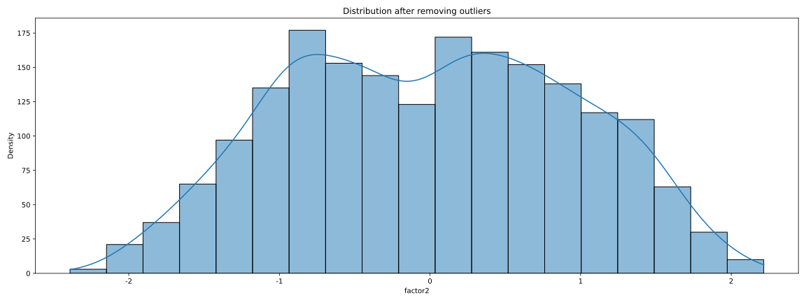

|   n_valid |   n_nan |   n_outlier |   mean |    std |     min |     25% |    50% |    75% |    max |
|----------:|--------:|------------:|-------:|-------:|--------:|--------:|-------:|-------:|-------:|
|      1910 |      90 |           0 | 0.0000 | 0.9489 | -2.3899 | -0.7823 | 0.0348 | 0.7474 | 2.2161 |

## 因子值非空比例
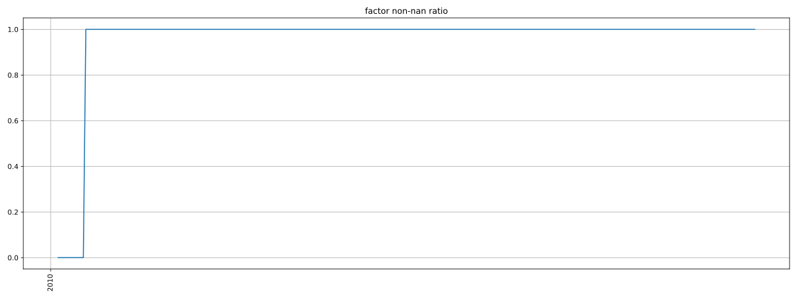

## IC分析
### 1D
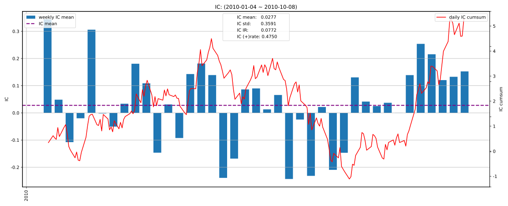

| IC   |   total |   2010 |
|:-----|--------:|-------:|
| mean |  0.0277 | 0.0277 |
| std  |  0.3591 | 0.3591 |
| IR   |  0.0772 | 0.0772 |

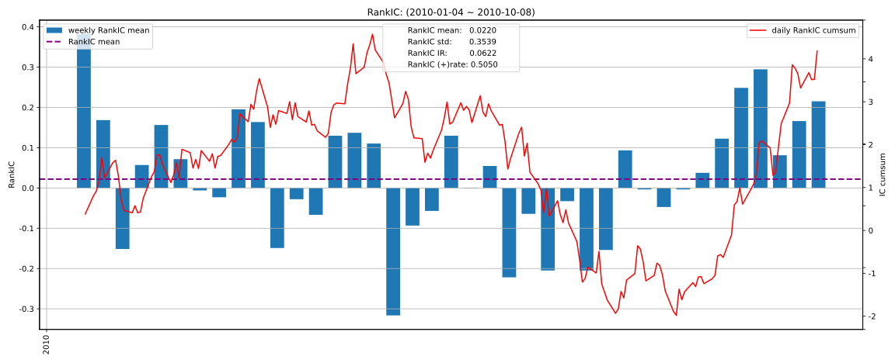

| RankIC   |   total |   2010 |
|:---------|--------:|-------:|
| mean     |  0.0220 | 0.0220 |
| std      |  0.3539 | 0.3539 |
| IR       |  0.0622 | 0.0622 |

### 5D

| IC   |   total |   2010 |
|:-----|--------:|-------:|
| mean |  0.0442 | 0.0442 |
| std  |  0.3367 | 0.3367 |
| IR   |  0.1314 | 0.1314 |

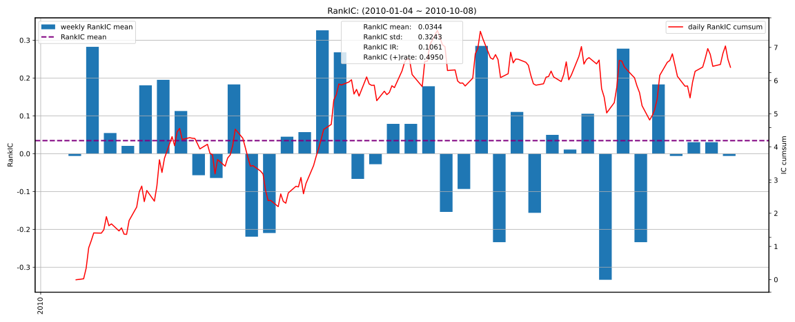

| RankIC   |   total |   2010 |
|:---------|--------:|-------:|
| mean     |  0.0344 | 0.0344 |
| std      |  0.3243 | 0.3243 |
| IR       |  0.1061 | 0.1061 |

### 10D
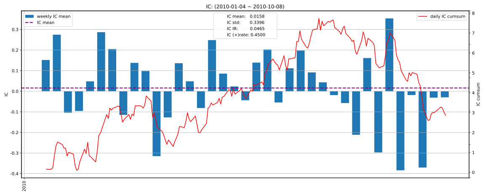

| IC   |   total |   2010 |
|:-----|--------:|-------:|
| mean |  0.0158 | 0.0158 |
| std  |  0.3396 | 0.3396 |
| IR   |  0.0465 | 0.0465 |

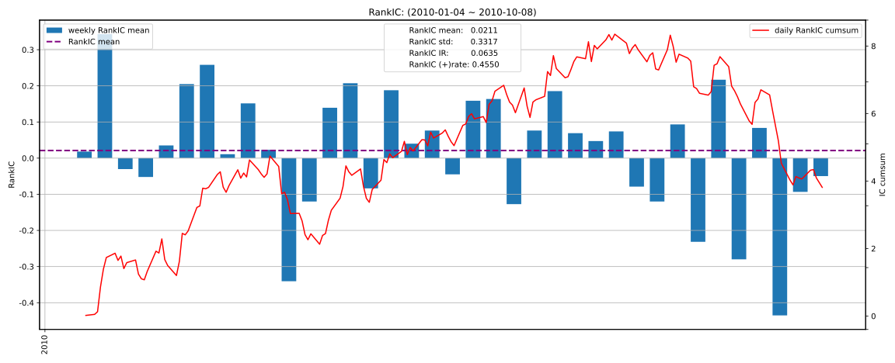

| RankIC   |   total |   2010 |
|:---------|--------:|-------:|
| mean     |  0.0211 | 0.0211 |
| std      |  0.3317 | 0.3317 |
| IR       |  0.0635 | 0.0635 |

### 20D
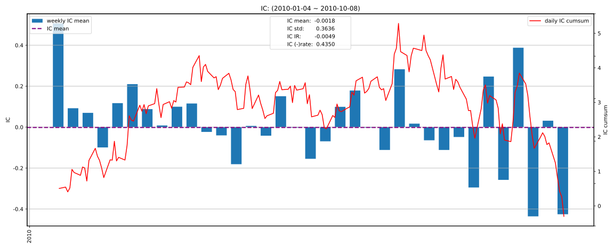

| IC   |   total |    2010 |
|:-----|--------:|--------:|
| mean | -0.0018 | -0.0018 |
| std  |  0.3636 |  0.3636 |
| IR   | -0.0049 | -0.0049 |

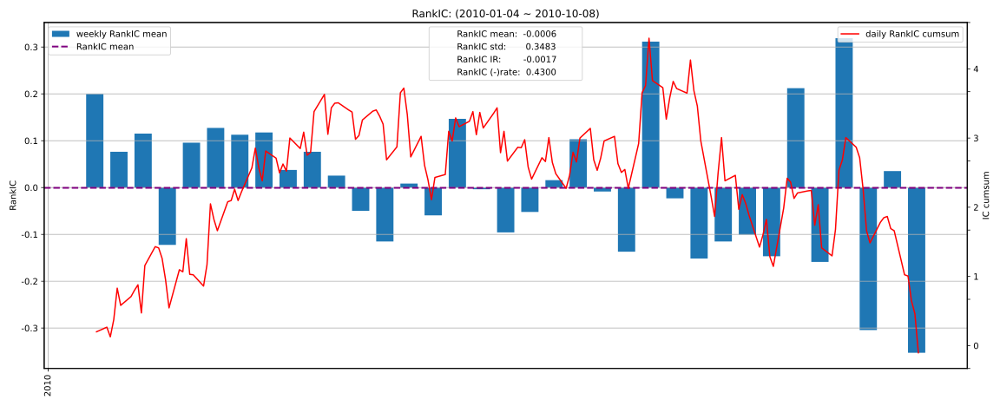

| RankIC   |   total |    2010 |
|:---------|--------:|--------:|
| mean     | -0.0006 | -0.0006 |
| std      |  0.3483 |  0.3483 |
| IR       | -0.0017 | -0.0017 |

## 收益分析
### 1D
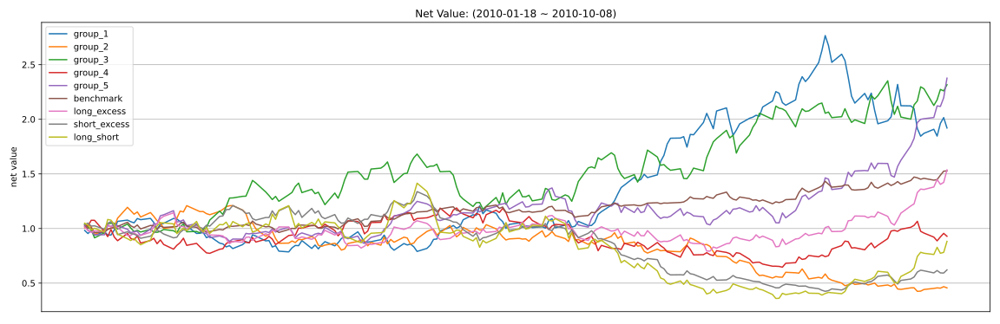

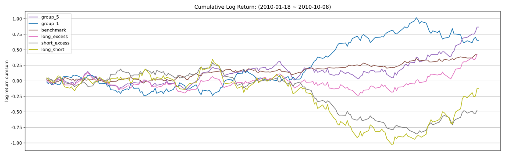

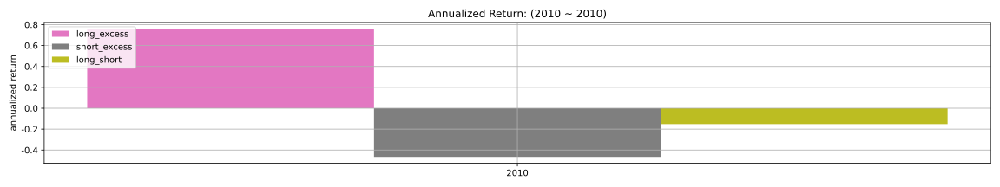

|                |   ann_ret |   max_dd |   sharpe |   calmar |   win_rate |   ann_vol |   avg_win_ret |   avg_loss_ret |   win_loss_ratio |
|:---------------|----------:|---------:|---------:|---------:|-----------:|----------:|--------------:|---------------:|-----------------:|
| group_5(long)  |    2.1527 |   0.2617 |   2.1861 |   8.2268 |     0.5684 |    0.6114 |        0.0316 |        -0.0297 |           1.0640 |
| group_1(short) |    1.3761 |   0.3330 |   1.6510 |   4.1325 |     0.5632 |    0.6542 |        0.0346 |        -0.0352 |           0.9827 |
| benchmark      |    0.7590 |   0.0979 |   2.0211 |   7.7533 |     0.5714 |    0.3022 |        0.0156 |        -0.0151 |           1.0306 |
| long_excess    |    0.7728 |   0.3065 |   1.2951 |   2.5212 |     0.5503 |    0.5660 |        0.0287 |        -0.0286 |           1.0020 |
| short_excess   |   -0.4701 |   0.6825 |  -0.8404 |  -0.6887 |     0.4815 |    0.5653 |        0.0292 |        -0.0308 |           0.9497 |
| long_short     |   -0.1532 |   0.7461 |   0.2778 |  -0.2053 |     0.4895 |    0.9236 |        0.0500 |        -0.0464 |           1.0771 |

### 5D
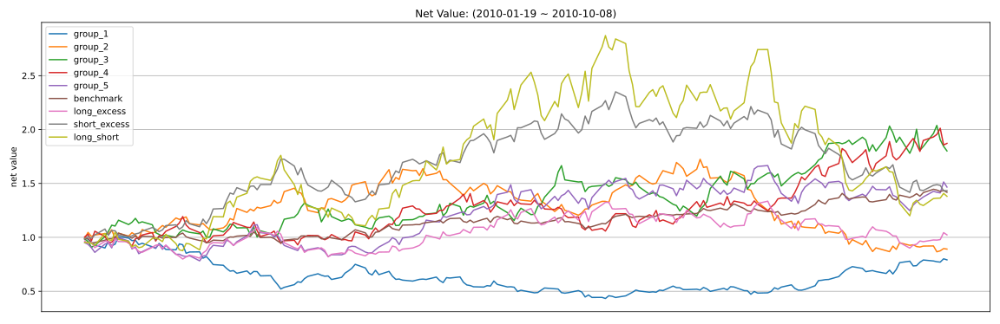

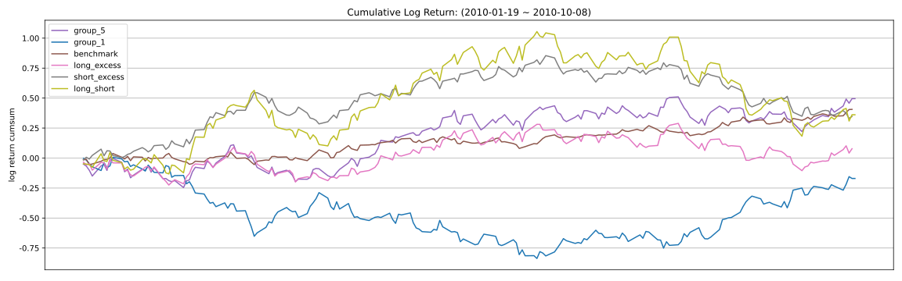

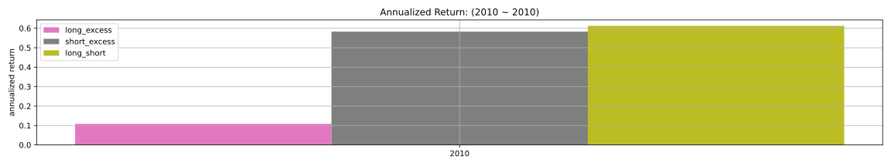

|                |   ann_ret |   max_dd |   sharpe |   calmar |   win_rate |   ann_vol |   avg_win_ret |   avg_loss_ret |   win_loss_ratio |
|:---------------|----------:|---------:|---------:|---------:|-----------:|----------:|--------------:|---------------:|-----------------:|
| group_5(long)  |    0.9360 |   0.2639 |   1.3403 |   3.5468 |     0.5344 |    0.6503 |        0.0349 |        -0.0330 |           1.0574 |
| group_1(short) |   -0.2030 |   0.5700 |  -0.0476 |  -0.3561 |     0.4656 |    0.6293 |        0.0345 |        -0.0306 |           1.1280 |
| benchmark      |    0.7235 |   0.0979 |   1.9519 |   7.3904 |     0.5691 |    0.3025 |        0.0156 |        -0.0151 |           1.0293 |
| long_excess    |    0.1101 |   0.3259 |   0.4736 |   0.3380 |     0.5053 |    0.6036 |        0.0321 |        -0.0305 |           1.0526 |
| short_excess   |    0.5926 |   0.4077 |   1.1131 |   1.4535 |     0.5266 |    0.5575 |        0.0304 |        -0.0287 |           1.0621 |
| long_short     |    0.6186 |   0.5821 |   0.9834 |   1.0627 |     0.5238 |    0.9168 |        0.0477 |        -0.0455 |           1.0492 |

### 10D
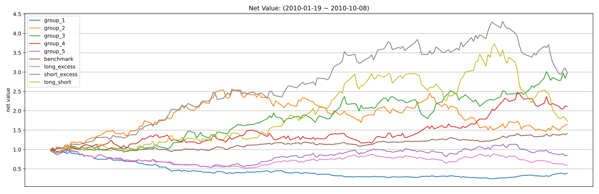

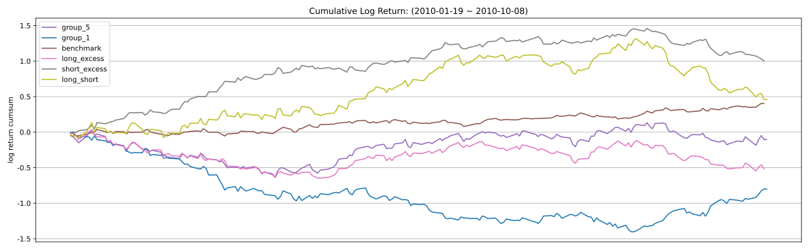

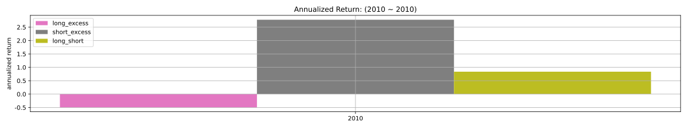

|                |   ann_ret |   max_dd |   sharpe |   calmar |   win_rate |   ann_vol |   avg_win_ret |   avg_loss_ret |   win_loss_ratio |
|:---------------|----------:|---------:|---------:|---------:|-----------:|----------:|--------------:|---------------:|-----------------:|
| group_5(long)  |   -0.1299 |   0.4805 |   0.1127 |  -0.2704 |     0.5026 |    0.6544 |        0.0333 |        -0.0334 |           0.9964 |
| group_1(short) |   -0.6563 |   0.7542 |  -1.4472 |  -0.8702 |     0.4233 |    0.6089 |        0.0328 |        -0.0304 |           1.0783 |
| benchmark      |    0.7235 |   0.0979 |   1.9519 |   7.3904 |     0.5691 |    0.3025 |        0.0156 |        -0.0151 |           1.0293 |
| long_excess    |   -0.5001 |   0.4955 |  -0.8701 |  -1.0092 |     0.4681 |    0.5933 |        0.0302 |        -0.0304 |           0.9926 |
| short_excess   |    2.8450 |   0.3667 |   2.9316 |   7.7585 |     0.5638 |    0.5036 |        0.0283 |        -0.0232 |           1.2219 |
| long_short     |    0.8465 |   0.5750 |   1.1573 |   1.4721 |     0.5291 |    0.8251 |        0.0423 |        -0.0399 |           1.0596 |

### 20D
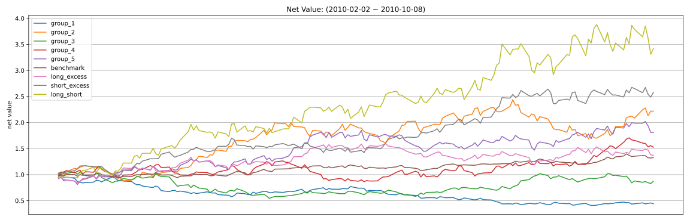

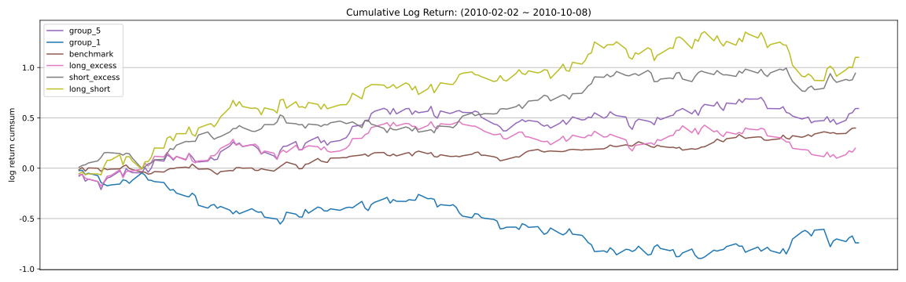

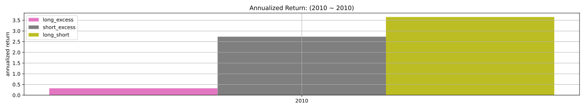

|                |   ann_ret |   max_dd |   sharpe |   calmar |   win_rate |   ann_vol |   avg_win_ret |   avg_loss_ret |   win_loss_ratio |
|:---------------|----------:|---------:|---------:|---------:|-----------:|----------:|--------------:|---------------:|-----------------:|
| group_5(long)  |    1.3040 |   0.2338 |   1.6184 |   5.5777 |     0.5363 |    0.6433 |        0.0353 |        -0.0323 |           1.0925 |
| group_1(short) |   -0.6478 |   0.5919 |  -1.4586 |  -1.0945 |     0.4413 |    0.5938 |        0.0302 |        -0.0303 |           0.9962 |
| benchmark      |    0.7593 |   0.0979 |   2.0448 |   7.7555 |     0.5618 |    0.2981 |        0.0157 |        -0.0146 |           1.0759 |
| long_excess    |    0.3255 |   0.3062 |   0.7824 |   1.0631 |     0.5000 |    0.5590 |        0.0305 |        -0.0270 |           1.1284 |
| short_excess   |    2.8014 |   0.2068 |   2.7772 |  13.5446 |     0.5674 |    0.5331 |        0.0289 |        -0.0244 |           1.1875 |
| long_short     |    3.7110 |   0.3852 |   2.2569 |   9.6329 |     0.5251 |    0.8450 |        0.0481 |        -0.0377 |           1.2758 |

### 因子加权日频收益
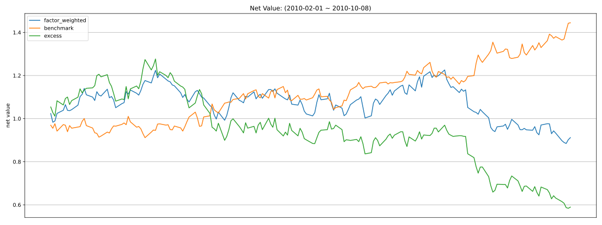

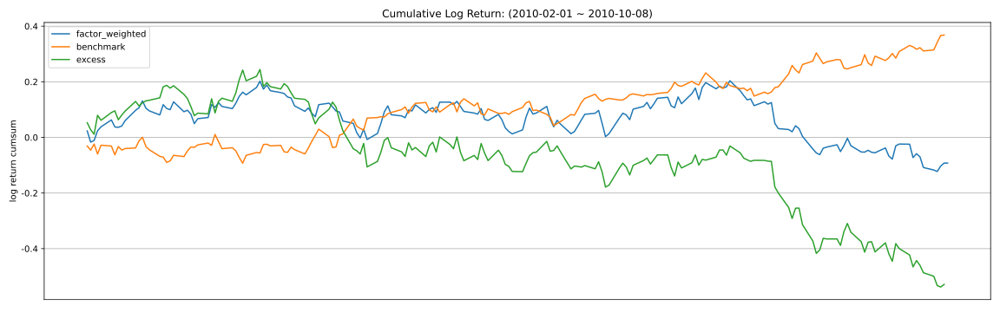

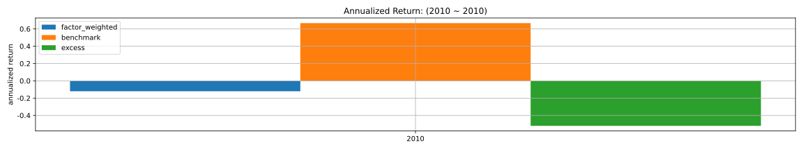

|                 |   ann_ret |   max_dd |   sharpe |   calmar |   win_rate |   ann_vol |   avg_win_ret |   avg_loss_ret |   win_loss_ratio |
|:----------------|----------:|---------:|---------:|---------:|-----------:|----------:|--------------:|---------------:|-----------------:|
| factor_weighted |   -0.1213 |   0.2784 |  -0.1591 |  -0.4358 |     0.4722 |    0.3743 |        0.0203 |        -0.0188 |           1.0793 |
| benchmark       |    0.6786 |   0.0979 |   1.8780 |   6.9322 |     0.5587 |    0.2999 |        0.0157 |        -0.0148 |           1.0611 |
| excess          |   -0.5250 |   0.5426 |  -1.2678 |  -0.9675 |     0.4525 |    0.4914 |        0.0254 |        -0.0255 |           0.9958 |

### 单因子策略(0.8, 1.0)收益
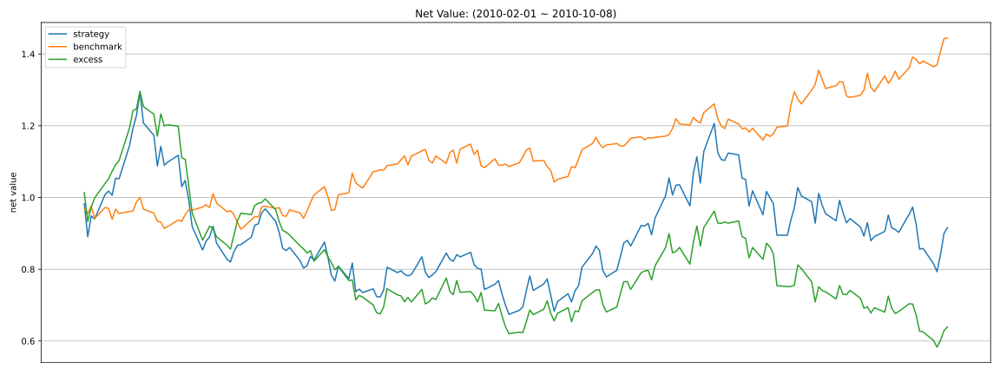

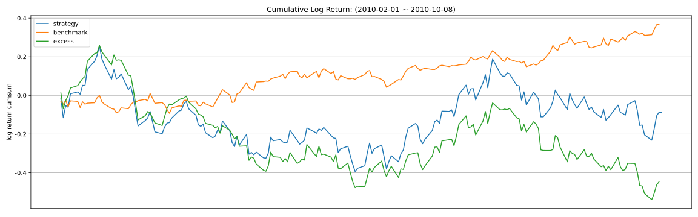

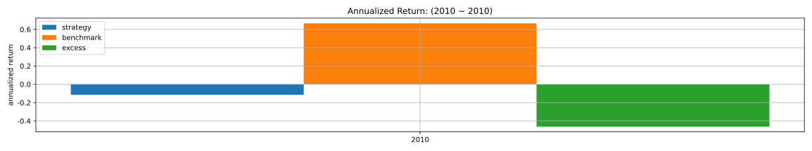

|           |   ann_ret |   max_dd |   sharpe |   calmar |   win_rate |   ann_vol |   avg_win_ret |   avg_loss_ret |   win_loss_ratio |
|:----------|----------:|---------:|---------:|---------:|-----------:|----------:|--------------:|---------------:|-----------------:|
| strategy  |   -0.1154 |   0.4784 |   0.1664 |  -0.2412 |     0.5000 |    0.6905 |        0.0364 |        -0.0358 |           1.0143 |
| benchmark |    0.6786 |   0.0979 |   1.8780 |   6.9322 |     0.5587 |    0.2999 |        0.0157 |        -0.0148 |           1.0611 |
| excess    |   -0.4671 |   0.5502 |  -0.7427 |  -0.8491 |     0.4693 |    0.6026 |        0.0306 |        -0.0304 |           1.0066 |

## 换手率分析
### 1D
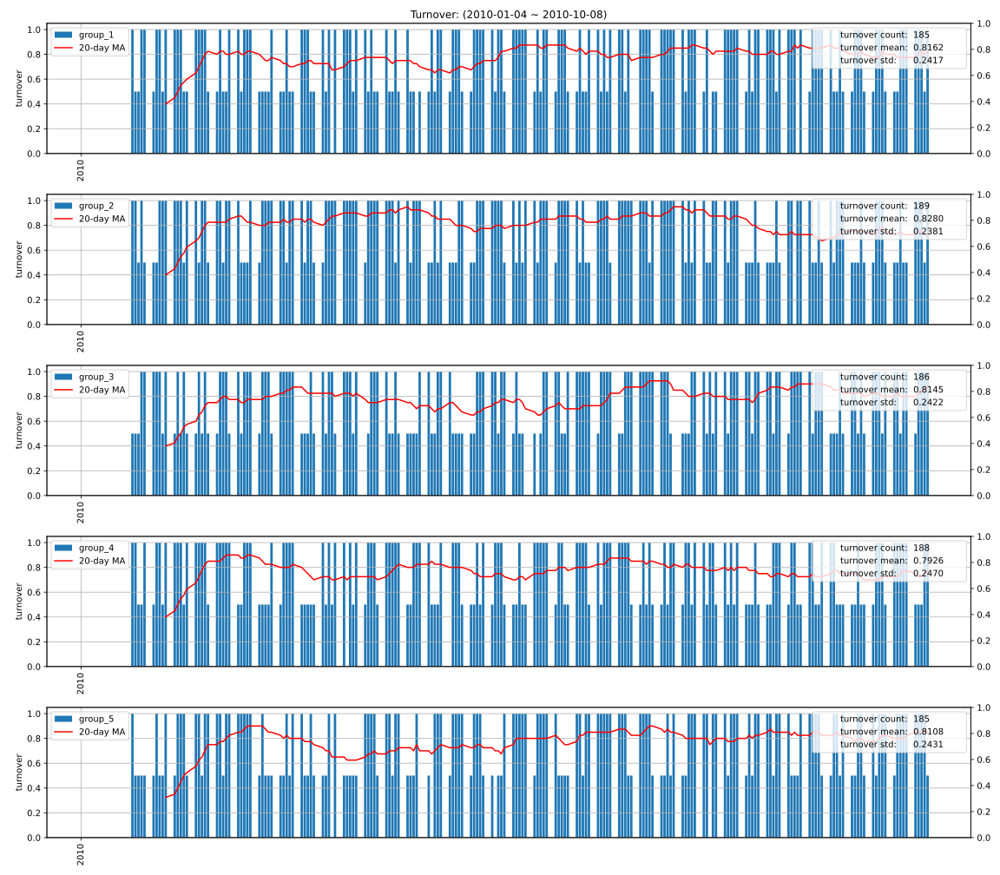

|         |   turnover_count |   turnover_mean |   turnover_std |
|:--------|-----------------:|----------------:|---------------:|
| group_1 |         185.0000 |          0.8162 |         0.2417 |
| group_2 |         189.0000 |          0.8280 |         0.2381 |
| group_3 |         186.0000 |          0.8145 |         0.2422 |
| group_4 |         188.0000 |          0.7926 |         0.2470 |
| group_5 |         185.0000 |          0.8108 |         0.2431 |

### 5D
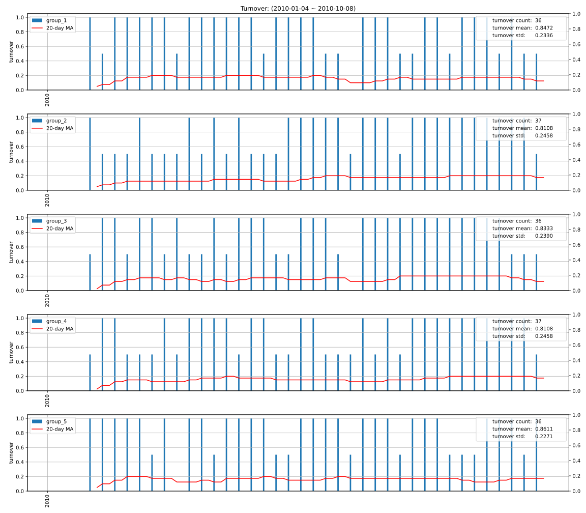

|         |   turnover_count |   turnover_mean |   turnover_std |
|:--------|-----------------:|----------------:|---------------:|
| group_1 |          36.0000 |          0.8472 |         0.2336 |
| group_2 |          37.0000 |          0.8108 |         0.2458 |
| group_3 |          36.0000 |          0.8333 |         0.2390 |
| group_4 |          37.0000 |          0.8108 |         0.2458 |
| group_5 |          36.0000 |          0.8611 |         0.2271 |

### 10D
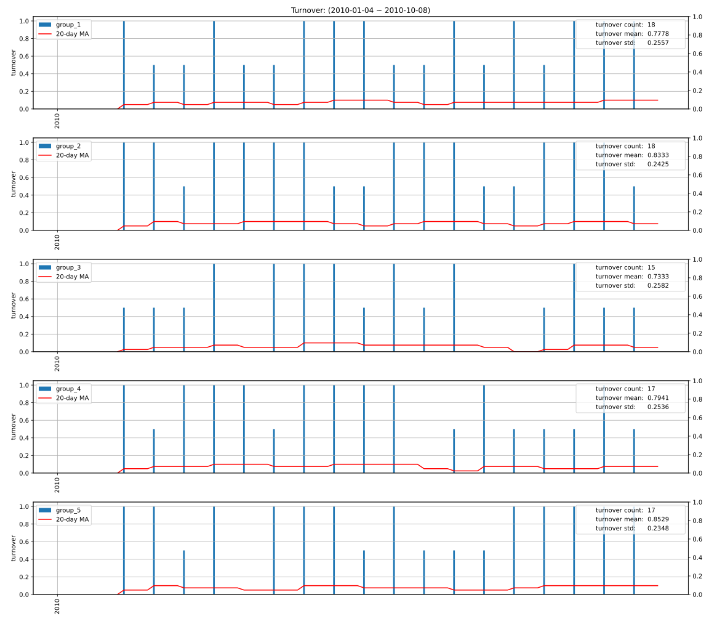

|         |   turnover_count |   turnover_mean |   turnover_std |
|:--------|-----------------:|----------------:|---------------:|
| group_1 |          18.0000 |          0.7778 |         0.2557 |
| group_2 |          18.0000 |          0.8333 |         0.2425 |
| group_3 |          15.0000 |          0.7333 |         0.2582 |
| group_4 |          17.0000 |          0.7941 |         0.2536 |
| group_5 |          17.0000 |          0.8529 |         0.2348 |

### 20D
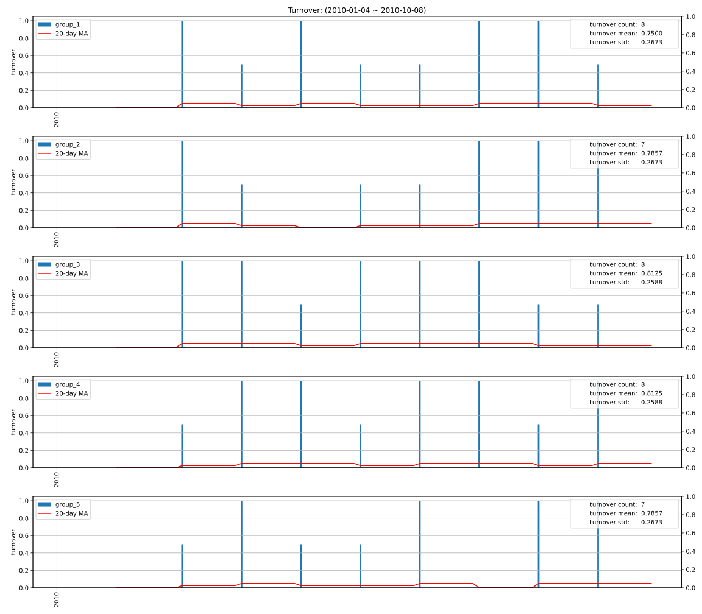

|         |   turnover_count |   turnover_mean |   turnover_std |
|:--------|-----------------:|----------------:|---------------:|
| group_1 |           8.0000 |          0.7500 |         0.2673 |
| group_2 |           7.0000 |          0.7857 |         0.2673 |
| group_3 |           8.0000 |          0.8125 |         0.2588 |
| group_4 |           8.0000 |          0.8125 |         0.2588 |
| group_5 |           7.0000 |          0.7857 |         0.2673 |

### 因子加权持仓换手率
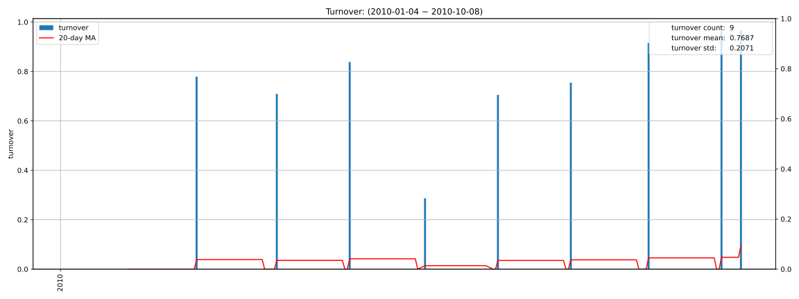

|                 |   turnover_count |   turnover_mean |   turnover_std |
|:----------------|-----------------:|----------------:|---------------:|
| factor_weighted |           9.0000 |          0.7687 |         0.2071 |

### 单因子策略(0.8, 1.0)换手率
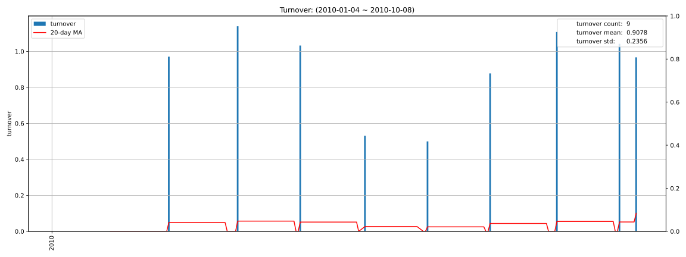

|          |   turnover_count |   turnover_mean |   turnover_std |
|:---------|-----------------:|----------------:|---------------:|
| strategy |           9.0000 |          0.9078 |         0.2356 |

