# open(RandomGenerated2) 因子报告

## 因子值分布（已去极值）

|   n_valid |   n_nan |   n_outlier |   mean |    std |     min |     25% |    50% |    75% |    max |
|----------:|--------:|------------:|-------:|-------:|--------:|--------:|-------:|-------:|-------:|
|      2000 |       0 |           0 | 0.0000 | 0.9489 | -2.1562 | -0.7083 | 0.0046 | 0.7151 | 2.3299 |

## 因子值非空比例

## IC分析

### 1D

| IC   |   total |   2010 |
|:-----|--------:|-------:|
| mean |  0.0087 | 0.0087 |
| std  |  0.3450 | 0.3450 |
| IR   |  0.0253 | 0.0253 |

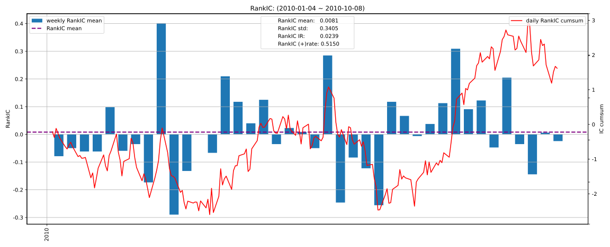

| RankIC   |   total |   2010 |
|:---------|--------:|-------:|
| mean     |  0.0081 | 0.0081 |
| std      |  0.3405 | 0.3405 |
| IR       |  0.0239 | 0.0239 |

### 5D

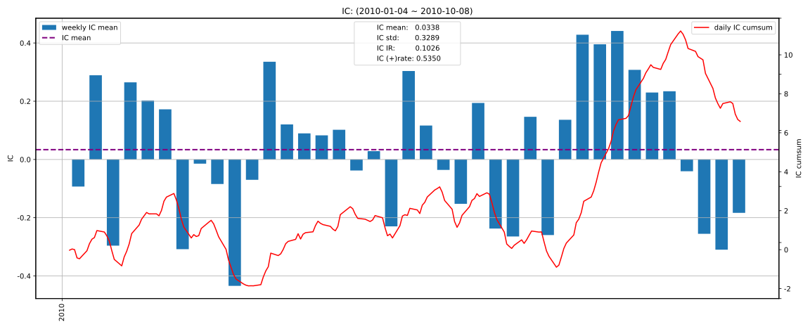

| IC   |   total |   2010 |
|:-----|--------:|-------:|
| mean |  0.0338 | 0.0338 |
| std  |  0.3289 | 0.3289 |
| IR   |  0.1026 | 0.1026 |

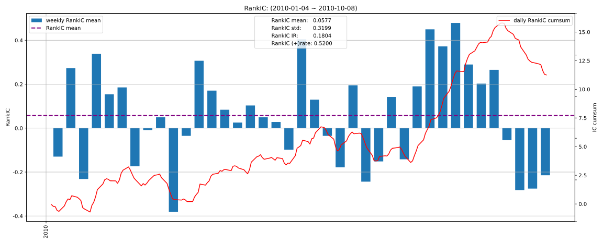

| RankIC   |   total |   2010 |
|:---------|--------:|-------:|
| mean     |  0.0577 | 0.0577 |
| std      |  0.3199 | 0.3199 |
| IR       |  0.1804 | 0.1804 |

### 10D

| IC   |   total |   2010 |
|:-----|--------:|-------:|
| mean |  0.0407 | 0.0407 |
| std  |  0.3061 | 0.3061 |
| IR   |  0.1331 | 0.1331 |

| RankIC   |   total |   2010 |
|:---------|--------:|-------:|
| mean     |  0.0630 | 0.0630 |
| std      |  0.3131 | 0.3131 |
| IR       |  0.2013 | 0.2013 |

### 20D

| IC   |   total |   2010 |
|:-----|--------:|-------:|
| mean |  0.0686 | 0.0686 |
| std  |  0.3499 | 0.3499 |
| IR   |  0.1961 | 0.1961 |

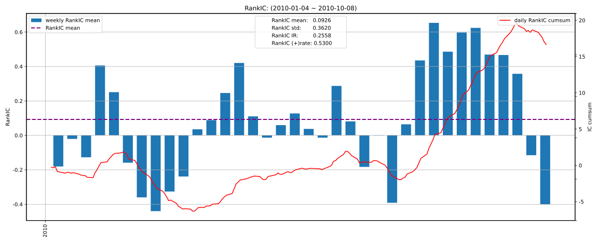

| RankIC   |   total |   2010 |
|:---------|--------:|-------:|
| mean     |  0.0926 | 0.0926 |
| std      |  0.3620 | 0.3620 |
| IR       |  0.2558 | 0.2558 |

## 收益分析

### 1D

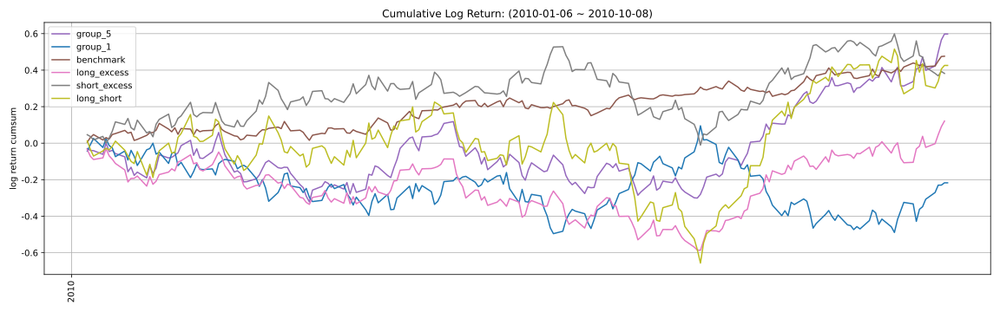

|                |   ann_ret |   max_dd |   sharpe |   calmar |   win_rate |   ann_vol |   avg_win_ret |   avg_loss_ret |   win_loss_ratio |
|:---------------|----------:|---------:|---------:|---------:|-----------:|----------:|--------------:|---------------:|-----------------:|
| group_5(long)  |    1.1401 |   0.3422 |   1.4921 |   3.3317 |     0.5505 |    0.6532 |        0.0344 |        -0.0339 |           1.0146 |
| group_1(short) |   -0.2413 |   0.4425 |  -0.0455 |  -0.5455 |     0.5202 |    0.6994 |        0.0360 |        -0.0397 |           0.9065 |
| benchmark      |    0.8390 |   0.0979 |   2.1741 |   8.5704 |     0.5787 |    0.3013 |        0.0156 |        -0.0152 |           1.0237 |
| long_excess    |    0.1676 |   0.4440 |   0.5568 |   0.3775 |     0.5431 |    0.5829 |        0.0291 |        -0.0317 |           0.9159 |
| short_excess   |    0.6299 |   0.4167 |   1.0882 |   1.5117 |     0.5127 |    0.6314 |        0.0345 |        -0.0307 |           1.1237 |
| long_short     |    0.7195 |   0.5860 |   1.0442 |   1.2278 |     0.5354 |    0.9638 |        0.0500 |        -0.0495 |           1.0091 |

### 5D

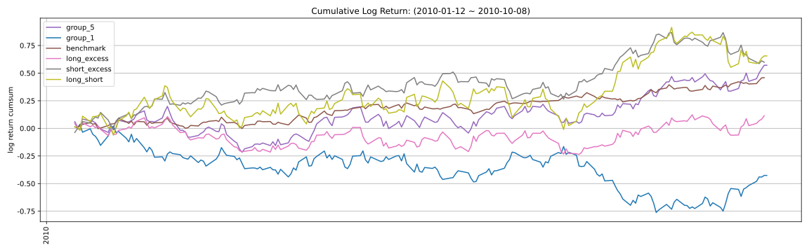

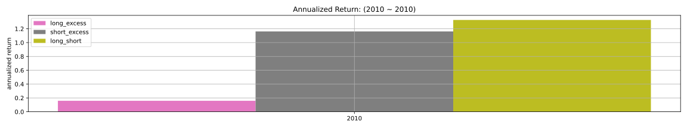

|                |   ann_ret |   max_dd |   sharpe |   calmar |   win_rate |   ann_vol |   avg_win_ret |   avg_loss_ret |   win_loss_ratio |
|:---------------|----------:|---------:|---------:|---------:|-----------:|----------:|--------------:|---------------:|-----------------:|
| group_5(long)  |    1.0999 |   0.3401 |   1.4840 |   3.2336 |     0.5412 |    0.6367 |        0.0343 |        -0.0327 |           1.0502 |
| group_1(short) |   -0.4249 |   0.5548 |  -0.4710 |  -0.7658 |     0.4742 |    0.6817 |        0.0369 |        -0.0360 |           1.0233 |
| benchmark      |    0.8200 |   0.0979 |   2.1434 |   8.3757 |     0.5751 |    0.3006 |        0.0155 |        -0.0150 |           1.0346 |
| long_excess    |    0.1608 |   0.2907 |   0.5448 |   0.5532 |     0.5337 |    0.5605 |        0.0283 |        -0.0298 |           0.9500 |
| short_excess   |    1.1837 |   0.2449 |   1.5869 |   4.8328 |     0.5440 |    0.6095 |        0.0319 |        -0.0297 |           1.0757 |
| long_short     |    1.3434 |   0.3557 |   1.3929 |   3.7768 |     0.5670 |    0.9088 |        0.0458 |        -0.0489 |           0.9356 |

### 10D

|                |   ann_ret |   max_dd |   sharpe |   calmar |   win_rate |   ann_vol |   avg_win_ret |   avg_loss_ret |   win_loss_ratio |
|:---------------|----------:|---------:|---------:|---------:|-----------:|----------:|--------------:|---------------:|-----------------:|
| group_5(long)  |    0.7696 |   0.3578 |   1.1905 |   2.1512 |     0.5132 |    0.6644 |        0.0369 |        -0.0328 |           1.1245 |
| group_1(short) |   -0.2426 |   0.4749 |  -0.0749 |  -0.5108 |     0.4974 |    0.6757 |        0.0358 |        -0.0362 |           0.9888 |
| benchmark      |    0.7235 |   0.0979 |   1.9519 |   7.3904 |     0.5691 |    0.3025 |        0.0156 |        -0.0151 |           1.0293 |
| long_excess    |    0.0318 |   0.3543 |   0.3468 |   0.0899 |     0.5160 |    0.5904 |        0.0303 |        -0.0307 |           0.9895 |
| short_excess   |    0.5734 |   0.2443 |   1.0460 |   2.3468 |     0.5638 |    0.6130 |        0.0299 |        -0.0328 |           0.9112 |
| long_short     |    0.4831 |   0.4069 |   0.8917 |   1.1872 |     0.5450 |    0.9438 |        0.0488 |        -0.0517 |           0.9438 |

### 20D

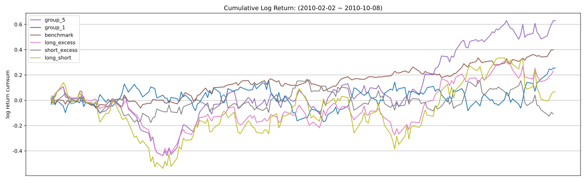

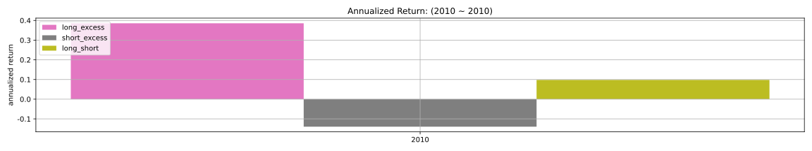

|                |   ann_ret |   max_dd |   sharpe |   calmar |   win_rate |   ann_vol |   avg_win_ret |   avg_loss_ret |   win_loss_ratio |
|:---------------|----------:|---------:|---------:|---------:|-----------:|----------:|--------------:|---------------:|-----------------:|
| group_5(long)  |    1.4245 |   0.4202 |   1.6762 |   3.3899 |     0.5363 |    0.6576 |        0.0364 |        -0.0330 |           1.1012 |
| group_1(short) |    0.4318 |   0.2793 |   0.8700 |   1.5460 |     0.4916 |    0.6664 |        0.0381 |        -0.0327 |           1.1659 |
| benchmark      |    0.7593 |   0.0979 |   2.0448 |   7.7555 |     0.5618 |    0.2981 |        0.0157 |        -0.0146 |           1.0759 |
| long_excess    |    0.3918 |   0.4193 |   0.8572 |   0.9344 |     0.5337 |    0.5820 |        0.0301 |        -0.0303 |           0.9963 |
| short_excess   |   -0.1414 |   0.2540 |   0.0443 |  -0.5567 |     0.5000 |    0.5990 |        0.0302 |        -0.0300 |           1.0070 |
| long_short     |    0.0987 |   0.4921 |   0.5650 |   0.2006 |     0.5140 |    0.9248 |        0.0480 |        -0.0471 |           1.0205 |

### 因子加权日频收益

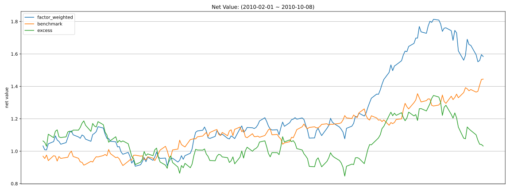

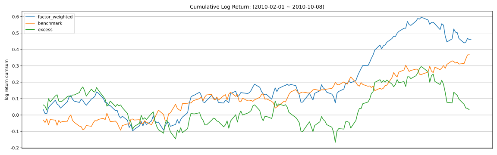

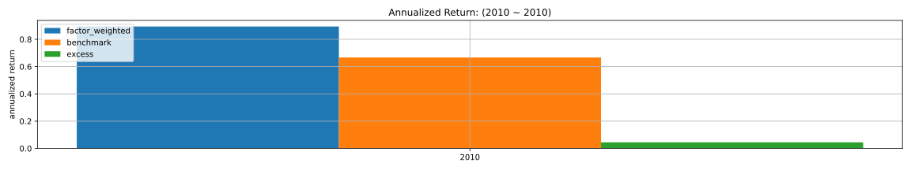

|                 |   ann_ret |   max_dd |   sharpe |   calmar |   win_rate |   ann_vol |   avg_win_ret |   avg_loss_ret |   win_loss_ratio |
|:----------------|----------:|---------:|---------:|---------:|-----------:|----------:|--------------:|---------------:|-----------------:|
| factor_weighted |    0.9037 |   0.2119 |   1.9153 |   4.2637 |     0.5389 |    0.3725 |        0.0207 |        -0.0183 |           1.1325 |
| benchmark       |    0.6786 |   0.0979 |   1.8780 |   6.9322 |     0.5587 |    0.2999 |        0.0157 |        -0.0148 |           1.0611 |
| excess          |    0.0453 |   0.2868 |   0.3271 |   0.1579 |     0.4637 |    0.4718 |        0.0269 |        -0.0221 |           1.2163 |

### 单因子策略(0.8, 1.0)收益

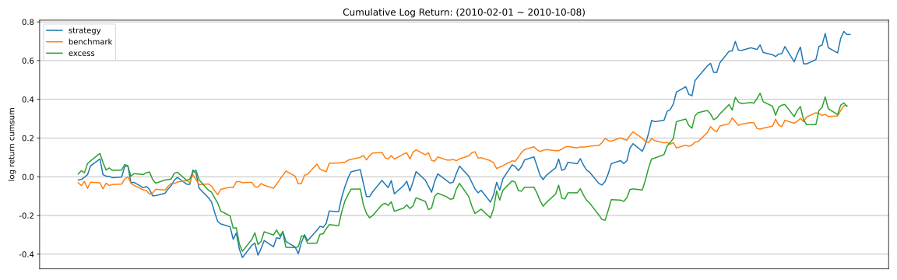

|           |   ann_ret |   max_dd |   sharpe |   calmar |   win_rate |   ann_vol |   avg_win_ret |   avg_loss_ret |   win_loss_ratio |
|:----------|----------:|---------:|---------:|---------:|-----------:|----------:|--------------:|---------------:|-----------------:|
| strategy  |    1.7968 |   0.3990 |   1.9312 |   4.5030 |     0.5444 |    0.6389 |        0.0353 |        -0.0318 |           1.1089 |
| benchmark |    0.6786 |   0.0979 |   1.8780 |   6.9322 |     0.5587 |    0.2999 |        0.0157 |        -0.0148 |           1.0611 |
| excess    |    0.6690 |   0.3969 |   1.1758 |   1.6856 |     0.5587 |    0.5763 |        0.0286 |        -0.0301 |           0.9500 |

## 换手率分析

### 1D

|         |   turnover_count |   turnover_mean |   turnover_std |
|:--------|-----------------:|----------------:|---------------:|
| group_1 |          99.0000 |          0.5354 |         0.1288 |
| group_2 |         155.0000 |          0.7032 |         0.2464 |
| group_3 |         168.0000 |          0.6667 |         0.2364 |
| group_4 |         157.0000 |          0.6529 |         0.2311 |
| group_5 |          86.0000 |          0.5640 |         0.1680 |

### 5D

|         |   turnover_count |   turnover_mean |   turnover_std |
|:--------|-----------------:|----------------:|---------------:|
| group_1 |          16.0000 |          0.5312 |         0.1250 |
| group_2 |          33.0000 |          0.6212 |         0.2176 |
| group_3 |          32.0000 |          0.6719 |         0.2413 |
| group_4 |          30.0000 |          0.7167 |         0.2520 |
| group_5 |          17.0000 |          0.5294 |         0.1213 |

### 10D

|         |   turnover_count |   turnover_mean |   turnover_std |
|:--------|-----------------:|----------------:|---------------:|
| group_1 |           9.0000 |          0.5556 |         0.1667 |
| group_2 |          17.0000 |          0.6765 |         0.2463 |
| group_3 |          18.0000 |          0.7222 |         0.2557 |
| group_4 |          18.0000 |          0.5556 |         0.1617 |
| group_5 |          13.0000 |          0.5385 |         0.1387 |

### 20D

|         |   turnover_count |   turnover_mean |   turnover_std |
|:--------|-----------------:|----------------:|---------------:|
| group_1 |           5.0000 |          0.6000 |         0.2236 |
| group_2 |           8.0000 |          0.6875 |         0.2588 |
| group_3 |           9.0000 |          0.8333 |         0.2500 |
| group_4 |           9.0000 |          0.6667 |         0.2500 |
| group_5 |           6.0000 |          0.6667 |         0.2582 |

### 因子加权持仓换手率

|                 |   turnover_count |   turnover_mean |   turnover_std |
|:----------------|-----------------:|----------------:|---------------:|
| factor_weighted |           9.0000 |          0.3062 |         0.1491 |

### 单因子策略(0.8, 1.0)换手率

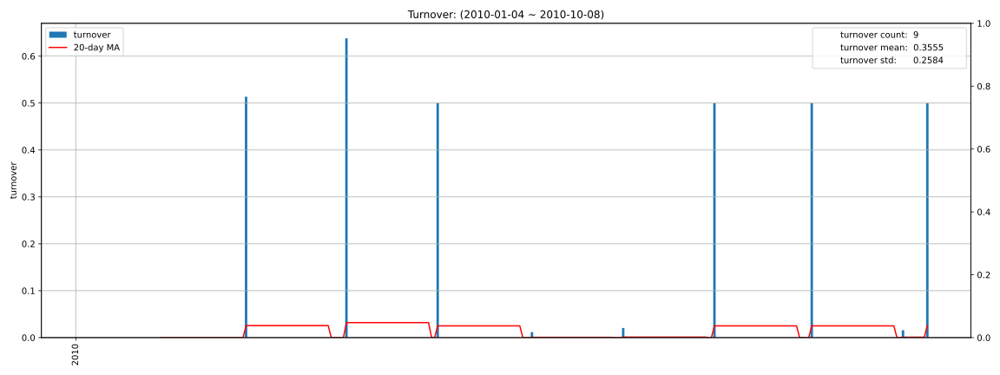

|          |   turnover_count |   turnover_mean |   turnover_std |
|:---------|-----------------:|----------------:|---------------:|
| strategy |           9.0000 |          0.3555 |         0.2584 |

