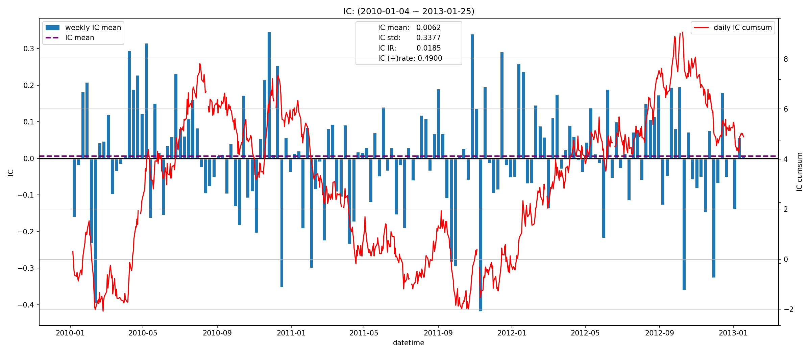
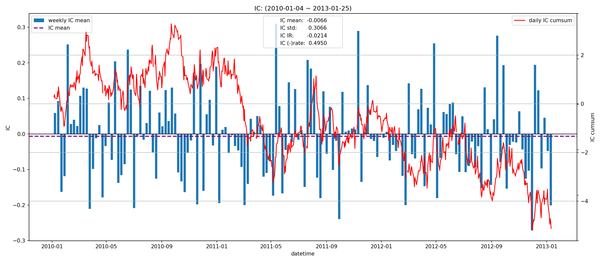
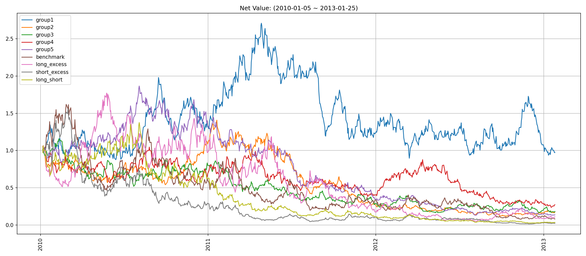
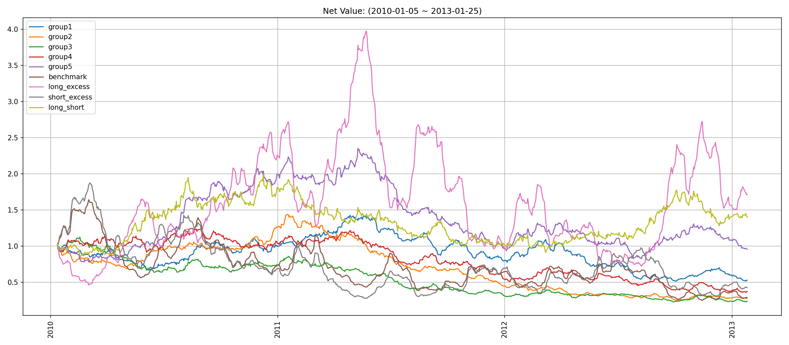
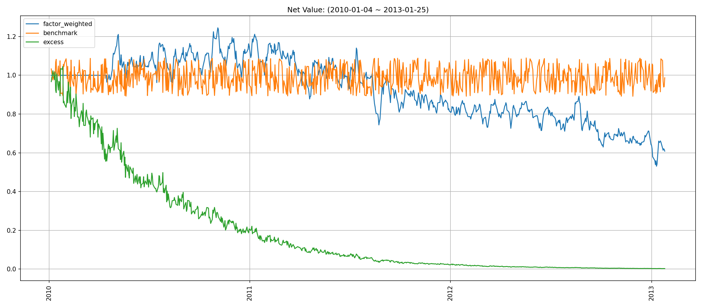
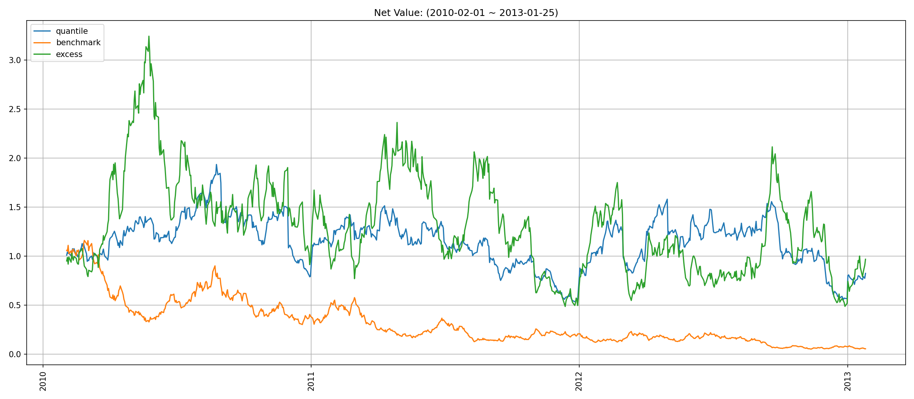
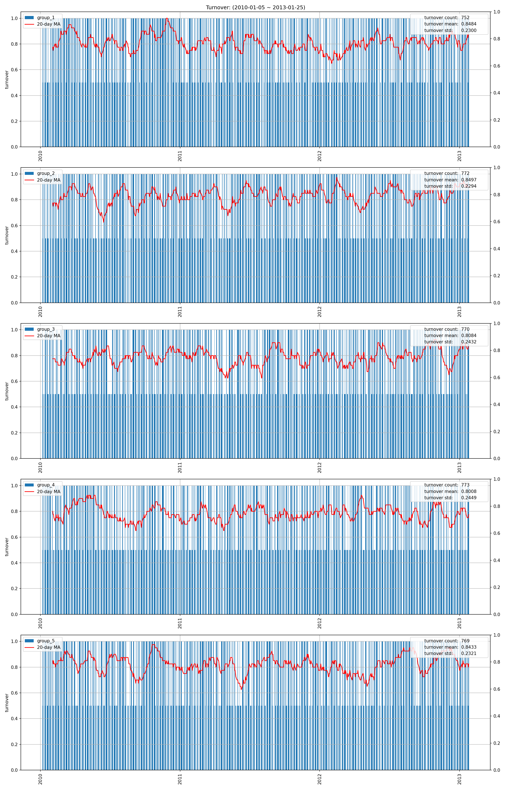
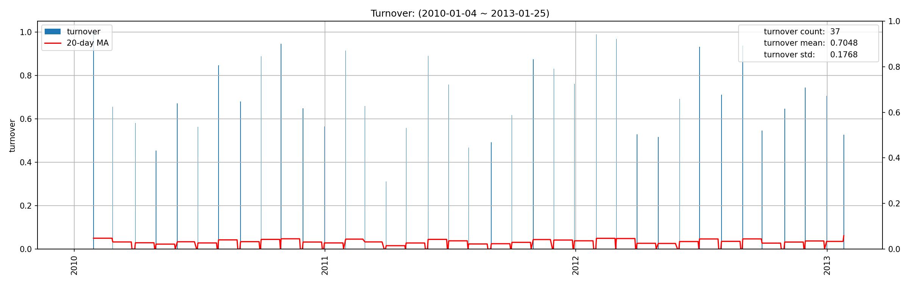
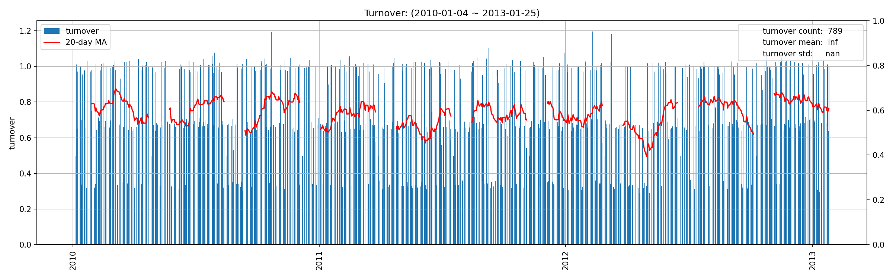

# factor1 factor report
## IC分析
### 1D

|         |   total |    2010 |    2011 |    2012 |   2013 |
|:--------|--------:|--------:|--------:|--------:|-------:|
| IC_mean | -0.0092 | -0.0062 | -0.0006 | -0.0253 | 0.0559 |
| IC_std  |  0.3249 |  0.3202 |  0.3294 |  0.3264 | 0.3198 |
| IC_IR   | -0.0283 | -0.0195 | -0.0018 | -0.0775 | 0.1747 |

### 5D

|         |   total |    2010 |    2011 |    2012 |    2013 |
|:--------|--------:|--------:|--------:|--------:|--------:|
| IC_mean | -0.0193 | -0.0075 | -0.0013 | -0.0462 | -0.0691 |
| IC_std  |  0.3088 |  0.2997 |  0.3328 |  0.2873 |  0.3869 |
| IC_IR   | -0.0624 | -0.0251 | -0.0038 | -0.1607 | -0.1786 |

### 10D

|         |   total |   2010 |    2011 |    2012 |    2013 |
|:--------|--------:|-------:|--------:|--------:|--------:|
| IC_mean | -0.0066 | 0.0089 | -0.0114 | -0.0127 | -0.1329 |
| IC_std  |  0.3066 | 0.3148 |  0.3009 |  0.3040 |  0.3183 |
| IC_IR   | -0.0214 | 0.0284 | -0.0379 | -0.0418 | -0.4177 |

## 收益分析
### 分层收益
### 1D
|               |   annual_return |   max_drawdown |   annual_sharpe |   annual_calmar |   win_rate |   avg_win_return |   avg_loss_return |   profit_loss_ratio |   annual_volatility |   annual_downside_deviation |   annual_sortino |
|:--------------|----------------:|---------------:|----------------:|----------------:|-----------:|-----------------:|------------------:|--------------------:|--------------------:|----------------------------:|-----------------:|
| group5(long)  |          1.2829 |         0.6511 |          1.3208 |         31.2800 |     0.4994 |           0.0478 |           -0.0376 |              1.2719 |              0.9644 |                      0.5197 |           2.4513 |
| group1(short) |          0.5947 |         0.8421 |          0.9530 |         11.2114 |     0.5234 |           0.0442 |           -0.0404 |              1.0927 |              1.0205 |                      0.6615 |           1.4701 |
| benchmark     |          0.0203 |         0.2899 |          0.6604 |          1.1093 |     0.4930 |           0.0708 |           -0.0622 |              1.1392 |              1.2968 |                      0.7104 |           1.2055 |
| long_excess   |         -0.5195 |         0.9371 |          0.2740 |         -8.8002 |     0.5082 |           0.0761 |           -0.0753 |              1.0109 |              1.5231 |                      0.8521 |           0.4898 |
| short_excess  |         -0.7716 |         0.9913 |         -0.0721 |        -12.3557 |     0.5082 |           0.0766 |           -0.0801 |              0.9563 |              1.6087 |                      1.0765 |          -0.1078 |
| long_short    |         -0.4736 |         0.9214 |          0.2200 |         -8.1591 |     0.5006 |           0.0599 |           -0.0576 |              1.0389 |              1.3696 |                      0.9057 |           0.3327 |

### 5D
|               |   annual_return |   max_drawdown |   annual_sharpe |   annual_calmar |   win_rate |   avg_win_return |   avg_loss_return |   profit_loss_ratio |   annual_volatility |   annual_downside_deviation |   annual_sortino |
|:--------------|----------------:|---------------:|----------------:|----------------:|-----------:|-----------------:|------------------:|--------------------:|--------------------:|----------------------------:|-----------------:|
| group5(long)  |          0.4452 |         0.3382 |          1.1309 |         20.8949 |     0.5146 |           0.0201 |           -0.0177 |              1.1375 |              0.3940 |                      0.2287 |           1.9477 |
| group1(short) |          1.1024 |         0.2974 |          2.0241 |         58.8374 |     0.5439 |           0.0206 |           -0.0174 |              1.1848 |              0.4082 |                      0.2130 |           3.8794 |
| benchmark     |          0.1389 |         0.1264 |          0.6206 |         17.4538 |     0.4879 |           0.0145 |           -0.0125 |              1.1570 |              0.2667 |                      0.1409 |           1.1748 |
| long_excess   |          0.1988 |         0.3802 |          0.6290 |          8.2998 |     0.5083 |           0.0231 |           -0.0216 |              1.0687 |              0.4452 |                      0.2517 |           1.1124 |
| short_excess  |         -0.5408 |         0.9219 |         -1.3777 |         -9.3129 |     0.4955 |           0.0210 |           -0.0258 |              0.8131 |              0.4795 |                      0.3459 |          -1.9099 |
| long_short    |         -0.4105 |         0.8997 |         -0.7021 |         -7.2435 |     0.4828 |           0.0259 |           -0.0271 |              0.9557 |              0.5421 |                      0.3492 |          -1.0900 |

### 10D
|               |   annual_return |   max_drawdown |   annual_sharpe |   annual_calmar |   win_rate |   avg_win_return |   avg_loss_return |   profit_loss_ratio |   annual_volatility |   annual_downside_deviation |   annual_sortino |
|:--------------|----------------:|---------------:|----------------:|----------------:|-----------:|-----------------:|------------------:|--------------------:|--------------------:|----------------------------:|-----------------:|
| group5(long)  |          0.4936 |         0.1663 |          1.8090 |         47.1322 |     0.5192 |           0.0126 |           -0.0100 |              1.2526 |              0.2374 |                      0.1294 |           3.3191 |
| group1(short) |          0.5384 |         0.2114 |          1.8679 |         40.4241 |     0.5077 |           0.0131 |           -0.0098 |              1.3362 |              0.2469 |                      0.1221 |           3.7784 |
| benchmark     |          0.0824 |         0.0940 |          0.6538 |         13.9123 |     0.4987 |           0.0074 |           -0.0066 |              1.1112 |              0.1350 |                      0.0720 |           1.2255 |
| long_excess   |          0.3600 |         0.2030 |          1.3130 |         28.1471 |     0.5115 |           0.0139 |           -0.0118 |              1.1801 |              0.2599 |                      0.1410 |           2.4206 |
| short_excess  |         -0.3364 |         0.7471 |         -1.3802 |         -7.1483 |     0.4974 |           0.0115 |           -0.0143 |              0.8029 |              0.2702 |                      0.2039 |          -1.8292 |
| long_short    |         -0.0821 |         0.4653 |         -0.0968 |         -2.8003 |     0.5154 |           0.0150 |           -0.0162 |              0.9252 |              0.3280 |                      0.2266 |          -0.1401 |

### 因子加权日频收益
|                 |   annual_return |   max_drawdown |   annual_sharpe |   annual_calmar |   win_rate |   avg_win_return |   avg_loss_return |   profit_loss_ratio |   annual_volatility |   annual_downside_deviation |   annual_sortino |
|:----------------|----------------:|---------------:|----------------:|----------------:|-----------:|-----------------:|------------------:|--------------------:|--------------------:|----------------------------:|-----------------:|
| factor_weighted |         -0.2130 |         0.6069 |         -0.2492 |         -5.5710 |     0.4900 |           0.0216 |           -0.0217 |              0.9955 |              0.4858 |                      0.3427 |          -0.3532 |
| benchmark       |         -0.0041 |         0.1815 |          0.6409 |         -0.3591 |     0.4944 |           0.0704 |           -0.0623 |              1.1297 |              1.2946 |                      0.7106 |           1.1677 |
| excess          |         -0.8499 |         0.9980 |         -0.6983 |        -13.5178 |     0.4869 |           0.0674 |           -0.0713 |              0.9453 |              1.3617 |                      0.8201 |          -1.1596 |

### 分位数(0.8, 1.0)收益
|           |   annual_return |   max_drawdown |   annual_sharpe |   annual_calmar |   win_rate |   avg_win_return |   avg_loss_return |   profit_loss_ratio |   annual_volatility |   annual_downside_deviation |   annual_sortino |
|:----------|----------------:|---------------:|----------------:|----------------:|-----------:|-----------------:|------------------:|--------------------:|--------------------:|----------------------------:|-----------------:|
| quantile  |          0.6076 |         0.4149 |          0.9879 |         23.2494 |     0.4791 |           0.0384 |           -0.0295 |              1.3025 |              0.7648 |                      0.3873 |           1.9508 |
| benchmark |         -0.0041 |         0.1815 |          0.6409 |         -0.3591 |     0.4944 |           0.0704 |           -0.0623 |              1.1297 |              1.2946 |                      0.7106 |           1.1677 |
| excess    |         -0.6678 |         0.9799 |         -0.0510 |        -10.8182 |     0.4931 |           0.0719 |           -0.0705 |              1.0196 |              1.4351 |                      0.8435 |          -0.0868 |

## 换手率分析
### 分层换手率

|         |   turnover_count |   turnover_mean |   turnover_std |
|:--------|-----------------:|----------------:|---------------:|
| group_1 |         752.0000 |          0.8484 |         0.2300 |
| group_2 |         772.0000 |          0.8497 |         0.2294 |
| group_3 |         770.0000 |          0.8084 |         0.2432 |
| group_4 |         773.0000 |          0.8008 |         0.2449 |
| group_5 |         769.0000 |          0.8433 |         0.2321 |

### 因子加权持仓换手率

|    |   turnover_count |   turnover_mean |   turnover_std |
|---:|-----------------:|----------------:|---------------:|
|  0 |         781.0000 |          0.7265 |         0.1840 |

### 分位数(0.8, 1.0)换手率

|    |   turnover_count |   turnover_mean |   turnover_std |
|---:|-----------------:|----------------:|---------------:|
|  0 |         789.0000 |             inf |            nan |

