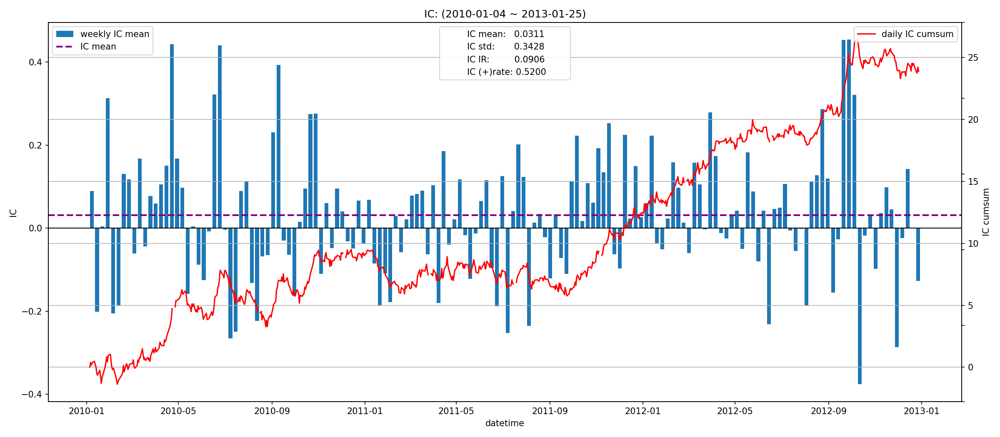
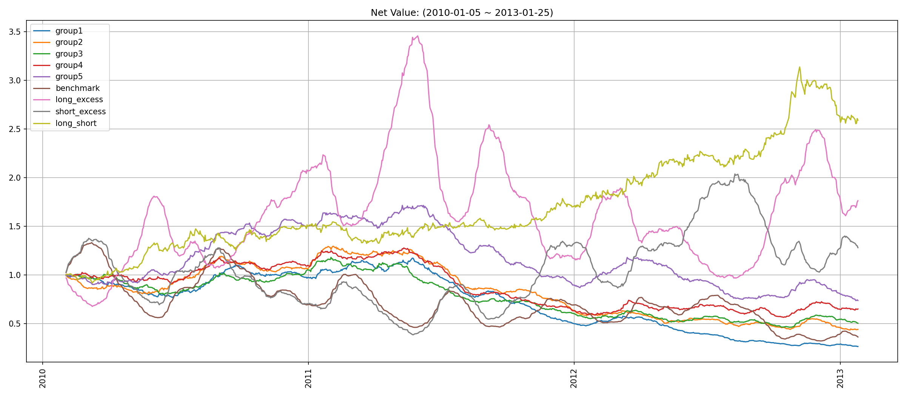

# factor1 因子报告
## IC分析
### 1D

|         |   total |    2010 |    2011 |    2012 |   2013 |
|:--------|--------:|--------:|--------:|--------:|-------:|
| IC_mean | -0.0144 | -0.0037 | -0.0210 | -0.0221 | 0.0380 |
| IC_std  |  0.3340 |  0.3395 |  0.3289 |  0.3339 | 0.3474 |
| IC_IR   | -0.0432 | -0.0108 | -0.0639 | -0.0663 | 0.1094 |

### 5D

|         |   total |   2010 |    2011 |   2012 |    2013 |
|:--------|--------:|-------:|--------:|-------:|--------:|
| IC_mean |  0.0062 | 0.0222 | -0.0228 | 0.0210 | -0.0253 |
| IC_std  |  0.3377 | 0.3549 |  0.3281 | 0.3326 |  0.2667 |
| IC_IR   |  0.0185 | 0.0625 | -0.0694 | 0.0632 | -0.0949 |

### 20D

|         |   total |   2010 |   2011 |   2012 |   2013 |
|:--------|--------:|-------:|-------:|-------:|-------:|
| IC_mean |  0.0311 | 0.0352 | 0.0135 | 0.0445 |    nan |
| IC_std  |  0.3428 | 0.3670 | 0.3304 | 0.3306 |    nan |
| IC_IR   |  0.0906 | 0.0959 | 0.0408 | 0.1345 |    nan |

## 收益分析
### 分层收益
### 1D
|               |   annual_return |   max_drawdown |   annual_sharpe |   annual_calmar |   win_rate |   avg_win_return |   avg_loss_return |   profit_loss_ratio |   annual_volatility |   annual_downside_deviation |   annual_sortino |
|:--------------|----------------:|---------------:|----------------:|----------------:|-----------:|-----------------:|------------------:|--------------------:|--------------------:|----------------------------:|-----------------:|
| group5(long)  |         -0.4696 |         0.9292 |         -0.7032 |         -8.0230 |     0.4791 |           0.0316 |           -0.0324 |              0.9753 |              0.6236 |                      0.3682 |          -1.1910 |
| group1(short) |         -0.0086 |         0.6691 |          0.3117 |         -0.2043 |     0.4880 |           0.0353 |           -0.0320 |              1.1009 |              0.6511 |                      0.3651 |           0.5558 |
| benchmark     |         -0.5504 |         0.9527 |         -0.3966 |         -9.1704 |     0.4842 |           0.0508 |           -0.0505 |              1.0057 |              0.9278 |                      0.4513 |          -0.8152 |
| long_excess   |         -0.5073 |         0.9725 |         -0.0629 |         -8.2811 |     0.5146 |           0.0561 |           -0.0600 |              0.9343 |              1.1224 |                      0.6765 |          -0.1044 |
| short_excess  |         -0.7032 |         0.9913 |         -0.5052 |        -11.2618 |     0.4842 |           0.0578 |           -0.0586 |              0.9856 |              1.1299 |                      0.6436 |          -0.8870 |
| long_short    |         -0.6580 |         0.9815 |         -0.6943 |        -10.6421 |     0.4880 |           0.0453 |           -0.0481 |              0.9409 |              0.9239 |                      0.5624 |          -1.1406 |

### 5D
|               |   annual_return |   max_drawdown |   annual_sharpe |   annual_calmar |   win_rate |   avg_win_return |   avg_loss_return |   profit_loss_ratio |   annual_volatility |   annual_downside_deviation |   annual_sortino |
|:--------------|----------------:|---------------:|----------------:|----------------:|-----------:|-----------------:|------------------:|--------------------:|--------------------:|----------------------------:|-----------------:|
| group5(long)  |         -0.0147 |         0.6491 |          0.0932 |         -0.3591 |     0.4841 |           0.0152 |           -0.0141 |              1.0815 |              0.2896 |                      0.1598 |           0.1690 |
| group1(short) |         -0.1859 |         0.6390 |         -0.5546 |         -4.6186 |     0.4904 |           0.0144 |           -0.0152 |              0.9521 |              0.2933 |                      0.1692 |          -0.9615 |
| benchmark     |         -0.3299 |         0.8480 |         -0.6554 |         -6.1761 |     0.4586 |           0.0239 |           -0.0224 |              1.0655 |              0.4542 |                      0.2304 |          -1.2924 |
| long_excess   |          0.1884 |         0.8189 |          0.5907 |          3.6528 |     0.5185 |           0.0281 |           -0.0276 |              1.0189 |              0.5497 |                      0.3581 |           0.9066 |
| short_excess  |         -0.2396 |         0.8529 |         -0.2552 |         -4.4590 |     0.4573 |           0.0282 |           -0.0247 |              1.1393 |              0.5290 |                      0.2850 |          -0.4738 |
| long_short    |          0.1141 |         0.5445 |          0.4690 |          3.3266 |     0.5146 |           0.0207 |           -0.0204 |              1.0148 |              0.4045 |                      0.2288 |           0.8290 |

### 20D
|               |   annual_return |   max_drawdown |   annual_sharpe |   annual_calmar |   win_rate |   avg_win_return |   avg_loss_return |   profit_loss_ratio |   annual_volatility |   annual_downside_deviation |   annual_sortino |
|:--------------|----------------:|---------------:|----------------:|----------------:|-----------:|-----------------:|------------------:|--------------------:|--------------------:|----------------------------:|-----------------:|
| group5(long)  |         -0.0950 |         0.5702 |         -0.5923 |         -2.6443 |     0.4351 |           0.0081 |           -0.0069 |              1.1810 |              0.1496 |                      0.0779 |          -1.1384 |
| group1(short) |         -0.3530 |         0.7746 |         -2.8013 |         -7.2349 |     0.3831 |           0.0080 |           -0.0077 |              1.0402 |              0.1512 |                      0.0777 |          -5.4527 |
| benchmark     |         -0.2827 |         0.7584 |         -1.4230 |         -5.9179 |     0.4182 |           0.0122 |           -0.0109 |              1.1220 |              0.2169 |                      0.1048 |          -2.9464 |
| long_excess   |          0.2037 |         0.7202 |          0.8367 |          4.4894 |     0.5429 |           0.0131 |           -0.0137 |              0.9597 |              0.2630 |                      0.1645 |           1.3373 |
| short_excess  |          0.0841 |         0.7203 |          0.4383 |          1.8527 |     0.4662 |           0.0147 |           -0.0119 |              1.2268 |              0.2624 |                      0.1414 |           0.8133 |
| long_short    |          0.3652 |         0.1858 |          1.5419 |         31.1990 |     0.5325 |           0.0114 |           -0.0102 |              1.1238 |              0.2173 |                      0.1325 |           2.5290 |

### 因子加权日频收益
|                 |   annual_return |   max_drawdown |   annual_sharpe |   annual_calmar |   win_rate |   avg_win_return |   avg_loss_return |   profit_loss_ratio |   annual_volatility |   annual_downside_deviation |   annual_sortino |
|:----------------|----------------:|---------------:|----------------:|----------------:|-----------:|-----------------:|------------------:|--------------------:|--------------------:|----------------------------:|-----------------:|
| factor_weighted |         -0.4142 |         0.8358 |         -0.6353 |         -7.8665 |     0.4685 |           0.0233 |           -0.0233 |              1.0004 |              0.5797 |                      0.4130 |          -0.8916 |
| benchmark       |         -0.6072 |         0.9552 |         -0.5418 |        -10.0918 |     0.4775 |           0.0510 |           -0.0504 |              1.0112 |              0.9278 |                      0.4492 |          -1.1192 |
| excess          |         -0.3746 |         0.9345 |          0.1218 |         -6.3628 |     0.5071 |           0.0558 |           -0.0563 |              0.9908 |              1.0997 |                      0.6259 |           0.2140 |

### 分位数(0.8, 1.0)收益
|           |   annual_return |   max_drawdown |   annual_sharpe |   annual_calmar |   win_rate |   avg_win_return |   avg_loss_return |   profit_loss_ratio |   annual_volatility |   annual_downside_deviation |   annual_sortino |
|:----------|----------------:|---------------:|----------------:|----------------:|-----------:|-----------------:|------------------:|--------------------:|--------------------:|----------------------------:|-----------------:|
| quantile  |         -0.0603 |         0.7250 |          0.3193 |         -1.3207 |     0.5006 |           0.0333 |           -0.0312 |              1.0654 |              0.8381 |                      0.5297 |           0.5052 |
| benchmark |         -0.6072 |         0.9552 |         -0.5418 |        -10.0918 |     0.4775 |           0.0510 |           -0.0504 |              1.0112 |              0.9278 |                      0.4492 |          -1.1192 |
| excess    |         -0.0102 |         0.8499 |          0.6085 |         -0.1898 |     0.5173 |           0.0623 |           -0.0605 |              1.0308 |              1.2664 |                      0.7080 |           1.0885 |

## 换手率分析
### 分层换手率

|         |   turnover_count |   turnover_mean |   turnover_std |
|:--------|-----------------:|----------------:|---------------:|
| group_1 |         763.0000 |          0.8263 |         0.2382 |
| group_2 |         760.0000 |          0.8132 |         0.2420 |
| group_3 |         772.0000 |          0.8025 |         0.2446 |
| group_4 |         766.0000 |          0.8192 |         0.2404 |
| group_5 |         755.0000 |          0.8377 |         0.2342 |

### 因子加权持仓换手率

|    |   turnover_count |   turnover_mean |   turnover_std |
|---:|-----------------:|----------------:|---------------:|
|  0 |          37.0000 |          0.7048 |         0.1768 |

### 分位数(0.8, 1.0)换手率

|    |   turnover_count |   turnover_mean |   turnover_std |
|---:|-----------------:|----------------:|---------------:|
|  0 |          36.0000 |          0.6998 |         0.2874 |

