# factor1 因子报告
## IC分析
### 1D
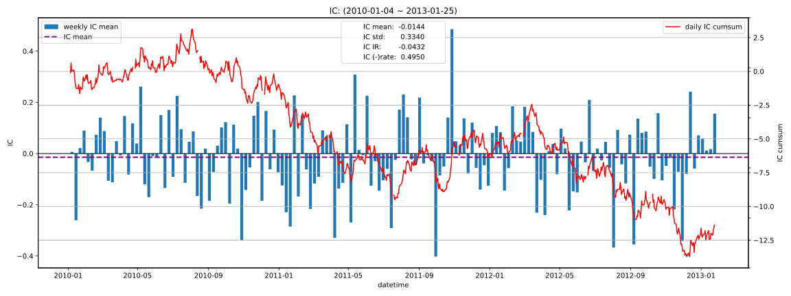

|         |   total |    2010 |    2011 |    2012 |   2013 |
|:--------|--------:|--------:|--------:|--------:|-------:|
| IC_mean | -0.0144 | -0.0037 | -0.0210 | -0.0221 | 0.0380 |
| IC_std  |  0.3340 |  0.3395 |  0.3289 |  0.3339 | 0.3474 |
| IC_IR   | -0.0432 | -0.0108 | -0.0639 | -0.0663 | 0.1094 |

### 5D
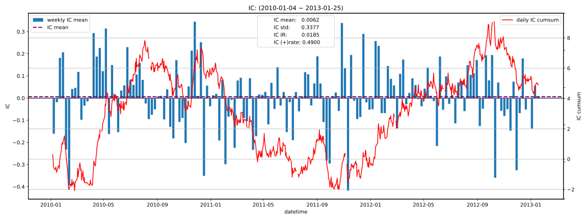

|         |   total |   2010 |    2011 |   2012 |    2013 |
|:--------|--------:|-------:|--------:|-------:|--------:|
| IC_mean |  0.0062 | 0.0222 | -0.0228 | 0.0210 | -0.0253 |
| IC_std  |  0.3377 | 0.3549 |  0.3281 | 0.3326 |  0.2667 |
| IC_IR   |  0.0185 | 0.0625 | -0.0694 | 0.0632 | -0.0949 |

### 10D
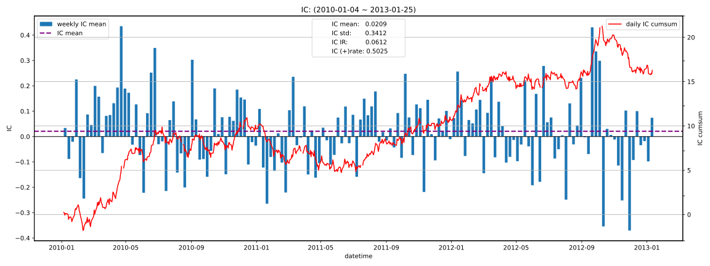

|         |   total |   2010 |   2011 |   2012 |    2013 |
|:--------|--------:|-------:|-------:|-------:|--------:|
| IC_mean |  0.0209 | 0.0378 | 0.0041 | 0.0224 | -0.0251 |
| IC_std  |  0.3412 | 0.3592 | 0.3221 | 0.3427 |  0.3296 |
| IC_IR   |  0.0612 | 0.1053 | 0.0127 | 0.0653 | -0.0761 |

### 20D
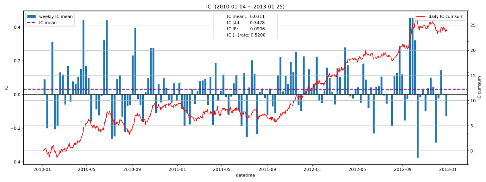

|         |   total |   2010 |   2011 |   2012 |   2013 |
|:--------|--------:|-------:|-------:|-------:|-------:|
| IC_mean |  0.0311 | 0.0352 | 0.0135 | 0.0445 |    nan |
| IC_std  |  0.3428 | 0.3670 | 0.3304 | 0.3306 |    nan |
| IC_IR   |  0.0906 | 0.0959 | 0.0408 | 0.1345 |    nan |

## 收益分析
### 分层收益
### 1D
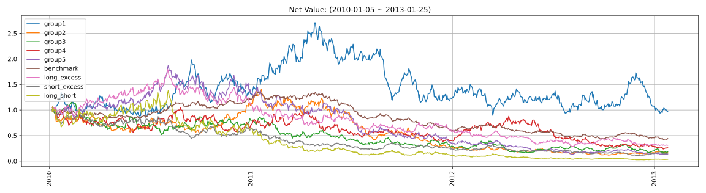

|               |   ann_ret |   max_dd |   ann_sharpe |   ann_calmar |   win_rate |   avg_win_ret |   avg_loss_ret |   profit_loss_ratio |   ann_vol |
|:--------------|----------:|---------:|-------------:|-------------:|-----------:|--------------:|---------------:|--------------------:|----------:|
| group5(long)  |   -0.4696 |   0.9292 |      -0.7032 |      -8.0230 |     0.4791 |        0.0316 |        -0.0324 |              0.9753 |    0.6236 |
| group1(short) |   -0.0086 |   0.6691 |       0.3117 |      -0.2043 |     0.4880 |        0.0353 |        -0.0320 |              1.1009 |    0.6511 |
| benchmark     |   -0.2306 |   0.6877 |      -0.7398 |      -5.3219 |     0.4740 |        0.0150 |        -0.0151 |              0.9887 |    0.2952 |
| long_excess   |   -0.3111 |   0.8418 |      -0.3991 |      -5.8657 |     0.4867 |        0.0279 |        -0.0281 |              0.9908 |    0.5515 |
| short_excess  |   -0.4495 |   0.8959 |      -0.7136 |      -7.9653 |     0.4702 |        0.0305 |        -0.0302 |              1.0091 |    0.5905 |
| long_short    |   -0.6580 |   0.9815 |      -0.6943 |     -10.6421 |     0.4880 |        0.0453 |        -0.0481 |              0.9409 |    0.9239 |

### 5D
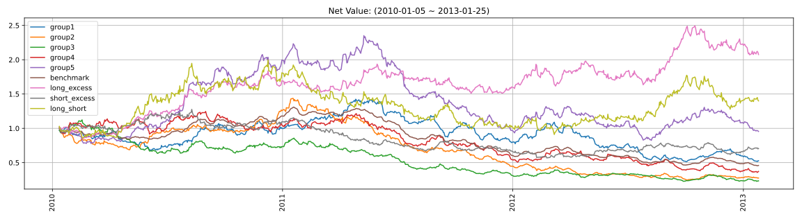

|               |   ann_ret |   max_dd |   ann_sharpe |   ann_calmar |   win_rate |   avg_win_ret |   avg_loss_ret |   profit_loss_ratio |   ann_vol |
|:--------------|----------:|---------:|-------------:|-------------:|-----------:|--------------:|---------------:|--------------------:|----------:|
| group5(long)  |   -0.0147 |   0.6491 |       0.0932 |      -0.3591 |     0.4841 |        0.0152 |        -0.0141 |              1.0815 |    0.2896 |
| group1(short) |   -0.1859 |   0.6390 |      -0.5546 |      -4.6186 |     0.4904 |        0.0144 |        -0.0152 |              0.9521 |    0.2933 |
| benchmark     |   -0.2209 |   0.6523 |      -1.8139 |      -5.3764 |     0.4637 |        0.0063 |        -0.0072 |              0.8718 |    0.1327 |
| long_excess   |    0.2641 |   0.2202 |       1.0366 |      19.0364 |     0.4994 |        0.0140 |        -0.0118 |              1.1828 |    0.2582 |
| short_excess  |   -0.1058 |   0.5540 |      -0.3002 |      -3.0315 |     0.4955 |        0.0129 |        -0.0133 |              0.9709 |    0.2598 |
| long_short    |    0.1141 |   0.5445 |       0.4690 |       3.3266 |     0.5146 |        0.0207 |        -0.0204 |              1.0148 |    0.4045 |

### 10D
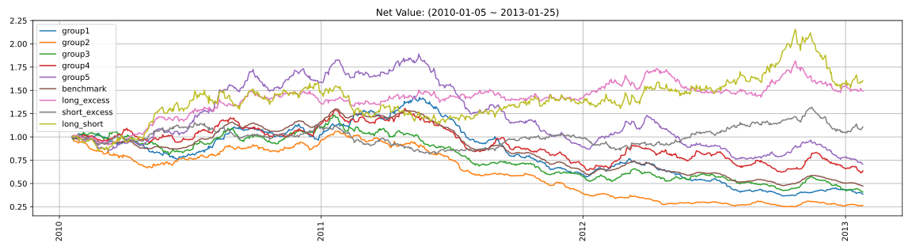

|               |   ann_ret |   max_dd |   ann_sharpe |   ann_calmar |   win_rate |   avg_win_ret |   avg_loss_ret |   profit_loss_ratio |   ann_vol |
|:--------------|----------:|---------:|-------------:|-------------:|-----------:|--------------:|---------------:|--------------------:|----------:|
| group5(long)  |   -0.1055 |   0.6257 |      -0.4502 |      -2.6766 |     0.4692 |        0.0104 |        -0.0098 |              1.0528 |    0.2023 |
| group1(short) |   -0.2654 |   0.7450 |      -1.3790 |      -5.6547 |     0.4474 |        0.0106 |        -0.0106 |              0.9956 |    0.2079 |
| benchmark     |   -0.2138 |   0.6344 |      -2.5298 |      -5.3495 |     0.4154 |        0.0048 |        -0.0050 |              0.9563 |    0.0933 |
| long_excess   |    0.1375 |   0.1869 |       0.8069 |      11.6838 |     0.5167 |        0.0092 |        -0.0087 |              1.0638 |    0.1797 |
| short_excess  |    0.0335 |   0.2933 |       0.2692 |       1.8117 |     0.5115 |        0.0095 |        -0.0096 |              0.9960 |    0.1880 |
| long_short    |    0.1649 |   0.2954 |       0.6673 |       8.8640 |     0.5192 |        0.0149 |        -0.0145 |              1.0289 |    0.2931 |

### 20D
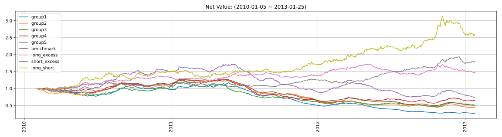

|               |   ann_ret |   max_dd |   ann_sharpe |   ann_calmar |   win_rate |   avg_win_ret |   avg_loss_ret |   profit_loss_ratio |   ann_vol |
|:--------------|----------:|---------:|-------------:|-------------:|-----------:|--------------:|---------------:|--------------------:|----------:|
| group5(long)  |   -0.0950 |   0.5702 |      -0.5923 |      -2.6443 |     0.4351 |        0.0081 |        -0.0069 |              1.1810 |    0.1496 |
| group1(short) |   -0.3530 |   0.7746 |      -2.8013 |      -7.2349 |     0.3831 |        0.0080 |        -0.0077 |              1.0402 |    0.1512 |
| benchmark     |   -0.2019 |   0.6130 |      -3.3374 |      -5.2276 |     0.3831 |        0.0034 |        -0.0035 |              0.9591 |    0.0669 |
| long_excess   |    0.1342 |   0.1929 |       1.0280 |      11.0466 |     0.4922 |        0.0072 |        -0.0060 |              1.2138 |    0.1308 |
| short_excess  |    0.2107 |   0.1390 |       1.4723 |      24.0638 |     0.5649 |        0.0067 |        -0.0069 |              0.9749 |    0.1362 |
| long_short    |    0.3652 |   0.1858 |       1.5419 |      31.1990 |     0.5325 |        0.0114 |        -0.0102 |              1.1238 |    0.2173 |

### 因子加权日频收益
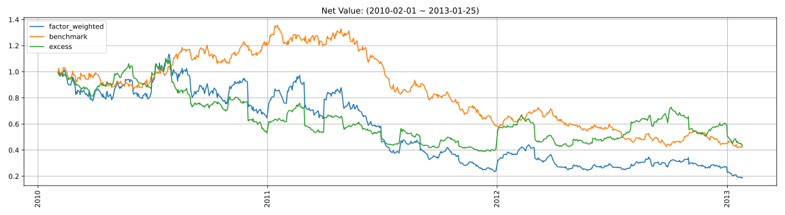

|                 |   ann_ret |   max_dd |   ann_sharpe |   ann_calmar |   win_rate |   avg_win_ret |   avg_loss_ret |   profit_loss_ratio |   ann_vol |
|:----------------|----------:|---------:|-------------:|-------------:|-----------:|--------------:|---------------:|--------------------:|----------:|
| factor_weighted |   -0.4142 |   0.8358 |      -0.6353 |      -7.8665 |     0.4685 |        0.0233 |        -0.0233 |              1.0004 |    0.5797 |
| benchmark       |   -0.2362 |   0.6918 |      -0.7668 |      -5.4201 |     0.4724 |        0.0149 |        -0.0151 |              0.9909 |    0.2946 |
| excess          |   -0.2348 |   0.6463 |      -0.2819 |      -5.7676 |     0.4737 |        0.0163 |        -0.0157 |              1.0350 |    0.5066 |

### 单因子策略(0.8, 1.0)收益
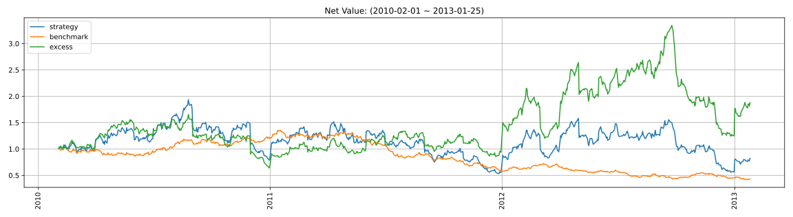

|           |   ann_ret |   max_dd |   ann_sharpe |   ann_calmar |   win_rate |   avg_win_ret |   avg_loss_ret |   profit_loss_ratio |   ann_vol |
|:----------|----------:|---------:|-------------:|-------------:|-----------:|--------------:|---------------:|--------------------:|----------:|
| strategy  |   -0.0603 |   0.7250 |       0.3193 |      -1.3207 |     0.5006 |        0.0333 |        -0.0312 |              1.0654 |    0.8381 |
| benchmark |   -0.2362 |   0.6918 |      -0.7668 |      -5.4201 |     0.4724 |        0.0149 |        -0.0151 |              0.9909 |    0.2946 |
| excess    |    0.2272 |   0.6286 |       0.6249 |       5.7367 |     0.5109 |        0.0297 |        -0.0271 |              1.0990 |    0.7903 |

## 换手率分析
### 分层换手率

|         |   turnover_count |   turnover_mean |   turnover_std |
|:--------|-----------------:|----------------:|---------------:|
| group_1 |         763.0000 |          0.8263 |         0.2382 |
| group_2 |         760.0000 |          0.8132 |         0.2420 |
| group_3 |         772.0000 |          0.8025 |         0.2446 |
| group_4 |         766.0000 |          0.8192 |         0.2404 |
| group_5 |         755.0000 |          0.8377 |         0.2342 |

### 因子加权持仓换手率
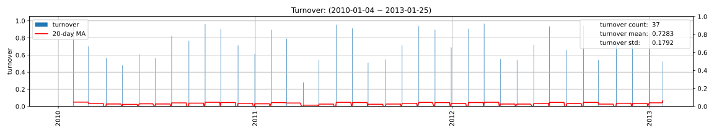

|                 |   turnover_count |   turnover_mean |   turnover_std |
|:----------------|-----------------:|----------------:|---------------:|
| factor_weighted |          37.0000 |          0.7283 |         0.1792 |

### 单因子策略(0.8, 1.0)换手率
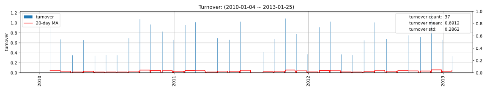

|          |   turnover_count |   turnover_mean |   turnover_std |
|:---------|-----------------:|----------------:|---------------:|
| strategy |          37.0000 |          0.6912 |         0.2862 |

