# factor1_factor4 factor report
## IC分析
### 1D
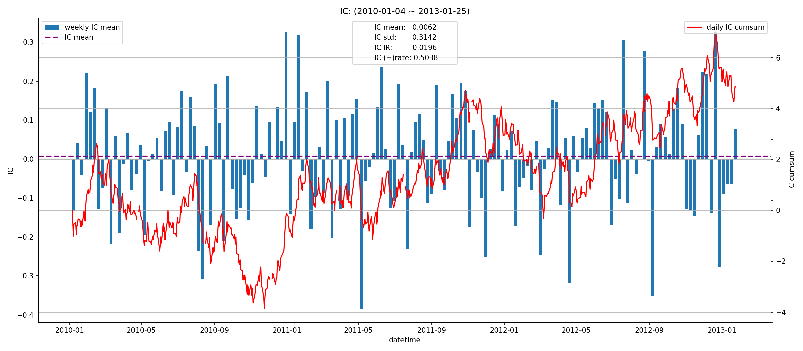
|         |   total |    2010 |   2011 |   2012 |    2013 |
|:--------|--------:|--------:|-------:|-------:|--------:|
| IC_mean |  0.0062 | -0.0005 | 0.0119 | 0.0104 | -0.0429 |
| IC_std  |  0.3142 |  0.3152 | 0.3176 | 0.3101 |  0.3318 |
| IC_IR   |  0.0196 | -0.0015 | 0.0375 | 0.0337 | -0.1293 |

### 5D
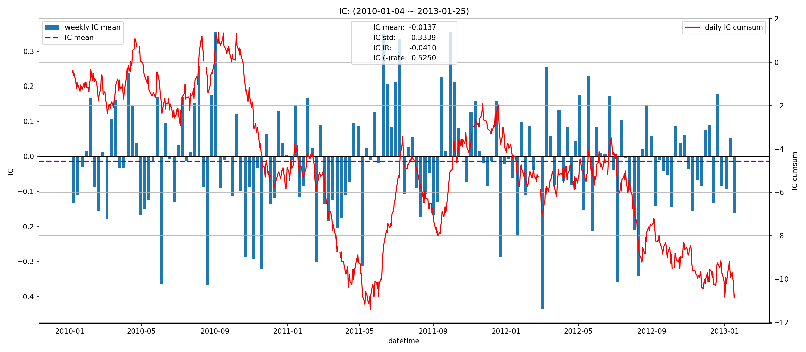
|         |   total |    2010 |   2011 |    2012 |    2013 |
|:--------|--------:|--------:|-------:|--------:|--------:|
| IC_mean | -0.0137 | -0.0189 | 0.0036 | -0.0239 | -0.0461 |
| IC_std  |  0.3339 |  0.3275 | 0.3386 |  0.3303 |  0.4437 |
| IC_IR   | -0.0410 | -0.0578 | 0.0106 | -0.0725 | -0.1040 |

### 10D
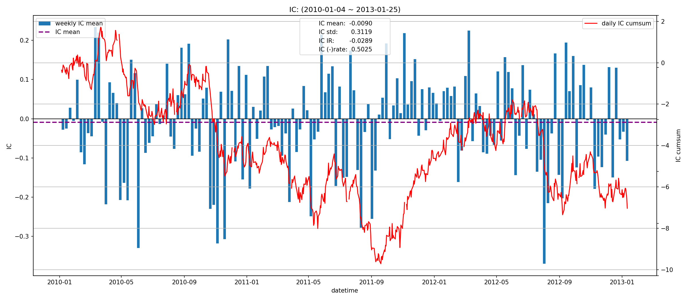
|         |   total |    2010 |    2011 |    2012 |    2013 |
|:--------|--------:|--------:|--------:|--------:|--------:|
| IC_mean | -0.0090 | -0.0160 | -0.0021 | -0.0068 | -0.0733 |
| IC_std  |  0.3119 |  0.3175 |  0.2982 |  0.3209 |  0.3087 |
| IC_IR   | -0.0289 | -0.0503 | -0.0070 | -0.0211 | -0.2374 |

## 收益分析
### 分层收益
### 1D
|               |   annual_return |   max_drawdown |   annual_sharpe |   annual_calmar |   win_rate |   avg_win_return |   avg_loss_return |   profit_loss_ratio |   annual_volatility |   annual_downside_deviation |   annual_sortino |
|:--------------|----------------:|---------------:|----------------:|----------------:|-----------:|-----------------:|------------------:|--------------------:|--------------------:|----------------------------:|-----------------:|
| group5(long)  |          0.1863 |         0.6694 |          0.6424 |          4.4167 |     0.5044 |           0.0432 |           -0.0391 |              1.1048 |              0.9476 |                      0.5832 |           1.0438 |
| group1(short) |          0.1276 |         0.7279 |          0.5651 |          2.7828 |     0.4867 |           0.0435 |           -0.0373 |              1.1660 |              0.9024 |                      0.4670 |           1.0919 |
| benchmark     |          0.0203 |         0.2899 |          0.6604 |          1.1093 |     0.4930 |           0.0708 |           -0.0622 |              1.1392 |              1.2968 |                      0.7104 |           1.2055 |
| long_excess   |         -0.7608 |         0.9904 |         -0.1610 |        -12.1952 |     0.4930 |           0.0758 |           -0.0757 |              1.0019 |              1.5386 |                      0.9032 |          -0.2743 |
| short_excess  |         -0.5865 |         0.9720 |          0.2255 |         -9.5776 |     0.5032 |           0.0763 |           -0.0745 |              1.0241 |              1.5370 |                      1.0249 |           0.3381 |
| long_short    |         -0.5177 |         0.9781 |          0.0782 |         -8.4010 |     0.5070 |           0.0548 |           -0.0555 |              0.9864 |              1.2628 |                      0.9266 |           0.1066 |

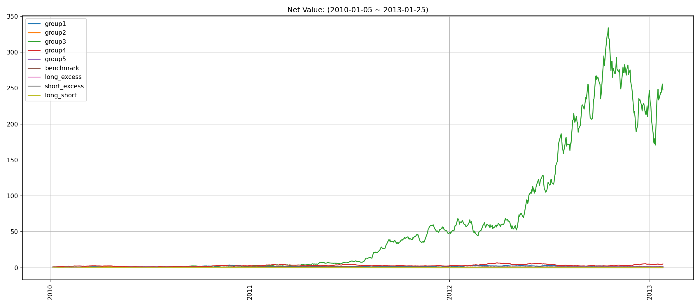
### 5D
|               |   annual_return |   max_drawdown |   annual_sharpe |   annual_calmar |   win_rate |   avg_win_return |   avg_loss_return |   profit_loss_ratio |   annual_volatility |   annual_downside_deviation |   annual_sortino |
|:--------------|----------------:|---------------:|----------------:|----------------:|-----------:|-----------------:|------------------:|--------------------:|--------------------:|----------------------------:|-----------------:|
| group5(long)  |          0.5599 |         0.3645 |          1.3134 |         24.3862 |     0.5248 |           0.0204 |           -0.0182 |              1.1233 |              0.3986 |                      0.2090 |           2.5046 |
| group1(short) |          2.1524 |         0.2145 |          3.1164 |        159.2591 |     0.5618 |           0.0213 |           -0.0163 |              1.3132 |              0.3937 |                      0.1935 |           6.3425 |
| benchmark     |          0.1389 |         0.1264 |          0.6206 |         17.4538 |     0.4879 |           0.0145 |           -0.0125 |              1.1570 |              0.2667 |                      0.1409 |           1.1748 |
| long_excess   |          0.2870 |         0.4212 |          0.7758 |         10.8162 |     0.5159 |           0.0234 |           -0.0220 |              1.0632 |              0.4615 |                      0.2550 |           1.4041 |
| short_excess  |         -0.6915 |         0.9768 |         -2.2616 |        -11.2378 |     0.4573 |           0.0205 |           -0.0251 |              0.8192 |              0.4694 |                      0.3383 |          -3.1380 |
| long_short    |         -0.5735 |         0.9331 |         -1.2983 |         -9.7570 |     0.4752 |           0.0250 |           -0.0280 |              0.8944 |              0.5418 |                      0.3481 |          -2.0211 |

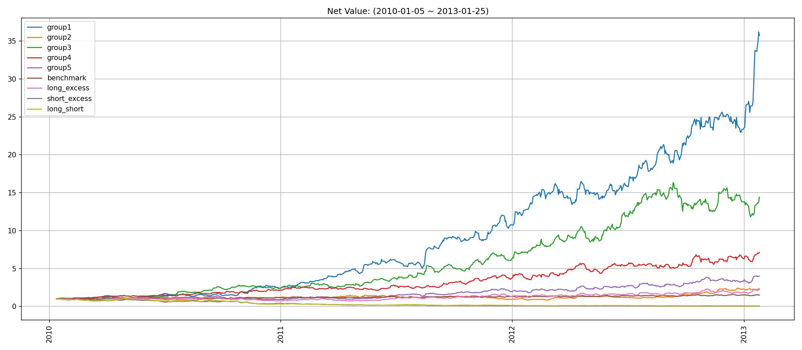
### 10D
|               |   annual_return |   max_drawdown |   annual_sharpe |   annual_calmar |   win_rate |   avg_win_return |   avg_loss_return |   profit_loss_ratio |   annual_volatility |   annual_downside_deviation |   annual_sortino |
|:--------------|----------------:|---------------:|----------------:|----------------:|-----------:|-----------------:|------------------:|--------------------:|--------------------:|----------------------------:|-----------------:|
| group5(long)  |          0.2502 |         0.1926 |          1.0772 |         20.6246 |     0.5090 |           0.0119 |           -0.0103 |              1.1540 |              0.2323 |                      0.1339 |           1.8696 |
| group1(short) |          0.8604 |         0.1408 |          2.7295 |         97.0250 |     0.5385 |           0.0127 |           -0.0092 |              1.3787 |              0.2380 |                      0.1206 |           5.3857 |
| benchmark     |          0.0824 |         0.0940 |          0.6538 |         13.9123 |     0.4987 |           0.0074 |           -0.0066 |              1.1112 |              0.1350 |                      0.0720 |           1.2255 |
| long_excess   |          0.1372 |         0.2158 |          0.6251 |         10.0875 |     0.5038 |           0.0132 |           -0.0121 |              1.0900 |              0.2592 |                      0.1489 |           1.0879 |
| short_excess  |         -0.4494 |         0.8518 |         -2.1388 |         -8.3749 |     0.4705 |           0.0109 |           -0.0139 |              0.7847 |              0.2624 |                      0.2013 |          -2.7881 |
| long_short    |         -0.3652 |         0.7582 |         -1.2080 |         -7.6468 |     0.4692 |           0.0148 |           -0.0160 |              0.9207 |              0.3305 |                      0.2367 |          -1.6868 |

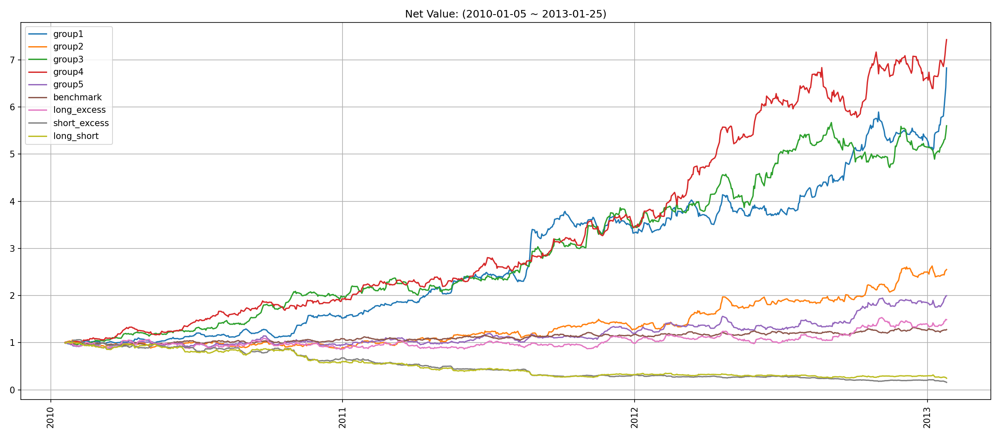
### 因子加权日频收益
|                 |   annual_return |   max_drawdown |   annual_sharpe |   annual_calmar |   win_rate |   avg_win_return |   avg_loss_return |   profit_loss_ratio |   annual_volatility |   annual_downside_deviation |   annual_sortino |
|:----------------|----------------:|---------------:|----------------:|----------------:|-----------:|-----------------:|------------------:|--------------------:|--------------------:|----------------------------:|-----------------:|
| factor_weighted |         -0.1665 |         0.5263 |         -0.0542 |         -5.0202 |     0.4962 |           0.0241 |           -0.0240 |              1.0052 |              0.5550 |                      0.3714 |          -0.0810 |
| benchmark       |         -0.0041 |         0.1815 |          0.6409 |         -0.3591 |     0.4944 |           0.0704 |           -0.0623 |              1.1297 |              1.2946 |                      0.7106 |           1.1677 |
| excess          |         -0.8523 |         0.9978 |         -0.5994 |        -13.5592 |     0.4856 |           0.0712 |           -0.0739 |              0.9642 |              1.4346 |                      0.8826 |          -0.9742 |

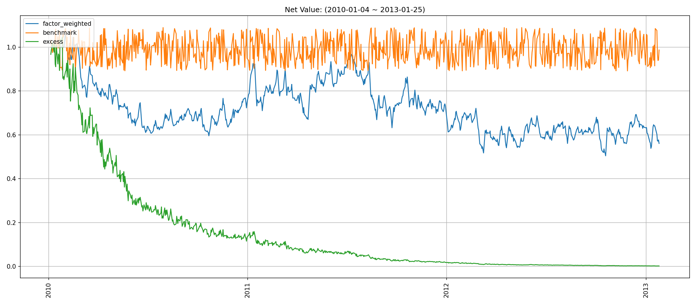
### 分位数(0.8, 1.0)收益
|           |   annual_return |   max_drawdown |   annual_sharpe |   annual_calmar |   win_rate |   avg_win_return |   avg_loss_return |   profit_loss_ratio |   annual_volatility |   annual_downside_deviation |   annual_sortino |
|:----------|----------------:|---------------:|----------------:|----------------:|-----------:|-----------------:|------------------:|--------------------:|--------------------:|----------------------------:|-----------------:|
| quantile  |          1.1123 |         0.3298 |          1.3235 |         53.5382 |     0.5090 |           0.0376 |           -0.0304 |              1.2390 |              0.7871 |                      0.3965 |           2.6273 |
| benchmark |         -0.0041 |         0.1815 |          0.6409 |         -0.3591 |     0.4944 |           0.0704 |           -0.0623 |              1.1297 |              1.2946 |                      0.7106 |           1.1677 |
| excess    |         -0.5993 |         0.9585 |          0.1423 |         -9.9262 |     0.5144 |           0.0728 |           -0.0754 |              0.9659 |              1.4987 |                      0.8914 |           0.2393 |

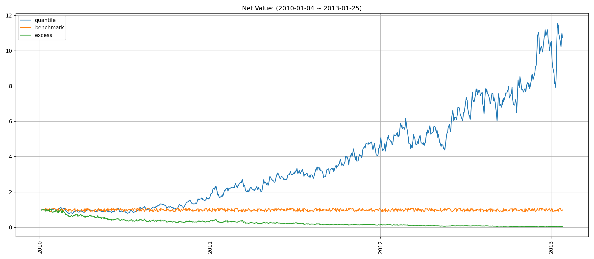
## 换手率分析
### 分层换手率
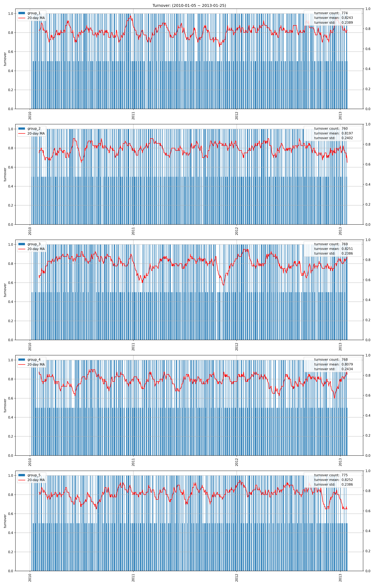
|         |   turnover_count |   turnover_mean |   turnover_std |
|:--------|-----------------:|----------------:|---------------:|
| group_1 |         774.0000 |          0.8243 |         0.2389 |
| group_2 |         760.0000 |          0.8197 |         0.2402 |
| group_3 |         769.0000 |          0.8251 |         0.2386 |
| group_4 |         768.0000 |          0.8079 |         0.2434 |
| group_5 |         775.0000 |          0.8252 |         0.2386 |

### 因子加权持仓换手率
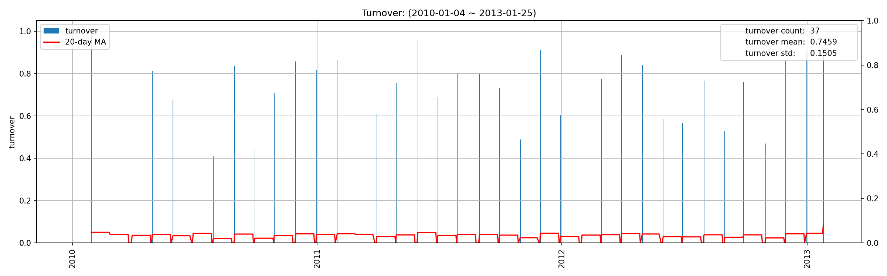
|    |   turnover_count |   turnover_mean |   turnover_std |
|---:|-----------------:|----------------:|---------------:|
|  0 |          37.0000 |          0.7459 |         0.1505 |

### 分位数(0.8, 1.0)换手率
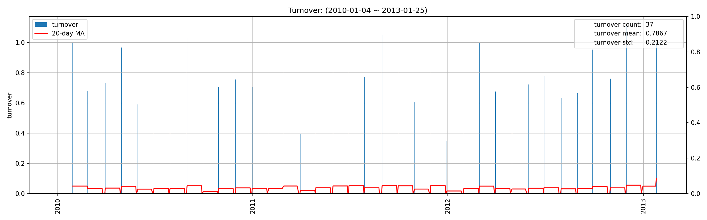
|    |   turnover_count |   turnover_mean |   turnover_std |
|---:|-----------------:|----------------:|---------------:|
|  0 |          37.0000 |          0.7867 |         0.2122 |

