# factor2 因子报告
## IC分析
### 1D
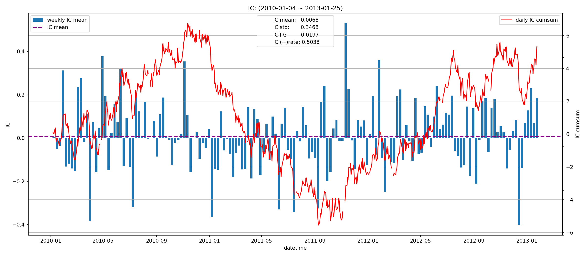
|         |   total |   2010 |    2011 |   2012 |   2013 |
|:--------|--------:|-------:|--------:|-------:|-------:|
| IC_mean |  0.0068 | 0.0225 | -0.0314 | 0.0176 | 0.1745 |
| IC_std  |  0.3468 | 0.3577 |  0.3426 | 0.3379 | 0.3227 |
| IC_IR   |  0.0197 | 0.0630 | -0.0918 | 0.0521 | 0.5409 |

### 5D
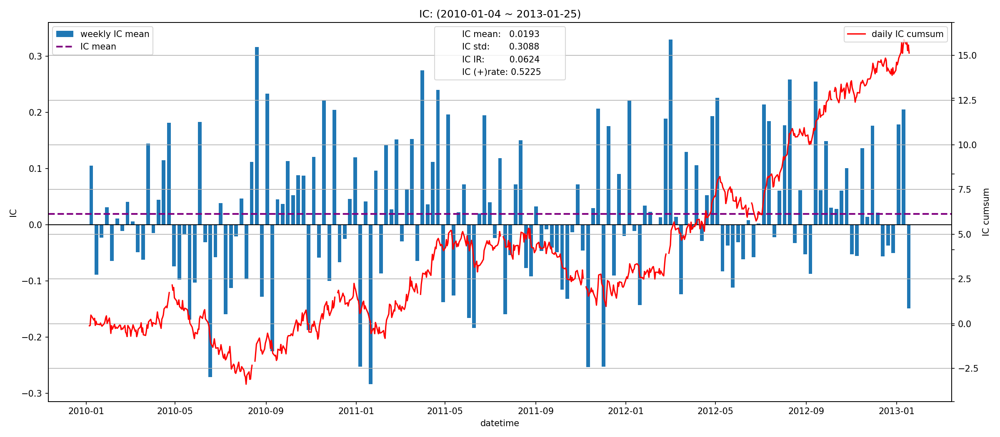
|         |   total |    2010 |   2011 |   2012 |   2013 |
|:--------|--------:|--------:|-------:|-------:|-------:|
| IC_mean |  0.0009 | -0.0148 | 0.0073 | 0.0049 | 0.0978 |
| IC_std  |  0.3362 |  0.3497 | 0.3260 | 0.3341 | 0.3195 |
| IC_IR   |  0.0028 | -0.0424 | 0.0225 | 0.0145 | 0.3062 |

### 20D
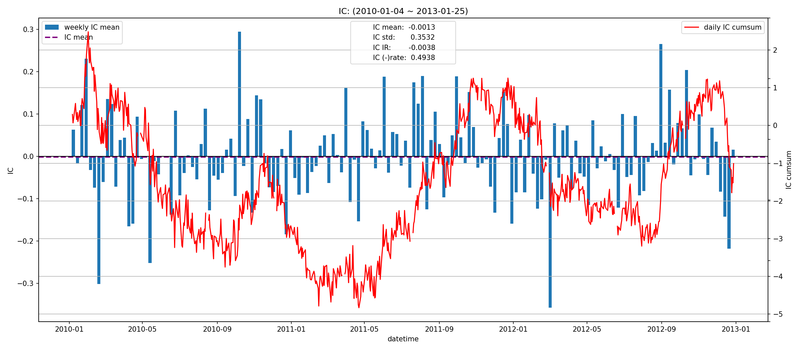
|         |   total |    2010 |   2011 |    2012 |   2013 |
|:--------|--------:|--------:|-------:|--------:|-------:|
| IC_mean | -0.0013 | -0.0106 | 0.0123 | -0.0058 |    nan |
| IC_std  |  0.3532 |  0.4055 | 0.3230 |  0.3265 |    nan |
| IC_IR   | -0.0038 | -0.0260 | 0.0380 | -0.0177 |    nan |

## 收益分析
### 分层收益
### 1D
|               |   annual_return |   max_drawdown |   annual_sharpe |   annual_calmar |   win_rate |   avg_win_return |   avg_loss_return |   profit_loss_ratio |   annual_volatility |   annual_downside_deviation |   annual_sortino |
|:--------------|----------------:|---------------:|----------------:|----------------:|-----------:|-----------------:|------------------:|--------------------:|--------------------:|----------------------------:|-----------------:|
| group5(long)  |         -0.2007 |         0.8445 |         -0.0028 |         -3.7725 |     0.4904 |           0.0352 |           -0.0339 |              1.0388 |              0.6658 |                      0.3892 |          -0.0049 |
| group1(short) |         -0.4219 |         0.8793 |         -0.5616 |         -7.6173 |     0.4840 |           0.0319 |           -0.0326 |              0.9779 |              0.6256 |                      0.3692 |          -0.9516 |
| benchmark     |         -0.5271 |         0.9418 |         -0.3478 |         -8.8851 |     0.4840 |           0.0507 |           -0.0501 |              1.0137 |              0.9239 |                      0.4499 |          -0.7141 |
| long_excess   |         -0.2731 |         0.9138 |          0.2830 |         -4.7450 |     0.5148 |           0.0581 |           -0.0590 |              0.9844 |              1.1289 |                      0.6309 |           0.5063 |
| short_excess  |         -0.4363 |         0.9085 |          0.0274 |         -7.6233 |     0.5045 |           0.0558 |           -0.0566 |              0.9864 |              1.0969 |                      0.6268 |           0.0479 |
| long_short    |         -0.0711 |         0.7396 |          0.3804 |         -1.5249 |     0.5058 |           0.0477 |           -0.0460 |              1.0367 |              0.9187 |                      0.5411 |           0.6459 |

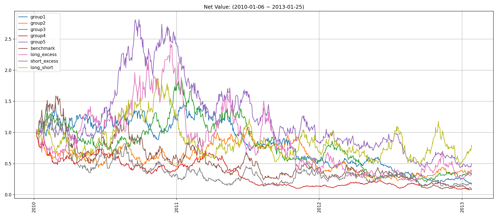
### 5D
|               |   annual_return |   max_drawdown |   annual_sharpe |   annual_calmar |   win_rate |   avg_win_return |   avg_loss_return |   profit_loss_ratio |   annual_volatility |   annual_downside_deviation |   annual_sortino |
|:--------------|----------------:|---------------:|----------------:|----------------:|-----------:|-----------------:|------------------:|--------------------:|--------------------:|----------------------------:|-----------------:|
| group5(long)  |         -0.1949 |         0.5839 |         -0.6101 |         -5.2978 |     0.4774 |           0.0144 |           -0.0145 |              0.9940 |              0.2875 |                      0.1670 |          -1.0504 |
| group1(short) |         -0.1961 |         0.7039 |         -0.6262 |         -4.4214 |     0.4594 |           0.0151 |           -0.0141 |              1.0683 |              0.2841 |                      0.1545 |          -1.1516 |
| benchmark     |         -0.3411 |         0.8525 |         -0.6916 |         -6.3521 |     0.4568 |           0.0239 |           -0.0224 |              1.0674 |              0.4546 |                      0.2310 |          -1.3611 |
| long_excess   |         -0.0044 |         0.7719 |          0.2601 |         -0.0896 |     0.5200 |           0.0265 |           -0.0276 |              0.9616 |              0.5341 |                      0.3400 |           0.4087 |
| short_excess  |         -0.2430 |         0.8447 |         -0.2556 |         -4.5665 |     0.4903 |           0.0271 |           -0.0271 |              0.9987 |              0.5338 |                      0.2930 |          -0.4657 |
| long_short    |         -0.0769 |         0.4559 |          0.0062 |         -2.6779 |     0.5032 |           0.0204 |           -0.0206 |              0.9881 |              0.4063 |                      0.2408 |           0.0104 |

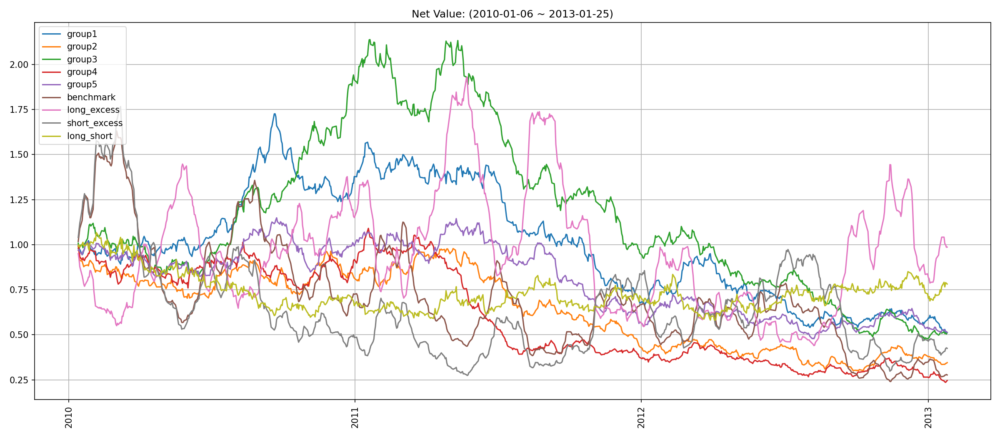
### 20D
|               |   annual_return |   max_drawdown |   annual_sharpe |   annual_calmar |   win_rate |   avg_win_return |   avg_loss_return |   profit_loss_ratio |   annual_volatility |   annual_downside_deviation |   annual_sortino |
|:--------------|----------------:|---------------:|----------------:|----------------:|-----------:|-----------------:|------------------:|--------------------:|--------------------:|----------------------------:|-----------------:|
| group5(long)  |         -0.1999 |         0.6019 |         -1.4144 |         -5.2729 |     0.4066 |           0.0083 |           -0.0071 |              1.1681 |              0.1497 |                      0.0742 |          -2.8529 |
| group1(short) |         -0.1269 |         0.6480 |         -0.7960 |         -3.1097 |     0.4421 |           0.0083 |           -0.0074 |              1.1124 |              0.1554 |                      0.0737 |          -1.6790 |
| benchmark     |         -0.2803 |         0.7467 |         -1.4103 |         -5.9582 |     0.4211 |           0.0121 |           -0.0109 |              1.1111 |              0.2165 |                      0.1049 |          -2.9108 |
| long_excess   |          0.0604 |         0.7455 |          0.3538 |          1.2851 |     0.5303 |           0.0130 |           -0.0138 |              0.9364 |              0.2644 |                      0.1592 |           0.5876 |
| short_excess  |         -0.1938 |         0.8105 |         -0.6982 |         -3.7964 |     0.4566 |           0.0134 |           -0.0126 |              1.0650 |              0.2601 |                      0.1527 |          -1.1892 |
| long_short    |         -0.1069 |         0.4246 |         -0.3944 |         -3.9957 |     0.4855 |           0.0109 |           -0.0110 |              0.9942 |              0.2233 |                      0.1437 |          -0.6127 |

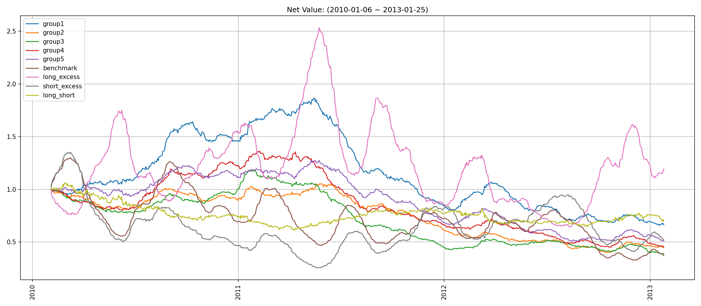
### 因子加权日频收益
|                 |   annual_return |   max_drawdown |   annual_sharpe |   annual_calmar |   win_rate |   avg_win_return |   avg_loss_return |   profit_loss_ratio |   annual_volatility |   annual_downside_deviation |   annual_sortino |
|:----------------|----------------:|---------------:|----------------:|----------------:|-----------:|-----------------:|------------------:|--------------------:|--------------------:|----------------------------:|-----------------:|
| factor_weighted |         -0.3092 |         0.8506 |         -0.1705 |         -5.7706 |     0.4852 |           0.0248 |           -0.0244 |              1.0194 |              0.7228 |                      0.5015 |          -0.2458 |
| benchmark       |         -0.6072 |         0.9552 |         -0.5418 |        -10.0918 |     0.4775 |           0.0510 |           -0.0504 |              1.0112 |              0.9278 |                      0.4492 |          -1.1192 |
| excess          |         -0.2551 |         0.9371 |          0.3222 |         -4.3219 |     0.5212 |           0.0565 |           -0.0583 |              0.9683 |              1.1773 |                      0.6476 |           0.5857 |

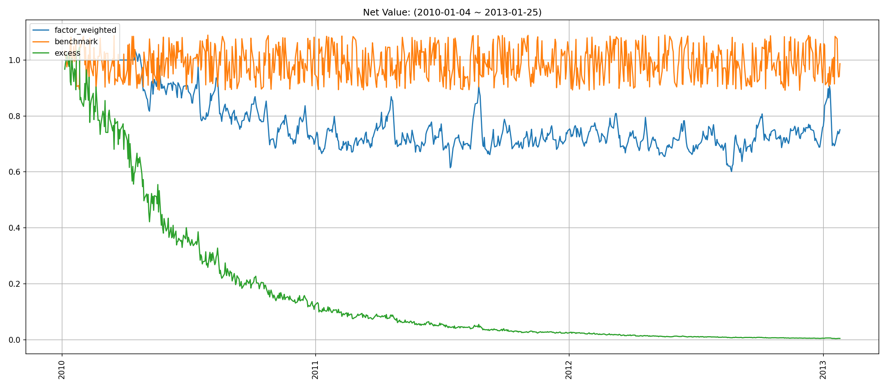
### 分位数(0.8, 1.0)收益
|           |   annual_return |   max_drawdown |   annual_sharpe |   annual_calmar |   win_rate |   avg_win_return |   avg_loss_return |   profit_loss_ratio |   annual_volatility |   annual_downside_deviation |   annual_sortino |
|:----------|----------------:|---------------:|----------------:|----------------:|-----------:|-----------------:|------------------:|--------------------:|--------------------:|----------------------------:|-----------------:|
| quantile  |         -0.4185 |         0.9202 |          0.0808 |         -7.2189 |     0.4827 |           0.0405 |           -0.0371 |              1.0929 |              1.1740 |                      0.7991 |           0.1187 |
| benchmark |         -0.6072 |         0.9552 |         -0.5418 |        -10.0918 |     0.4775 |           0.0510 |           -0.0504 |              1.0112 |              0.9278 |                      0.4492 |          -1.1192 |
| excess    |         -0.3761 |         0.9583 |          0.3956 |         -6.2304 |     0.5186 |           0.0656 |           -0.0658 |              0.9977 |              1.5110 |                      0.8734 |           0.6843 |

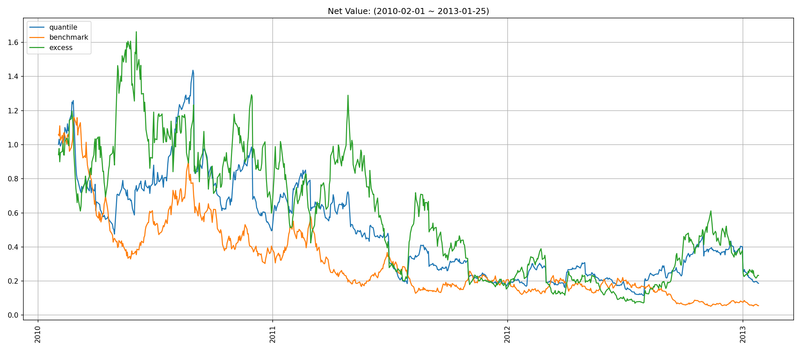
## 换手率分析
### 分层换手率
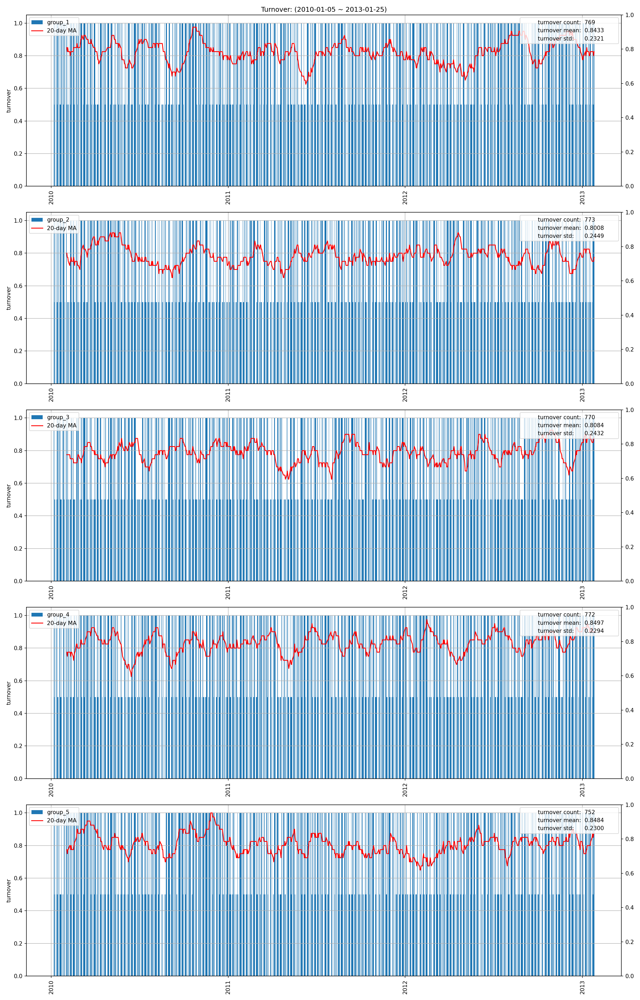
|         |   turnover_count |   turnover_mean |   turnover_std |
|:--------|-----------------:|----------------:|---------------:|
| group_1 |         768.0000 |          0.9069 |         0.1948 |
| group_2 |         763.0000 |          0.8434 |         0.2321 |
| group_3 |         745.0000 |          0.7805 |         0.2483 |
| group_4 |         760.0000 |          0.8461 |         0.2310 |
| group_5 |         774.0000 |          0.9154 |         0.1876 |

### 因子加权持仓换手率
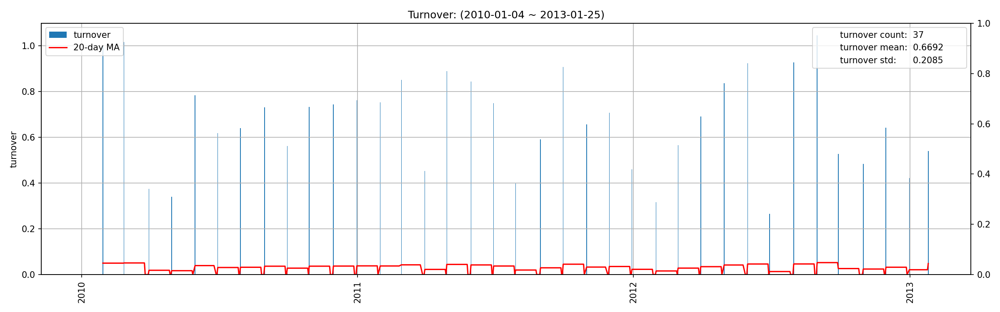
|    |   turnover_count |   turnover_mean |   turnover_std |
|---:|-----------------:|----------------:|---------------:|
|  0 |          37.0000 |          0.6692 |         0.2085 |

### 分位数(0.8, 1.0)换手率
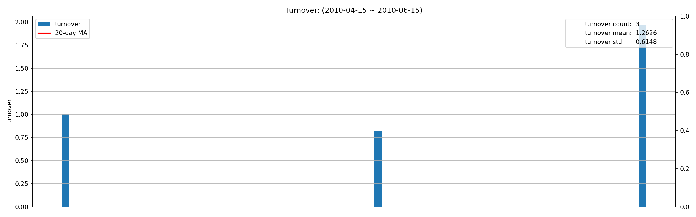
|    |   turnover_count |   turnover_mean |   turnover_std |
|---:|-----------------:|----------------:|---------------:|
|  0 |          36.0000 |          0.7298 |         0.2876 |

