# factor2 因子报告
## IC分析
### 1D
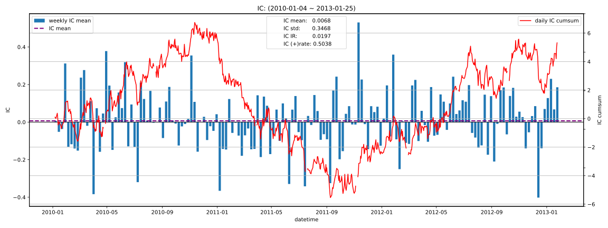

|         |   total |   2010 |    2011 |   2012 |   2013 |
|:--------|--------:|-------:|--------:|-------:|-------:|
| IC_mean |  0.0068 | 0.0225 | -0.0314 | 0.0176 | 0.1745 |
| IC_std  |  0.3468 | 0.3577 |  0.3426 | 0.3379 | 0.3227 |
| IC_IR   |  0.0197 | 0.0630 | -0.0918 | 0.0521 | 0.5409 |

### 5D
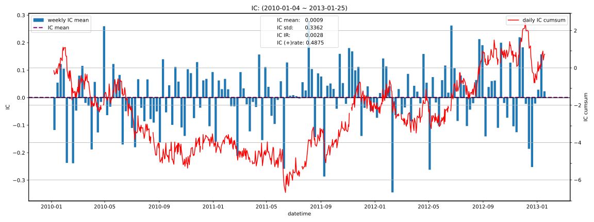

|         |   total |    2010 |   2011 |   2012 |   2013 |
|:--------|--------:|--------:|-------:|-------:|-------:|
| IC_mean |  0.0009 | -0.0148 | 0.0073 | 0.0049 | 0.0978 |
| IC_std  |  0.3362 |  0.3497 | 0.3260 | 0.3341 | 0.3195 |
| IC_IR   |  0.0028 | -0.0424 | 0.0225 | 0.0145 | 0.3062 |

### 10D
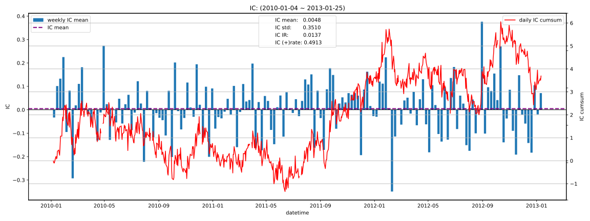

|         |   total |   2010 |   2011 |    2012 |   2013 |
|:--------|--------:|-------:|-------:|--------:|-------:|
| IC_mean |  0.0048 | 0.0030 | 0.0111 | -0.0019 | 0.0659 |
| IC_std  |  0.3510 | 0.3731 | 0.3358 |  0.3469 | 0.2872 |
| IC_IR   |  0.0137 | 0.0080 | 0.0332 | -0.0055 | 0.2294 |

### 20D
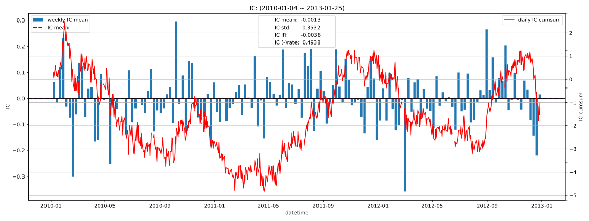

|         |   total |    2010 |   2011 |    2012 |   2013 |
|:--------|--------:|--------:|-------:|--------:|-------:|
| IC_mean | -0.0013 | -0.0106 | 0.0123 | -0.0058 |    nan |
| IC_std  |  0.3532 |  0.4055 | 0.3230 |  0.3265 |    nan |
| IC_IR   | -0.0038 | -0.0260 | 0.0380 | -0.0177 |    nan |

## 收益分析
### 分层收益
### 1D
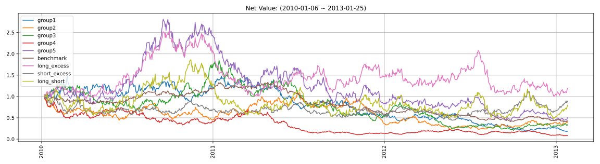

|               |   ann_ret |   max_dd |   ann_sharpe |   ann_calmar |   win_rate |   avg_win_ret |   avg_loss_ret |   profit_loss_ratio |   ann_vol |
|:--------------|----------:|---------:|-------------:|-------------:|-----------:|--------------:|---------------:|--------------------:|----------:|
| group5(long)  |   -0.2007 |   0.8445 |      -0.0028 |      -3.7725 |     0.4904 |        0.0352 |        -0.0339 |              1.0388 |    0.6658 |
| group1(short) |   -0.4219 |   0.8793 |      -0.5616 |      -7.6173 |     0.4840 |        0.0319 |        -0.0326 |              0.9779 |    0.6256 |
| benchmark     |   -0.2415 |   0.6927 |      -0.7876 |      -5.5344 |     0.4737 |        0.0149 |        -0.0152 |              0.9826 |    0.2954 |
| long_excess   |    0.0582 |   0.6072 |       0.3912 |       1.5207 |     0.5186 |        0.0302 |        -0.0307 |              0.9858 |    0.5899 |
| short_excess  |   -0.0375 |   0.5571 |       0.2119 |      -1.0698 |     0.5045 |        0.0289 |        -0.0285 |              1.0150 |    0.5600 |
| long_short    |   -0.0711 |   0.7396 |       0.3804 |      -1.5249 |     0.5058 |        0.0477 |        -0.0460 |              1.0367 |    0.9187 |

### 5D
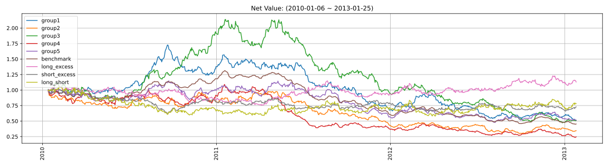

|               |   ann_ret |   max_dd |   ann_sharpe |   ann_calmar |   win_rate |   avg_win_ret |   avg_loss_ret |   profit_loss_ratio |   ann_vol |
|:--------------|----------:|---------:|-------------:|-------------:|-----------:|--------------:|---------------:|--------------------:|----------:|
| group5(long)  |   -0.1949 |   0.5839 |      -0.6101 |      -5.2978 |     0.4774 |        0.0144 |        -0.0145 |              0.9940 |    0.2875 |
| group1(short) |   -0.1961 |   0.7039 |      -0.6262 |      -4.4214 |     0.4594 |        0.0151 |        -0.0141 |              1.0683 |    0.2841 |
| benchmark     |   -0.2268 |   0.6579 |      -1.8633 |      -5.4729 |     0.4606 |        0.0064 |        -0.0073 |              0.8760 |    0.1332 |
| long_excess   |    0.0406 |   0.2866 |       0.2829 |       2.2490 |     0.4877 |        0.0135 |        -0.0123 |              1.0983 |    0.2574 |
| short_excess  |   -0.0976 |   0.3878 |      -0.2767 |      -3.9954 |     0.5110 |        0.0123 |        -0.0134 |              0.9163 |    0.2541 |
| long_short    |   -0.0769 |   0.4559 |       0.0062 |      -2.6779 |     0.5032 |        0.0204 |        -0.0206 |              0.9881 |    0.4063 |

### 10D
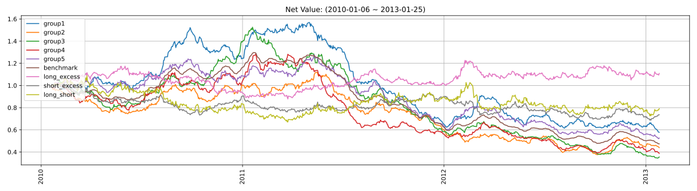

|               |   ann_ret |   max_dd |   ann_sharpe |   ann_calmar |   win_rate |   avg_win_ret |   avg_loss_ret |   profit_loss_ratio |   ann_vol |
|:--------------|----------:|---------:|-------------:|-------------:|-----------:|--------------:|---------------:|--------------------:|----------:|
| group5(long)  |   -0.1895 |   0.5931 |      -0.9461 |      -5.0731 |     0.4390 |        0.0107 |        -0.0097 |              1.1017 |    0.2008 |
| group1(short) |   -0.1643 |   0.6317 |      -0.7510 |      -4.1287 |     0.4545 |        0.0109 |        -0.0103 |              1.0660 |    0.2098 |
| benchmark     |   -0.2171 |   0.6349 |      -2.5648 |      -5.4282 |     0.4143 |        0.0048 |        -0.0050 |              0.9556 |    0.0937 |
| long_excess   |    0.0344 |   0.2521 |       0.2762 |       2.1630 |     0.4909 |        0.0096 |        -0.0088 |              1.0830 |    0.1821 |
| short_excess  |   -0.0955 |   0.3232 |      -0.4420 |      -4.6887 |     0.5286 |        0.0085 |        -0.0103 |              0.8313 |    0.1872 |
| long_short    |   -0.0739 |   0.3835 |      -0.1091 |      -3.0576 |     0.4948 |        0.0151 |        -0.0150 |              1.0037 |    0.2975 |

### 20D
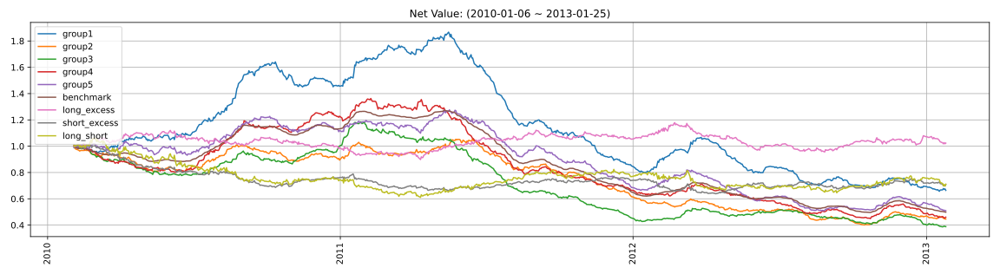

|               |   ann_ret |   max_dd |   ann_sharpe |   ann_calmar |   win_rate |   avg_win_ret |   avg_loss_ret |   profit_loss_ratio |   ann_vol |
|:--------------|----------:|---------:|-------------:|-------------:|-----------:|--------------:|---------------:|--------------------:|----------:|
| group5(long)  |   -0.1999 |   0.6019 |      -1.4144 |      -5.2729 |     0.4066 |        0.0083 |        -0.0071 |              1.1681 |    0.1497 |
| group1(short) |   -0.1269 |   0.6480 |      -0.7960 |      -3.1097 |     0.4421 |        0.0083 |        -0.0074 |              1.1124 |    0.1554 |
| benchmark     |   -0.2062 |   0.6101 |      -3.4210 |      -5.3661 |     0.3816 |        0.0034 |        -0.0036 |              0.9534 |    0.0668 |
| long_excess   |    0.0078 |   0.1979 |       0.1250 |       0.6284 |     0.4539 |        0.0075 |        -0.0061 |              1.2270 |    0.1346 |
| short_excess  |   -0.1080 |   0.3674 |      -0.7660 |      -4.6681 |     0.5184 |        0.0062 |        -0.0075 |              0.8218 |    0.1370 |
| long_short    |   -0.1069 |   0.4246 |      -0.3944 |      -3.9957 |     0.4855 |        0.0109 |        -0.0110 |              0.9942 |    0.2233 |

### 因子加权日频收益
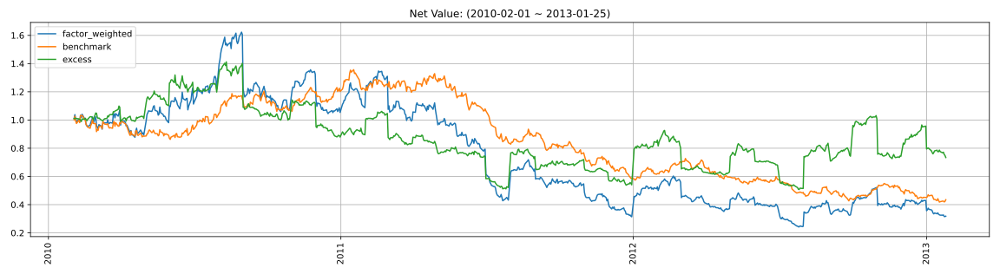

|                 |   ann_ret |   max_dd |   ann_sharpe |   ann_calmar |   win_rate |   avg_win_ret |   avg_loss_ret |   profit_loss_ratio |   ann_vol |
|:----------------|----------:|---------:|-------------:|-------------:|-----------:|--------------:|---------------:|--------------------:|----------:|
| factor_weighted |   -0.3092 |   0.8506 |      -0.1705 |      -5.7706 |     0.4852 |        0.0248 |        -0.0244 |              1.0194 |    0.7228 |
| benchmark       |   -0.2362 |   0.6918 |      -0.7668 |      -5.4201 |     0.4724 |        0.0149 |        -0.0151 |              0.9909 |    0.2946 |
| excess          |   -0.0952 |   0.6408 |       0.1540 |      -2.3585 |     0.4942 |        0.0176 |        -0.0164 |              1.0736 |    0.6656 |

### 单因子策略(0.8, 1.0)收益
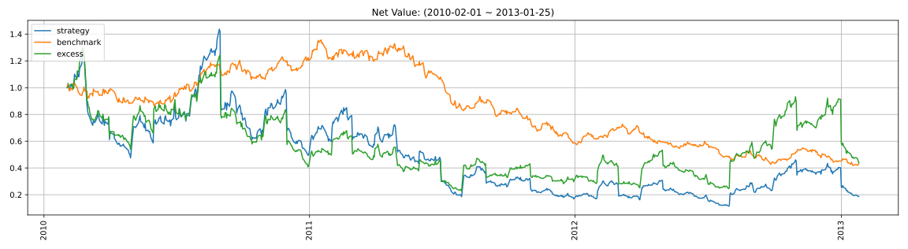

|           |   ann_ret |   max_dd |   ann_sharpe |   ann_calmar |   win_rate |   avg_win_ret |   avg_loss_ret |   profit_loss_ratio |   ann_vol |
|:----------|----------:|---------:|-------------:|-------------:|-----------:|--------------:|---------------:|--------------------:|----------:|
| strategy  |   -0.4185 |   0.9202 |       0.0808 |      -7.2189 |     0.4827 |        0.0405 |        -0.0371 |              1.0929 |    1.1740 |
| benchmark |   -0.2362 |   0.6918 |      -0.7668 |      -5.4201 |     0.4724 |        0.0149 |        -0.0151 |              0.9909 |    0.2946 |
| excess    |   -0.2333 |   0.8243 |       0.2817 |      -4.4925 |     0.4929 |        0.0357 |        -0.0322 |              1.1089 |    1.1392 |

## 换手率分析
### 分层换手率
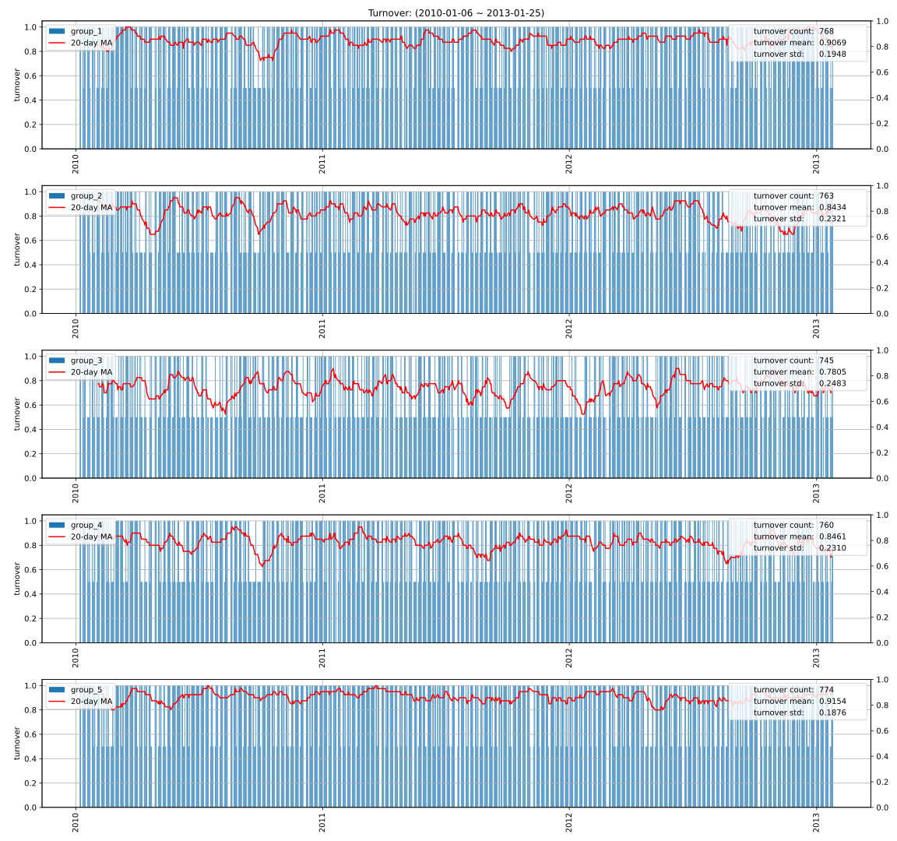

|         |   turnover_count |   turnover_mean |   turnover_std |
|:--------|-----------------:|----------------:|---------------:|
| group_1 |         768.0000 |          0.9069 |         0.1948 |
| group_2 |         763.0000 |          0.8434 |         0.2321 |
| group_3 |         745.0000 |          0.7805 |         0.2483 |
| group_4 |         760.0000 |          0.8461 |         0.2310 |
| group_5 |         774.0000 |          0.9154 |         0.1876 |

### 因子加权持仓换手率
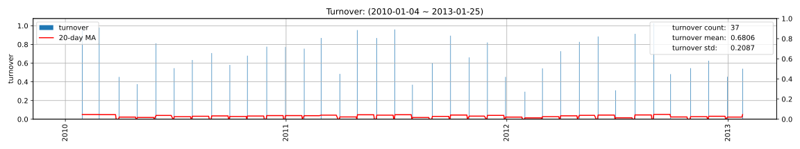

|                 |   turnover_count |   turnover_mean |   turnover_std |
|:----------------|-----------------:|----------------:|---------------:|
| factor_weighted |          37.0000 |          0.6806 |         0.2087 |

### 单因子策略(0.8, 1.0)换手率
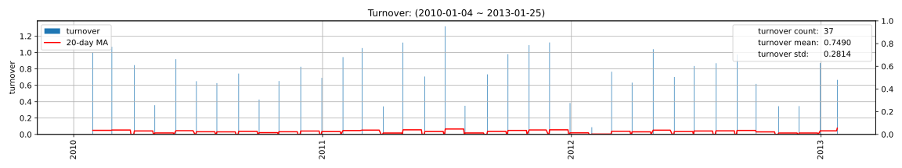

|          |   turnover_count |   turnover_mean |   turnover_std |
|:---------|-----------------:|----------------:|---------------:|
| strategy |          37.0000 |          0.7490 |         0.2814 |

