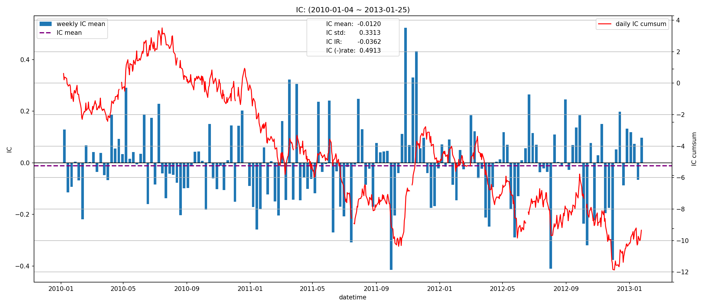
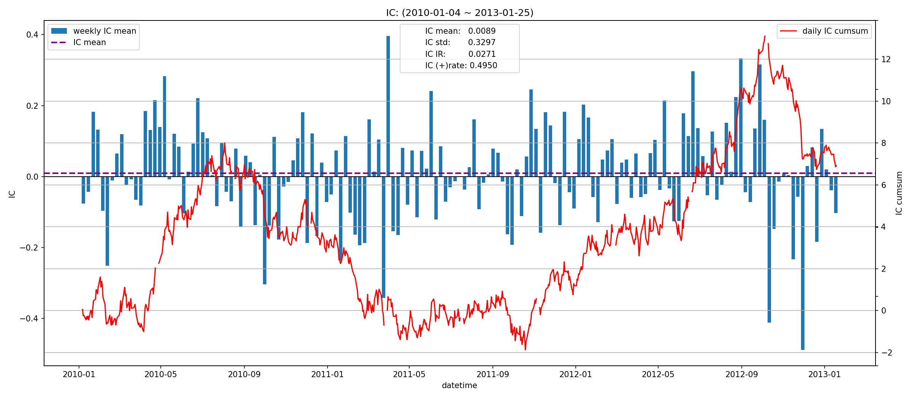
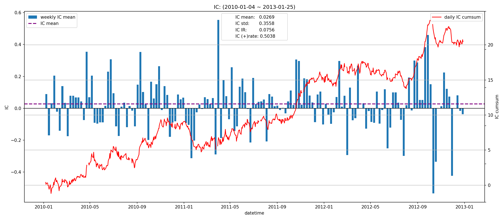
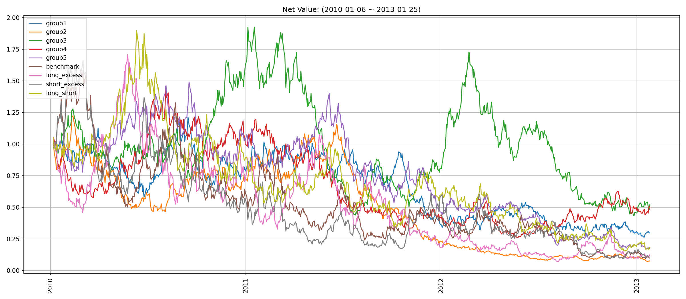
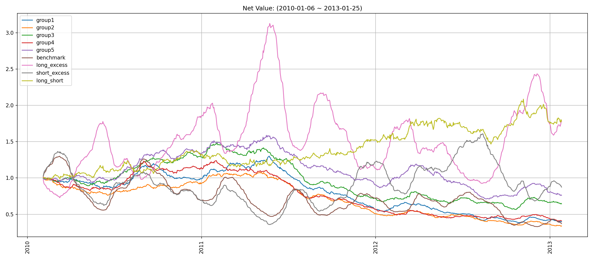
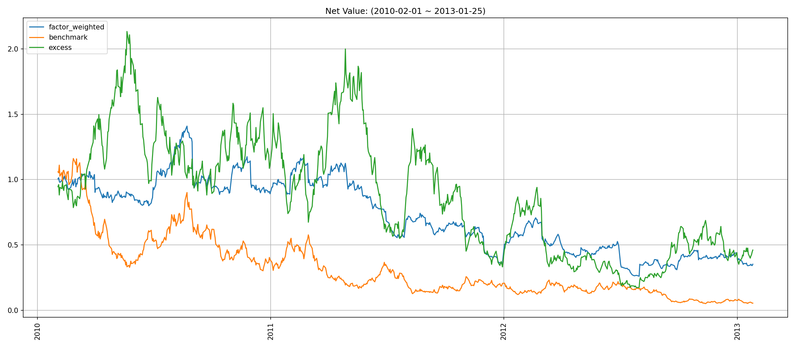
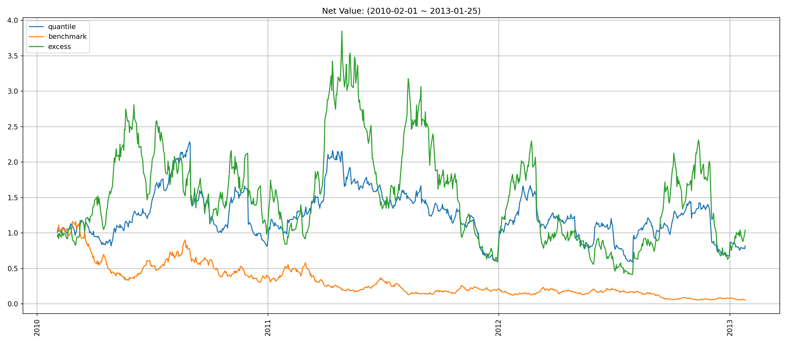
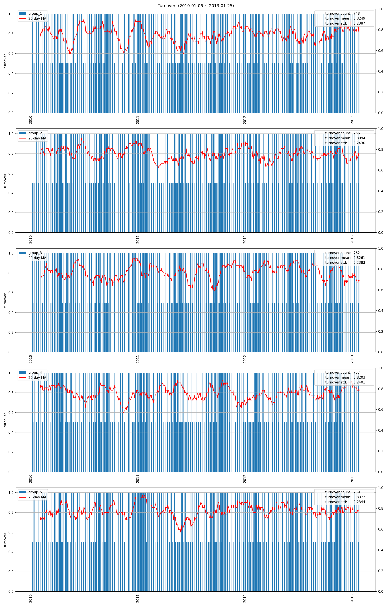
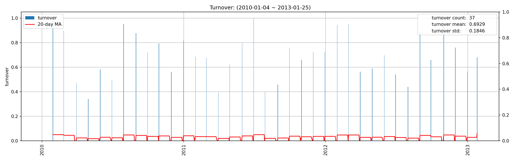
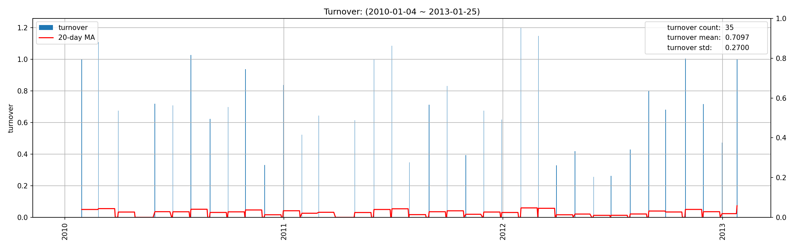

# factor2_factor4_factor3 因子报告
## IC分析
### 1D

|         |   total |    2010 |    2011 |    2012 |   2013 |
|:--------|--------:|--------:|--------:|--------:|-------:|
| IC_mean | -0.0120 | -0.0004 | -0.0190 | -0.0208 | 0.0496 |
| IC_std  |  0.3313 |  0.3311 |  0.3305 |  0.3340 | 0.3218 |
| IC_IR   | -0.0362 | -0.0013 | -0.0575 | -0.0622 | 0.1541 |

### 5D

|         |   total |   2010 |    2011 |   2012 |    2013 |
|:--------|--------:|-------:|--------:|-------:|--------:|
| IC_mean |  0.0089 | 0.0133 | -0.0085 | 0.0249 | -0.0440 |
| IC_std  |  0.3297 | 0.3360 |  0.3223 | 0.3379 |  0.1633 |
| IC_IR   |  0.0271 | 0.0396 | -0.0265 | 0.0738 | -0.2696 |

### 20D

|         |   total |   2010 |   2011 |   2012 |   2013 |
|:--------|--------:|-------:|-------:|-------:|-------:|
| IC_mean |  0.0269 | 0.0360 | 0.0244 | 0.0204 |    nan |
| IC_std  |  0.3558 | 0.3724 | 0.3436 | 0.3522 |    nan |
| IC_IR   |  0.0756 | 0.0965 | 0.0711 | 0.0580 |    nan |

## 收益分析
### 分层收益
### 1D
|               |   annual_return |   max_drawdown |   annual_sharpe |   annual_calmar |   win_rate |   avg_win_return |   avg_loss_return |   profit_loss_ratio |   annual_volatility |   annual_downside_deviation |   annual_sortino |
|:--------------|----------------:|---------------:|----------------:|----------------:|-----------:|-----------------:|------------------:|--------------------:|--------------------:|----------------------------:|-----------------:|
| group5(long)  |         -0.4230 |         0.8865 |         -0.5224 |         -7.5750 |     0.4865 |           0.0332 |           -0.0341 |              0.9744 |              0.6482 |                      0.3815 |          -0.8876 |
| group1(short) |         -0.3242 |         0.7826 |         -0.2983 |         -6.5760 |     0.4994 |           0.0320 |           -0.0335 |              0.9575 |              0.6353 |                      0.3662 |          -0.5176 |
| benchmark     |         -0.5271 |         0.9418 |         -0.3478 |         -8.8851 |     0.4840 |           0.0507 |           -0.0501 |              1.0137 |              0.9239 |                      0.4499 |          -0.7141 |
| long_excess   |         -0.4913 |         0.9585 |         -0.0151 |         -8.1375 |     0.5032 |           0.0592 |           -0.0601 |              0.9850 |              1.1440 |                      0.6514 |          -0.0265 |
| short_excess  |         -0.5159 |         0.9436 |         -0.1212 |         -8.6795 |     0.4904 |           0.0567 |           -0.0556 |              1.0201 |              1.0878 |                      0.6103 |          -0.2159 |
| long_short    |         -0.4248 |         0.9190 |         -0.1663 |         -7.3388 |     0.5096 |           0.0442 |           -0.0471 |              0.9376 |              0.8963 |                      0.5411 |          -0.2755 |

### 5D
|               |   annual_return |   max_drawdown |   annual_sharpe |   annual_calmar |   win_rate |   avg_win_return |   avg_loss_return |   profit_loss_ratio |   annual_volatility |   annual_downside_deviation |   annual_sortino |
|:--------------|----------------:|---------------:|----------------:|----------------:|-----------:|-----------------:|------------------:|--------------------:|--------------------:|----------------------------:|-----------------:|
| group5(long)  |         -0.1245 |         0.6015 |         -0.3189 |         -3.2860 |     0.4800 |           0.0147 |           -0.0143 |              1.0302 |              0.2876 |                      0.1622 |          -0.5654 |
| group1(short) |         -0.1745 |         0.6567 |         -0.5225 |         -4.2173 |     0.4723 |           0.0145 |           -0.0141 |              1.0280 |              0.2878 |                      0.1639 |          -0.9174 |
| benchmark     |         -0.3411 |         0.8525 |         -0.6916 |         -6.3521 |     0.4568 |           0.0239 |           -0.0224 |              1.0674 |              0.4546 |                      0.2310 |          -1.3611 |
| long_excess   |          0.0766 |         0.7527 |          0.4091 |          1.6148 |     0.5058 |           0.0281 |           -0.0270 |              1.0418 |              0.5442 |                      0.3513 |           0.6338 |
| short_excess  |         -0.2612 |         0.8283 |         -0.3104 |         -5.0058 |     0.4735 |           0.0273 |           -0.0258 |              1.0585 |              0.5283 |                      0.2838 |          -0.5778 |
| long_short    |         -0.0215 |         0.4661 |          0.1463 |         -0.7333 |     0.5084 |           0.0198 |           -0.0200 |              0.9899 |              0.4011 |                      0.2504 |           0.2342 |

### 20D
|               |   annual_return |   max_drawdown |   annual_sharpe |   annual_calmar |   win_rate |   avg_win_return |   avg_loss_return |   profit_loss_ratio |   annual_volatility |   annual_downside_deviation |   annual_sortino |
|:--------------|----------------:|---------------:|----------------:|----------------:|-----------:|-----------------:|------------------:|--------------------:|--------------------:|----------------------------:|-----------------:|
| group5(long)  |         -0.0868 |         0.5523 |         -0.5109 |         -2.4961 |     0.4408 |           0.0084 |           -0.0072 |              1.1696 |              0.1545 |                      0.0797 |          -0.9904 |
| group1(short) |         -0.2641 |         0.7056 |         -1.9521 |         -5.9405 |     0.4105 |           0.0081 |           -0.0076 |              1.0629 |              0.1511 |                      0.0724 |          -4.0765 |
| benchmark     |         -0.2803 |         0.7467 |         -1.4103 |         -5.9582 |     0.4211 |           0.0121 |           -0.0109 |              1.1111 |              0.2165 |                      0.1049 |          -2.9108 |
| long_excess   |          0.2110 |         0.7043 |          0.8573 |          4.7555 |     0.5553 |           0.0129 |           -0.0140 |              0.9163 |              0.2641 |                      0.1655 |           1.3676 |
| short_excess  |         -0.0438 |         0.7381 |         -0.0391 |         -0.9416 |     0.4671 |           0.0141 |           -0.0124 |              1.1338 |              0.2630 |                      0.1491 |          -0.0689 |
| long_short    |          0.2116 |         0.1953 |          0.9841 |         17.1998 |     0.5092 |           0.0116 |           -0.0103 |              1.1280 |              0.2196 |                      0.1331 |           1.6240 |

### 因子加权日频收益
|                 |   annual_return |   max_drawdown |   annual_sharpe |   annual_calmar |   win_rate |   avg_win_return |   avg_loss_return |   profit_loss_ratio |   annual_volatility |   annual_downside_deviation |   annual_sortino |
|:----------------|----------------:|---------------:|----------------:|----------------:|-----------:|-----------------:|------------------:|--------------------:|--------------------:|----------------------------:|-----------------:|
| factor_weighted |         -0.2854 |         0.8146 |         -0.2186 |         -5.5626 |     0.4904 |           0.0236 |           -0.0238 |              0.9919 |              0.6348 |                      0.4625 |          -0.3000 |
| benchmark       |         -0.6072 |         0.9552 |         -0.5418 |        -10.0918 |     0.4775 |           0.0510 |           -0.0504 |              1.0112 |              0.9278 |                      0.4492 |          -1.1192 |
| excess          |         -0.2212 |         0.9181 |          0.3272 |         -3.8250 |     0.5225 |           0.0552 |           -0.0574 |              0.9622 |              1.1118 |                      0.6244 |           0.5825 |

### 分位数(0.8, 1.0)收益
|           |   annual_return |   max_drawdown |   annual_sharpe |   annual_calmar |   win_rate |   avg_win_return |   avg_loss_return |   profit_loss_ratio |   annual_volatility |   annual_downside_deviation |   annual_sortino |
|:----------|----------------:|---------------:|----------------:|----------------:|-----------:|-----------------:|------------------:|--------------------:|--------------------:|----------------------------:|-----------------:|
| quantile  |         -0.0627 |         0.7417 |          0.3651 |         -1.3429 |     0.5006 |           0.0353 |           -0.0327 |              1.0792 |              0.9240 |                      0.6133 |           0.5501 |
| benchmark |         -0.6072 |         0.9552 |         -0.5418 |        -10.0918 |     0.4775 |           0.0510 |           -0.0504 |              1.0112 |              0.9278 |                      0.4492 |          -1.1192 |
| excess    |          0.0127 |         0.8933 |          0.6449 |          0.2264 |     0.5186 |           0.0629 |           -0.0608 |              1.0340 |              1.3033 |                      0.7509 |           1.1193 |

## 换手率分析
### 分层换手率

|         |   turnover_count |   turnover_mean |   turnover_std |
|:--------|-----------------:|----------------:|---------------:|
| group_1 |         748.0000 |          0.8249 |         0.2387 |
| group_2 |         766.0000 |          0.8094 |         0.2430 |
| group_3 |         762.0000 |          0.8261 |         0.2383 |
| group_4 |         757.0000 |          0.8203 |         0.2401 |
| group_5 |         759.0000 |          0.8373 |         0.2344 |

### 因子加权持仓换手率

|    |   turnover_count |   turnover_mean |   turnover_std |
|---:|-----------------:|----------------:|---------------:|
|  0 |          37.0000 |          0.6929 |         0.1846 |

### 分位数(0.8, 1.0)换手率

|    |   turnover_count |   turnover_mean |   turnover_std |
|---:|-----------------:|----------------:|---------------:|
|  0 |          35.0000 |          0.7097 |         0.2700 |

