# factor3 因子报告
## IC分析
### 1D
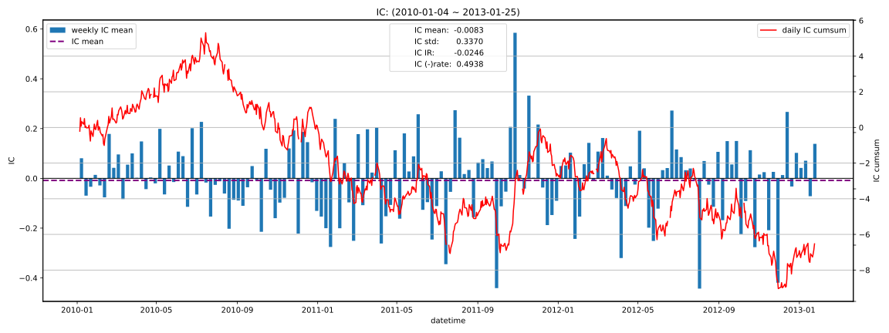

|         |   total |   2010 |    2011 |    2012 |   2013 |
|:--------|--------:|-------:|--------:|--------:|-------:|
| IC_mean | -0.0083 | 0.0004 | -0.0105 | -0.0175 | 0.0315 |
| IC_std  |  0.3370 | 0.3348 |  0.3354 |  0.3423 | 0.3342 |
| IC_IR   | -0.0246 | 0.0013 | -0.0313 | -0.0511 | 0.0944 |

### 5D
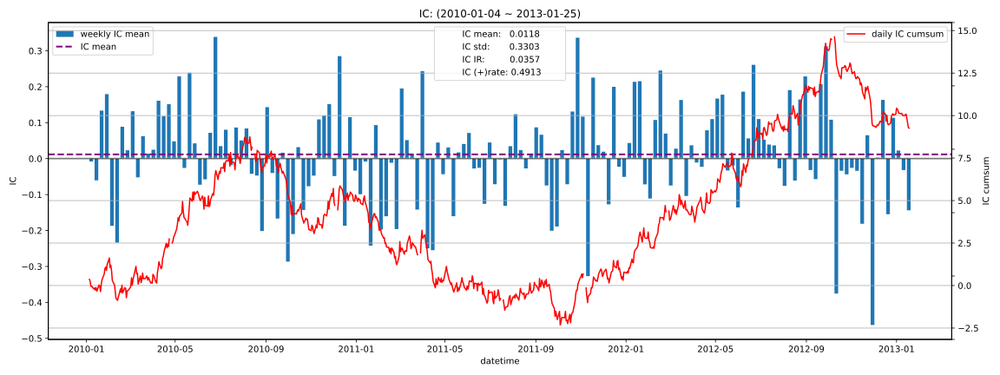

|         |   total |   2010 |    2011 |   2012 |    2013 |
|:--------|--------:|-------:|--------:|-------:|--------:|
| IC_mean |  0.0118 | 0.0208 | -0.0177 | 0.0360 | -0.0587 |
| IC_std  |  0.3303 | 0.3497 |  0.3224 | 0.3238 |  0.1614 |
| IC_IR   |  0.0357 | 0.0596 | -0.0549 | 0.1113 | -0.3636 |

### 10D
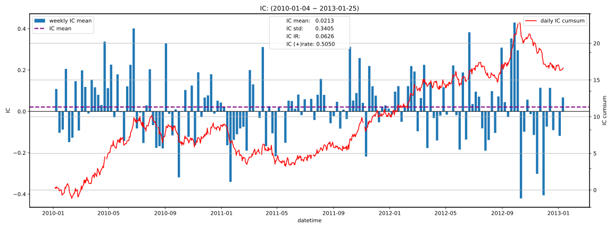

|         |   total |   2010 |   2011 |   2012 |    2013 |
|:--------|--------:|-------:|-------:|-------:|--------:|
| IC_mean |  0.0213 | 0.0347 | 0.0062 | 0.0255 | -0.0481 |
| IC_std  |  0.3405 | 0.3582 | 0.3251 | 0.3428 |  0.1583 |
| IC_IR   |  0.0626 | 0.0969 | 0.0192 | 0.0744 | -0.3040 |

### 20D
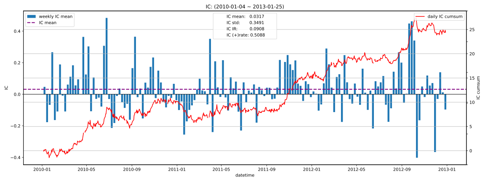

|         |   total |   2010 |   2011 |   2012 |   2013 |
|:--------|--------:|-------:|-------:|-------:|-------:|
| IC_mean |  0.0317 | 0.0397 | 0.0206 | 0.0348 |    nan |
| IC_std  |  0.3491 | 0.3716 | 0.3389 | 0.3369 |    nan |
| IC_IR   |  0.0908 | 0.1069 | 0.0608 | 0.1034 |    nan |

## 收益分析
### 分层收益
### 1D
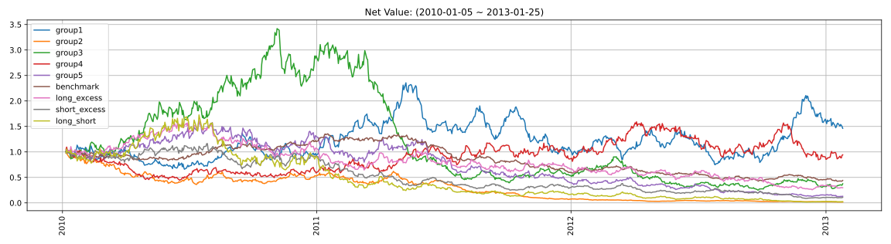

|               |   ann_ret |   max_dd |   ann_sharpe |   ann_calmar |   win_rate |   avg_win_ret |   avg_loss_ret |   profit_loss_ratio |   ann_vol |
|:--------------|----------:|---------:|-------------:|-------------:|-----------:|--------------:|---------------:|--------------------:|----------:|
| group5(long)  |   -0.4789 |   0.9228 |      -0.6911 |      -8.2377 |     0.4689 |        0.0336 |        -0.0330 |              1.0186 |    0.6426 |
| group1(short) |    0.1292 |   0.6821 |       0.5083 |       3.0065 |     0.5095 |        0.0334 |        -0.0320 |              1.0410 |    0.6340 |
| benchmark     |   -0.2306 |   0.6877 |      -0.7398 |      -5.3219 |     0.4740 |        0.0150 |        -0.0151 |              0.9887 |    0.2952 |
| long_excess   |   -0.3212 |   0.8398 |      -0.3975 |      -6.0725 |     0.4842 |        0.0287 |        -0.0287 |              1.0009 |    0.5678 |
| short_excess  |   -0.5073 |   0.9243 |      -0.9399 |      -8.7121 |     0.4778 |        0.0283 |        -0.0300 |              0.9430 |    0.5753 |
| long_short    |   -0.6987 |   0.9897 |      -0.8287 |     -11.2070 |     0.4791 |        0.0458 |        -0.0480 |              0.9550 |    0.9248 |

### 5D
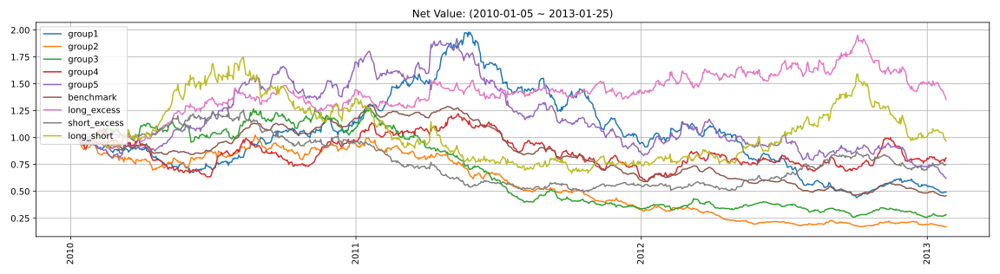

|               |   ann_ret |   max_dd |   ann_sharpe |   ann_calmar |   win_rate |   avg_win_ret |   avg_loss_ret |   profit_loss_ratio |   ann_vol |
|:--------------|----------:|---------:|-------------:|-------------:|-----------:|--------------:|---------------:|--------------------:|----------:|
| group5(long)  |   -0.1417 |   0.6767 |      -0.3930 |      -3.3238 |     0.4637 |        0.0150 |        -0.0138 |              1.0869 |    0.2854 |
| group1(short) |   -0.2034 |   0.7770 |      -0.6259 |      -4.1557 |     0.4777 |        0.0148 |        -0.0149 |              0.9908 |    0.2942 |
| benchmark     |   -0.2209 |   0.6523 |      -1.8139 |      -5.3764 |     0.4637 |        0.0063 |        -0.0072 |              0.8718 |    0.1327 |
| long_excess   |    0.1025 |   0.3058 |       0.5161 |       5.3233 |     0.4841 |        0.0132 |        -0.0114 |              1.1579 |    0.2491 |
| short_excess  |   -0.0874 |   0.6060 |      -0.2141 |      -2.2907 |     0.4968 |        0.0131 |        -0.0134 |              0.9790 |    0.2641 |
| long_short    |   -0.0104 |   0.6183 |       0.1772 |      -0.2664 |     0.4981 |        0.0207 |        -0.0199 |              1.0364 |    0.4062 |

### 10D
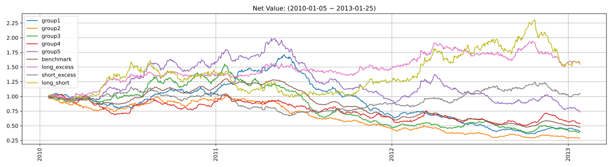

|               |   ann_ret |   max_dd |   ann_sharpe |   ann_calmar |   win_rate |   avg_win_ret |   avg_loss_ret |   profit_loss_ratio |   ann_vol |
|:--------------|----------:|---------:|-------------:|-------------:|-----------:|--------------:|---------------:|--------------------:|----------:|
| group5(long)  |   -0.0950 |   0.6308 |      -0.3790 |      -2.3920 |     0.4577 |        0.0110 |        -0.0098 |              1.1157 |    0.2071 |
| group1(short) |   -0.2532 |   0.7866 |      -1.3064 |      -5.1108 |     0.4615 |        0.0103 |        -0.0108 |              0.9513 |    0.2070 |
| benchmark     |   -0.2138 |   0.6344 |      -2.5298 |      -5.3495 |     0.4154 |        0.0048 |        -0.0050 |              0.9563 |    0.0933 |
| long_excess   |    0.1516 |   0.2233 |       0.8689 |      10.7780 |     0.5064 |        0.0095 |        -0.0085 |              1.1200 |    0.1813 |
| short_excess  |    0.0170 |   0.4232 |       0.1837 |       0.6381 |     0.5269 |        0.0091 |        -0.0099 |              0.9241 |    0.1872 |
| long_short    |    0.1596 |   0.3888 |       0.6477 |       6.5174 |     0.5321 |        0.0147 |        -0.0151 |              0.9745 |    0.2964 |

### 20D
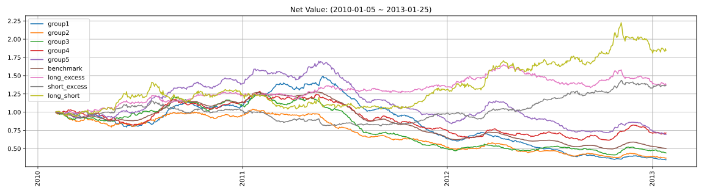

|               |   ann_ret |   max_dd |   ann_sharpe |   ann_calmar |   win_rate |   avg_win_ret |   avg_loss_ret |   profit_loss_ratio |   ann_vol |
|:--------------|----------:|---------:|-------------:|-------------:|-----------:|--------------:|---------------:|--------------------:|----------:|
| group5(long)  |   -0.1131 |   0.5919 |      -0.7329 |      -3.0326 |     0.4377 |        0.0080 |        -0.0070 |              1.1433 |    0.1487 |
| group1(short) |   -0.2924 |   0.7678 |      -2.1901 |      -6.0463 |     0.3844 |        0.0085 |        -0.0074 |              1.1377 |    0.1526 |
| benchmark     |   -0.2019 |   0.6130 |      -3.3374 |      -5.2276 |     0.3831 |        0.0034 |        -0.0035 |              0.9591 |    0.0669 |
| long_excess   |    0.1114 |   0.1913 |       0.8727 |       9.2457 |     0.5013 |        0.0069 |        -0.0061 |              1.1441 |    0.1308 |
| short_excess  |    0.1070 |   0.2983 |       0.8132 |       5.6920 |     0.5688 |        0.0063 |        -0.0074 |              0.8633 |    0.1365 |
| long_short    |    0.2227 |   0.2617 |       1.0265 |      13.5076 |     0.5247 |        0.0111 |        -0.0104 |              1.0693 |    0.2193 |

### 因子加权日频收益
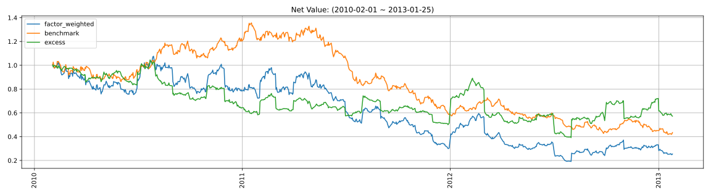

|                 |   ann_ret |   max_dd |   ann_sharpe |   ann_calmar |   win_rate |   avg_win_ret |   avg_loss_ret |   profit_loss_ratio |   ann_vol |
|:----------------|----------:|---------:|-------------:|-------------:|-----------:|--------------:|---------------:|--------------------:|----------:|
| factor_weighted |   -0.3576 |   0.8221 |      -0.4124 |      -6.9058 |     0.4814 |        0.0225 |        -0.0229 |              0.9851 |    0.6200 |
| benchmark       |   -0.2362 |   0.6918 |      -0.7668 |      -5.4201 |     0.4724 |        0.0149 |        -0.0151 |              0.9909 |    0.2946 |
| excess          |   -0.1651 |   0.6250 |      -0.0534 |      -4.1934 |     0.4698 |        0.0159 |        -0.0143 |              1.1106 |    0.5635 |

### 单因子策略(0.8, 1.0)收益
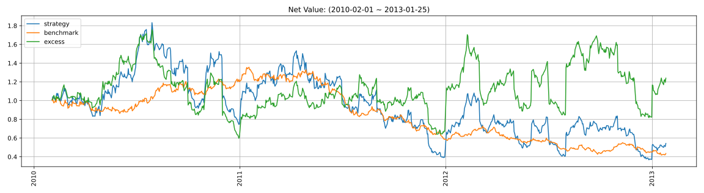

|           |   ann_ret |   max_dd |   ann_sharpe |   ann_calmar |   win_rate |   avg_win_ret |   avg_loss_ret |   profit_loss_ratio |   ann_vol |
|:----------|----------:|---------:|-------------:|-------------:|-----------:|--------------:|---------------:|--------------------:|----------:|
| strategy  |   -0.1794 |   0.7994 |       0.2259 |      -3.5633 |     0.4814 |        0.0365 |        -0.0323 |              1.1320 |    0.9459 |
| benchmark |   -0.2362 |   0.6918 |      -0.7668 |      -5.4201 |     0.4724 |        0.0149 |        -0.0151 |              0.9909 |    0.2946 |
| excess    |    0.0720 |   0.6597 |       0.4856 |       1.7321 |     0.5071 |        0.0309 |        -0.0282 |              1.0941 |    0.9058 |

## 换手率分析
### 分层换手率
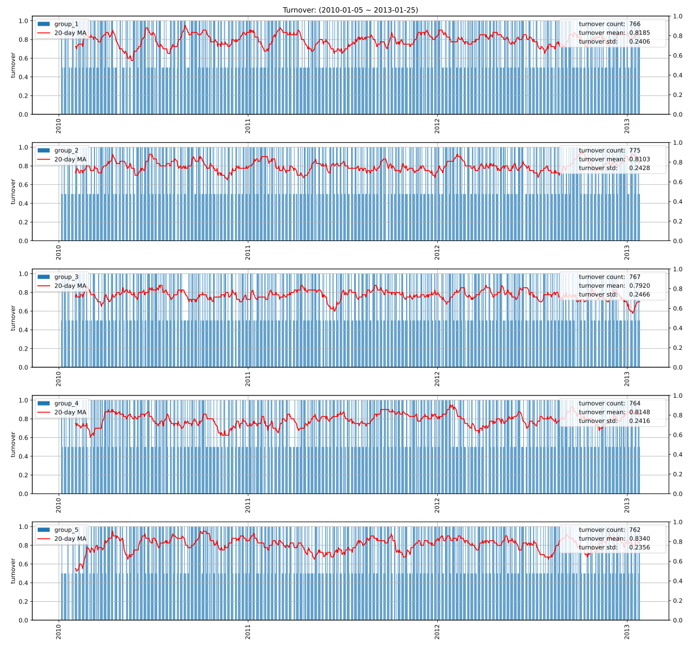

|         |   turnover_count |   turnover_mean |   turnover_std |
|:--------|-----------------:|----------------:|---------------:|
| group_1 |         766.0000 |          0.8185 |         0.2406 |
| group_2 |         775.0000 |          0.8103 |         0.2428 |
| group_3 |         767.0000 |          0.7920 |         0.2466 |
| group_4 |         764.0000 |          0.8148 |         0.2416 |
| group_5 |         762.0000 |          0.8340 |         0.2356 |

### 因子加权持仓换手率
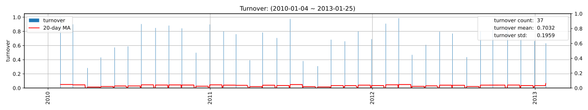

|                 |   turnover_count |   turnover_mean |   turnover_std |
|:----------------|-----------------:|----------------:|---------------:|
| factor_weighted |          37.0000 |          0.7032 |         0.1959 |

### 单因子策略(0.8, 1.0)换手率
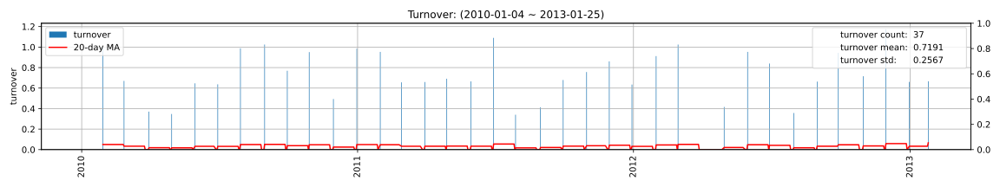

|          |   turnover_count |   turnover_mean |   turnover_std |
|:---------|-----------------:|----------------:|---------------:|
| strategy |          37.0000 |          0.7191 |         0.2567 |

