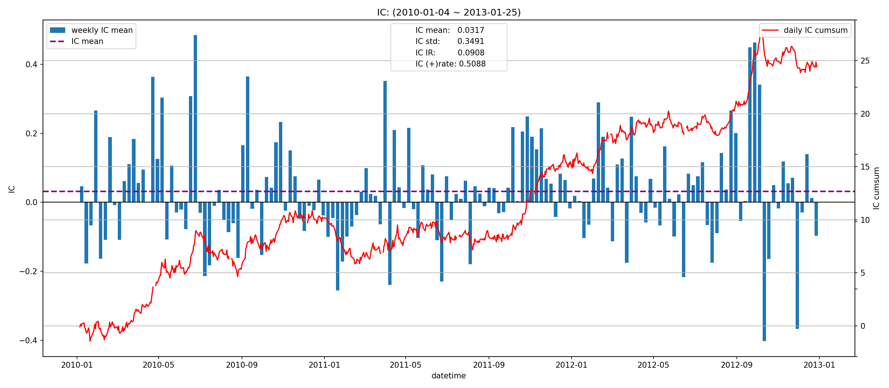
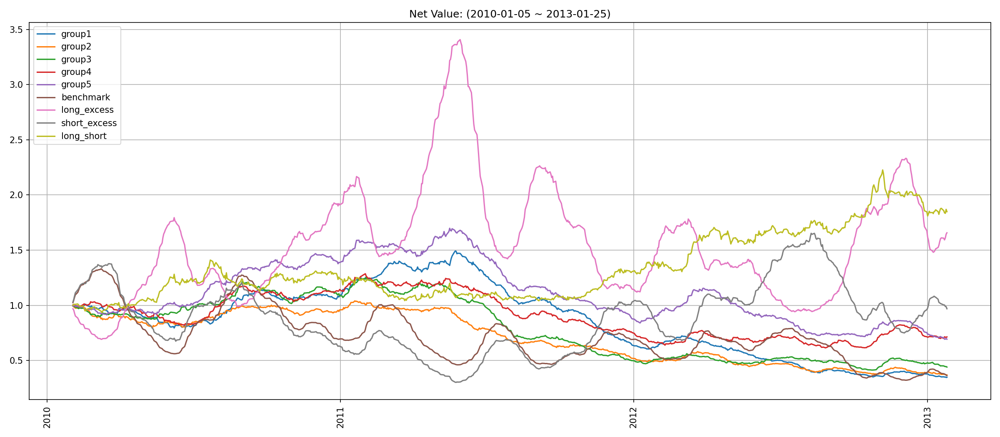

# factor3 因子报告
## IC分析
### 1D

|         |   total |   2010 |    2011 |    2012 |   2013 |
|:--------|--------:|-------:|--------:|--------:|-------:|
| IC_mean | -0.0083 | 0.0004 | -0.0105 | -0.0175 | 0.0315 |
| IC_std  |  0.3370 | 0.3348 |  0.3354 |  0.3423 | 0.3342 |
| IC_IR   | -0.0246 | 0.0013 | -0.0313 | -0.0511 | 0.0944 |

### 5D

|         |   total |   2010 |    2011 |   2012 |    2013 |
|:--------|--------:|-------:|--------:|-------:|--------:|
| IC_mean |  0.0118 | 0.0208 | -0.0177 | 0.0360 | -0.0587 |
| IC_std  |  0.3303 | 0.3497 |  0.3224 | 0.3238 |  0.1614 |
| IC_IR   |  0.0357 | 0.0596 | -0.0549 | 0.1113 | -0.3636 |

### 20D

|         |   total |   2010 |   2011 |   2012 |   2013 |
|:--------|--------:|-------:|-------:|-------:|-------:|
| IC_mean |  0.0317 | 0.0397 | 0.0206 | 0.0348 |    nan |
| IC_std  |  0.3491 | 0.3716 | 0.3389 | 0.3369 |    nan |
| IC_IR   |  0.0908 | 0.1069 | 0.0608 | 0.1034 |    nan |

## 收益分析
### 分层收益
### 1D
|               |   annual_return |   max_drawdown |   annual_sharpe |   annual_calmar |   win_rate |   avg_win_return |   avg_loss_return |   profit_loss_ratio |   annual_volatility |   annual_downside_deviation |   annual_sortino |
|:--------------|----------------:|---------------:|----------------:|----------------:|-----------:|-----------------:|------------------:|--------------------:|--------------------:|----------------------------:|-----------------:|
| group5(long)  |         -0.4789 |         0.9228 |         -0.6911 |         -8.2377 |     0.4689 |           0.0336 |           -0.0330 |              1.0186 |              0.6426 |                      0.3766 |          -1.1792 |
| group1(short) |          0.1292 |         0.6821 |          0.5083 |          3.0065 |     0.5095 |           0.0334 |           -0.0320 |              1.0410 |              0.6340 |                      0.3591 |           0.8976 |
| benchmark     |         -0.5504 |         0.9527 |         -0.3966 |         -9.1704 |     0.4842 |           0.0508 |           -0.0505 |              1.0057 |              0.9278 |                      0.4513 |          -0.8152 |
| long_excess   |         -0.5173 |         0.9627 |         -0.0669 |         -8.5290 |     0.5070 |           0.0576 |           -0.0598 |              0.9625 |              1.1377 |                      0.6667 |          -0.1142 |
| short_excess  |         -0.7276 |         0.9925 |         -0.6285 |        -11.6371 |     0.4892 |           0.0550 |           -0.0581 |              0.9476 |              1.0981 |                      0.6378 |          -1.0822 |
| long_short    |         -0.6987 |         0.9897 |         -0.8287 |        -11.2070 |     0.4791 |           0.0458 |           -0.0480 |              0.9550 |              0.9248 |                      0.5673 |          -1.3509 |

### 5D
|               |   annual_return |   max_drawdown |   annual_sharpe |   annual_calmar |   win_rate |   avg_win_return |   avg_loss_return |   profit_loss_ratio |   annual_volatility |   annual_downside_deviation |   annual_sortino |
|:--------------|----------------:|---------------:|----------------:|----------------:|-----------:|-----------------:|------------------:|--------------------:|--------------------:|----------------------------:|-----------------:|
| group5(long)  |         -0.1417 |         0.6767 |         -0.3930 |         -3.3238 |     0.4637 |           0.0150 |           -0.0138 |              1.0869 |              0.2854 |                      0.1572 |          -0.7136 |
| group1(short) |         -0.2034 |         0.7770 |         -0.6259 |         -4.1557 |     0.4777 |           0.0148 |           -0.0149 |              0.9908 |              0.2942 |                      0.1673 |          -1.1009 |
| benchmark     |         -0.3299 |         0.8480 |         -0.6554 |         -6.1761 |     0.4586 |           0.0239 |           -0.0224 |              1.0655 |              0.4542 |                      0.2304 |          -1.2924 |
| long_excess   |          0.0392 |         0.7806 |          0.3430 |          0.7965 |     0.5057 |           0.0279 |           -0.0270 |              1.0312 |              0.5409 |                      0.3490 |           0.5316 |
| short_excess  |         -0.2245 |         0.8939 |         -0.2133 |         -3.9858 |     0.4650 |           0.0285 |           -0.0256 |              1.1129 |              0.5323 |                      0.2775 |          -0.4092 |
| long_short    |         -0.0104 |         0.6183 |          0.1772 |         -0.2664 |     0.4981 |           0.0207 |           -0.0199 |              1.0364 |              0.4062 |                      0.2450 |           0.2938 |

### 20D
|               |   annual_return |   max_drawdown |   annual_sharpe |   annual_calmar |   win_rate |   avg_win_return |   avg_loss_return |   profit_loss_ratio |   annual_volatility |   annual_downside_deviation |   annual_sortino |
|:--------------|----------------:|---------------:|----------------:|----------------:|-----------:|-----------------:|------------------:|--------------------:|--------------------:|----------------------------:|-----------------:|
| group5(long)  |         -0.1131 |         0.5919 |         -0.7329 |         -3.0326 |     0.4377 |           0.0080 |           -0.0070 |              1.1433 |              0.1487 |                      0.0767 |          -1.4201 |
| group1(short) |         -0.2924 |         0.7678 |         -2.1901 |         -6.0463 |     0.3844 |           0.0085 |           -0.0074 |              1.1377 |              0.1526 |                      0.0749 |          -4.4623 |
| benchmark     |         -0.2827 |         0.7584 |         -1.4230 |         -5.9179 |     0.4182 |           0.0122 |           -0.0109 |              1.1220 |              0.2169 |                      0.1048 |          -2.9464 |
| long_excess   |          0.1798 |         0.7235 |          0.7625 |          3.9449 |     0.5532 |           0.0128 |           -0.0140 |              0.9097 |              0.2619 |                      0.1644 |           1.2148 |
| short_excess  |         -0.0104 |         0.7809 |          0.0949 |         -0.2106 |     0.4481 |           0.0152 |           -0.0122 |              1.2504 |              0.2683 |                      0.1495 |           0.1704 |
| long_short    |          0.2227 |         0.2617 |          1.0265 |         13.5076 |     0.5247 |           0.0111 |           -0.0104 |              1.0693 |              0.2193 |                      0.1396 |           1.6133 |

### 因子加权日频收益
|                 |   annual_return |   max_drawdown |   annual_sharpe |   annual_calmar |   win_rate |   avg_win_return |   avg_loss_return |   profit_loss_ratio |   annual_volatility |   annual_downside_deviation |   annual_sortino |
|:----------------|----------------:|---------------:|----------------:|----------------:|-----------:|-----------------:|------------------:|--------------------:|--------------------:|----------------------------:|-----------------:|
| factor_weighted |         -0.3576 |         0.8221 |         -0.4124 |         -6.9058 |     0.4814 |           0.0225 |           -0.0229 |              0.9851 |              0.6200 |                      0.4372 |          -0.5847 |
| benchmark       |         -0.6072 |         0.9552 |         -0.5418 |        -10.0918 |     0.4775 |           0.0510 |           -0.0504 |              1.0112 |              0.9278 |                      0.4492 |          -1.1192 |
| excess          |         -0.3033 |         0.9389 |          0.2230 |         -5.1284 |     0.5045 |           0.0561 |           -0.0551 |              1.0174 |              1.1061 |                      0.6309 |           0.3911 |

### 分位数(0.8, 1.0)收益
|           |   annual_return |   max_drawdown |   annual_sharpe |   annual_calmar |   win_rate |   avg_win_return |   avg_loss_return |   profit_loss_ratio |   annual_volatility |   annual_downside_deviation |   annual_sortino |
|:----------|----------------:|---------------:|----------------:|----------------:|-----------:|-----------------:|------------------:|--------------------:|--------------------:|----------------------------:|-----------------:|
| quantile  |         -0.1794 |         0.7994 |          0.2259 |         -3.5633 |     0.4814 |           0.0365 |           -0.0323 |              1.1320 |              0.9459 |                      0.5818 |           0.3673 |
| benchmark |         -0.6072 |         0.9552 |         -0.5418 |        -10.0918 |     0.4775 |           0.0510 |           -0.0504 |              1.0112 |              0.9278 |                      0.4492 |          -1.1192 |
| excess    |         -0.1312 |         0.9058 |          0.5372 |         -2.2998 |     0.5148 |           0.0633 |           -0.0613 |              1.0328 |              1.3341 |                      0.7573 |           0.9464 |

## 换手率分析
### 分层换手率

|         |   turnover_count |   turnover_mean |   turnover_std |
|:--------|-----------------:|----------------:|---------------:|
| group_1 |         766.0000 |          0.8185 |         0.2406 |
| group_2 |         775.0000 |          0.8103 |         0.2428 |
| group_3 |         767.0000 |          0.7920 |         0.2466 |
| group_4 |         764.0000 |          0.8148 |         0.2416 |
| group_5 |         762.0000 |          0.8340 |         0.2356 |

### 因子加权持仓换手率

|    |   turnover_count |   turnover_mean |   turnover_std |
|---:|-----------------:|----------------:|---------------:|
|  0 |          37.0000 |          0.6862 |         0.2010 |

### 分位数(0.8, 1.0)换手率

|    |   turnover_count |   turnover_mean |   turnover_std |
|---:|-----------------:|----------------:|---------------:|
|  0 |          36.0000 |          0.7262 |         0.2603 |

