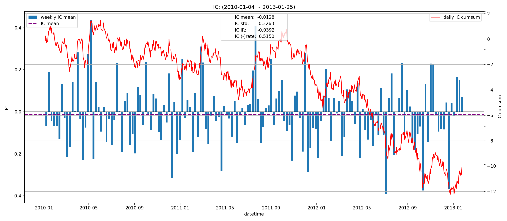
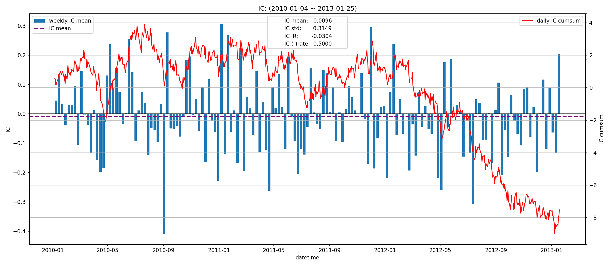
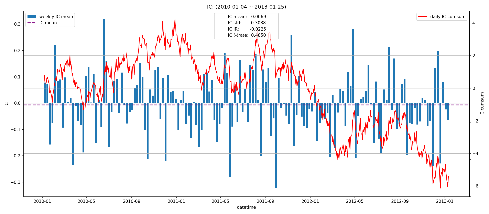
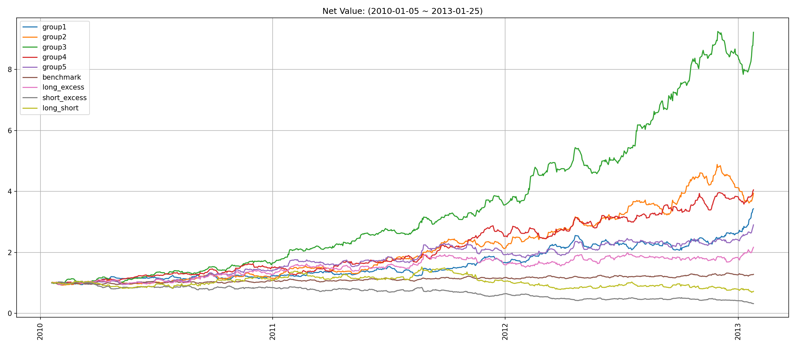
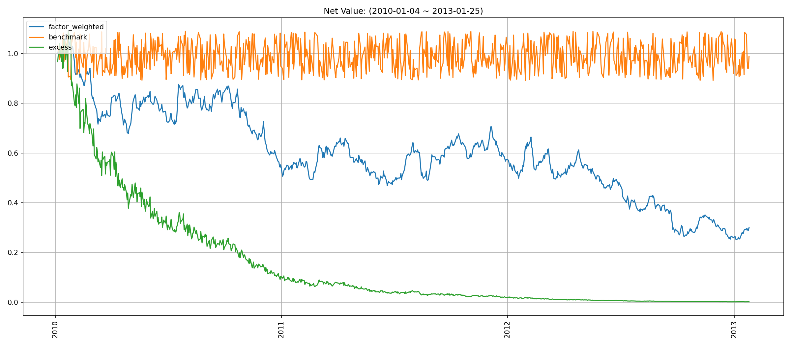
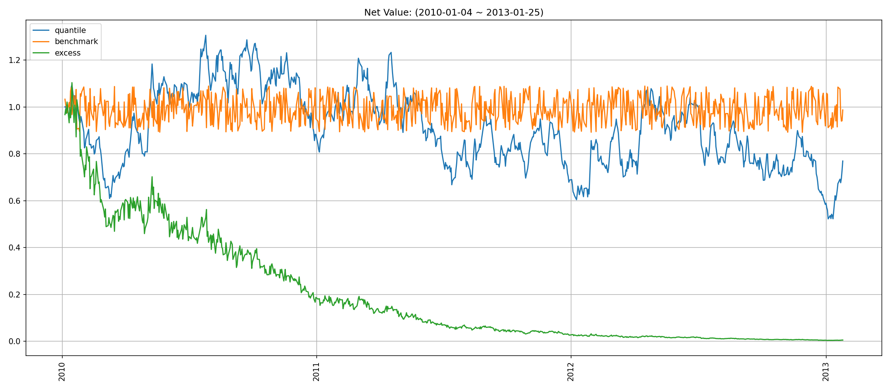
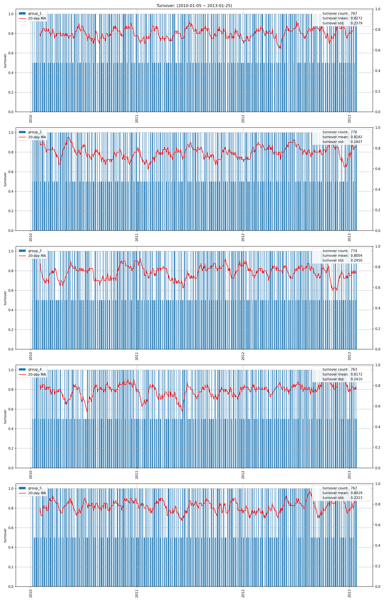
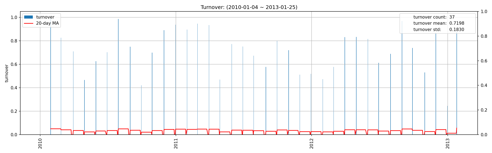
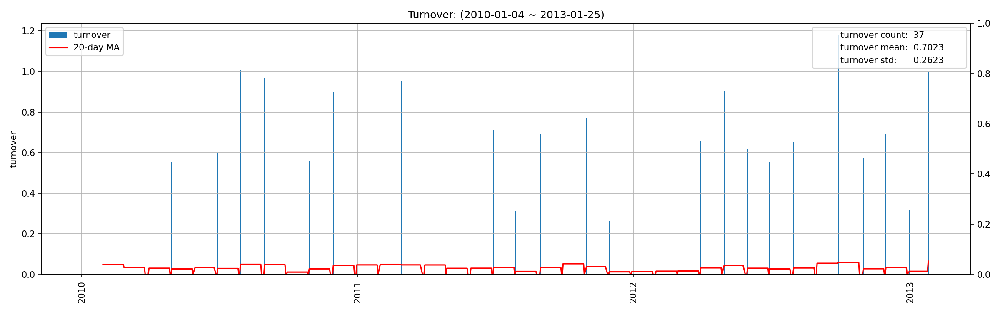

# factor3 factor report
## IC分析
### 1D

|         |   total |    2010 |    2011 |    2012 |   2013 |
|:--------|--------:|--------:|--------:|--------:|-------:|
| IC_mean | -0.0128 | -0.0125 | -0.0014 | -0.0317 | 0.0903 |
| IC_std  |  0.3263 |  0.3100 |  0.3244 |  0.3430 | 0.3336 |
| IC_IR   | -0.0392 | -0.0404 | -0.0042 | -0.0923 | 0.2709 |

### 5D

|         |   total |   2010 |   2011 |    2012 |   2013 |
|:--------|--------:|-------:|-------:|--------:|-------:|
| IC_mean | -0.0096 | 0.0027 | 0.0022 | -0.0344 | 0.0058 |
| IC_std  |  0.3149 | 0.3155 | 0.3278 |  0.2990 | 0.3527 |
| IC_IR   | -0.0304 | 0.0086 | 0.0068 | -0.1149 | 0.0164 |

### 10D

|         |   total |   2010 |    2011 |    2012 |    2013 |
|:--------|--------:|-------:|--------:|--------:|--------:|
| IC_mean | -0.0069 | 0.0129 | -0.0136 | -0.0186 | -0.0464 |
| IC_std  |  0.3088 | 0.3092 |  0.3064 |  0.3099 |  0.3599 |
| IC_IR   | -0.0225 | 0.0417 | -0.0444 | -0.0601 | -0.1288 |

## 收益分析
### 分层收益
### 1D
|               |   annual_return |   max_drawdown |   annual_sharpe |   annual_calmar |   win_rate |   avg_win_return |   avg_loss_return |   profit_loss_ratio |   annual_volatility |   annual_downside_deviation |   annual_sortino |
|:--------------|----------------:|---------------:|----------------:|----------------:|-----------:|-----------------:|------------------:|--------------------:|--------------------:|----------------------------:|-----------------:|
| group5(long)  |          0.1432 |         0.7078 |          0.5898 |          3.2130 |     0.4918 |           0.0436 |           -0.0378 |              1.1524 |              0.9450 |                      0.5095 |           1.0938 |
| group1(short) |          0.5354 |         0.7655 |          0.9058 |         11.1029 |     0.5095 |           0.0449 |           -0.0395 |              1.1388 |              0.9852 |                      0.5879 |           1.5178 |
| benchmark     |          0.0203 |         0.2899 |          0.6604 |          1.1093 |     0.4930 |           0.0708 |           -0.0622 |              1.1392 |              1.2968 |                      0.7104 |           1.2055 |
| long_excess   |         -0.7776 |         0.9956 |         -0.1924 |        -12.3990 |     0.4994 |           0.0752 |           -0.0774 |              0.9718 |              1.5546 |                      0.9175 |          -0.3260 |
| short_excess  |         -0.7547 |         0.9890 |         -0.0224 |        -12.1137 |     0.5120 |           0.0763 |           -0.0804 |              0.9495 |              1.5981 |                      1.1052 |          -0.0324 |
| long_short    |         -0.6943 |         0.9842 |         -0.2572 |        -11.1977 |     0.4981 |           0.0566 |           -0.0588 |              0.9622 |              1.3025 |                      0.8559 |          -0.3914 |

### 5D
|               |   annual_return |   max_drawdown |   annual_sharpe |   annual_calmar |   win_rate |   avg_win_return |   avg_loss_return |   profit_loss_ratio |   annual_volatility |   annual_downside_deviation |   annual_sortino |
|:--------------|----------------:|---------------:|----------------:|----------------:|-----------:|-----------------:|------------------:|--------------------:|--------------------:|----------------------------:|-----------------:|
| group5(long)  |          0.4367 |         0.3334 |          1.1101 |         20.7934 |     0.5108 |           0.0205 |           -0.0178 |              1.1500 |              0.3968 |                      0.2203 |           2.0000 |
| group1(short) |          1.0473 |         0.1682 |          2.0141 |         98.8502 |     0.5490 |           0.0199 |           -0.0173 |              1.1534 |              0.3943 |                      0.2086 |           3.8079 |
| benchmark     |          0.1389 |         0.1264 |          0.6206 |         17.4538 |     0.4879 |           0.0145 |           -0.0125 |              1.1570 |              0.2667 |                      0.1409 |           1.1748 |
| long_excess   |          0.1893 |         0.4375 |          0.6086 |          6.8682 |     0.4981 |           0.0234 |           -0.0211 |              1.1116 |              0.4518 |                      0.2642 |           1.0407 |
| short_excess  |         -0.5226 |         0.9141 |         -1.3490 |         -9.0748 |     0.4866 |           0.0210 |           -0.0248 |              0.8479 |              0.4660 |                      0.3210 |          -1.9583 |
| long_short    |         -0.3905 |         0.8374 |         -0.6660 |         -7.4026 |     0.4777 |           0.0258 |           -0.0263 |              0.9815 |              0.5310 |                      0.3323 |          -1.0642 |

### 10D
|               |   annual_return |   max_drawdown |   annual_sharpe |   annual_calmar |   win_rate |   avg_win_return |   avg_loss_return |   profit_loss_ratio |   annual_volatility |   annual_downside_deviation |   annual_sortino |
|:--------------|----------------:|---------------:|----------------:|----------------:|-----------:|-----------------:|------------------:|--------------------:|--------------------:|----------------------------:|-----------------:|
| group5(long)  |          0.4108 |         0.2063 |          1.6190 |         31.6088 |     0.5115 |           0.0119 |           -0.0095 |              1.2588 |              0.2287 |                      0.1252 |           2.9572 |
| group1(short) |          0.4889 |         0.1980 |          1.8381 |         39.1939 |     0.5256 |           0.0120 |           -0.0098 |              1.2304 |              0.2311 |                      0.1239 |           3.4300 |
| benchmark     |          0.0824 |         0.0940 |          0.6538 |         13.9123 |     0.4987 |           0.0074 |           -0.0066 |              1.1112 |              0.1350 |                      0.0720 |           1.2255 |
| long_excess   |          0.2837 |         0.2153 |          1.1088 |         20.9192 |     0.5103 |           0.0132 |           -0.0115 |              1.1508 |              0.2544 |                      0.1417 |           1.9908 |
| short_excess  |         -0.3088 |         0.6981 |         -1.3237 |         -7.0216 |     0.4821 |           0.0114 |           -0.0132 |              0.8642 |              0.2543 |                      0.1772 |          -1.8996 |
| long_short    |         -0.1003 |         0.5472 |         -0.1704 |         -2.9106 |     0.4949 |           0.0153 |           -0.0154 |              0.9924 |              0.3201 |                      0.2042 |          -0.2670 |

### 因子加权日频收益
|                 |   annual_return |   max_drawdown |   annual_sharpe |   annual_calmar |   win_rate |   avg_win_return |   avg_loss_return |   profit_loss_ratio |   annual_volatility |   annual_downside_deviation |   annual_sortino |
|:----------------|----------------:|---------------:|----------------:|----------------:|-----------:|-----------------:|------------------:|--------------------:|--------------------:|----------------------------:|-----------------:|
| factor_weighted |         -0.1147 |         0.4336 |         -0.0110 |         -4.1999 |     0.4766 |           0.0231 |           -0.0211 |              1.0960 |              0.4860 |                      0.3213 |          -0.0166 |
| benchmark       |         -0.0041 |         0.1815 |          0.6409 |         -0.3591 |     0.4944 |           0.0704 |           -0.0623 |              1.1297 |              1.2946 |                      0.7106 |           1.1677 |
| excess          |         -0.8234 |         0.9961 |         -0.6292 |        -13.1226 |     0.4994 |           0.0645 |           -0.0709 |              0.9089 |              1.3271 |                      0.8037 |          -1.0390 |

### 分位数(0.8, 1.0)收益
|           |   annual_return |   max_drawdown |   annual_sharpe |   annual_calmar |   win_rate |   avg_win_return |   avg_loss_return |   profit_loss_ratio |   annual_volatility |   annual_downside_deviation |   annual_sortino |
|:----------|----------------:|---------------:|----------------:|----------------:|-----------:|-----------------:|------------------:|--------------------:|--------------------:|----------------------------:|-----------------:|
| quantile  |          0.5643 |         0.4370 |          0.9158 |         20.4994 |     0.4766 |           0.0405 |           -0.0301 |              1.3448 |              0.8828 |                      0.4676 |           1.7288 |
| benchmark |         -0.0041 |         0.1815 |          0.6409 |         -0.3591 |     0.4944 |           0.0704 |           -0.0623 |              1.1297 |              1.2946 |                      0.7106 |           1.1677 |
| excess    |         -0.6147 |         0.9620 |         -0.0147 |        -10.1433 |     0.5006 |           0.0666 |           -0.0670 |              0.9951 |              1.3800 |                      0.7644 |          -0.0265 |

## 换手率分析
### 分层换手率

|         |   turnover_count |   turnover_mean |   turnover_std |
|:--------|-----------------:|----------------:|---------------:|
| group_1 |         767.0000 |          0.8272 |         0.2379 |
| group_2 |         770.0000 |          0.8182 |         0.2407 |
| group_3 |         774.0000 |          0.8004 |         0.2450 |
| group_4 |         763.0000 |          0.8172 |         0.2410 |
| group_5 |         767.0000 |          0.8429 |         0.2323 |

### 因子加权持仓换手率

|    |   turnover_count |   turnover_mean |   turnover_std |
|---:|-----------------:|----------------:|---------------:|
|  0 |           3.0000 |          1.3726 |         0.3487 |

### 分位数(0.8, 1.0)换手率

|    |   turnover_count |   turnover_mean |   turnover_std |
|---:|-----------------:|----------------:|---------------:|
|  0 |           3.0000 |          1.2411 |         0.3531 |

