# factor4 因子报告
## IC分析
### 1D
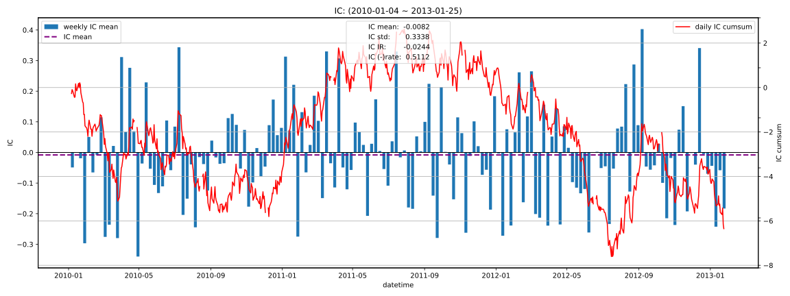

|         |   total |    2010 |   2011 |    2012 |    2013 |
|:--------|--------:|--------:|-------:|--------:|--------:|
| IC_mean | -0.0082 | -0.0151 | 0.0172 | -0.0167 | -0.1479 |
| IC_std  |  0.3338 |  0.3343 | 0.3432 |  0.3251 |  0.2930 |
| IC_IR   | -0.0244 | -0.0452 | 0.0501 | -0.0513 | -0.5049 |

### 5D
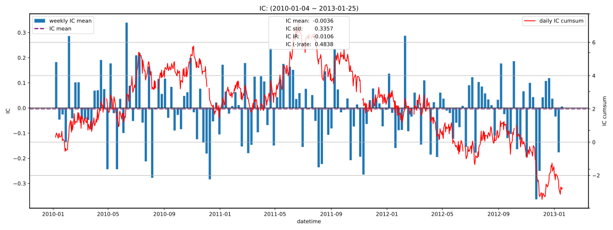

|         |   total |   2010 |   2011 |    2012 |    2013 |
|:--------|--------:|-------:|-------:|--------:|--------:|
| IC_mean | -0.0036 | 0.0072 | 0.0018 | -0.0147 | -0.0924 |
| IC_std  |  0.3357 | 0.3497 | 0.3276 |  0.3335 |  0.2717 |
| IC_IR   | -0.0106 | 0.0206 | 0.0056 | -0.0441 | -0.3402 |

### 10D
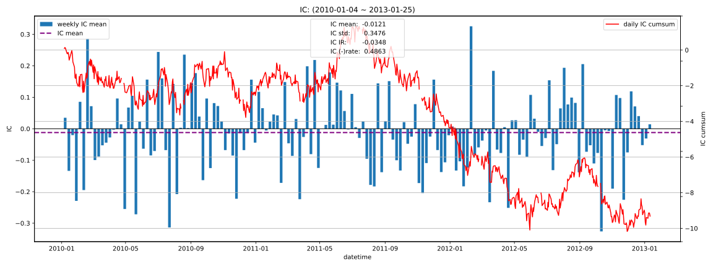

|         |   total |    2010 |    2011 |    2012 |    2013 |
|:--------|--------:|--------:|--------:|--------:|--------:|
| IC_mean | -0.0121 | -0.0101 | -0.0071 | -0.0181 | -0.0376 |
| IC_std  |  0.3476 |  0.3759 |  0.3344 |  0.3352 |  0.2739 |
| IC_IR   | -0.0348 | -0.0269 | -0.0212 | -0.0541 | -0.1371 |

### 20D
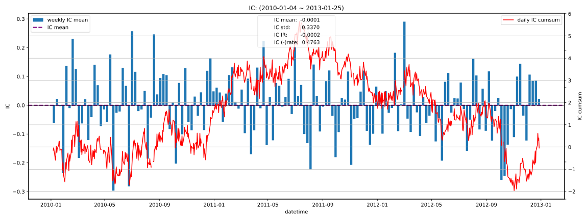

|         |   total |   2010 |   2011 |    2012 |   2013 |
|:--------|--------:|-------:|-------:|--------:|-------:|
| IC_mean | -0.0001 | 0.0063 | 0.0029 | -0.0093 |    nan |
| IC_std  |  0.3370 | 0.3718 | 0.3142 |  0.3236 |    nan |
| IC_IR   | -0.0002 | 0.0168 | 0.0093 | -0.0288 |    nan |

## 收益分析
### 分层收益
### 1D
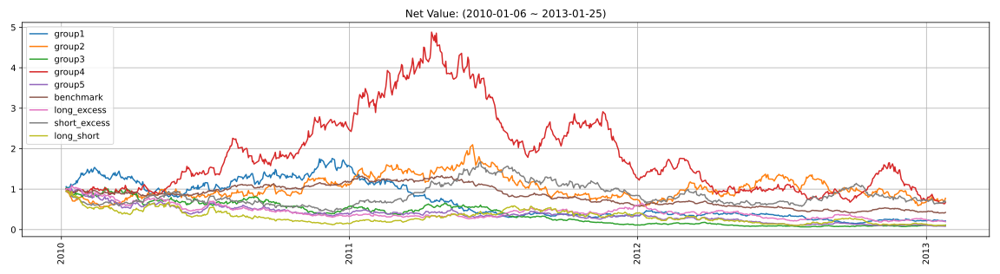

|               |   ann_ret |   max_dd |   ann_sharpe |   ann_calmar |   win_rate |   avg_win_ret |   avg_loss_ret |   profit_loss_ratio |   ann_vol |
|:--------------|----------:|---------:|-------------:|-------------:|-----------:|--------------:|---------------:|--------------------:|----------:|
| group5(long)  |   -0.5545 |   0.9186 |      -0.9434 |      -9.5830 |     0.4660 |        0.0328 |        -0.0331 |              0.9911 |    0.6392 |
| group1(short) |   -0.3928 |   0.9165 |      -0.4315 |      -6.8027 |     0.4827 |        0.0340 |        -0.0339 |              1.0032 |    0.6559 |
| benchmark     |   -0.2415 |   0.6927 |      -0.7876 |      -5.5344 |     0.4737 |        0.0149 |        -0.0152 |              0.9826 |    0.2954 |
| long_excess   |   -0.4117 |   0.8260 |      -0.6552 |      -7.9128 |     0.4891 |        0.0281 |        -0.0298 |              0.9438 |    0.5652 |
| short_excess  |   -0.1097 |   0.6562 |       0.0874 |      -2.6538 |     0.5135 |        0.0287 |        -0.0299 |              0.9605 |    0.5769 |
| long_short    |   -0.5237 |   0.9017 |      -0.3495 |      -9.2200 |     0.4917 |        0.0458 |        -0.0468 |              0.9788 |    0.9155 |

### 5D
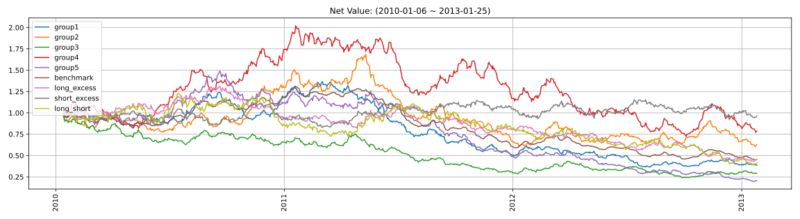

|               |   ann_ret |   max_dd |   ann_sharpe |   ann_calmar |   win_rate |   avg_win_ret |   avg_loss_ret |   profit_loss_ratio |   ann_vol |
|:--------------|----------:|---------:|-------------:|-------------:|-----------:|--------------:|---------------:|--------------------:|----------:|
| group5(long)  |   -0.4017 |   0.8675 |      -1.6498 |      -7.3504 |     0.4465 |        0.0143 |        -0.0149 |              0.9582 |    0.2863 |
| group1(short) |   -0.2655 |   0.7326 |      -0.9447 |      -5.7532 |     0.4671 |        0.0141 |        -0.0143 |              0.9819 |    0.2839 |
| benchmark     |   -0.2268 |   0.6579 |      -1.8633 |      -5.4729 |     0.4606 |        0.0064 |        -0.0073 |              0.8760 |    0.1332 |
| long_excess   |   -0.2273 |   0.6709 |      -0.8627 |      -5.3775 |     0.4658 |        0.0130 |        -0.0130 |              1.0002 |    0.2597 |
| short_excess  |   -0.0119 |   0.2677 |       0.0790 |      -0.7051 |     0.5135 |        0.0125 |        -0.0130 |              0.9591 |    0.2525 |
| long_short    |   -0.2485 |   0.6832 |      -0.5056 |      -5.7748 |     0.4942 |        0.0196 |        -0.0208 |              0.9447 |    0.4038 |

### 10D
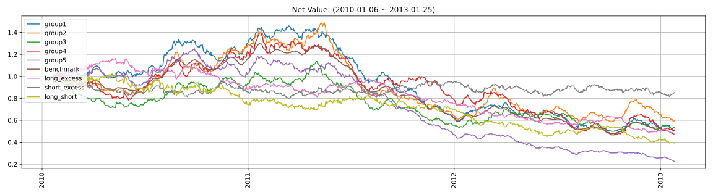

|               |   ann_ret |   max_dd |   ann_sharpe |   ann_calmar |   win_rate |   avg_win_ret |   avg_loss_ret |   profit_loss_ratio |   ann_vol |
|:--------------|----------:|---------:|-------------:|-------------:|-----------:|--------------:|---------------:|--------------------:|----------:|
| group5(long)  |   -0.3857 |   0.8196 |      -2.3405 |      -7.4708 |     0.4091 |        0.0104 |        -0.0103 |              1.0056 |    0.1995 |
| group1(short) |   -0.2007 |   0.6571 |      -1.0061 |      -4.8486 |     0.4481 |        0.0104 |        -0.0099 |              1.0505 |    0.2023 |
| benchmark     |   -0.2171 |   0.6349 |      -2.5648 |      -5.4282 |     0.4143 |        0.0048 |        -0.0050 |              0.9556 |    0.0937 |
| long_excess   |   -0.2164 |   0.5916 |      -1.2266 |      -5.8069 |     0.4429 |        0.0097 |        -0.0093 |              1.0396 |    0.1848 |
| short_excess  |   -0.0512 |   0.1996 |      -0.2067 |      -4.0750 |     0.5104 |        0.0087 |        -0.0094 |              0.9288 |    0.1779 |
| long_short    |   -0.2634 |   0.6163 |      -0.9082 |      -6.7851 |     0.4870 |        0.0142 |        -0.0156 |              0.9153 |    0.2901 |

### 20D
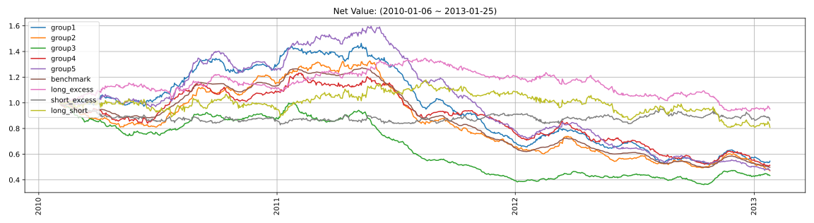

|               |   ann_ret |   max_dd |   ann_sharpe |   ann_calmar |   win_rate |   avg_win_ret |   avg_loss_ret |   profit_loss_ratio |   ann_vol |
|:--------------|----------:|---------:|-------------:|-------------:|-----------:|--------------:|---------------:|--------------------:|----------:|
| group5(long)  |   -0.2189 |   0.7030 |      -1.5872 |      -4.9423 |     0.4000 |        0.0082 |        -0.0070 |              1.1667 |    0.1486 |
| group1(short) |   -0.1820 |   0.6458 |      -1.2527 |      -4.4747 |     0.4237 |        0.0082 |        -0.0073 |              1.1170 |    0.1513 |
| benchmark     |   -0.2062 |   0.6101 |      -3.4210 |      -5.3661 |     0.3816 |        0.0034 |        -0.0036 |              0.9534 |    0.0668 |
| long_excess   |   -0.0160 |   0.3066 |      -0.0545 |      -0.8286 |     0.4592 |        0.0072 |        -0.0062 |              1.1675 |    0.1334 |
| short_excess  |   -0.0469 |   0.1716 |      -0.2941 |      -4.3370 |     0.5421 |        0.0059 |        -0.0073 |              0.8057 |    0.1331 |
| long_short    |   -0.0679 |   0.3136 |      -0.2125 |      -3.4352 |     0.5079 |        0.0104 |        -0.0111 |              0.9363 |    0.2185 |

### 因子加权日频收益
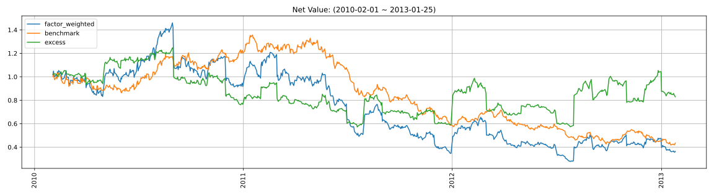

|                 |   ann_ret |   max_dd |   ann_sharpe |   ann_calmar |   win_rate |   avg_win_ret |   avg_loss_ret |   profit_loss_ratio |   ann_vol |
|:----------------|----------:|---------:|-------------:|-------------:|-----------:|--------------:|---------------:|--------------------:|----------:|
| factor_weighted |   -0.2788 |   0.8096 |      -0.2040 |      -5.4667 |     0.4917 |        0.0231 |        -0.0233 |              0.9887 |    0.6410 |
| benchmark       |   -0.2362 |   0.6918 |      -0.7668 |      -5.4201 |     0.4724 |        0.0149 |        -0.0151 |              0.9909 |    0.2946 |
| excess          |   -0.0588 |   0.5414 |       0.1637 |      -1.7239 |     0.4917 |        0.0161 |        -0.0148 |              1.0856 |    0.5802 |

### 单因子策略(0.8, 1.0)收益
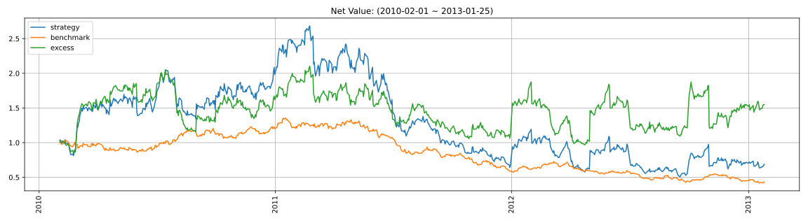

|           |   ann_ret |   max_dd |   ann_sharpe |   ann_calmar |   win_rate |   avg_win_ret |   avg_loss_ret |   profit_loss_ratio |   ann_vol |
|:----------|----------:|---------:|-------------:|-------------:|-----------:|--------------:|---------------:|--------------------:|----------:|
| strategy  |   -0.1136 |   0.8115 |       0.2284 |      -2.2223 |     0.4968 |        0.0329 |        -0.0310 |              1.0599 |    0.7966 |
| benchmark |   -0.2362 |   0.6918 |      -0.7668 |      -5.4201 |     0.4724 |        0.0149 |        -0.0151 |              0.9909 |    0.2946 |
| excess    |    0.1522 |   0.5401 |       0.5423 |       4.4724 |     0.4968 |        0.0296 |        -0.0260 |              1.1384 |    0.7525 |

## 换手率分析
### 分层换手率
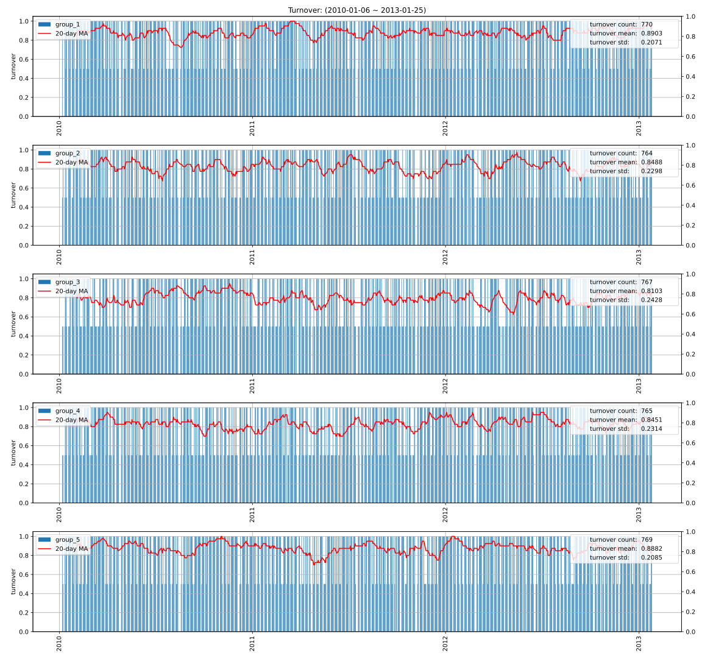

|         |   turnover_count |   turnover_mean |   turnover_std |
|:--------|-----------------:|----------------:|---------------:|
| group_1 |         770.0000 |          0.8903 |         0.2071 |
| group_2 |         764.0000 |          0.8488 |         0.2298 |
| group_3 |         767.0000 |          0.8103 |         0.2428 |
| group_4 |         765.0000 |          0.8451 |         0.2314 |
| group_5 |         769.0000 |          0.8882 |         0.2085 |

### 因子加权持仓换手率
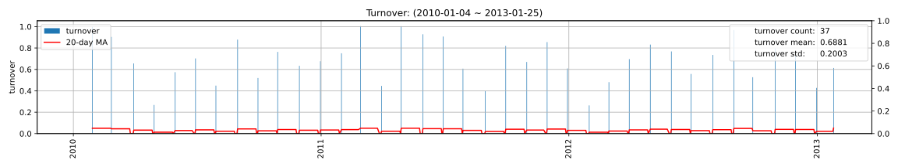

|                 |   turnover_count |   turnover_mean |   turnover_std |
|:----------------|-----------------:|----------------:|---------------:|
| factor_weighted |          37.0000 |          0.6881 |         0.2003 |

### 单因子策略(0.8, 1.0)换手率
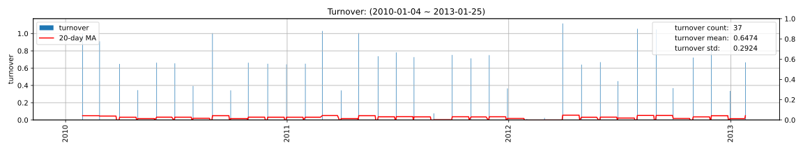

|          |   turnover_count |   turnover_mean |   turnover_std |
|:---------|-----------------:|----------------:|---------------:|
| strategy |          37.0000 |          0.6474 |         0.2924 |

