# factor4 因子报告
## IC分析
### 1D
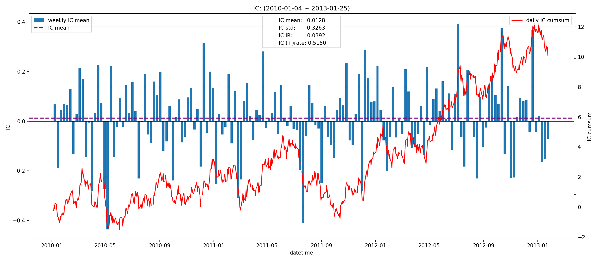
|         |   total |    2010 |   2011 |    2012 |    2013 |
|:--------|--------:|--------:|-------:|--------:|--------:|
| IC_mean | -0.0082 | -0.0151 | 0.0172 | -0.0167 | -0.1479 |
| IC_std  |  0.3338 |  0.3343 | 0.3432 |  0.3251 |  0.2930 |
| IC_IR   | -0.0244 | -0.0452 | 0.0501 | -0.0513 | -0.5049 |

### 5D
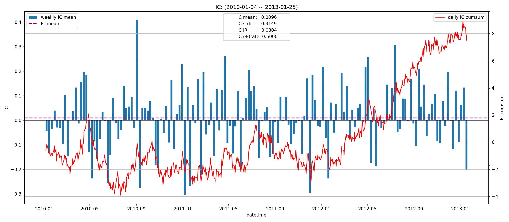
|         |   total |   2010 |   2011 |    2012 |    2013 |
|:--------|--------:|-------:|-------:|--------:|--------:|
| IC_mean | -0.0036 | 0.0072 | 0.0018 | -0.0147 | -0.0924 |
| IC_std  |  0.3357 | 0.3497 | 0.3276 |  0.3335 |  0.2717 |
| IC_IR   | -0.0106 | 0.0206 | 0.0056 | -0.0441 | -0.3402 |

### 20D
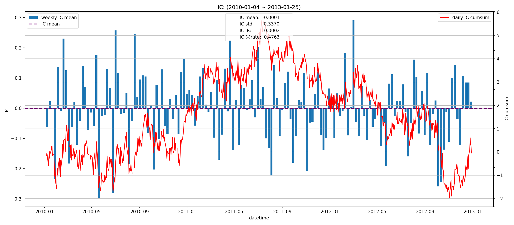
|         |   total |   2010 |   2011 |    2012 |   2013 |
|:--------|--------:|-------:|-------:|--------:|-------:|
| IC_mean | -0.0001 | 0.0063 | 0.0029 | -0.0093 |    nan |
| IC_std  |  0.3370 | 0.3718 | 0.3142 |  0.3236 |    nan |
| IC_IR   | -0.0002 | 0.0168 | 0.0093 | -0.0288 |    nan |

## 收益分析
### 分层收益
### 1D
|               |   annual_return |   max_drawdown |   annual_sharpe |   annual_calmar |   win_rate |   avg_win_return |   avg_loss_return |   profit_loss_ratio |   annual_volatility |   annual_downside_deviation |   annual_sortino |
|:--------------|----------------:|---------------:|----------------:|----------------:|-----------:|-----------------:|------------------:|--------------------:|--------------------:|----------------------------:|-----------------:|
| group5(long)  |         -0.5545 |         0.9186 |         -0.9434 |         -9.5830 |     0.4660 |           0.0328 |           -0.0331 |              0.9911 |              0.6392 |                      0.3667 |          -1.6443 |
| group1(short) |         -0.3928 |         0.9165 |         -0.4315 |         -6.8027 |     0.4827 |           0.0340 |           -0.0339 |              1.0032 |              0.6559 |                      0.3742 |          -0.7564 |
| benchmark     |         -0.5271 |         0.9418 |         -0.3478 |         -8.8851 |     0.4840 |           0.0507 |           -0.0501 |              1.0137 |              0.9239 |                      0.4499 |          -0.7141 |
| long_excess   |         -0.5981 |         0.9652 |         -0.2517 |         -9.8372 |     0.4929 |           0.0575 |           -0.0581 |              0.9896 |              1.1192 |                      0.6400 |          -0.4401 |
| short_excess  |         -0.4834 |         0.9043 |         -0.0343 |         -8.4865 |     0.4865 |           0.0588 |           -0.0560 |              1.0498 |              1.1143 |                      0.6293 |          -0.0608 |
| long_short    |         -0.5237 |         0.9017 |         -0.3495 |         -9.2200 |     0.4917 |           0.0458 |           -0.0468 |              0.9788 |              0.9155 |                      0.5525 |          -0.5791 |

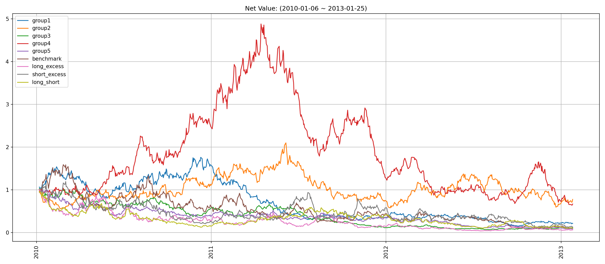
### 5D
|               |   annual_return |   max_drawdown |   annual_sharpe |   annual_calmar |   win_rate |   avg_win_return |   avg_loss_return |   profit_loss_ratio |   annual_volatility |   annual_downside_deviation |   annual_sortino |
|:--------------|----------------:|---------------:|----------------:|----------------:|-----------:|-----------------:|------------------:|--------------------:|--------------------:|----------------------------:|-----------------:|
| group5(long)  |         -0.4017 |         0.8675 |         -1.6498 |         -7.3504 |     0.4465 |           0.0143 |           -0.0149 |              0.9582 |              0.2863 |                      0.1551 |          -3.0458 |
| group1(short) |         -0.2655 |         0.7326 |         -0.9447 |         -5.7532 |     0.4671 |           0.0141 |           -0.0143 |              0.9819 |              0.2839 |                      0.1663 |          -1.6120 |
| benchmark     |         -0.3411 |         0.8525 |         -0.6916 |         -6.3521 |     0.4568 |           0.0239 |           -0.0224 |              1.0674 |              0.4546 |                      0.2310 |          -1.3611 |
| long_excess   |         -0.2572 |         0.8756 |         -0.3001 |         -4.6621 |     0.4942 |           0.0263 |           -0.0269 |              0.9764 |              0.5262 |                      0.3352 |          -0.4711 |
| short_excess  |         -0.1714 |         0.8009 |         -0.0865 |         -3.3974 |     0.4839 |           0.0279 |           -0.0265 |              1.0524 |              0.5343 |                      0.2812 |          -0.1643 |
| long_short    |         -0.2485 |         0.6832 |         -0.5056 |         -5.7748 |     0.4942 |           0.0196 |           -0.0208 |              0.9447 |              0.4038 |                      0.2447 |          -0.8340 |

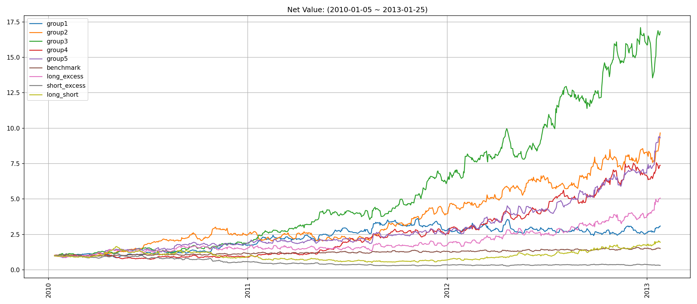
### 20D
|               |   annual_return |   max_drawdown |   annual_sharpe |   annual_calmar |   win_rate |   avg_win_return |   avg_loss_return |   profit_loss_ratio |   annual_volatility |   annual_downside_deviation |   annual_sortino |
|:--------------|----------------:|---------------:|----------------:|----------------:|-----------:|-----------------:|------------------:|--------------------:|--------------------:|----------------------------:|-----------------:|
| group5(long)  |         -0.2189 |         0.7030 |         -1.5872 |         -4.9423 |     0.4000 |           0.0082 |           -0.0070 |              1.1667 |              0.1486 |                      0.0736 |          -3.2066 |
| group1(short) |         -0.1820 |         0.6458 |         -1.2527 |         -4.4747 |     0.4237 |           0.0082 |           -0.0073 |              1.1170 |              0.1513 |                      0.0766 |          -2.4743 |
| benchmark     |         -0.2803 |         0.7467 |         -1.4103 |         -5.9582 |     0.4211 |           0.0121 |           -0.0109 |              1.1111 |              0.2165 |                      0.1049 |          -2.9108 |
| long_excess   |          0.0375 |         0.7842 |          0.2718 |          0.7584 |     0.5474 |           0.0119 |           -0.0138 |              0.8634 |              0.2555 |                      0.1640 |           0.4234 |
| short_excess  |         -0.1394 |         0.7396 |         -0.4424 |         -2.9918 |     0.4618 |           0.0139 |           -0.0128 |              1.0873 |              0.2618 |                      0.1510 |          -0.7672 |
| long_short    |         -0.0679 |         0.3136 |         -0.2125 |         -3.4352 |     0.5079 |           0.0104 |           -0.0111 |              0.9363 |              0.2185 |                      0.1385 |          -0.3351 |

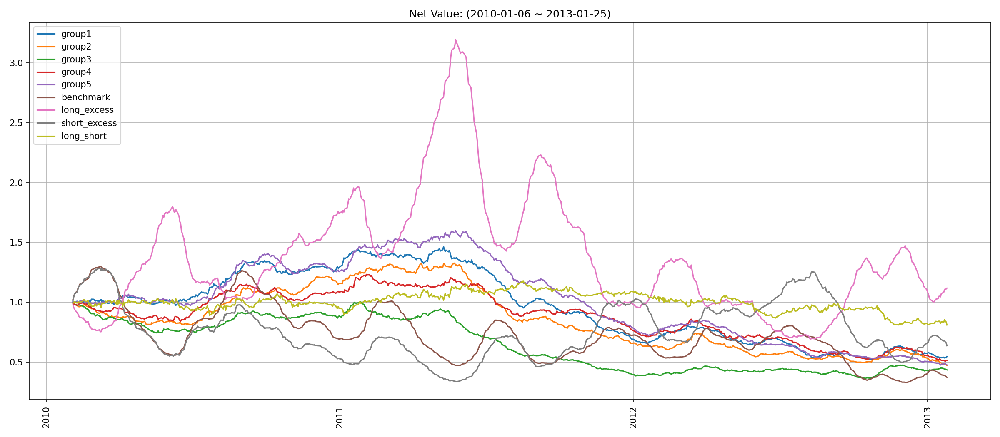
### 因子加权日频收益
|                 |   annual_return |   max_drawdown |   annual_sharpe |   annual_calmar |   win_rate |   avg_win_return |   avg_loss_return |   profit_loss_ratio |   annual_volatility |   annual_downside_deviation |   annual_sortino |
|:----------------|----------------:|---------------:|----------------:|----------------:|-----------:|-----------------:|------------------:|--------------------:|--------------------:|----------------------------:|-----------------:|
| factor_weighted |         -0.2788 |         0.8096 |         -0.2040 |         -5.4667 |     0.4917 |           0.0231 |           -0.0233 |              0.9887 |              0.6410 |                      0.4449 |          -0.2940 |
| benchmark       |         -0.6072 |         0.9552 |         -0.5418 |        -10.0918 |     0.4775 |           0.0510 |           -0.0504 |              1.0112 |              0.9278 |                      0.4492 |          -1.1192 |
| excess          |         -0.2249 |         0.9279 |          0.3293 |         -3.8479 |     0.5225 |           0.0554 |           -0.0576 |              0.9631 |              1.1288 |                      0.6206 |           0.5990 |

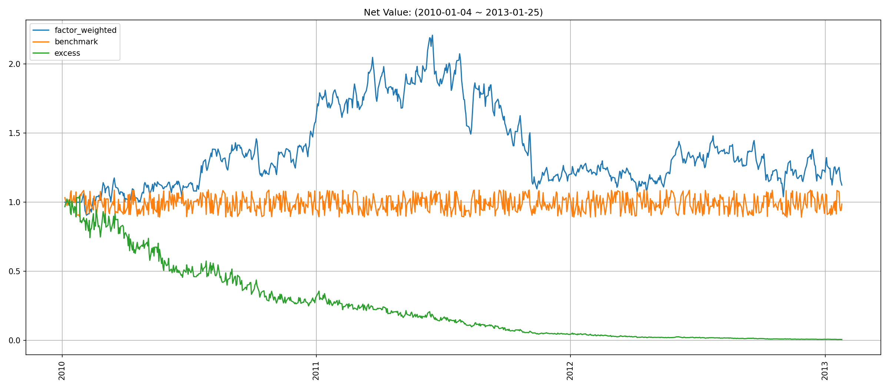
### 分位数(0.8, 1.0)收益
|           |   annual_return |   max_drawdown |   annual_sharpe |   annual_calmar |   win_rate |   avg_win_return |   avg_loss_return |   profit_loss_ratio |   annual_volatility |   annual_downside_deviation |   annual_sortino |
|:----------|----------------:|---------------:|----------------:|----------------:|-----------:|-----------------:|------------------:|--------------------:|--------------------:|----------------------------:|-----------------:|
| quantile  |         -0.1136 |         0.8115 |          0.2284 |         -2.2223 |     0.4968 |           0.0329 |           -0.0310 |              1.0599 |              0.7966 |                      0.5003 |           0.3636 |
| benchmark |         -0.6072 |         0.9552 |         -0.5418 |        -10.0918 |     0.4775 |           0.0510 |           -0.0504 |              1.0112 |              0.9278 |                      0.4492 |          -1.1192 |
| excess    |         -0.0385 |         0.9204 |          0.5610 |         -0.6635 |     0.5225 |           0.0595 |           -0.0595 |              1.0015 |              1.2207 |                      0.6657 |           1.0288 |

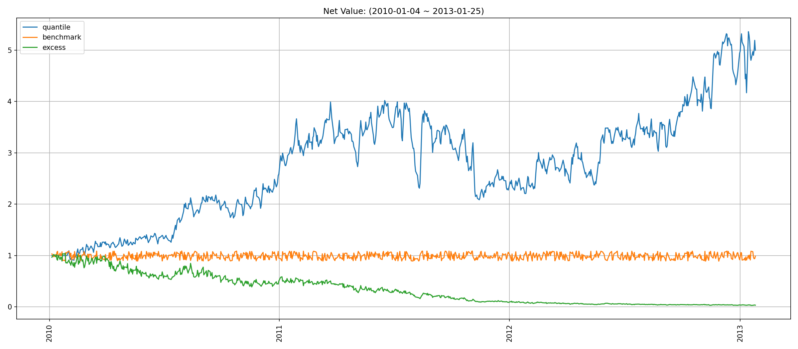
## 换手率分析
### 分层换手率
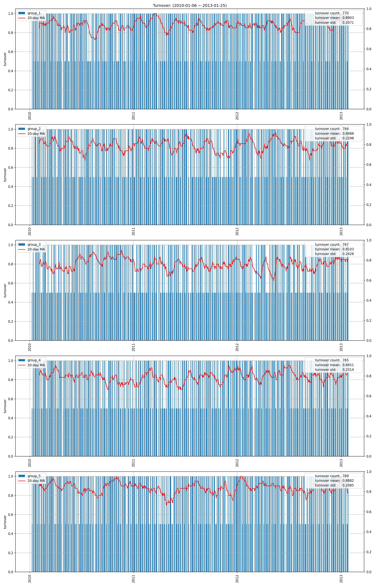
|         |   turnover_count |   turnover_mean |   turnover_std |
|:--------|-----------------:|----------------:|---------------:|
| group_1 |         770.0000 |          0.8903 |         0.2071 |
| group_2 |         764.0000 |          0.8488 |         0.2298 |
| group_3 |         767.0000 |          0.8103 |         0.2428 |
| group_4 |         765.0000 |          0.8451 |         0.2314 |
| group_5 |         769.0000 |          0.8882 |         0.2085 |

### 因子加权持仓换手率
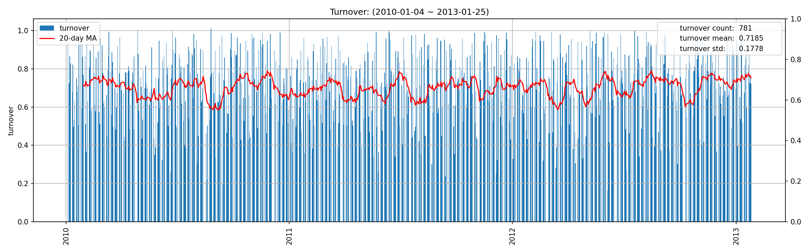
|    |   turnover_count |   turnover_mean |   turnover_std |
|---:|-----------------:|----------------:|---------------:|
|  0 |          37.0000 |          0.6699 |         0.1982 |

### 分位数(0.8, 1.0)换手率
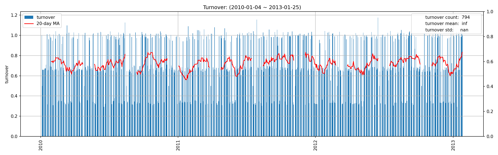
|    |   turnover_count |   turnover_mean |   turnover_std |
|---:|-----------------:|----------------:|---------------:|
|  0 |          34.0000 |          0.6708 |         0.2325 |

