# factor6 factor report
## IC分析
### 1D
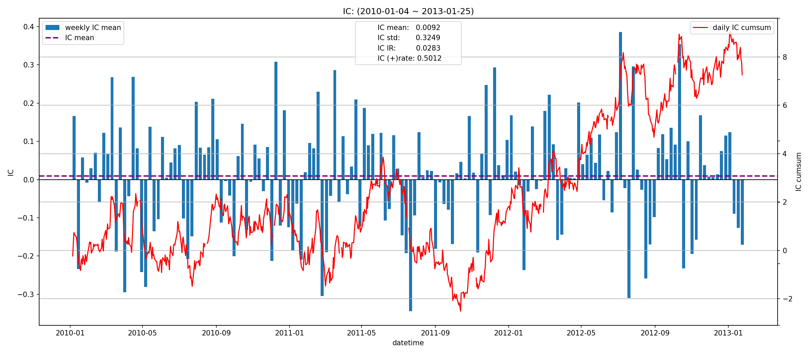
|         |   total |   2010 |   2011 |   2012 |    2013 |
|:--------|--------:|-------:|-------:|-------:|--------:|
| IC_mean |  0.0092 | 0.0062 | 0.0006 | 0.0253 | -0.0559 |
| IC_std  |  0.3249 | 0.3202 | 0.3294 | 0.3264 |  0.3198 |
| IC_IR   |  0.0283 | 0.0195 | 0.0018 | 0.0775 | -0.1747 |

### 5D
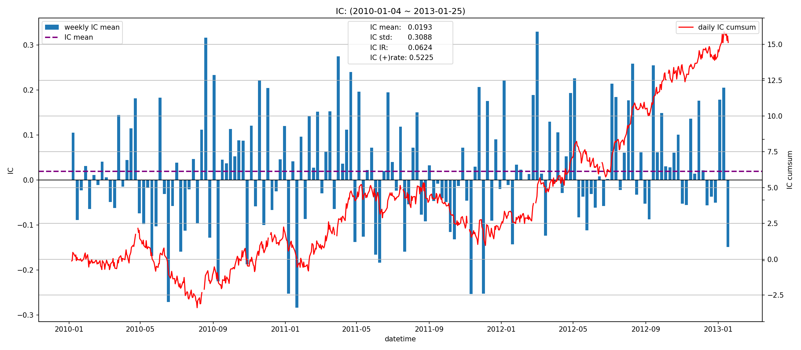
|         |   total |   2010 |   2011 |   2012 |   2013 |
|:--------|--------:|-------:|-------:|-------:|-------:|
| IC_mean |  0.0193 | 0.0075 | 0.0013 | 0.0462 | 0.0691 |
| IC_std  |  0.3088 | 0.2997 | 0.3328 | 0.2873 | 0.3869 |
| IC_IR   |  0.0624 | 0.0251 | 0.0038 | 0.1607 | 0.1786 |

### 10D
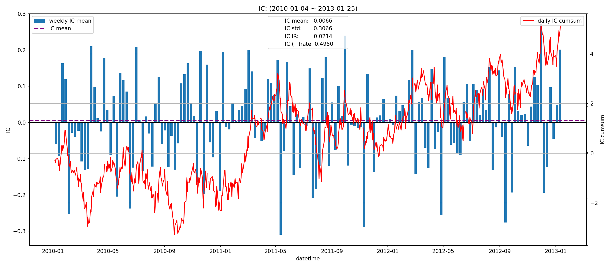
|         |   total |    2010 |   2011 |   2012 |   2013 |
|:--------|--------:|--------:|-------:|-------:|-------:|
| IC_mean |  0.0066 | -0.0089 | 0.0114 | 0.0127 | 0.1329 |
| IC_std  |  0.3066 |  0.3148 | 0.3009 | 0.3040 | 0.3183 |
| IC_IR   |  0.0214 | -0.0284 | 0.0379 | 0.0418 | 0.4177 |

## 收益分析
### 分层收益
### 1D
|              |   annual_return |   max_drawdown |   annual_sharpe |   annual_calmar |   win_rate |   avg_win_return |   avg_loss_return |   profit_loss_ratio |   annual_volatility |   annual_downside_deviation |   annual_sortino |
|:-------------|----------------:|---------------:|----------------:|----------------:|-----------:|-----------------:|------------------:|--------------------:|--------------------:|----------------------------:|-----------------:|
| group1       |          1.2829 |         0.6511 |          1.3208 |         31.2800 |     0.4994 |           0.0478 |           -0.0376 |              1.2719 |              0.9644 |                      0.5197 |           2.4513 |
| group5       |          0.5947 |         0.8421 |          0.9530 |         11.2114 |     0.5234 |           0.0442 |           -0.0404 |              1.0927 |              1.0205 |                      0.6615 |           1.4701 |
| benchmark    |          0.0203 |         0.2899 |          0.6604 |          1.1093 |     0.4930 |           0.0708 |           -0.0622 |              1.1392 |              1.2968 |                      0.7104 |           1.2055 |
| long_excess  |         -0.6935 |         0.9868 |          0.0721 |        -11.1563 |     0.4918 |           0.0801 |           -0.0766 |              1.0457 |              1.6087 |                      0.9615 |           0.1207 |
| short_excess |         -0.8033 |         0.9965 |         -0.2740 |        -12.7968 |     0.4918 |           0.0753 |           -0.0761 |              0.9892 |              1.5231 |                      1.0104 |          -0.4131 |
| long_short   |         -0.7304 |         0.9954 |         -0.2200 |        -11.6485 |     0.4994 |           0.0576 |           -0.0599 |              0.9626 |              1.3696 |                      1.0911 |          -0.2762 |

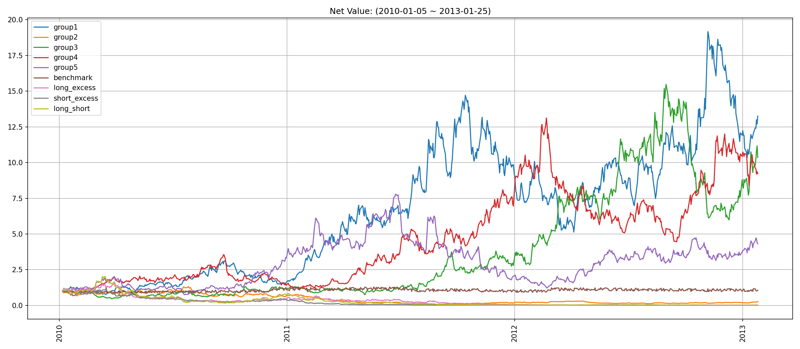
### 5D
|              |   annual_return |   max_drawdown |   annual_sharpe |   annual_calmar |   win_rate |   avg_win_return |   avg_loss_return |   profit_loss_ratio |   annual_volatility |   annual_downside_deviation |   annual_sortino |
|:-------------|----------------:|---------------:|----------------:|----------------:|-----------:|-----------------:|------------------:|--------------------:|--------------------:|----------------------------:|-----------------:|
| group1       |          0.4452 |         0.3382 |          1.1309 |         20.8949 |     0.5146 |           0.0201 |           -0.0177 |              1.1375 |              0.3940 |                      0.2287 |           1.9477 |
| group5       |          1.1024 |         0.2974 |          2.0241 |         58.8374 |     0.5439 |           0.0206 |           -0.0174 |              1.1848 |              0.4082 |                      0.2130 |           3.8794 |
| benchmark    |          0.1389 |         0.1264 |          0.6206 |         17.4538 |     0.4879 |           0.0145 |           -0.0125 |              1.1570 |              0.2667 |                      0.1409 |           1.1748 |
| long_excess  |          0.7273 |         0.3242 |          1.3777 |         35.6129 |     0.5045 |           0.0258 |           -0.0210 |              1.2298 |              0.4795 |                      0.2517 |           2.6249 |
| short_excess |         -0.3160 |         0.7405 |         -0.6290 |         -6.7742 |     0.4917 |           0.0216 |           -0.0231 |              0.9357 |              0.4452 |                      0.2856 |          -0.9805 |
| long_short   |          0.2634 |         0.5392 |          0.7021 |          7.7561 |     0.5172 |           0.0271 |           -0.0259 |              1.0464 |              0.5421 |                      0.3355 |           1.1346 |

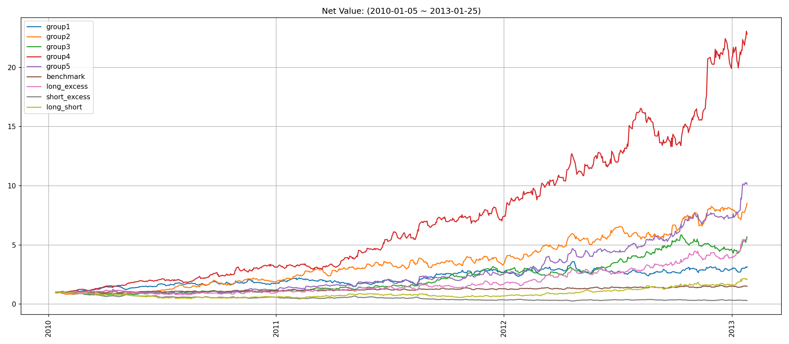
### 10D
|              |   annual_return |   max_drawdown |   annual_sharpe |   annual_calmar |   win_rate |   avg_win_return |   avg_loss_return |   profit_loss_ratio |   annual_volatility |   annual_downside_deviation |   annual_sortino |
|:-------------|----------------:|---------------:|----------------:|----------------:|-----------:|-----------------:|------------------:|--------------------:|--------------------:|----------------------------:|-----------------:|
| group1       |          0.4936 |         0.1663 |          1.8090 |         47.1322 |     0.5192 |           0.0126 |           -0.0100 |              1.2526 |              0.2374 |                      0.1294 |           3.3191 |
| group5       |          0.5384 |         0.2114 |          1.8679 |         40.4241 |     0.5077 |           0.0131 |           -0.0098 |              1.3362 |              0.2469 |                      0.1221 |           3.7784 |
| benchmark    |          0.0824 |         0.0940 |          0.6538 |         13.9123 |     0.4987 |           0.0074 |           -0.0066 |              1.1112 |              0.1350 |                      0.0720 |           1.2255 |
| long_excess  |          0.4001 |         0.1876 |          1.3802 |         33.8535 |     0.5026 |           0.0143 |           -0.0115 |              1.2455 |              0.2702 |                      0.1416 |           2.6347 |
| short_excess |         -0.3130 |         0.6871 |         -1.3130 |         -7.2309 |     0.4885 |           0.0118 |           -0.0139 |              0.8474 |              0.2599 |                      0.1794 |          -1.9019 |
| long_short   |         -0.0216 |         0.2822 |          0.0968 |         -1.2175 |     0.4846 |           0.0162 |           -0.0150 |              1.0809 |              0.3280 |                      0.2052 |           0.1548 |

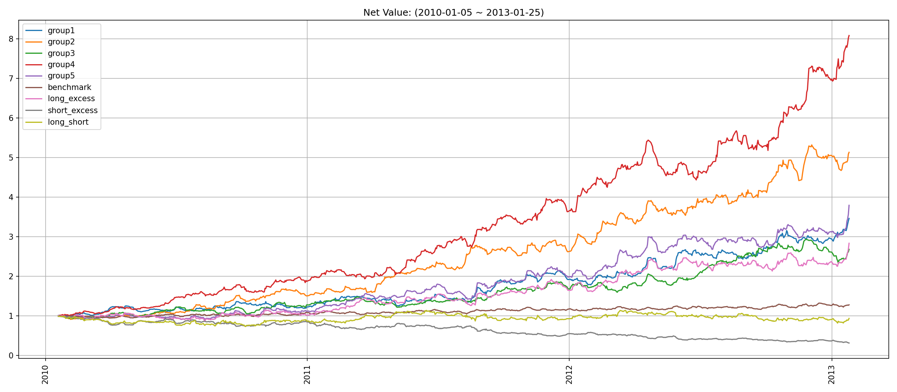
### 因子加权日频收益
|                 |   annual_return |   max_drawdown |   annual_sharpe |   annual_calmar |   win_rate |   avg_win_return |   avg_loss_return |   profit_loss_ratio |   annual_volatility |   annual_downside_deviation |   annual_sortino |
|:----------------|----------------:|---------------:|----------------:|----------------:|-----------:|-----------------:|------------------:|--------------------:|--------------------:|----------------------------:|-----------------:|
| factor_weighted |         -0.0863 |         0.4195 |          0.0722 |         -3.2643 |     0.5427 |           0.0210 |           -0.0246 |              0.8544 |              0.4957 |                      0.4371 |           0.0819 |
| benchmark       |         -0.0041 |         0.1815 |          0.6409 |         -0.3591 |     0.4944 |           0.0704 |           -0.0623 |              1.1297 |              1.2946 |                      0.7106 |           1.1677 |
| excess          |         -0.8200 |         0.9964 |         -0.5929 |        -13.0637 |     0.5019 |           0.0643 |           -0.0711 |              0.9042 |              1.3390 |                      0.8479 |          -0.9363 |

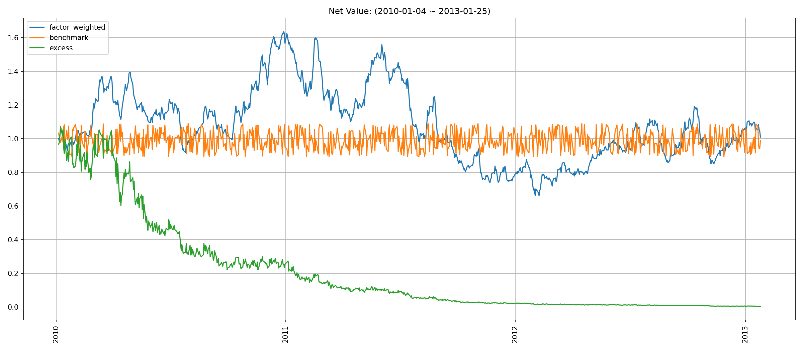
### 分位数(0.8, 1.0)收益
|           |   annual_return |   max_drawdown |   annual_sharpe |   annual_calmar |   win_rate |   avg_win_return |   avg_loss_return |   profit_loss_ratio |   annual_volatility |   annual_downside_deviation |   annual_sortino |
|:----------|----------------:|---------------:|----------------:|----------------:|-----------:|-----------------:|------------------:|--------------------:|--------------------:|----------------------------:|-----------------:|
| quantile  |          0.8239 |         0.3520 |          1.1362 |         37.1550 |     0.5399 |           0.0365 |           -0.0342 |              1.0660 |              0.7958 |                      0.5087 |           1.7774 |
| benchmark |         -0.0041 |         0.1815 |          0.6409 |         -0.3591 |     0.4944 |           0.0704 |           -0.0623 |              1.1297 |              1.2946 |                      0.7106 |           1.1677 |
| excess    |         -0.5587 |         0.9430 |          0.0564 |         -9.4040 |     0.4881 |           0.0683 |           -0.0646 |              1.0582 |              1.3399 |                      0.7889 |           0.0958 |

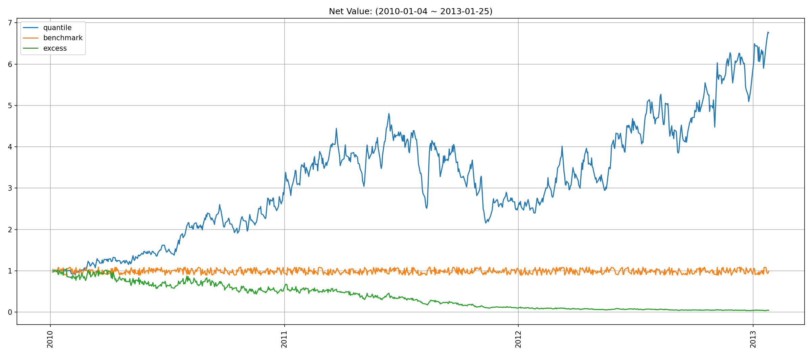
## 换手率分析
### 分层换手率
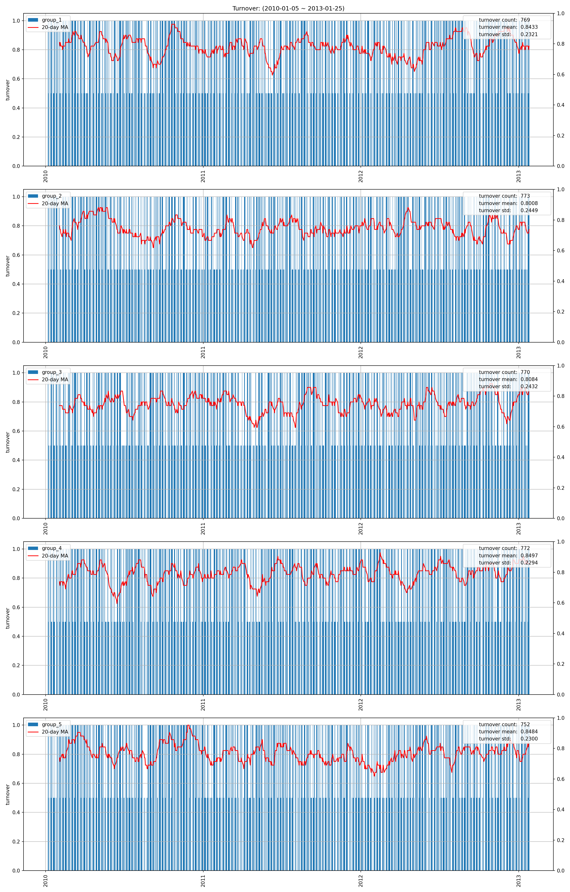
|    | group   |   turnover_count |   turnover_mean |   turnover_std |
|---:|:--------|-----------------:|----------------:|---------------:|
|  0 | group_1 |              769 |          0.8433 |         0.2321 |
|  1 | group_2 |              773 |          0.8008 |         0.2449 |
|  2 | group_3 |              770 |          0.8084 |         0.2432 |
|  3 | group_4 |              772 |          0.8497 |         0.2294 |
|  4 | group_5 |              752 |          0.8484 |         0.2300 |

### 因子加权持仓换手率
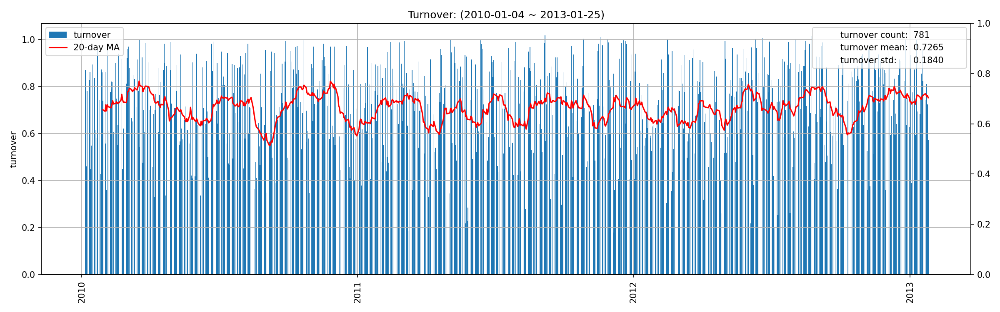
|    |   turnover_count |   turnover_mean |   turnover_std |
|---:|-----------------:|----------------:|---------------:|
|  0 |           3.0000 |          1.3656 |         0.4161 |

### 分位数(0.8, 1.0)换手率
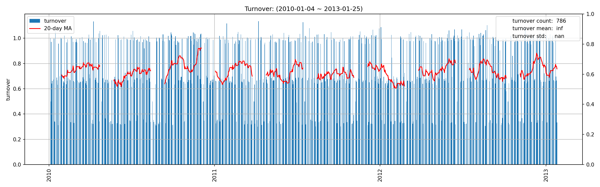
|    |   turnover_count |   turnover_mean |   turnover_std |
|---:|-----------------:|----------------:|---------------:|
|  0 |           3.0000 |          1.2626 |         0.6148 |

# factor6 factor report
## IC分析
### 1D

|         |   total |   2010 |   2011 |   2012 |    2013 |
|:--------|--------:|-------:|-------:|-------:|--------:|
| IC_mean |  0.0092 | 0.0062 | 0.0006 | 0.0253 | -0.0559 |
| IC_std  |  0.3249 | 0.3202 | 0.3294 | 0.3264 |  0.3198 |
| IC_IR   |  0.0283 | 0.0195 | 0.0018 | 0.0775 | -0.1747 |

### 5D

|         |   total |   2010 |   2011 |   2012 |   2013 |
|:--------|--------:|-------:|-------:|-------:|-------:|
| IC_mean |  0.0193 | 0.0075 | 0.0013 | 0.0462 | 0.0691 |
| IC_std  |  0.3088 | 0.2997 | 0.3328 | 0.2873 | 0.3869 |
| IC_IR   |  0.0624 | 0.0251 | 0.0038 | 0.1607 | 0.1786 |

### 10D

|         |   total |    2010 |   2011 |   2012 |   2013 |
|:--------|--------:|--------:|-------:|-------:|-------:|
| IC_mean |  0.0066 | -0.0089 | 0.0114 | 0.0127 | 0.1329 |
| IC_std  |  0.3066 |  0.3148 | 0.3009 | 0.3040 | 0.3183 |
| IC_IR   |  0.0214 | -0.0284 | 0.0379 | 0.0418 | 0.4177 |

## 收益分析
### 分层收益
### 1D
|               |   annual_return |   max_drawdown |   annual_sharpe |   annual_calmar |   win_rate |   avg_win_return |   avg_loss_return |   profit_loss_ratio |   annual_volatility |   annual_downside_deviation |   annual_sortino |
|:--------------|----------------:|---------------:|----------------:|----------------:|-----------:|-----------------:|------------------:|--------------------:|--------------------:|----------------------------:|-----------------:|
| group5(long)  |          0.5947 |         0.8421 |          0.9530 |         11.2114 |     0.5234 |           0.0442 |           -0.0404 |              1.0927 |              1.0205 |                      0.6615 |           1.4701 |
| group1(short) |          1.2829 |         0.6511 |          1.3208 |         31.2800 |     0.4994 |           0.0478 |           -0.0376 |              1.2719 |              0.9644 |                      0.5197 |           2.4513 |
| benchmark     |          0.0203 |         0.2899 |          0.6604 |          1.1093 |     0.4930 |           0.0708 |           -0.0622 |              1.1392 |              1.2968 |                      0.7104 |           1.2055 |
| long_excess   |         -0.6935 |         0.9868 |          0.0721 |        -11.1563 |     0.4918 |           0.0801 |           -0.0766 |              1.0457 |              1.6087 |                      0.9615 |           0.1207 |
| short_excess  |         -0.8033 |         0.9965 |         -0.2740 |        -12.7968 |     0.4918 |           0.0753 |           -0.0761 |              0.9892 |              1.5231 |                      1.0104 |          -0.4131 |
| long_short    |         -0.7304 |         0.9954 |         -0.2200 |        -11.6485 |     0.4994 |           0.0576 |           -0.0599 |              0.9626 |              1.3696 |                      1.0911 |          -0.2762 |

### 5D
|               |   annual_return |   max_drawdown |   annual_sharpe |   annual_calmar |   win_rate |   avg_win_return |   avg_loss_return |   profit_loss_ratio |   annual_volatility |   annual_downside_deviation |   annual_sortino |
|:--------------|----------------:|---------------:|----------------:|----------------:|-----------:|-----------------:|------------------:|--------------------:|--------------------:|----------------------------:|-----------------:|
| group5(long)  |          1.1024 |         0.2974 |          2.0241 |         58.8374 |     0.5439 |           0.0206 |           -0.0174 |              1.1848 |              0.4082 |                      0.2130 |           3.8794 |
| group1(short) |          0.4452 |         0.3382 |          1.1309 |         20.8949 |     0.5146 |           0.0201 |           -0.0177 |              1.1375 |              0.3940 |                      0.2287 |           1.9477 |
| benchmark     |          0.1389 |         0.1264 |          0.6206 |         17.4538 |     0.4879 |           0.0145 |           -0.0125 |              1.1570 |              0.2667 |                      0.1409 |           1.1748 |
| long_excess   |          0.7273 |         0.3242 |          1.3777 |         35.6129 |     0.5045 |           0.0258 |           -0.0210 |              1.2298 |              0.4795 |                      0.2517 |           2.6249 |
| short_excess  |         -0.3160 |         0.7405 |         -0.6290 |         -6.7742 |     0.4917 |           0.0216 |           -0.0231 |              0.9357 |              0.4452 |                      0.2856 |          -0.9805 |
| long_short    |          0.2634 |         0.5392 |          0.7021 |          7.7561 |     0.5172 |           0.0271 |           -0.0259 |              1.0464 |              0.5421 |                      0.3355 |           1.1346 |

### 10D
|               |   annual_return |   max_drawdown |   annual_sharpe |   annual_calmar |   win_rate |   avg_win_return |   avg_loss_return |   profit_loss_ratio |   annual_volatility |   annual_downside_deviation |   annual_sortino |
|:--------------|----------------:|---------------:|----------------:|----------------:|-----------:|-----------------:|------------------:|--------------------:|--------------------:|----------------------------:|-----------------:|
| group5(long)  |          0.5384 |         0.2114 |          1.8679 |         40.4241 |     0.5077 |           0.0131 |           -0.0098 |              1.3362 |              0.2469 |                      0.1221 |           3.7784 |
| group1(short) |          0.4936 |         0.1663 |          1.8090 |         47.1322 |     0.5192 |           0.0126 |           -0.0100 |              1.2526 |              0.2374 |                      0.1294 |           3.3191 |
| benchmark     |          0.0824 |         0.0940 |          0.6538 |         13.9123 |     0.4987 |           0.0074 |           -0.0066 |              1.1112 |              0.1350 |                      0.0720 |           1.2255 |
| long_excess   |          0.4001 |         0.1876 |          1.3802 |         33.8535 |     0.5026 |           0.0143 |           -0.0115 |              1.2455 |              0.2702 |                      0.1416 |           2.6347 |
| short_excess  |         -0.3130 |         0.6871 |         -1.3130 |         -7.2309 |     0.4885 |           0.0118 |           -0.0139 |              0.8474 |              0.2599 |                      0.1794 |          -1.9019 |
| long_short    |         -0.0216 |         0.2822 |          0.0968 |         -1.2175 |     0.4846 |           0.0162 |           -0.0150 |              1.0809 |              0.3280 |                      0.2052 |           0.1548 |

### 因子加权日频收益
|                 |   annual_return |   max_drawdown |   annual_sharpe |   annual_calmar |   win_rate |   avg_win_return |   avg_loss_return |   profit_loss_ratio |   annual_volatility |   annual_downside_deviation |   annual_sortino |
|:----------------|----------------:|---------------:|----------------:|----------------:|-----------:|-----------------:|------------------:|--------------------:|--------------------:|----------------------------:|-----------------:|
| factor_weighted |         -0.0863 |         0.4195 |          0.0722 |         -3.2643 |     0.5427 |           0.0210 |           -0.0246 |              0.8544 |              0.4957 |                      0.4371 |           0.0819 |
| benchmark       |         -0.0041 |         0.1815 |          0.6409 |         -0.3591 |     0.4944 |           0.0704 |           -0.0623 |              1.1297 |              1.2946 |                      0.7106 |           1.1677 |
| excess          |         -0.8200 |         0.9964 |         -0.5929 |        -13.0637 |     0.5019 |           0.0643 |           -0.0711 |              0.9042 |              1.3390 |                      0.8479 |          -0.9363 |

### 分位数(0.8, 1.0)收益
|           |   annual_return |   max_drawdown |   annual_sharpe |   annual_calmar |   win_rate |   avg_win_return |   avg_loss_return |   profit_loss_ratio |   annual_volatility |   annual_downside_deviation |   annual_sortino |
|:----------|----------------:|---------------:|----------------:|----------------:|-----------:|-----------------:|------------------:|--------------------:|--------------------:|----------------------------:|-----------------:|
| quantile  |          0.8239 |         0.3520 |          1.1362 |         37.1550 |     0.5399 |           0.0365 |           -0.0342 |              1.0660 |              0.7958 |                      0.5087 |           1.7774 |
| benchmark |         -0.0041 |         0.1815 |          0.6409 |         -0.3591 |     0.4944 |           0.0704 |           -0.0623 |              1.1297 |              1.2946 |                      0.7106 |           1.1677 |
| excess    |         -0.5587 |         0.9430 |          0.0564 |         -9.4040 |     0.4881 |           0.0683 |           -0.0646 |              1.0582 |              1.3399 |                      0.7889 |           0.0958 |

## 换手率分析
### 分层换手率

|         |   turnover_count |   turnover_mean |   turnover_std |
|:--------|-----------------:|----------------:|---------------:|
| group_1 |         769.0000 |          0.8433 |         0.2321 |
| group_2 |         773.0000 |          0.8008 |         0.2449 |
| group_3 |         770.0000 |          0.8084 |         0.2432 |
| group_4 |         772.0000 |          0.8497 |         0.2294 |
| group_5 |         752.0000 |          0.8484 |         0.2300 |

### 因子加权持仓换手率

|    |   turnover_count |   turnover_mean |   turnover_std |
|---:|-----------------:|----------------:|---------------:|
|  0 |           3.0000 |          1.3656 |         0.4161 |

### 分位数(0.8, 1.0)换手率

|    |   turnover_count |   turnover_mean |   turnover_std |
|---:|-----------------:|----------------:|---------------:|
|  0 |           3.0000 |          1.2626 |         0.6148 |

