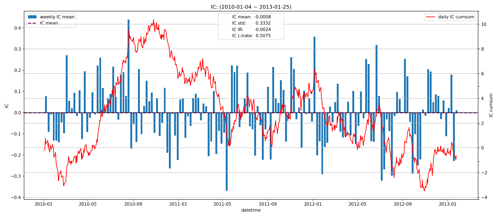
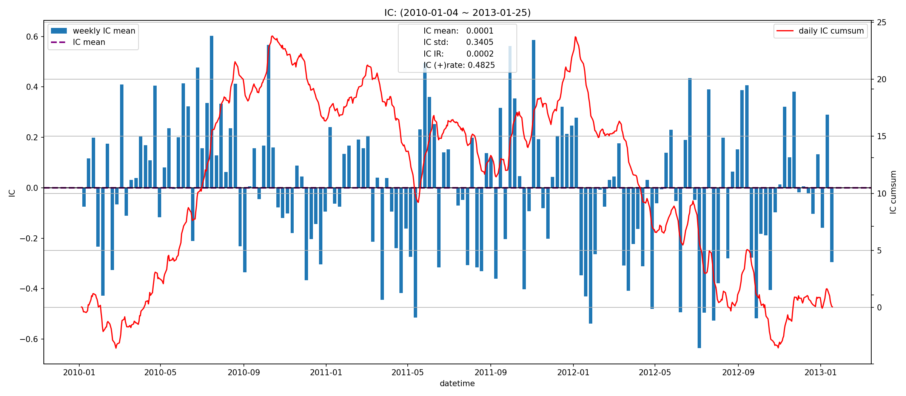
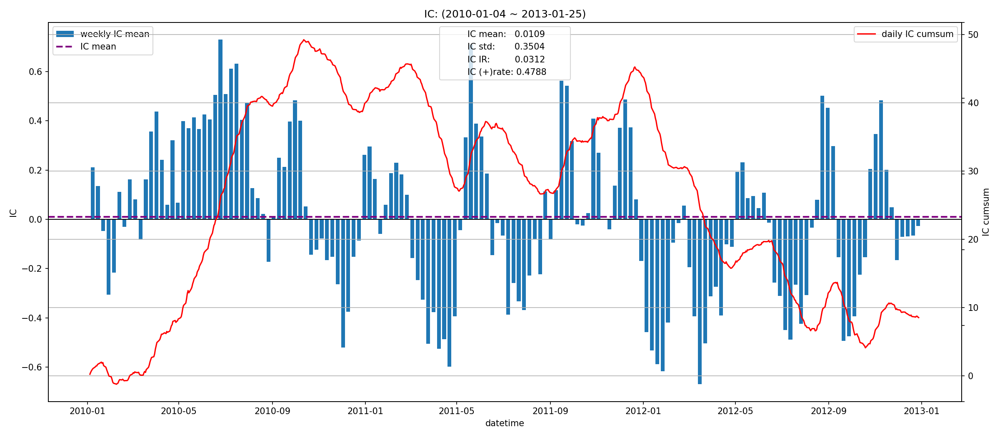
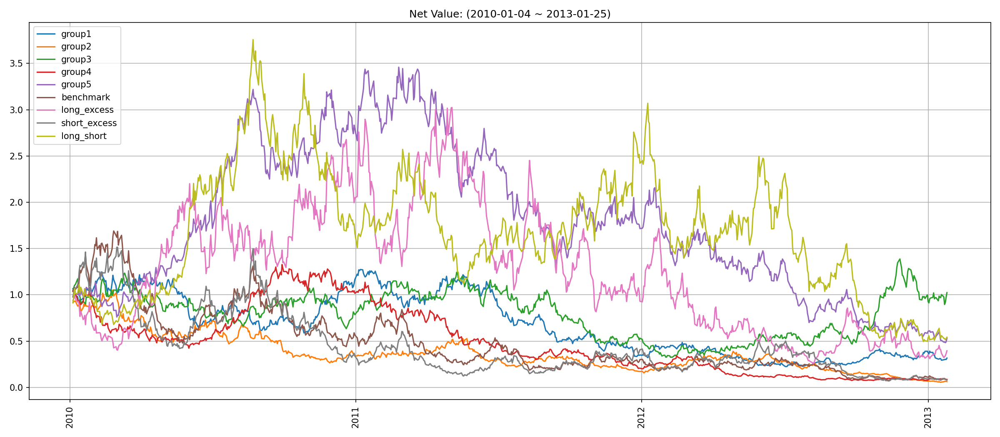
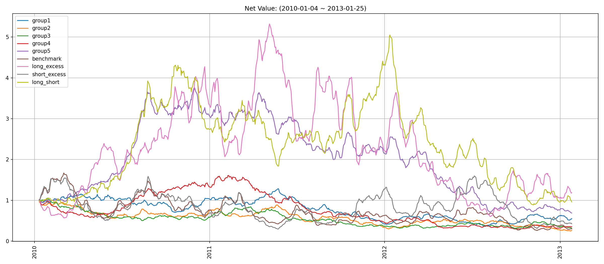
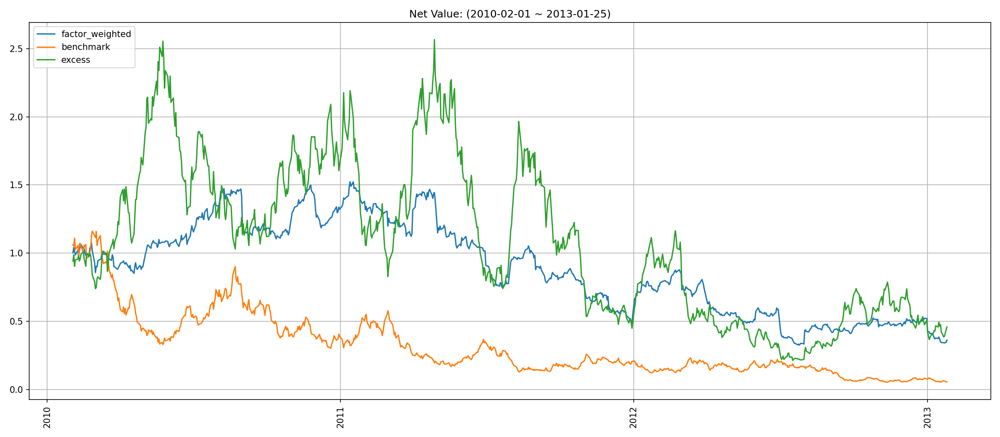
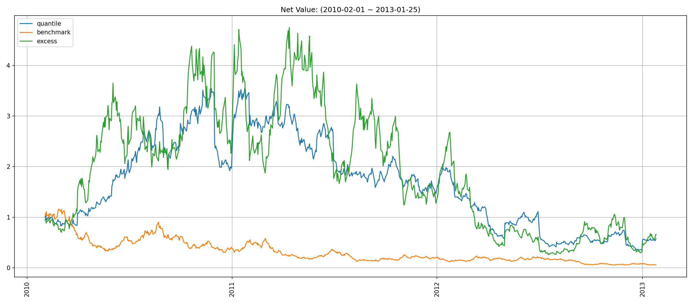
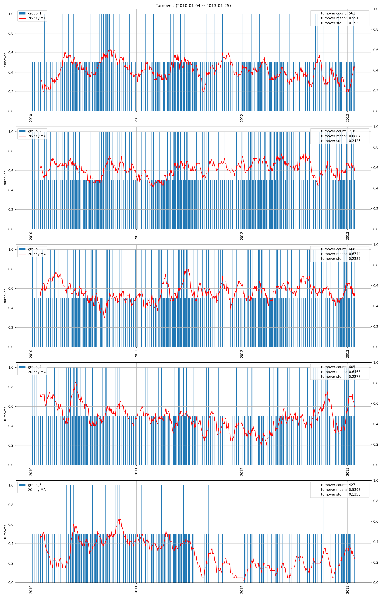
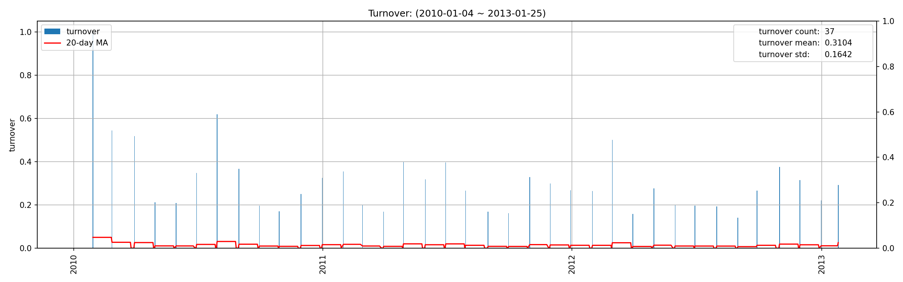
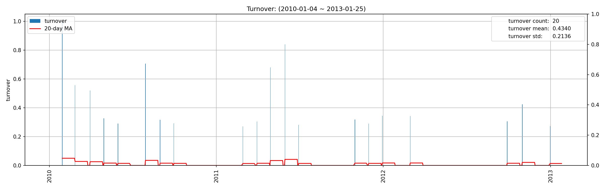

# open 因子报告
## IC分析
### 1D

|         |   total |   2010 |    2011 |    2012 |    2013 |
|:--------|--------:|-------:|--------:|--------:|--------:|
| IC_mean | -0.0008 | 0.0215 | -0.0041 | -0.0182 | -0.0246 |
| IC_std  |  0.3332 | 0.3226 |  0.3407 |  0.3396 |  0.2856 |
| IC_IR   | -0.0024 | 0.0667 | -0.0120 | -0.0534 | -0.0861 |

### 5D

|         |   total |   2010 |   2011 |    2012 |    2013 |
|:--------|--------:|-------:|-------:|--------:|--------:|
| IC_mean |  0.0001 | 0.0628 | 0.0217 | -0.0809 | -0.0581 |
| IC_std  |  0.3405 | 0.3201 | 0.3405 |  0.3444 |  0.3690 |
| IC_IR   |  0.0002 | 0.1963 | 0.0637 | -0.2349 | -0.1573 |

### 20D

|         |   total |   2010 |   2011 |    2012 |   2013 |
|:--------|--------:|-------:|-------:|--------:|-------:|
| IC_mean |  0.0109 | 0.1535 | 0.0158 | -0.1365 |    nan |
| IC_std  |  0.3504 | 0.3187 | 0.3441 |  0.3271 |    nan |
| IC_IR   |  0.0312 | 0.4815 | 0.0459 | -0.4173 |    nan |

## 收益分析
### 分层收益
### 1D
|               |   annual_return |   max_drawdown |   annual_sharpe |   annual_calmar |   win_rate |   avg_win_return |   avg_loss_return |   profit_loss_ratio |   annual_volatility |   annual_downside_deviation |   annual_sortino |
|:--------------|----------------:|---------------:|----------------:|----------------:|-----------:|-----------------:|------------------:|--------------------:|--------------------:|----------------------------:|-----------------:|
| group5(long)  |         -0.1813 |         0.8603 |          0.0318 |         -3.3454 |     0.5106 |           0.0332 |           -0.0344 |              0.9631 |              0.6642 |                      0.4002 |           0.0528 |
| group1(short) |         -0.3041 |         0.8234 |         -0.2930 |         -5.8638 |     0.4919 |           0.0308 |           -0.0312 |              0.9870 |              0.6068 |                      0.3648 |          -0.4874 |
| benchmark     |         -0.5474 |         0.9552 |         -0.3875 |         -9.0983 |     0.4831 |           0.0510 |           -0.0504 |              1.0113 |              0.9293 |                      0.4512 |          -0.7982 |
| long_excess   |         -0.2536 |         0.9148 |          0.3292 |         -4.4013 |     0.5119 |           0.0602 |           -0.0600 |              1.0028 |              1.1582 |                      0.6657 |           0.5727 |
| short_excess  |         -0.5502 |         0.9542 |         -0.1642 |         -9.1535 |     0.4793 |           0.0599 |           -0.0565 |              1.0594 |              1.1099 |                      0.5974 |          -0.3052 |
| long_short    |         -0.1756 |         0.8681 |          0.2246 |         -3.2110 |     0.5094 |           0.0452 |           -0.0453 |              0.9974 |              0.8859 |                      0.4967 |           0.4005 |

### 5D
|               |   annual_return |   max_drawdown |   annual_sharpe |   annual_calmar |   win_rate |   avg_win_return |   avg_loss_return |   profit_loss_ratio |   annual_volatility |   annual_downside_deviation |   annual_sortino |
|:--------------|----------------:|---------------:|----------------:|----------------:|-----------:|-----------------:|------------------:|--------------------:|--------------------:|----------------------------:|-----------------:|
| group5(long)  |         -0.1107 |         0.8160 |         -0.2583 |         -2.1532 |     0.4918 |           0.0149 |           -0.0150 |              0.9928 |              0.2908 |                      0.1589 |          -0.4727 |
| group1(short) |         -0.1710 |         0.7180 |         -0.5172 |         -3.7801 |     0.4994 |           0.0139 |           -0.0150 |              0.9245 |              0.2843 |                      0.1674 |          -0.8787 |
| benchmark     |         -0.3157 |         0.8429 |         -0.6064 |         -5.9447 |     0.4604 |           0.0240 |           -0.0225 |              1.0662 |              0.4554 |                      0.2302 |          -1.1993 |
| long_excess   |          0.0552 |         0.8865 |          0.3709 |          0.9890 |     0.5182 |           0.0274 |           -0.0278 |              0.9849 |              0.5420 |                      0.3282 |           0.6126 |
| short_excess  |         -0.2364 |         0.8126 |         -0.2425 |         -4.6192 |     0.4730 |           0.0278 |           -0.0259 |              1.0726 |              0.5323 |                      0.2781 |          -0.4642 |
| long_short    |         -0.0122 |         0.8244 |          0.1751 |         -0.2352 |     0.5208 |           0.0202 |           -0.0213 |              0.9460 |              0.4110 |                      0.2329 |           0.3089 |

### 20D
|               |   annual_return |   max_drawdown |   annual_sharpe |   annual_calmar |   win_rate |   avg_win_return |   avg_loss_return |   profit_loss_ratio |   annual_volatility |   annual_downside_deviation |   annual_sortino |
|:--------------|----------------:|---------------:|----------------:|----------------:|-----------:|-----------------:|------------------:|--------------------:|--------------------:|----------------------------:|-----------------:|
| group5(long)  |         -0.1723 |         0.8293 |         -1.2864 |         -3.2982 |     0.4372 |           0.0072 |           -0.0069 |              1.0506 |              0.1394 |                      0.0820 |          -2.1859 |
| group1(short) |         -0.1371 |         0.5947 |         -0.9201 |         -3.6596 |     0.4385 |           0.0078 |           -0.0071 |              1.1061 |              0.1483 |                      0.0686 |          -1.9904 |
| benchmark     |         -0.2875 |         0.7716 |         -1.4535 |         -5.9147 |     0.4154 |           0.0123 |           -0.0109 |              1.1299 |              0.2169 |                      0.1046 |          -3.0138 |
| long_excess   |          0.1147 |         0.8517 |          0.5811 |          2.1380 |     0.5269 |           0.0120 |           -0.0122 |              0.9815 |              0.2340 |                      0.1373 |           0.9906 |
| short_excess  |         -0.1941 |         0.7912 |         -0.6577 |         -3.8944 |     0.4551 |           0.0146 |           -0.0135 |              1.0814 |              0.2719 |                      0.1480 |          -1.2083 |
| long_short    |         -0.0645 |         0.8346 |         -0.1966 |         -1.2268 |     0.5051 |           0.0104 |           -0.0109 |              0.9489 |              0.2180 |                      0.1500 |          -0.2858 |

### 因子加权日频收益
|                 |   annual_return |   max_drawdown |   annual_sharpe |   annual_calmar |   win_rate |   avg_win_return |   avg_loss_return |   profit_loss_ratio |   annual_volatility |   annual_downside_deviation |   annual_sortino |
|:----------------|----------------:|---------------:|----------------:|----------------:|-----------:|-----------------:|------------------:|--------------------:|--------------------:|----------------------------:|-----------------:|
| factor_weighted |         -0.2800 |         0.7868 |         -0.3039 |         -5.6489 |     0.5083 |           0.0207 |           -0.0228 |              0.9084 |              0.5629 |                      0.4276 |          -0.4001 |
| benchmark       |         -0.6072 |         0.9552 |         -0.5418 |        -10.0918 |     0.4775 |           0.0510 |           -0.0504 |              1.0112 |              0.9278 |                      0.4492 |          -1.1192 |
| excess          |         -0.2227 |         0.9171 |          0.3065 |         -3.8546 |     0.5276 |           0.0539 |           -0.0574 |              0.9388 |              1.0813 |                      0.5968 |           0.5553 |

### 分位数(0.8, 1.0)收益
|           |   annual_return |   max_drawdown |   annual_sharpe |   annual_calmar |   win_rate |   avg_win_return |   avg_loss_return |   profit_loss_ratio |   annual_volatility |   annual_downside_deviation |   annual_sortino |
|:----------|----------------:|---------------:|----------------:|----------------:|-----------:|-----------------:|------------------:|--------------------:|--------------------:|----------------------------:|-----------------:|
| quantile  |         -0.1631 |         0.9021 |          0.2499 |         -2.8693 |     0.5006 |           0.0355 |           -0.0337 |              1.0511 |              0.9135 |                      0.6260 |           0.3647 |
| benchmark |         -0.6072 |         0.9552 |         -0.5418 |        -10.0918 |     0.4775 |           0.0510 |           -0.0504 |              1.0112 |              0.9278 |                      0.4492 |          -1.1192 |
| excess    |         -0.1245 |         0.9459 |          0.5528 |         -2.0892 |     0.5327 |           0.0612 |           -0.0636 |              0.9628 |              1.3228 |                      0.7897 |           0.9260 |

## 换手率分析
### 分层换手率

|         |   turnover_count |   turnover_mean |   turnover_std |
|:--------|-----------------:|----------------:|---------------:|
| group_1 |         561.0000 |          0.5918 |         0.1938 |
| group_2 |         718.0000 |          0.6887 |         0.2425 |
| group_3 |         668.0000 |          0.6744 |         0.2385 |
| group_4 |         605.0000 |          0.6463 |         0.2277 |
| group_5 |         427.0000 |          0.5398 |         0.1355 |

### 因子加权持仓换手率

|    |   turnover_count |   turnover_mean |   turnover_std |
|---:|-----------------:|----------------:|---------------:|
|  0 |          37.0000 |          0.3104 |         0.1642 |

### 分位数(0.8, 1.0)换手率

|    |   turnover_count |   turnover_mean |   turnover_std |
|---:|-----------------:|----------------:|---------------:|
|  0 |          20.0000 |          0.4340 |         0.2136 |

