# open_factor1 因子报告
## IC分析
### 1D
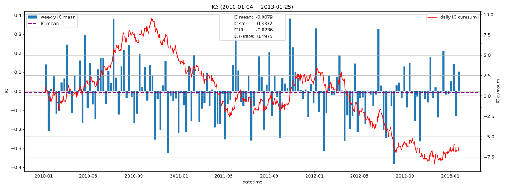

|         |   total |   2010 |    2011 |    2012 |   2013 |
|:--------|--------:|-------:|--------:|--------:|-------:|
| IC_mean | -0.0079 | 0.0168 | -0.0101 | -0.0322 | 0.0189 |
| IC_std  |  0.3372 | 0.3412 |  0.3342 |  0.3381 | 0.3070 |
| IC_IR   | -0.0236 | 0.0492 | -0.0303 | -0.0953 | 0.0617 |

### 5D
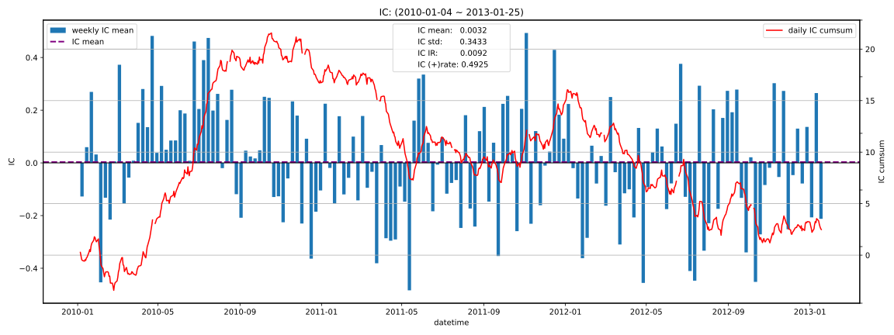

|         |   total |   2010 |    2011 |    2012 |    2013 |
|:--------|--------:|-------:|--------:|--------:|--------:|
| IC_mean |  0.0032 | 0.0654 | -0.0080 | -0.0443 | -0.0537 |
| IC_std  |  0.3433 | 0.3502 |  0.3352 |  0.3396 |  0.2877 |
| IC_IR   |  0.0092 | 0.1866 | -0.0239 | -0.1306 | -0.1867 |

### 10D
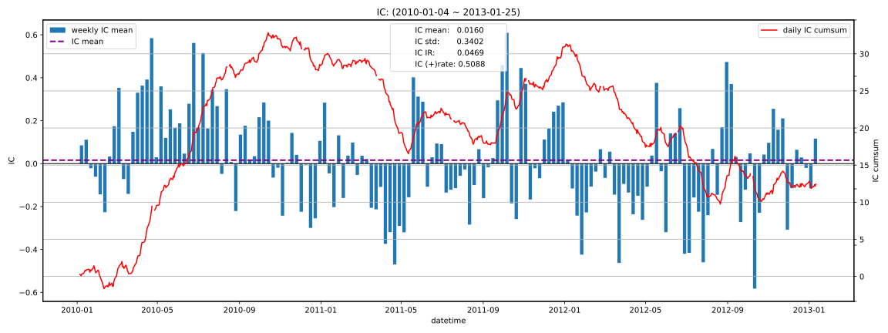

|         |   total |   2010 |   2011 |    2012 |    2013 |
|:--------|--------:|-------:|-------:|--------:|--------:|
| IC_mean |  0.0160 | 0.1109 | 0.0097 | -0.0708 | -0.0214 |
| IC_std  |  0.3402 | 0.3307 | 0.3383 |  0.3300 |  0.2981 |
| IC_IR   |  0.0469 | 0.3355 | 0.0288 | -0.2146 | -0.0719 |

### 20D
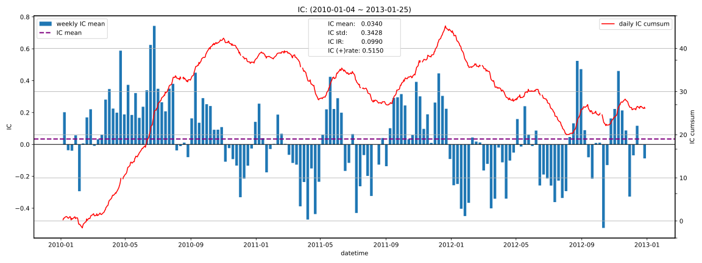

|         |   total |   2010 |   2011 |    2012 |   2013 |
|:--------|--------:|-------:|-------:|--------:|-------:|
| IC_mean |  0.0340 | 0.1465 | 0.0262 | -0.0703 |    nan |
| IC_std  |  0.3428 | 0.3299 | 0.3376 |  0.3272 |    nan |
| IC_IR   |  0.0990 | 0.4440 | 0.0775 | -0.2149 |    nan |

## 收益分析
### 分层收益
### 1D
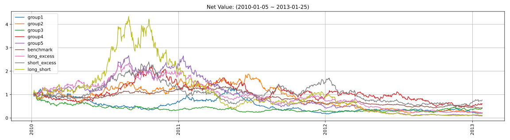

|               |   ann_ret |   max_dd |   ann_sharpe |   ann_calmar |   win_rate |   avg_win_ret |   avg_loss_ret |   profit_loss_ratio |   ann_vol |
|:--------------|----------:|---------:|-------------:|-------------:|-----------:|--------------:|---------------:|--------------------:|----------:|
| group5(long)  |   -0.5305 |   0.9673 |      -0.8032 |      -8.7064 |     0.4728 |        0.0340 |        -0.0345 |              0.9853 |    0.6645 |
| group1(short) |   -0.4041 |   0.8619 |      -0.4668 |      -7.4433 |     0.4804 |        0.0337 |        -0.0335 |              1.0067 |    0.6522 |
| benchmark     |   -0.2306 |   0.6877 |      -0.7398 |      -5.3219 |     0.4740 |        0.0150 |        -0.0151 |              0.9887 |    0.2952 |
| long_excess   |   -0.3864 |   0.9117 |      -0.5367 |      -6.7272 |     0.4677 |        0.0310 |        -0.0296 |              1.0477 |    0.5874 |
| short_excess  |   -0.0809 |   0.8024 |       0.1475 |      -1.6012 |     0.4943 |        0.0306 |        -0.0292 |              1.0467 |    0.5837 |
| long_short    |   -0.4896 |   0.9795 |      -0.2445 |      -7.9352 |     0.5032 |        0.0463 |        -0.0487 |              0.9503 |    0.9375 |

### 5D
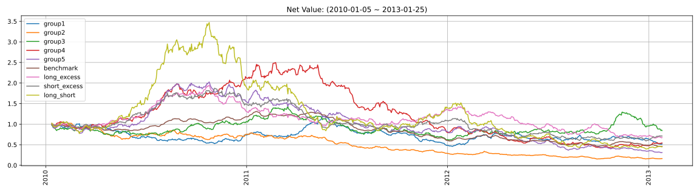

|               |   ann_ret |   max_dd |   ann_sharpe |   ann_calmar |   win_rate |   avg_win_ret |   avg_loss_ret |   profit_loss_ratio |   ann_vol |
|:--------------|----------:|---------:|-------------:|-------------:|-----------:|--------------:|---------------:|--------------------:|----------:|
| group5(long)  |   -0.3133 |   0.8493 |      -1.1647 |      -5.8551 |     0.4459 |        0.0150 |        -0.0144 |              1.0368 |    0.2871 |
| group1(short) |   -0.1902 |   0.6152 |      -0.5634 |      -4.9084 |     0.4688 |        0.0151 |        -0.0146 |              1.0360 |    0.2966 |
| benchmark     |   -0.2209 |   0.6523 |      -1.8139 |      -5.3764 |     0.4637 |        0.0063 |        -0.0072 |              0.8718 |    0.1327 |
| long_excess   |   -0.1194 |   0.6595 |      -0.3621 |      -2.8735 |     0.4892 |        0.0131 |        -0.0132 |              0.9868 |    0.2587 |
| short_excess  |   -0.1037 |   0.6853 |      -0.2752 |      -2.4012 |     0.5019 |        0.0131 |        -0.0137 |              0.9500 |    0.2674 |
| long_short    |   -0.2261 |   0.8869 |      -0.3968 |      -4.0470 |     0.4955 |        0.0208 |        -0.0218 |              0.9565 |    0.4216 |

### 10D
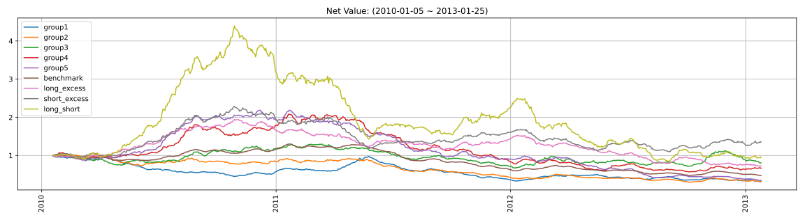

|               |   ann_ret |   max_dd |   ann_sharpe |   ann_calmar |   win_rate |   avg_win_ret |   avg_loss_ret |   profit_loss_ratio |   ann_vol |
|:--------------|----------:|---------:|-------------:|-------------:|-----------:|--------------:|---------------:|--------------------:|----------:|
| group5(long)  |   -0.2898 |   0.8434 |      -1.6083 |      -5.4551 |     0.4436 |        0.0100 |        -0.0103 |              0.9735 |    0.2002 |
| group1(short) |   -0.3140 |   0.6885 |      -1.6915 |      -7.2389 |     0.4436 |        0.0105 |        -0.0109 |              0.9627 |    0.2097 |
| benchmark     |   -0.2138 |   0.6344 |      -2.5298 |      -5.3495 |     0.4154 |        0.0048 |        -0.0050 |              0.9563 |    0.0933 |
| long_excess   |   -0.0970 |   0.6298 |      -0.4786 |      -2.4454 |     0.4615 |        0.0094 |        -0.0087 |              1.0817 |    0.1796 |
| short_excess  |    0.1049 |   0.5215 |       0.6112 |       3.1914 |     0.5346 |        0.0096 |        -0.0100 |              0.9588 |    0.1940 |
| long_short    |   -0.0123 |   0.8082 |       0.1086 |      -0.2418 |     0.5038 |        0.0148 |        -0.0148 |              1.0021 |    0.3001 |

### 20D
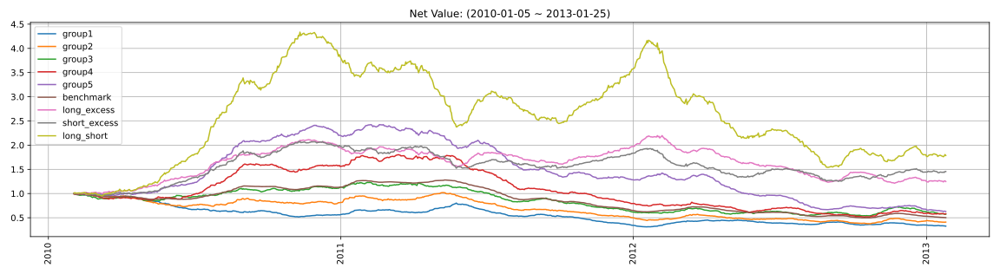

|               |   ann_ret |   max_dd |   ann_sharpe |   ann_calmar |   win_rate |   avg_win_ret |   avg_loss_ret |   profit_loss_ratio |   ann_vol |
|:--------------|----------:|---------:|-------------:|-------------:|-----------:|--------------:|---------------:|--------------------:|----------:|
| group5(long)  |   -0.1413 |   0.7411 |      -0.9842 |      -3.0264 |     0.4416 |        0.0076 |        -0.0070 |              1.0825 |    0.1442 |
| group1(short) |   -0.3065 |   0.6887 |      -2.4209 |      -7.0646 |     0.4013 |        0.0076 |        -0.0074 |              1.0189 |    0.1467 |
| benchmark     |   -0.2019 |   0.6130 |      -3.3374 |      -5.2276 |     0.3831 |        0.0034 |        -0.0035 |              0.9591 |    0.0669 |
| long_excess   |    0.0754 |   0.4480 |       0.6197 |       2.6701 |     0.4831 |        0.0072 |        -0.0061 |              1.1799 |    0.1311 |
| short_excess  |    0.1307 |   0.3973 |       0.9797 |       5.2200 |     0.5675 |        0.0063 |        -0.0071 |              0.8920 |    0.1346 |
| long_short    |    0.2092 |   0.6447 |       0.9906 |       5.1504 |     0.5364 |        0.0107 |        -0.0106 |              1.0132 |    0.2152 |

### 因子加权日频收益
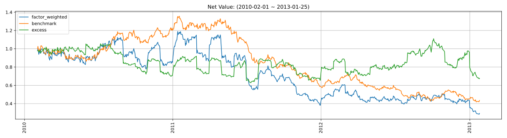

|                 |   ann_ret |   max_dd |   ann_sharpe |   ann_calmar |   win_rate |   avg_win_ret |   avg_loss_ret |   profit_loss_ratio |   ann_vol |
|:----------------|----------:|---------:|-------------:|-------------:|-----------:|--------------:|---------------:|--------------------:|----------:|
| factor_weighted |   -0.3277 |   0.7618 |      -0.4537 |      -6.8282 |     0.4788 |        0.0222 |        -0.0223 |              0.9960 |    0.5465 |
| benchmark       |   -0.2362 |   0.6918 |      -0.7668 |      -5.4201 |     0.4724 |        0.0149 |        -0.0151 |              0.9909 |    0.2946 |
| excess          |   -0.1195 |   0.4043 |      -0.0484 |      -4.6932 |     0.4981 |        0.0149 |        -0.0149 |              0.9958 |    0.4621 |

### 单因子策略(0.8, 1.0)收益
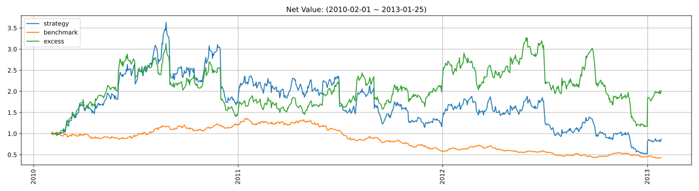

|           |   ann_ret |   max_dd |   ann_sharpe |   ann_calmar |   win_rate |   avg_win_ret |   avg_loss_ret |   profit_loss_ratio |   ann_vol |
|:----------|----------:|---------:|-------------:|-------------:|-----------:|--------------:|---------------:|--------------------:|----------:|
| strategy  |   -0.0440 |   0.8580 |       0.3538 |      -0.8139 |     0.4904 |        0.0356 |        -0.0320 |              1.1140 |    0.8342 |
| benchmark |   -0.2362 |   0.6918 |      -0.7668 |      -5.4201 |     0.4724 |        0.0149 |        -0.0151 |              0.9909 |    0.2946 |
| excess    |    0.2553 |   0.6454 |       0.6683 |       6.2792 |     0.5186 |        0.0300 |        -0.0281 |              1.0704 |    0.7802 |

## 换手率分析
### 分层换手率

|         |   turnover_count |   turnover_mean |   turnover_std |
|:--------|-----------------:|----------------:|---------------:|
| group_1 |         732.0000 |          0.7213 |         0.2485 |
| group_2 |         768.0000 |          0.7871 |         0.2474 |
| group_3 |         758.0000 |          0.8140 |         0.2418 |
| group_4 |         763.0000 |          0.8054 |         0.2440 |
| group_5 |         715.0000 |          0.6972 |         0.2445 |

### 因子加权持仓换手率
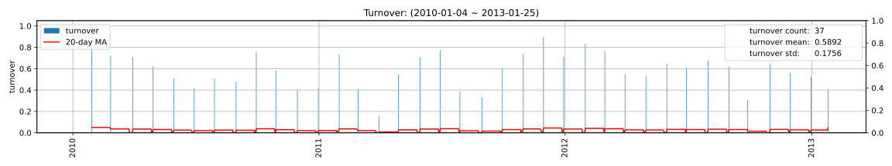

|                 |   turnover_count |   turnover_mean |   turnover_std |
|:----------------|-----------------:|----------------:|---------------:|
| factor_weighted |          37.0000 |          0.5892 |         0.1756 |

### 单因子策略(0.8, 1.0)换手率
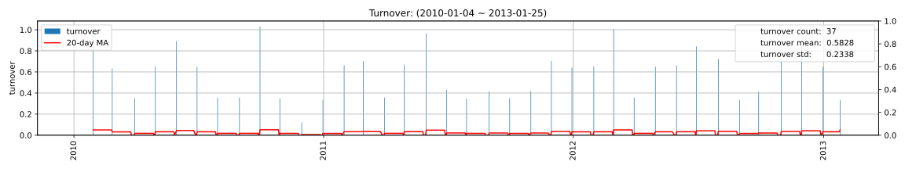

|          |   turnover_count |   turnover_mean |   turnover_std |
|:---------|-----------------:|----------------:|---------------:|
| strategy |          37.0000 |          0.5828 |         0.2338 |

