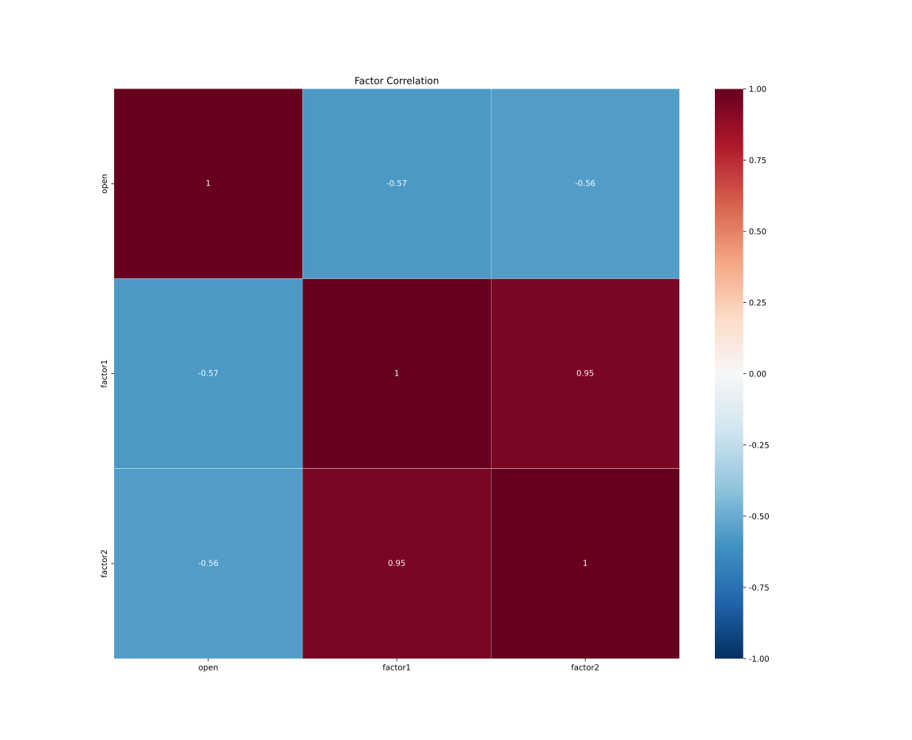
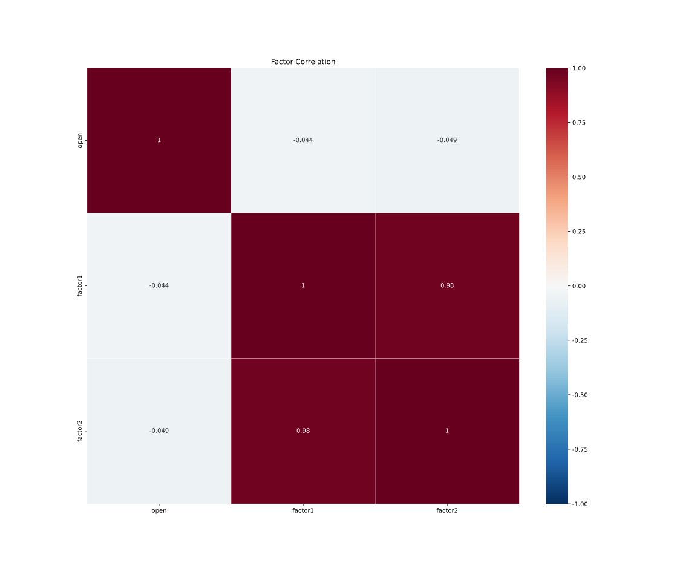

# 因子分析报告

## RandomGenerated1，3个因子

### RankIC比较，根据(T=20,IR)降序

<table border="1" class="dataframe">
  <thead>
    <tr>
      <th></th>
      <th colspan="3" halign="left">T=1</th>
      <th colspan="3" halign="left">T=5</th>
      <th colspan="3" halign="left">T=10</th>
      <th colspan="3" halign="left">T=20</th>
    </tr>
    <tr>
      <th></th>
      <th>mean</th>
      <th>std</th>
      <th>IR</th>
      <th>mean</th>
      <th>std</th>
      <th>IR</th>
      <th>mean</th>
      <th>std</th>
      <th>IR</th>
      <th>mean</th>
      <th>std</th>
      <th>IR</th>
    </tr>
  </thead>
  <tbody>
    <tr>
      <th>open</th>
      <td style="text-align:right; background-color:rgba(248, 191, 163, 76)">0.0439</td>
      <td style="text-align:right; background-color:rgba(176, 212, 230, 76)">0.3083</td>
      <td style="text-align:right; background-color:rgba(248, 191, 163, 76)">0.1425</td>
      <td style="text-align:right; background-color:rgba(248, 191, 163, 76)">0.0941</td>
      <td style="text-align:right; background-color:rgba(248, 191, 163, 76)">0.3166</td>
      <td style="text-align:right; background-color:rgba(248, 191, 163, 76)">0.2971</td>
      <td style="text-align:right; background-color:rgba(248, 191, 163, 76)">0.1529</td>
      <td style="text-align:right; background-color:rgba(176, 212, 230, 76)">0.2948</td>
      <td style="text-align:right; background-color:rgba(248, 191, 163, 76)">0.5187</td>
      <td style="text-align:right; background-color:rgba(248, 191, 163, 76)">0.196</td>
      <td style="text-align:right; background-color:rgba(176, 212, 230, 76)">0.2869</td>
      <td style="text-align:right; background-color:rgba(248, 191, 163, 76)">0.6829</td>
    </tr>
    <tr>
      <th>factor2</th>
      <td style="text-align:right; background-color:rgba(176, 212, 230, 76)">-0.0463</td>
      <td style="text-align:right; background-color:rgba(248, 191, 163, 76)">0.3385</td>
      <td style="text-align:right; background-color:rgba(181, 215, 232, 76)">-0.1367</td>
      <td style="text-align:right; background-color:rgba(176, 212, 230, 76)">-0.0413</td>
      <td style="text-align:right; background-color:rgba(176, 212, 230, 76)">0.3081</td>
      <td style="text-align:right; background-color:rgba(176, 212, 230, 76)">-0.1341</td>
      <td style="text-align:right; background-color:rgba(176, 212, 230, 76)">-0.0882</td>
      <td style="text-align:right; background-color:rgba(250, 202, 177, 76)">0.323</td>
      <td style="text-align:right; background-color:rgba(176, 212, 230, 76)">-0.2732</td>
      <td style="text-align:right; background-color:rgba(176, 212, 230, 76)">-0.1222</td>
      <td style="text-align:right; background-color:rgba(251, 227, 214, 76)">0.3088</td>
      <td style="text-align:right; background-color:rgba(176, 212, 230, 76)">-0.3957</td>
    </tr>
    <tr>
      <th>factor1</th>
      <td style="text-align:right; background-color:rgba(176, 212, 230, 76)">-0.0463</td>
      <td style="text-align:right; background-color:rgba(216, 232, 241, 76)">0.3153</td>
      <td style="text-align:right; background-color:rgba(176, 212, 230, 76)">-0.1467</td>
      <td style="text-align:right; background-color:rgba(181, 215, 232, 76)">-0.0375</td>
      <td style="text-align:right; background-color:rgba(222, 235, 242, 76)">0.3106</td>
      <td style="text-align:right; background-color:rgba(181, 215, 232, 76)">-0.1206</td>
      <td style="text-align:right; background-color:rgba(179, 213, 231, 76)">-0.0846</td>
      <td style="text-align:right; background-color:rgba(248, 191, 163, 76)">0.325</td>
      <td style="text-align:right; background-color:rgba(181, 215, 232, 76)">-0.2603</td>
      <td style="text-align:right; background-color:rgba(179, 213, 231, 76)">-0.1184</td>
      <td style="text-align:right; background-color:rgba(248, 191, 163, 76)">0.3169</td>
      <td style="text-align:right; background-color:rgba(181, 215, 232, 76)">-0.3736</td>
    </tr>
  </tbody>
</table>
### 因子(T=20)收益比较，根据sharpe降序

#### 多空组合

<table border="1" class="dataframe">
  <thead>
    <tr>
      <th></th>
      <th colspan="6" halign="left">return</th>
      <th colspan="2" halign="left">turnover</th>
    </tr>
    <tr>
      <th></th>
      <th>ann_ret</th>
      <th>max_dd</th>
      <th>sharpe</th>
      <th>calmar</th>
      <th>win_rate</th>
      <th>ann_vol</th>
      <th>count</th>
      <th>mean</th>
    </tr>
  </thead>
  <tbody>
    <tr>
      <th>open</th>
      <td style="text-align:right; background-color:rgba(248, 191, 163, 76)">1.355</td>
      <td style="text-align:right; background-color:rgba(176, 212, 230, 76)">0.3223</td>
      <td style="text-align:right; background-color:rgba(248, 191, 163, 76)">1.391</td>
      <td style="text-align:right; background-color:rgba(248, 191, 163, 76)">4.2044</td>
      <td style="text-align:right; background-color:rgba(248, 191, 163, 76)">0.5363</td>
      <td style="text-align:right; background-color:rgba(248, 191, 163, 76)">0.9138</td>
      <td style="text-align:right; background-color:rgba(176, 212, 230, 76)">14</td>
      <td style="text-align:right; background-color:rgba(176, 212, 230, 76)">0.6072</td>
    </tr>
    <tr>
      <th>factor2</th>
      <td style="text-align:right; background-color:rgba(222, 235, 242, 76)">-0.0227</td>
      <td style="text-align:right; background-color:rgba(252, 221, 202, 76)">0.555</td>
      <td style="text-align:right; background-color:rgba(247, 246, 246, 76)">0.3839</td>
      <td style="text-align:right; background-color:rgba(210, 229, 240, 76)">-0.041</td>
      <td style="text-align:right; background-color:rgba(176, 212, 230, 76)">0.5028</td>
      <td style="text-align:right; background-color:rgba(176, 212, 230, 76)">0.8202</td>
      <td style="text-align:right; background-color:rgba(248, 191, 163, 76)">18</td>
      <td style="text-align:right; background-color:rgba(248, 191, 163, 76)">0.6389</td>
    </tr>
    <tr>
      <th>factor1</th>
      <td style="text-align:right; background-color:rgba(176, 212, 230, 76)">-0.5908</td>
      <td style="text-align:right; background-color:rgba(248, 191, 163, 76)">0.6092</td>
      <td style="text-align:right; background-color:rgba(176, 212, 230, 76)">-0.6449</td>
      <td style="text-align:right; background-color:rgba(176, 212, 230, 76)">-0.9698</td>
      <td style="text-align:right; background-color:rgba(176, 212, 230, 76)">0.5028</td>
      <td style="text-align:right; background-color:rgba(210, 229, 240, 76)">0.837</td>
      <td style="text-align:right; background-color:rgba(251, 225, 210, 76)">17</td>
      <td style="text-align:right; background-color:rgba(226, 237, 243, 76)">0.6177</td>
    </tr>
  </tbody>
</table>

#### 多头超额

<table border="1" class="dataframe">
  <thead>
    <tr>
      <th></th>
      <th colspan="6" halign="left">return</th>
      <th colspan="2" halign="left">turnover</th>
    </tr>
    <tr>
      <th></th>
      <th>ann_ret</th>
      <th>max_dd</th>
      <th>sharpe</th>
      <th>calmar</th>
      <th>win_rate</th>
      <th>ann_vol</th>
      <th>count</th>
      <th>mean</th>
    </tr>
  </thead>
  <tbody>
    <tr>
      <th>open</th>
      <td style="text-align:right; background-color:rgba(248, 191, 163, 76)">4.3663</td>
      <td style="text-align:right; background-color:rgba(176, 212, 230, 76)">0.3874</td>
      <td style="text-align:right; background-color:rgba(248, 191, 163, 76)">2.0807</td>
      <td style="text-align:right; background-color:rgba(248, 191, 163, 76)">11.2703</td>
      <td style="text-align:right; background-color:rgba(248, 191, 163, 76)">0.5393</td>
      <td style="text-align:right; background-color:rgba(176, 212, 230, 76)">1.0993</td>
      <td style="text-align:right; background-color:rgba(176, 212, 230, 76)">5</td>
      <td style="text-align:right; background-color:rgba(176, 212, 230, 76)">0.5</td>
    </tr>
    <tr>
      <th>factor2</th>
      <td style="text-align:right; background-color:rgba(181, 215, 232, 76)">0.3655</td>
      <td style="text-align:right; background-color:rgba(248, 191, 163, 76)">0.5103</td>
      <td style="text-align:right; background-color:rgba(184, 216, 232, 76)">0.8451</td>
      <td style="text-align:right; background-color:rgba(179, 213, 231, 76)">0.7162</td>
      <td style="text-align:right; background-color:rgba(176, 212, 230, 76)">0.5337</td>
      <td style="text-align:right; background-color:rgba(251, 225, 210, 76)">1.1528</td>
      <td style="text-align:right; background-color:rgba(248, 191, 163, 76)">9</td>
      <td style="text-align:right; background-color:rgba(248, 191, 163, 76)">0.6111</td>
    </tr>
    <tr>
      <th>factor1</th>
      <td style="text-align:right; background-color:rgba(176, 212, 230, 76)">0.2747</td>
      <td style="text-align:right; background-color:rgba(252, 221, 202, 76)">0.4861</td>
      <td style="text-align:right; background-color:rgba(176, 212, 230, 76)">0.7916</td>
      <td style="text-align:right; background-color:rgba(176, 212, 230, 76)">0.5651</td>
      <td style="text-align:right; background-color:rgba(248, 191, 163, 76)">0.5393</td>
      <td style="text-align:right; background-color:rgba(248, 191, 163, 76)">1.1706</td>
      <td style="text-align:right; background-color:rgba(248, 191, 163, 76)">9</td>
      <td style="text-align:right; background-color:rgba(247, 246, 246, 76)">0.5556</td>
    </tr>
  </tbody>
</table>

#### 空头超额

<table border="1" class="dataframe">
  <thead>
    <tr>
      <th></th>
      <th colspan="6" halign="left">return</th>
      <th colspan="2" halign="left">turnover</th>
    </tr>
    <tr>
      <th></th>
      <th>ann_ret</th>
      <th>max_dd</th>
      <th>sharpe</th>
      <th>calmar</th>
      <th>win_rate</th>
      <th>ann_vol</th>
      <th>count</th>
      <th>mean</th>
    </tr>
  </thead>
  <tbody>
    <tr>
      <th>factor2</th>
      <td style="text-align:right; background-color:rgba(248, 191, 163, 76)">-0.7274</td>
      <td style="text-align:right; background-color:rgba(176, 212, 230, 76)">0.8111</td>
      <td style="text-align:right; background-color:rgba(248, 191, 163, 76)">-0.5824</td>
      <td style="text-align:right; background-color:rgba(248, 191, 163, 76)">-0.8968</td>
      <td style="text-align:right; background-color:rgba(248, 191, 163, 76)">0.4888</td>
      <td style="text-align:right; background-color:rgba(181, 215, 232, 76)">1.1292</td>
      <td style="text-align:right; background-color:rgba(248, 191, 163, 76)">9</td>
      <td style="text-align:right; background-color:rgba(176, 212, 230, 76)">0.6667</td>
    </tr>
    <tr>
      <th>open</th>
      <td style="text-align:right; background-color:rgba(228, 238, 243, 76)">-0.828</td>
      <td style="text-align:right; background-color:rgba(181, 215, 232, 76)">0.8132</td>
      <td style="text-align:right; background-color:rgba(249, 233, 223, 76)">-0.8295</td>
      <td style="text-align:right; background-color:rgba(176, 212, 230, 76)">-1.0181</td>
      <td style="text-align:right; background-color:rgba(248, 191, 163, 76)">0.4888</td>
      <td style="text-align:right; background-color:rgba(248, 191, 163, 76)">1.2166</td>
      <td style="text-align:right; background-color:rgba(248, 191, 163, 76)">9</td>
      <td style="text-align:right; background-color:rgba(176, 212, 230, 76)">0.6667</td>
    </tr>
    <tr>
      <th>factor1</th>
      <td style="text-align:right; background-color:rgba(176, 212, 230, 76)">-0.8794</td>
      <td style="text-align:right; background-color:rgba(248, 191, 163, 76)">0.8905</td>
      <td style="text-align:right; background-color:rgba(176, 212, 230, 76)">-1.3048</td>
      <td style="text-align:right; background-color:rgba(217, 233, 241, 76)">-0.9875</td>
      <td style="text-align:right; background-color:rgba(176, 212, 230, 76)">0.4663</td>
      <td style="text-align:right; background-color:rgba(176, 212, 230, 76)">1.1261</td>
      <td style="text-align:right; background-color:rgba(176, 212, 230, 76)">8</td>
      <td style="text-align:right; background-color:rgba(248, 191, 163, 76)">0.6875</td>
    </tr>
  </tbody>
</table>

### 单因子策略收益比较，根据sharpe降序

<table border="1" class="dataframe">
  <thead>
    <tr>
      <th></th>
      <th colspan="6" halign="left">excess_return</th>
      <th colspan="3" halign="left">turnover</th>
    </tr>
    <tr>
      <th></th>
      <th>ann_ret</th>
      <th>max_dd</th>
      <th>sharpe</th>
      <th>calmar</th>
      <th>win_rate</th>
      <th>ann_vol</th>
      <th>count</th>
      <th>mean</th>
      <th>std</th>
    </tr>
  </thead>
  <tbody>
    <tr>
      <th>open</th>
      <td style="text-align:right; background-color:rgba(248, 191, 163, 76)">6.1591</td>
      <td style="text-align:right; background-color:rgba(176, 212, 230, 76)">0.4303</td>
      <td style="text-align:right; background-color:rgba(248, 191, 163, 76)">2.336</td>
      <td style="text-align:right; background-color:rgba(248, 191, 163, 76)">14.3145</td>
      <td style="text-align:right; background-color:rgba(248, 191, 163, 76)">0.5475</td>
      <td style="text-align:right; background-color:rgba(176, 212, 230, 76)">1.1043</td>
      <td style="text-align:right; background-color:rgba(247, 246, 246, 76)">9</td>
      <td style="text-align:right; background-color:rgba(176, 212, 230, 76)">0.3802</td>
      <td style="text-align:right; background-color:rgba(176, 212, 230, 76)">0.1931</td>
    </tr>
    <tr>
      <th>factor2</th>
      <td style="text-align:right; background-color:rgba(176, 212, 230, 76)">-0.1941</td>
      <td style="text-align:right; background-color:rgba(248, 191, 163, 76)">0.6026</td>
      <td style="text-align:right; background-color:rgba(176, 212, 230, 76)">0.3654</td>
      <td style="text-align:right; background-color:rgba(176, 212, 230, 76)">-0.322</td>
      <td style="text-align:right; background-color:rgba(226, 237, 243, 76)">0.5028</td>
      <td style="text-align:right; background-color:rgba(238, 243, 245, 76)">1.1249</td>
      <td style="text-align:right; background-color:rgba(247, 246, 246, 76)">9</td>
      <td style="text-align:right; background-color:rgba(248, 191, 163, 76)">0.6574</td>
      <td style="text-align:right; background-color:rgba(248, 191, 163, 76)">0.3869</td>
    </tr>
    <tr>
      <th>factor1</th>
      <td style="text-align:right; background-color:rgba(176, 212, 230, 76)">-0.2186</td>
      <td style="text-align:right; background-color:rgba(251, 210, 188, 76)">0.5811</td>
      <td style="text-align:right; background-color:rgba(176, 212, 230, 76)">0.3581</td>
      <td style="text-align:right; background-color:rgba(176, 212, 230, 76)">-0.3763</td>
      <td style="text-align:right; background-color:rgba(176, 212, 230, 76)">0.4804</td>
      <td style="text-align:right; background-color:rgba(248, 191, 163, 76)">1.1526</td>
      <td style="text-align:right; background-color:rgba(247, 246, 246, 76)">9</td>
      <td style="text-align:right; background-color:rgba(251, 227, 214, 76)">0.582</td>
      <td style="text-align:right; background-color:rgba(252, 220, 200, 76)">0.3513</td>
    </tr>
  </tbody>
</table>

### 因子相关性热力图

### 因子等权组合优化

#### 没有找到优化因子

## RandomGenerated2，3个因子

### RankIC比较，根据(T=20,IR)降序

<table border="1" class="dataframe">
  <thead>
    <tr>
      <th></th>
      <th colspan="3" halign="left">T=1</th>
      <th colspan="3" halign="left">T=5</th>
      <th colspan="3" halign="left">T=10</th>
      <th colspan="3" halign="left">T=20</th>
    </tr>
    <tr>
      <th></th>
      <th>mean</th>
      <th>std</th>
      <th>IR</th>
      <th>mean</th>
      <th>std</th>
      <th>IR</th>
      <th>mean</th>
      <th>std</th>
      <th>IR</th>
      <th>mean</th>
      <th>std</th>
      <th>IR</th>
    </tr>
  </thead>
  <tbody>
    <tr>
      <th>open</th>
      <td style="text-align:right; background-color:rgba(176, 212, 230, 76)">0.0081</td>
      <td style="text-align:right; background-color:rgba(176, 212, 230, 76)">0.3405</td>
      <td style="text-align:right; background-color:rgba(176, 212, 230, 76)">0.0239</td>
      <td style="text-align:right; background-color:rgba(248, 191, 163, 76)">0.0577</td>
      <td style="text-align:right; background-color:rgba(176, 212, 230, 76)">0.3199</td>
      <td style="text-align:right; background-color:rgba(248, 191, 163, 76)">0.1804</td>
      <td style="text-align:right; background-color:rgba(248, 191, 163, 76)">0.063</td>
      <td style="text-align:right; background-color:rgba(176, 212, 230, 76)">0.3131</td>
      <td style="text-align:right; background-color:rgba(248, 191, 163, 76)">0.2013</td>
      <td style="text-align:right; background-color:rgba(248, 191, 163, 76)">0.0926</td>
      <td style="text-align:right; background-color:rgba(248, 191, 163, 76)">0.362</td>
      <td style="text-align:right; background-color:rgba(248, 191, 163, 76)">0.2558</td>
    </tr>
    <tr>
      <th>factor1</th>
      <td style="text-align:right; background-color:rgba(248, 191, 163, 76)">0.0297</td>
      <td style="text-align:right; background-color:rgba(248, 191, 163, 76)">0.3586</td>
      <td style="text-align:right; background-color:rgba(248, 191, 163, 76)">0.0827</td>
      <td style="text-align:right; background-color:rgba(176, 212, 230, 76)">0.034</td>
      <td style="text-align:right; background-color:rgba(248, 239, 234, 76)">0.3225</td>
      <td style="text-align:right; background-color:rgba(176, 212, 230, 76)">0.1055</td>
      <td style="text-align:right; background-color:rgba(189, 218, 234, 76)">0.0242</td>
      <td style="text-align:right; background-color:rgba(248, 191, 163, 76)">0.3414</td>
      <td style="text-align:right; background-color:rgba(186, 217, 233, 76)">0.0709</td>
      <td style="text-align:right; background-color:rgba(189, 218, 234, 76)">0.006</td>
      <td style="text-align:right; background-color:rgba(176, 212, 230, 76)">0.3462</td>
      <td style="text-align:right; background-color:rgba(189, 218, 234, 76)">0.0173</td>
    </tr>
    <tr>
      <th>factor2</th>
      <td style="text-align:right; background-color:rgba(249, 235, 227, 76)">0.022</td>
      <td style="text-align:right; background-color:rgba(251, 226, 212, 76)">0.3539</td>
      <td style="text-align:right; background-color:rgba(249, 234, 225, 76)">0.0622</td>
      <td style="text-align:right; background-color:rgba(181, 215, 232, 76)">0.0344</td>
      <td style="text-align:right; background-color:rgba(248, 191, 163, 76)">0.3243</td>
      <td style="text-align:right; background-color:rgba(179, 213, 231, 76)">0.1061</td>
      <td style="text-align:right; background-color:rgba(176, 212, 230, 76)">0.0211</td>
      <td style="text-align:right; background-color:rgba(249, 233, 223, 76)">0.3317</td>
      <td style="text-align:right; background-color:rgba(176, 212, 230, 76)">0.0635</td>
      <td style="text-align:right; background-color:rgba(176, 212, 230, 76)">-0.0006</td>
      <td style="text-align:right; background-color:rgba(201, 225, 237, 76)">0.3483</td>
      <td style="text-align:right; background-color:rgba(176, 212, 230, 76)">-0.0017</td>
    </tr>
  </tbody>
</table>
### 因子(T=20)收益比较，根据sharpe降序

#### 多空组合

<table border="1" class="dataframe">
  <thead>
    <tr>
      <th></th>
      <th colspan="6" halign="left">return</th>
      <th colspan="2" halign="left">turnover</th>
    </tr>
    <tr>
      <th></th>
      <th>ann_ret</th>
      <th>max_dd</th>
      <th>sharpe</th>
      <th>calmar</th>
      <th>win_rate</th>
      <th>ann_vol</th>
      <th>count</th>
      <th>mean</th>
    </tr>
  </thead>
  <tbody>
    <tr>
      <th>factor2</th>
      <td style="text-align:right; background-color:rgba(248, 191, 163, 76)">3.711</td>
      <td style="text-align:right; background-color:rgba(176, 212, 230, 76)">0.3852</td>
      <td style="text-align:right; background-color:rgba(248, 191, 163, 76)">2.2569</td>
      <td style="text-align:right; background-color:rgba(248, 191, 163, 76)">9.6329</td>
      <td style="text-align:right; background-color:rgba(247, 246, 246, 76)">0.5251</td>
      <td style="text-align:right; background-color:rgba(189, 218, 234, 76)">0.845</td>
      <td style="text-align:right; background-color:rgba(248, 191, 163, 76)">15</td>
      <td style="text-align:right; background-color:rgba(248, 191, 163, 76)">0.7667</td>
    </tr>
    <tr>
      <th>factor1</th>
      <td style="text-align:right; background-color:rgba(249, 233, 223, 76)">2.4903</td>
      <td style="text-align:right; background-color:rgba(176, 212, 230, 76)">0.3852</td>
      <td style="text-align:right; background-color:rgba(252, 222, 204, 76)">1.9083</td>
      <td style="text-align:right; background-color:rgba(249, 233, 223, 76)">6.4643</td>
      <td style="text-align:right; background-color:rgba(248, 191, 163, 76)">0.5363</td>
      <td style="text-align:right; background-color:rgba(176, 212, 230, 76)">0.8403</td>
      <td style="text-align:right; background-color:rgba(248, 191, 163, 76)">15</td>
      <td style="text-align:right; background-color:rgba(248, 191, 163, 76)">0.7667</td>
    </tr>
    <tr>
      <th>open</th>
      <td style="text-align:right; background-color:rgba(176, 212, 230, 76)">0.0987</td>
      <td style="text-align:right; background-color:rgba(248, 191, 163, 76)">0.4921</td>
      <td style="text-align:right; background-color:rgba(176, 212, 230, 76)">0.565</td>
      <td style="text-align:right; background-color:rgba(176, 212, 230, 76)">0.2006</td>
      <td style="text-align:right; background-color:rgba(176, 212, 230, 76)">0.514</td>
      <td style="text-align:right; background-color:rgba(248, 191, 163, 76)">0.9248</td>
      <td style="text-align:right; background-color:rgba(176, 212, 230, 76)">11</td>
      <td style="text-align:right; background-color:rgba(176, 212, 230, 76)">0.6364</td>
    </tr>
  </tbody>
</table>

#### 多头超额

<table border="1" class="dataframe">
  <thead>
    <tr>
      <th></th>
      <th colspan="6" halign="left">return</th>
      <th colspan="2" halign="left">turnover</th>
    </tr>
    <tr>
      <th></th>
      <th>ann_ret</th>
      <th>max_dd</th>
      <th>sharpe</th>
      <th>calmar</th>
      <th>win_rate</th>
      <th>ann_vol</th>
      <th>count</th>
      <th>mean</th>
    </tr>
  </thead>
  <tbody>
    <tr>
      <th>factor1</th>
      <td style="text-align:right; background-color:rgba(248, 191, 163, 76)">0.4577</td>
      <td style="text-align:right; background-color:rgba(209, 229, 240, 76)">0.3257</td>
      <td style="text-align:right; background-color:rgba(248, 191, 163, 76)">0.9541</td>
      <td style="text-align:right; background-color:rgba(248, 191, 163, 76)">1.4053</td>
      <td style="text-align:right; background-color:rgba(247, 246, 246, 76)">0.5169</td>
      <td style="text-align:right; background-color:rgba(176, 212, 230, 76)">0.5573</td>
      <td style="text-align:right; background-color:rgba(248, 191, 163, 76)">7</td>
      <td style="text-align:right; background-color:rgba(248, 191, 163, 76)">0.7857</td>
    </tr>
    <tr>
      <th>open</th>
      <td style="text-align:right; background-color:rgba(247, 246, 246, 76)">0.3918</td>
      <td style="text-align:right; background-color:rgba(248, 191, 163, 76)">0.4193</td>
      <td style="text-align:right; background-color:rgba(240, 243, 245, 76)">0.8572</td>
      <td style="text-align:right; background-color:rgba(176, 212, 230, 76)">0.9344</td>
      <td style="text-align:right; background-color:rgba(248, 191, 163, 76)">0.5337</td>
      <td style="text-align:right; background-color:rgba(248, 191, 163, 76)">0.582</td>
      <td style="text-align:right; background-color:rgba(176, 212, 230, 76)">6</td>
      <td style="text-align:right; background-color:rgba(176, 212, 230, 76)">0.6667</td>
    </tr>
    <tr>
      <th>factor2</th>
      <td style="text-align:right; background-color:rgba(176, 212, 230, 76)">0.3255</td>
      <td style="text-align:right; background-color:rgba(176, 212, 230, 76)">0.3062</td>
      <td style="text-align:right; background-color:rgba(176, 212, 230, 76)">0.7824</td>
      <td style="text-align:right; background-color:rgba(220, 234, 242, 76)">1.0631</td>
      <td style="text-align:right; background-color:rgba(176, 212, 230, 76)">0.5</td>
      <td style="text-align:right; background-color:rgba(189, 218, 234, 76)">0.559</td>
      <td style="text-align:right; background-color:rgba(248, 191, 163, 76)">7</td>
      <td style="text-align:right; background-color:rgba(248, 191, 163, 76)">0.7857</td>
    </tr>
  </tbody>
</table>

#### 空头超额

<table border="1" class="dataframe">
  <thead>
    <tr>
      <th></th>
      <th colspan="6" halign="left">return</th>
      <th colspan="2" halign="left">turnover</th>
    </tr>
    <tr>
      <th></th>
      <th>ann_ret</th>
      <th>max_dd</th>
      <th>sharpe</th>
      <th>calmar</th>
      <th>win_rate</th>
      <th>ann_vol</th>
      <th>count</th>
      <th>mean</th>
    </tr>
  </thead>
  <tbody>
    <tr>
      <th>factor2</th>
      <td style="text-align:right; background-color:rgba(248, 191, 163, 76)">2.8014</td>
      <td style="text-align:right; background-color:rgba(176, 212, 230, 76)">0.2068</td>
      <td style="text-align:right; background-color:rgba(248, 191, 163, 76)">2.7772</td>
      <td style="text-align:right; background-color:rgba(248, 191, 163, 76)">13.5446</td>
      <td style="text-align:right; background-color:rgba(248, 191, 163, 76)">0.5674</td>
      <td style="text-align:right; background-color:rgba(199, 223, 237, 76)">0.5331</td>
      <td style="text-align:right; background-color:rgba(248, 191, 163, 76)">8</td>
      <td style="text-align:right; background-color:rgba(248, 191, 163, 76)">0.75</td>
    </tr>
    <tr>
      <th>factor1</th>
      <td style="text-align:right; background-color:rgba(248, 239, 234, 76)">1.5641</td>
      <td style="text-align:right; background-color:rgba(176, 212, 230, 76)">0.2068</td>
      <td style="text-align:right; background-color:rgba(251, 226, 212, 76)">2.0582</td>
      <td style="text-align:right; background-color:rgba(248, 239, 234, 76)">7.5624</td>
      <td style="text-align:right; background-color:rgba(226, 237, 243, 76)">0.5225</td>
      <td style="text-align:right; background-color:rgba(176, 212, 230, 76)">0.5252</td>
      <td style="text-align:right; background-color:rgba(248, 191, 163, 76)">8</td>
      <td style="text-align:right; background-color:rgba(248, 191, 163, 76)">0.75</td>
    </tr>
    <tr>
      <th>open</th>
      <td style="text-align:right; background-color:rgba(176, 212, 230, 76)">-0.1414</td>
      <td style="text-align:right; background-color:rgba(248, 191, 163, 76)">0.254</td>
      <td style="text-align:right; background-color:rgba(176, 212, 230, 76)">0.0443</td>
      <td style="text-align:right; background-color:rgba(176, 212, 230, 76)">-0.5567</td>
      <td style="text-align:right; background-color:rgba(176, 212, 230, 76)">0.5</td>
      <td style="text-align:right; background-color:rgba(248, 191, 163, 76)">0.599</td>
      <td style="text-align:right; background-color:rgba(176, 212, 230, 76)">5</td>
      <td style="text-align:right; background-color:rgba(176, 212, 230, 76)">0.6</td>
    </tr>
  </tbody>
</table>

### 单因子策略收益比较，根据sharpe降序

<table border="1" class="dataframe">
  <thead>
    <tr>
      <th></th>
      <th colspan="6" halign="left">excess_return</th>
      <th colspan="3" halign="left">turnover</th>
    </tr>
    <tr>
      <th></th>
      <th>ann_ret</th>
      <th>max_dd</th>
      <th>sharpe</th>
      <th>calmar</th>
      <th>win_rate</th>
      <th>ann_vol</th>
      <th>count</th>
      <th>mean</th>
      <th>std</th>
    </tr>
  </thead>
  <tbody>
    <tr>
      <th>open</th>
      <td style="text-align:right; background-color:rgba(248, 191, 163, 76)">0.669</td>
      <td style="text-align:right; background-color:rgba(176, 212, 230, 76)">0.3969</td>
      <td style="text-align:right; background-color:rgba(248, 191, 163, 76)">1.1758</td>
      <td style="text-align:right; background-color:rgba(248, 191, 163, 76)">1.6856</td>
      <td style="text-align:right; background-color:rgba(248, 191, 163, 76)">0.5587</td>
      <td style="text-align:right; background-color:rgba(176, 212, 230, 76)">0.5763</td>
      <td style="text-align:right; background-color:rgba(247, 246, 246, 76)">9</td>
      <td style="text-align:right; background-color:rgba(176, 212, 230, 76)">0.3555</td>
      <td style="text-align:right; background-color:rgba(248, 191, 163, 76)">0.2584</td>
    </tr>
    <tr>
      <th>factor1</th>
      <td style="text-align:right; background-color:rgba(179, 213, 231, 76)">-0.455</td>
      <td style="text-align:right; background-color:rgba(248, 191, 163, 76)">0.5737</td>
      <td style="text-align:right; background-color:rgba(181, 215, 232, 76)">-0.7093</td>
      <td style="text-align:right; background-color:rgba(181, 215, 232, 76)">-0.7931</td>
      <td style="text-align:right; background-color:rgba(189, 218, 234, 76)">0.4749</td>
      <td style="text-align:right; background-color:rgba(250, 202, 177, 76)">0.6011</td>
      <td style="text-align:right; background-color:rgba(247, 246, 246, 76)">9</td>
      <td style="text-align:right; background-color:rgba(248, 193, 166, 76)">0.9042</td>
      <td style="text-align:right; background-color:rgba(176, 212, 230, 76)">0.2334</td>
    </tr>
    <tr>
      <th>factor2</th>
      <td style="text-align:right; background-color:rgba(176, 212, 230, 76)">-0.4671</td>
      <td style="text-align:right; background-color:rgba(251, 212, 190, 76)">0.5502</td>
      <td style="text-align:right; background-color:rgba(176, 212, 230, 76)">-0.7427</td>
      <td style="text-align:right; background-color:rgba(176, 212, 230, 76)">-0.8491</td>
      <td style="text-align:right; background-color:rgba(176, 212, 230, 76)">0.4693</td>
      <td style="text-align:right; background-color:rgba(248, 191, 163, 76)">0.6026</td>
      <td style="text-align:right; background-color:rgba(247, 246, 246, 76)">9</td>
      <td style="text-align:right; background-color:rgba(248, 191, 163, 76)">0.9078</td>
      <td style="text-align:right; background-color:rgba(194, 221, 235, 76)">0.2356</td>
    </tr>
  </tbody>
</table>

### 因子相关性热力图

### 因子等权组合优化

#### 没有找到优化因子

## factor1，2个选股池

### RankIC比较，根据(T=20,IR)降序

<table border="1" class="dataframe">
  <thead>
    <tr>
      <th></th>
      <th colspan="3" halign="left">T=1</th>
      <th colspan="3" halign="left">T=5</th>
      <th colspan="3" halign="left">T=10</th>
      <th colspan="3" halign="left">T=20</th>
    </tr>
    <tr>
      <th></th>
      <th>mean</th>
      <th>std</th>
      <th>IR</th>
      <th>mean</th>
      <th>std</th>
      <th>IR</th>
      <th>mean</th>
      <th>std</th>
      <th>IR</th>
      <th>mean</th>
      <th>std</th>
      <th>IR</th>
    </tr>
  </thead>
  <tbody>
    <tr>
      <th>RandomGenerated2</th>
      <td style="text-align:right; background-color:rgba(248, 191, 163, 76)">0.0297</td>
      <td style="text-align:right; background-color:rgba(248, 191, 163, 76)">0.3586</td>
      <td style="text-align:right; background-color:rgba(248, 191, 163, 76)">0.0827</td>
      <td style="text-align:right; background-color:rgba(248, 191, 163, 76)">0.034</td>
      <td style="text-align:right; background-color:rgba(248, 191, 163, 76)">0.3225</td>
      <td style="text-align:right; background-color:rgba(248, 191, 163, 76)">0.1055</td>
      <td style="text-align:right; background-color:rgba(248, 191, 163, 76)">0.0242</td>
      <td style="text-align:right; background-color:rgba(248, 191, 163, 76)">0.3414</td>
      <td style="text-align:right; background-color:rgba(248, 191, 163, 76)">0.0709</td>
      <td style="text-align:right; background-color:rgba(248, 191, 163, 76)">0.006</td>
      <td style="text-align:right; background-color:rgba(248, 191, 163, 76)">0.3462</td>
      <td style="text-align:right; background-color:rgba(248, 191, 163, 76)">0.0173</td>
    </tr>
    <tr>
      <th>RandomGenerated1</th>
      <td style="text-align:right; background-color:rgba(176, 212, 230, 76)">-0.0463</td>
      <td style="text-align:right; background-color:rgba(176, 212, 230, 76)">0.3153</td>
      <td style="text-align:right; background-color:rgba(176, 212, 230, 76)">-0.1467</td>
      <td style="text-align:right; background-color:rgba(176, 212, 230, 76)">-0.0375</td>
      <td style="text-align:right; background-color:rgba(176, 212, 230, 76)">0.3106</td>
      <td style="text-align:right; background-color:rgba(176, 212, 230, 76)">-0.1206</td>
      <td style="text-align:right; background-color:rgba(176, 212, 230, 76)">-0.0846</td>
      <td style="text-align:right; background-color:rgba(176, 212, 230, 76)">0.325</td>
      <td style="text-align:right; background-color:rgba(176, 212, 230, 76)">-0.2603</td>
      <td style="text-align:right; background-color:rgba(176, 212, 230, 76)">-0.1184</td>
      <td style="text-align:right; background-color:rgba(176, 212, 230, 76)">0.3169</td>
      <td style="text-align:right; background-color:rgba(176, 212, 230, 76)">-0.3736</td>
    </tr>
  </tbody>
</table>
### 因子(T=20)收益比较，根据sharpe降序

#### 多空组合

<table border="1" class="dataframe">
  <thead>
    <tr>
      <th></th>
      <th colspan="6" halign="left">return</th>
      <th colspan="2" halign="left">turnover</th>
    </tr>
    <tr>
      <th></th>
      <th>ann_ret</th>
      <th>max_dd</th>
      <th>sharpe</th>
      <th>calmar</th>
      <th>win_rate</th>
      <th>ann_vol</th>
      <th>count</th>
      <th>mean</th>
    </tr>
  </thead>
  <tbody>
    <tr>
      <th>RandomGenerated2</th>
      <td style="text-align:right; background-color:rgba(248, 191, 163, 76)">2.4903</td>
      <td style="text-align:right; background-color:rgba(176, 212, 230, 76)">0.3852</td>
      <td style="text-align:right; background-color:rgba(248, 191, 163, 76)">1.9083</td>
      <td style="text-align:right; background-color:rgba(248, 191, 163, 76)">6.4643</td>
      <td style="text-align:right; background-color:rgba(248, 191, 163, 76)">0.5363</td>
      <td style="text-align:right; background-color:rgba(248, 191, 163, 76)">0.8403</td>
      <td style="text-align:right; background-color:rgba(176, 212, 230, 76)">15</td>
      <td style="text-align:right; background-color:rgba(248, 191, 163, 76)">0.7667</td>
    </tr>
    <tr>
      <th>RandomGenerated1</th>
      <td style="text-align:right; background-color:rgba(176, 212, 230, 76)">-0.5908</td>
      <td style="text-align:right; background-color:rgba(248, 191, 163, 76)">0.6092</td>
      <td style="text-align:right; background-color:rgba(176, 212, 230, 76)">-0.6449</td>
      <td style="text-align:right; background-color:rgba(176, 212, 230, 76)">-0.9698</td>
      <td style="text-align:right; background-color:rgba(176, 212, 230, 76)">0.5028</td>
      <td style="text-align:right; background-color:rgba(176, 212, 230, 76)">0.837</td>
      <td style="text-align:right; background-color:rgba(248, 191, 163, 76)">17</td>
      <td style="text-align:right; background-color:rgba(176, 212, 230, 76)">0.6177</td>
    </tr>
  </tbody>
</table>

#### 多头超额

<table border="1" class="dataframe">
  <thead>
    <tr>
      <th></th>
      <th colspan="6" halign="left">return</th>
      <th colspan="2" halign="left">turnover</th>
    </tr>
    <tr>
      <th></th>
      <th>ann_ret</th>
      <th>max_dd</th>
      <th>sharpe</th>
      <th>calmar</th>
      <th>win_rate</th>
      <th>ann_vol</th>
      <th>count</th>
      <th>mean</th>
    </tr>
  </thead>
  <tbody>
    <tr>
      <th>RandomGenerated2</th>
      <td style="text-align:right; background-color:rgba(248, 191, 163, 76)">0.4577</td>
      <td style="text-align:right; background-color:rgba(176, 212, 230, 76)">0.3257</td>
      <td style="text-align:right; background-color:rgba(248, 191, 163, 76)">0.9541</td>
      <td style="text-align:right; background-color:rgba(248, 191, 163, 76)">1.4053</td>
      <td style="text-align:right; background-color:rgba(176, 212, 230, 76)">0.5169</td>
      <td style="text-align:right; background-color:rgba(176, 212, 230, 76)">0.5573</td>
      <td style="text-align:right; background-color:rgba(176, 212, 230, 76)">7</td>
      <td style="text-align:right; background-color:rgba(248, 191, 163, 76)">0.7857</td>
    </tr>
    <tr>
      <th>RandomGenerated1</th>
      <td style="text-align:right; background-color:rgba(176, 212, 230, 76)">0.2747</td>
      <td style="text-align:right; background-color:rgba(248, 191, 163, 76)">0.4861</td>
      <td style="text-align:right; background-color:rgba(176, 212, 230, 76)">0.7916</td>
      <td style="text-align:right; background-color:rgba(176, 212, 230, 76)">0.5651</td>
      <td style="text-align:right; background-color:rgba(248, 191, 163, 76)">0.5393</td>
      <td style="text-align:right; background-color:rgba(248, 191, 163, 76)">1.1706</td>
      <td style="text-align:right; background-color:rgba(248, 191, 163, 76)">9</td>
      <td style="text-align:right; background-color:rgba(176, 212, 230, 76)">0.5556</td>
    </tr>
  </tbody>
</table>

#### 空头超额

<table border="1" class="dataframe">
  <thead>
    <tr>
      <th></th>
      <th colspan="6" halign="left">return</th>
      <th colspan="2" halign="left">turnover</th>
    </tr>
    <tr>
      <th></th>
      <th>ann_ret</th>
      <th>max_dd</th>
      <th>sharpe</th>
      <th>calmar</th>
      <th>win_rate</th>
      <th>ann_vol</th>
      <th>count</th>
      <th>mean</th>
    </tr>
  </thead>
  <tbody>
    <tr>
      <th>RandomGenerated2</th>
      <td style="text-align:right; background-color:rgba(248, 191, 163, 76)">1.5641</td>
      <td style="text-align:right; background-color:rgba(176, 212, 230, 76)">0.2068</td>
      <td style="text-align:right; background-color:rgba(248, 191, 163, 76)">2.0582</td>
      <td style="text-align:right; background-color:rgba(248, 191, 163, 76)">7.5624</td>
      <td style="text-align:right; background-color:rgba(248, 191, 163, 76)">0.5225</td>
      <td style="text-align:right; background-color:rgba(176, 212, 230, 76)">0.5252</td>
      <td style="text-align:right; background-color:rgba(247, 246, 246, 76)">8</td>
      <td style="text-align:right; background-color:rgba(248, 191, 163, 76)">0.75</td>
    </tr>
    <tr>
      <th>RandomGenerated1</th>
      <td style="text-align:right; background-color:rgba(176, 212, 230, 76)">-0.8794</td>
      <td style="text-align:right; background-color:rgba(248, 191, 163, 76)">0.8905</td>
      <td style="text-align:right; background-color:rgba(176, 212, 230, 76)">-1.3048</td>
      <td style="text-align:right; background-color:rgba(176, 212, 230, 76)">-0.9875</td>
      <td style="text-align:right; background-color:rgba(176, 212, 230, 76)">0.4663</td>
      <td style="text-align:right; background-color:rgba(248, 191, 163, 76)">1.1261</td>
      <td style="text-align:right; background-color:rgba(247, 246, 246, 76)">8</td>
      <td style="text-align:right; background-color:rgba(176, 212, 230, 76)">0.6875</td>
    </tr>
  </tbody>
</table>

### 单因子策略收益比较，根据sharpe降序

<table border="1" class="dataframe">
  <thead>
    <tr>
      <th></th>
      <th colspan="6" halign="left">excess_return</th>
      <th colspan="3" halign="left">turnover</th>
    </tr>
    <tr>
      <th></th>
      <th>ann_ret</th>
      <th>max_dd</th>
      <th>sharpe</th>
      <th>calmar</th>
      <th>win_rate</th>
      <th>ann_vol</th>
      <th>count</th>
      <th>mean</th>
      <th>std</th>
    </tr>
  </thead>
  <tbody>
    <tr>
      <th>RandomGenerated1</th>
      <td style="text-align:right; background-color:rgba(248, 191, 163, 76)">-0.2186</td>
      <td style="text-align:right; background-color:rgba(248, 191, 163, 76)">0.5811</td>
      <td style="text-align:right; background-color:rgba(248, 191, 163, 76)">0.3581</td>
      <td style="text-align:right; background-color:rgba(248, 191, 163, 76)">-0.3763</td>
      <td style="text-align:right; background-color:rgba(248, 191, 163, 76)">0.4804</td>
      <td style="text-align:right; background-color:rgba(248, 191, 163, 76)">1.1526</td>
      <td style="text-align:right; background-color:rgba(247, 246, 246, 76)">9</td>
      <td style="text-align:right; background-color:rgba(176, 212, 230, 76)">0.582</td>
      <td style="text-align:right; background-color:rgba(248, 191, 163, 76)">0.3513</td>
    </tr>
    <tr>
      <th>RandomGenerated2</th>
      <td style="text-align:right; background-color:rgba(176, 212, 230, 76)">-0.455</td>
      <td style="text-align:right; background-color:rgba(176, 212, 230, 76)">0.5737</td>
      <td style="text-align:right; background-color:rgba(176, 212, 230, 76)">-0.7093</td>
      <td style="text-align:right; background-color:rgba(176, 212, 230, 76)">-0.7931</td>
      <td style="text-align:right; background-color:rgba(176, 212, 230, 76)">0.4749</td>
      <td style="text-align:right; background-color:rgba(176, 212, 230, 76)">0.6011</td>
      <td style="text-align:right; background-color:rgba(247, 246, 246, 76)">9</td>
      <td style="text-align:right; background-color:rgba(248, 191, 163, 76)">0.9042</td>
      <td style="text-align:right; background-color:rgba(176, 212, 230, 76)">0.2334</td>
    </tr>
  </tbody>
</table>

## factor2，2个选股池

### RankIC比较，根据(T=20,IR)降序

<table border="1" class="dataframe">
  <thead>
    <tr>
      <th></th>
      <th colspan="3" halign="left">T=1</th>
      <th colspan="3" halign="left">T=5</th>
      <th colspan="3" halign="left">T=10</th>
      <th colspan="3" halign="left">T=20</th>
    </tr>
    <tr>
      <th></th>
      <th>mean</th>
      <th>std</th>
      <th>IR</th>
      <th>mean</th>
      <th>std</th>
      <th>IR</th>
      <th>mean</th>
      <th>std</th>
      <th>IR</th>
      <th>mean</th>
      <th>std</th>
      <th>IR</th>
    </tr>
  </thead>
  <tbody>
    <tr>
      <th>RandomGenerated2</th>
      <td style="text-align:right; background-color:rgba(248, 191, 163, 76)">0.022</td>
      <td style="text-align:right; background-color:rgba(248, 191, 163, 76)">0.3539</td>
      <td style="text-align:right; background-color:rgba(248, 191, 163, 76)">0.0622</td>
      <td style="text-align:right; background-color:rgba(248, 191, 163, 76)">0.0344</td>
      <td style="text-align:right; background-color:rgba(248, 191, 163, 76)">0.3243</td>
      <td style="text-align:right; background-color:rgba(248, 191, 163, 76)">0.1061</td>
      <td style="text-align:right; background-color:rgba(248, 191, 163, 76)">0.0211</td>
      <td style="text-align:right; background-color:rgba(248, 191, 163, 76)">0.3317</td>
      <td style="text-align:right; background-color:rgba(248, 191, 163, 76)">0.0635</td>
      <td style="text-align:right; background-color:rgba(248, 191, 163, 76)">-0.0006</td>
      <td style="text-align:right; background-color:rgba(248, 191, 163, 76)">0.3483</td>
      <td style="text-align:right; background-color:rgba(248, 191, 163, 76)">-0.0017</td>
    </tr>
    <tr>
      <th>RandomGenerated1</th>
      <td style="text-align:right; background-color:rgba(176, 212, 230, 76)">-0.0463</td>
      <td style="text-align:right; background-color:rgba(176, 212, 230, 76)">0.3385</td>
      <td style="text-align:right; background-color:rgba(176, 212, 230, 76)">-0.1367</td>
      <td style="text-align:right; background-color:rgba(176, 212, 230, 76)">-0.0413</td>
      <td style="text-align:right; background-color:rgba(176, 212, 230, 76)">0.3081</td>
      <td style="text-align:right; background-color:rgba(176, 212, 230, 76)">-0.1341</td>
      <td style="text-align:right; background-color:rgba(176, 212, 230, 76)">-0.0882</td>
      <td style="text-align:right; background-color:rgba(176, 212, 230, 76)">0.323</td>
      <td style="text-align:right; background-color:rgba(176, 212, 230, 76)">-0.2732</td>
      <td style="text-align:right; background-color:rgba(176, 212, 230, 76)">-0.1222</td>
      <td style="text-align:right; background-color:rgba(176, 212, 230, 76)">0.3088</td>
      <td style="text-align:right; background-color:rgba(176, 212, 230, 76)">-0.3957</td>
    </tr>
  </tbody>
</table>
### 因子(T=20)收益比较，根据sharpe降序

#### 多空组合

<table border="1" class="dataframe">
  <thead>
    <tr>
      <th></th>
      <th colspan="6" halign="left">return</th>
      <th colspan="2" halign="left">turnover</th>
    </tr>
    <tr>
      <th></th>
      <th>ann_ret</th>
      <th>max_dd</th>
      <th>sharpe</th>
      <th>calmar</th>
      <th>win_rate</th>
      <th>ann_vol</th>
      <th>count</th>
      <th>mean</th>
    </tr>
  </thead>
  <tbody>
    <tr>
      <th>RandomGenerated2</th>
      <td style="text-align:right; background-color:rgba(248, 191, 163, 76)">3.711</td>
      <td style="text-align:right; background-color:rgba(176, 212, 230, 76)">0.3852</td>
      <td style="text-align:right; background-color:rgba(248, 191, 163, 76)">2.2569</td>
      <td style="text-align:right; background-color:rgba(248, 191, 163, 76)">9.6329</td>
      <td style="text-align:right; background-color:rgba(248, 191, 163, 76)">0.5251</td>
      <td style="text-align:right; background-color:rgba(248, 191, 163, 76)">0.845</td>
      <td style="text-align:right; background-color:rgba(176, 212, 230, 76)">15</td>
      <td style="text-align:right; background-color:rgba(248, 191, 163, 76)">0.7667</td>
    </tr>
    <tr>
      <th>RandomGenerated1</th>
      <td style="text-align:right; background-color:rgba(176, 212, 230, 76)">-0.0227</td>
      <td style="text-align:right; background-color:rgba(248, 191, 163, 76)">0.555</td>
      <td style="text-align:right; background-color:rgba(176, 212, 230, 76)">0.3839</td>
      <td style="text-align:right; background-color:rgba(176, 212, 230, 76)">-0.041</td>
      <td style="text-align:right; background-color:rgba(176, 212, 230, 76)">0.5028</td>
      <td style="text-align:right; background-color:rgba(176, 212, 230, 76)">0.8202</td>
      <td style="text-align:right; background-color:rgba(248, 191, 163, 76)">18</td>
      <td style="text-align:right; background-color:rgba(176, 212, 230, 76)">0.6389</td>
    </tr>
  </tbody>
</table>

#### 多头超额

<table border="1" class="dataframe">
  <thead>
    <tr>
      <th></th>
      <th colspan="6" halign="left">return</th>
      <th colspan="2" halign="left">turnover</th>
    </tr>
    <tr>
      <th></th>
      <th>ann_ret</th>
      <th>max_dd</th>
      <th>sharpe</th>
      <th>calmar</th>
      <th>win_rate</th>
      <th>ann_vol</th>
      <th>count</th>
      <th>mean</th>
    </tr>
  </thead>
  <tbody>
    <tr>
      <th>RandomGenerated1</th>
      <td style="text-align:right; background-color:rgba(248, 191, 163, 76)">0.3655</td>
      <td style="text-align:right; background-color:rgba(248, 191, 163, 76)">0.5103</td>
      <td style="text-align:right; background-color:rgba(248, 191, 163, 76)">0.8451</td>
      <td style="text-align:right; background-color:rgba(176, 212, 230, 76)">0.7162</td>
      <td style="text-align:right; background-color:rgba(248, 191, 163, 76)">0.5337</td>
      <td style="text-align:right; background-color:rgba(248, 191, 163, 76)">1.1528</td>
      <td style="text-align:right; background-color:rgba(248, 191, 163, 76)">9</td>
      <td style="text-align:right; background-color:rgba(176, 212, 230, 76)">0.6111</td>
    </tr>
    <tr>
      <th>RandomGenerated2</th>
      <td style="text-align:right; background-color:rgba(176, 212, 230, 76)">0.3255</td>
      <td style="text-align:right; background-color:rgba(176, 212, 230, 76)">0.3062</td>
      <td style="text-align:right; background-color:rgba(176, 212, 230, 76)">0.7824</td>
      <td style="text-align:right; background-color:rgba(248, 191, 163, 76)">1.0631</td>
      <td style="text-align:right; background-color:rgba(176, 212, 230, 76)">0.5</td>
      <td style="text-align:right; background-color:rgba(176, 212, 230, 76)">0.559</td>
      <td style="text-align:right; background-color:rgba(176, 212, 230, 76)">7</td>
      <td style="text-align:right; background-color:rgba(248, 191, 163, 76)">0.7857</td>
    </tr>
  </tbody>
</table>

#### 空头超额

<table border="1" class="dataframe">
  <thead>
    <tr>
      <th></th>
      <th colspan="6" halign="left">return</th>
      <th colspan="2" halign="left">turnover</th>
    </tr>
    <tr>
      <th></th>
      <th>ann_ret</th>
      <th>max_dd</th>
      <th>sharpe</th>
      <th>calmar</th>
      <th>win_rate</th>
      <th>ann_vol</th>
      <th>count</th>
      <th>mean</th>
    </tr>
  </thead>
  <tbody>
    <tr>
      <th>RandomGenerated2</th>
      <td style="text-align:right; background-color:rgba(248, 191, 163, 76)">2.8014</td>
      <td style="text-align:right; background-color:rgba(176, 212, 230, 76)">0.2068</td>
      <td style="text-align:right; background-color:rgba(248, 191, 163, 76)">2.7772</td>
      <td style="text-align:right; background-color:rgba(248, 191, 163, 76)">13.5446</td>
      <td style="text-align:right; background-color:rgba(248, 191, 163, 76)">0.5674</td>
      <td style="text-align:right; background-color:rgba(176, 212, 230, 76)">0.5331</td>
      <td style="text-align:right; background-color:rgba(176, 212, 230, 76)">8</td>
      <td style="text-align:right; background-color:rgba(248, 191, 163, 76)">0.75</td>
    </tr>
    <tr>
      <th>RandomGenerated1</th>
      <td style="text-align:right; background-color:rgba(176, 212, 230, 76)">-0.7274</td>
      <td style="text-align:right; background-color:rgba(248, 191, 163, 76)">0.8111</td>
      <td style="text-align:right; background-color:rgba(176, 212, 230, 76)">-0.5824</td>
      <td style="text-align:right; background-color:rgba(176, 212, 230, 76)">-0.8968</td>
      <td style="text-align:right; background-color:rgba(176, 212, 230, 76)">0.4888</td>
      <td style="text-align:right; background-color:rgba(248, 191, 163, 76)">1.1292</td>
      <td style="text-align:right; background-color:rgba(248, 191, 163, 76)">9</td>
      <td style="text-align:right; background-color:rgba(176, 212, 230, 76)">0.6667</td>
    </tr>
  </tbody>
</table>

### 单因子策略收益比较，根据sharpe降序

<table border="1" class="dataframe">
  <thead>
    <tr>
      <th></th>
      <th colspan="6" halign="left">excess_return</th>
      <th colspan="3" halign="left">turnover</th>
    </tr>
    <tr>
      <th></th>
      <th>ann_ret</th>
      <th>max_dd</th>
      <th>sharpe</th>
      <th>calmar</th>
      <th>win_rate</th>
      <th>ann_vol</th>
      <th>count</th>
      <th>mean</th>
      <th>std</th>
    </tr>
  </thead>
  <tbody>
    <tr>
      <th>RandomGenerated1</th>
      <td style="text-align:right; background-color:rgba(248, 191, 163, 76)">-0.1941</td>
      <td style="text-align:right; background-color:rgba(248, 191, 163, 76)">0.6026</td>
      <td style="text-align:right; background-color:rgba(248, 191, 163, 76)">0.3654</td>
      <td style="text-align:right; background-color:rgba(248, 191, 163, 76)">-0.322</td>
      <td style="text-align:right; background-color:rgba(248, 191, 163, 76)">0.5028</td>
      <td style="text-align:right; background-color:rgba(248, 191, 163, 76)">1.1249</td>
      <td style="text-align:right; background-color:rgba(247, 246, 246, 76)">9</td>
      <td style="text-align:right; background-color:rgba(176, 212, 230, 76)">0.6574</td>
      <td style="text-align:right; background-color:rgba(248, 191, 163, 76)">0.3869</td>
    </tr>
    <tr>
      <th>RandomGenerated2</th>
      <td style="text-align:right; background-color:rgba(176, 212, 230, 76)">-0.4671</td>
      <td style="text-align:right; background-color:rgba(176, 212, 230, 76)">0.5502</td>
      <td style="text-align:right; background-color:rgba(176, 212, 230, 76)">-0.7427</td>
      <td style="text-align:right; background-color:rgba(176, 212, 230, 76)">-0.8491</td>
      <td style="text-align:right; background-color:rgba(176, 212, 230, 76)">0.4693</td>
      <td style="text-align:right; background-color:rgba(176, 212, 230, 76)">0.6026</td>
      <td style="text-align:right; background-color:rgba(247, 246, 246, 76)">9</td>
      <td style="text-align:right; background-color:rgba(248, 191, 163, 76)">0.9078</td>
      <td style="text-align:right; background-color:rgba(176, 212, 230, 76)">0.2356</td>
    </tr>
  </tbody>
</table>

## open，2个选股池

### RankIC比较，根据(T=20,IR)降序

<table border="1" class="dataframe">
  <thead>
    <tr>
      <th></th>
      <th colspan="3" halign="left">T=1</th>
      <th colspan="3" halign="left">T=5</th>
      <th colspan="3" halign="left">T=10</th>
      <th colspan="3" halign="left">T=20</th>
    </tr>
    <tr>
      <th></th>
      <th>mean</th>
      <th>std</th>
      <th>IR</th>
      <th>mean</th>
      <th>std</th>
      <th>IR</th>
      <th>mean</th>
      <th>std</th>
      <th>IR</th>
      <th>mean</th>
      <th>std</th>
      <th>IR</th>
    </tr>
  </thead>
  <tbody>
    <tr>
      <th>RandomGenerated1</th>
      <td style="text-align:right; background-color:rgba(248, 191, 163, 76)">0.0439</td>
      <td style="text-align:right; background-color:rgba(176, 212, 230, 76)">0.3083</td>
      <td style="text-align:right; background-color:rgba(248, 191, 163, 76)">0.1425</td>
      <td style="text-align:right; background-color:rgba(248, 191, 163, 76)">0.0941</td>
      <td style="text-align:right; background-color:rgba(176, 212, 230, 76)">0.3166</td>
      <td style="text-align:right; background-color:rgba(248, 191, 163, 76)">0.2971</td>
      <td style="text-align:right; background-color:rgba(248, 191, 163, 76)">0.1529</td>
      <td style="text-align:right; background-color:rgba(176, 212, 230, 76)">0.2948</td>
      <td style="text-align:right; background-color:rgba(248, 191, 163, 76)">0.5187</td>
      <td style="text-align:right; background-color:rgba(248, 191, 163, 76)">0.196</td>
      <td style="text-align:right; background-color:rgba(176, 212, 230, 76)">0.2869</td>
      <td style="text-align:right; background-color:rgba(248, 191, 163, 76)">0.6829</td>
    </tr>
    <tr>
      <th>RandomGenerated2</th>
      <td style="text-align:right; background-color:rgba(176, 212, 230, 76)">0.0081</td>
      <td style="text-align:right; background-color:rgba(248, 191, 163, 76)">0.3405</td>
      <td style="text-align:right; background-color:rgba(176, 212, 230, 76)">0.0239</td>
      <td style="text-align:right; background-color:rgba(176, 212, 230, 76)">0.0577</td>
      <td style="text-align:right; background-color:rgba(248, 191, 163, 76)">0.3199</td>
      <td style="text-align:right; background-color:rgba(176, 212, 230, 76)">0.1804</td>
      <td style="text-align:right; background-color:rgba(176, 212, 230, 76)">0.063</td>
      <td style="text-align:right; background-color:rgba(248, 191, 163, 76)">0.3131</td>
      <td style="text-align:right; background-color:rgba(176, 212, 230, 76)">0.2013</td>
      <td style="text-align:right; background-color:rgba(176, 212, 230, 76)">0.0926</td>
      <td style="text-align:right; background-color:rgba(248, 191, 163, 76)">0.362</td>
      <td style="text-align:right; background-color:rgba(176, 212, 230, 76)">0.2558</td>
    </tr>
  </tbody>
</table>
### 因子(T=20)收益比较，根据sharpe降序

#### 多空组合

<table border="1" class="dataframe">
  <thead>
    <tr>
      <th></th>
      <th colspan="6" halign="left">return</th>
      <th colspan="2" halign="left">turnover</th>
    </tr>
    <tr>
      <th></th>
      <th>ann_ret</th>
      <th>max_dd</th>
      <th>sharpe</th>
      <th>calmar</th>
      <th>win_rate</th>
      <th>ann_vol</th>
      <th>count</th>
      <th>mean</th>
    </tr>
  </thead>
  <tbody>
    <tr>
      <th>RandomGenerated1</th>
      <td style="text-align:right; background-color:rgba(248, 191, 163, 76)">1.355</td>
      <td style="text-align:right; background-color:rgba(176, 212, 230, 76)">0.3223</td>
      <td style="text-align:right; background-color:rgba(248, 191, 163, 76)">1.391</td>
      <td style="text-align:right; background-color:rgba(248, 191, 163, 76)">4.2044</td>
      <td style="text-align:right; background-color:rgba(248, 191, 163, 76)">0.5363</td>
      <td style="text-align:right; background-color:rgba(176, 212, 230, 76)">0.9138</td>
      <td style="text-align:right; background-color:rgba(248, 191, 163, 76)">14</td>
      <td style="text-align:right; background-color:rgba(176, 212, 230, 76)">0.6072</td>
    </tr>
    <tr>
      <th>RandomGenerated2</th>
      <td style="text-align:right; background-color:rgba(176, 212, 230, 76)">0.0987</td>
      <td style="text-align:right; background-color:rgba(248, 191, 163, 76)">0.4921</td>
      <td style="text-align:right; background-color:rgba(176, 212, 230, 76)">0.565</td>
      <td style="text-align:right; background-color:rgba(176, 212, 230, 76)">0.2006</td>
      <td style="text-align:right; background-color:rgba(176, 212, 230, 76)">0.514</td>
      <td style="text-align:right; background-color:rgba(248, 191, 163, 76)">0.9248</td>
      <td style="text-align:right; background-color:rgba(176, 212, 230, 76)">11</td>
      <td style="text-align:right; background-color:rgba(248, 191, 163, 76)">0.6364</td>
    </tr>
  </tbody>
</table>

#### 多头超额

<table border="1" class="dataframe">
  <thead>
    <tr>
      <th></th>
      <th colspan="6" halign="left">return</th>
      <th colspan="2" halign="left">turnover</th>
    </tr>
    <tr>
      <th></th>
      <th>ann_ret</th>
      <th>max_dd</th>
      <th>sharpe</th>
      <th>calmar</th>
      <th>win_rate</th>
      <th>ann_vol</th>
      <th>count</th>
      <th>mean</th>
    </tr>
  </thead>
  <tbody>
    <tr>
      <th>RandomGenerated1</th>
      <td style="text-align:right; background-color:rgba(248, 191, 163, 76)">4.3663</td>
      <td style="text-align:right; background-color:rgba(176, 212, 230, 76)">0.3874</td>
      <td style="text-align:right; background-color:rgba(248, 191, 163, 76)">2.0807</td>
      <td style="text-align:right; background-color:rgba(248, 191, 163, 76)">11.2703</td>
      <td style="text-align:right; background-color:rgba(248, 191, 163, 76)">0.5393</td>
      <td style="text-align:right; background-color:rgba(248, 191, 163, 76)">1.0993</td>
      <td style="text-align:right; background-color:rgba(176, 212, 230, 76)">5</td>
      <td style="text-align:right; background-color:rgba(176, 212, 230, 76)">0.5</td>
    </tr>
    <tr>
      <th>RandomGenerated2</th>
      <td style="text-align:right; background-color:rgba(176, 212, 230, 76)">0.3918</td>
      <td style="text-align:right; background-color:rgba(248, 191, 163, 76)">0.4193</td>
      <td style="text-align:right; background-color:rgba(176, 212, 230, 76)">0.8572</td>
      <td style="text-align:right; background-color:rgba(176, 212, 230, 76)">0.9344</td>
      <td style="text-align:right; background-color:rgba(176, 212, 230, 76)">0.5337</td>
      <td style="text-align:right; background-color:rgba(176, 212, 230, 76)">0.582</td>
      <td style="text-align:right; background-color:rgba(248, 191, 163, 76)">6</td>
      <td style="text-align:right; background-color:rgba(248, 191, 163, 76)">0.6667</td>
    </tr>
  </tbody>
</table>

#### 空头超额

<table border="1" class="dataframe">
  <thead>
    <tr>
      <th></th>
      <th colspan="6" halign="left">return</th>
      <th colspan="2" halign="left">turnover</th>
    </tr>
    <tr>
      <th></th>
      <th>ann_ret</th>
      <th>max_dd</th>
      <th>sharpe</th>
      <th>calmar</th>
      <th>win_rate</th>
      <th>ann_vol</th>
      <th>count</th>
      <th>mean</th>
    </tr>
  </thead>
  <tbody>
    <tr>
      <th>RandomGenerated2</th>
      <td style="text-align:right; background-color:rgba(248, 191, 163, 76)">-0.1414</td>
      <td style="text-align:right; background-color:rgba(176, 212, 230, 76)">0.254</td>
      <td style="text-align:right; background-color:rgba(248, 191, 163, 76)">0.0443</td>
      <td style="text-align:right; background-color:rgba(248, 191, 163, 76)">-0.5567</td>
      <td style="text-align:right; background-color:rgba(248, 191, 163, 76)">0.5</td>
      <td style="text-align:right; background-color:rgba(176, 212, 230, 76)">0.599</td>
      <td style="text-align:right; background-color:rgba(176, 212, 230, 76)">5</td>
      <td style="text-align:right; background-color:rgba(176, 212, 230, 76)">0.6</td>
    </tr>
    <tr>
      <th>RandomGenerated1</th>
      <td style="text-align:right; background-color:rgba(176, 212, 230, 76)">-0.828</td>
      <td style="text-align:right; background-color:rgba(248, 191, 163, 76)">0.8132</td>
      <td style="text-align:right; background-color:rgba(176, 212, 230, 76)">-0.8295</td>
      <td style="text-align:right; background-color:rgba(176, 212, 230, 76)">-1.0181</td>
      <td style="text-align:right; background-color:rgba(176, 212, 230, 76)">0.4888</td>
      <td style="text-align:right; background-color:rgba(248, 191, 163, 76)">1.2166</td>
      <td style="text-align:right; background-color:rgba(248, 191, 163, 76)">9</td>
      <td style="text-align:right; background-color:rgba(248, 191, 163, 76)">0.6667</td>
    </tr>
  </tbody>
</table>

### 单因子策略收益比较，根据sharpe降序

<table border="1" class="dataframe">
  <thead>
    <tr>
      <th></th>
      <th colspan="6" halign="left">excess_return</th>
      <th colspan="3" halign="left">turnover</th>
    </tr>
    <tr>
      <th></th>
      <th>ann_ret</th>
      <th>max_dd</th>
      <th>sharpe</th>
      <th>calmar</th>
      <th>win_rate</th>
      <th>ann_vol</th>
      <th>count</th>
      <th>mean</th>
      <th>std</th>
    </tr>
  </thead>
  <tbody>
    <tr>
      <th>RandomGenerated1</th>
      <td style="text-align:right; background-color:rgba(248, 191, 163, 76)">6.1591</td>
      <td style="text-align:right; background-color:rgba(248, 191, 163, 76)">0.4303</td>
      <td style="text-align:right; background-color:rgba(248, 191, 163, 76)">2.336</td>
      <td style="text-align:right; background-color:rgba(248, 191, 163, 76)">14.3145</td>
      <td style="text-align:right; background-color:rgba(176, 212, 230, 76)">0.5475</td>
      <td style="text-align:right; background-color:rgba(248, 191, 163, 76)">1.1043</td>
      <td style="text-align:right; background-color:rgba(247, 246, 246, 76)">9</td>
      <td style="text-align:right; background-color:rgba(248, 191, 163, 76)">0.3802</td>
      <td style="text-align:right; background-color:rgba(176, 212, 230, 76)">0.1931</td>
    </tr>
    <tr>
      <th>RandomGenerated2</th>
      <td style="text-align:right; background-color:rgba(176, 212, 230, 76)">0.669</td>
      <td style="text-align:right; background-color:rgba(176, 212, 230, 76)">0.3969</td>
      <td style="text-align:right; background-color:rgba(176, 212, 230, 76)">1.1758</td>
      <td style="text-align:right; background-color:rgba(176, 212, 230, 76)">1.6856</td>
      <td style="text-align:right; background-color:rgba(248, 191, 163, 76)">0.5587</td>
      <td style="text-align:right; background-color:rgba(176, 212, 230, 76)">0.5763</td>
      <td style="text-align:right; background-color:rgba(247, 246, 246, 76)">9</td>
      <td style="text-align:right; background-color:rgba(176, 212, 230, 76)">0.3555</td>
      <td style="text-align:right; background-color:rgba(248, 191, 163, 76)">0.2584</td>
    </tr>
  </tbody>
</table>

